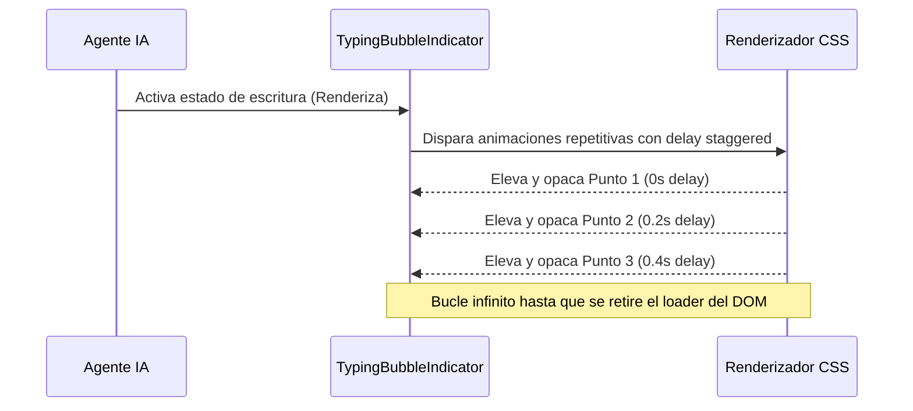

<!--
{
  "resource": "TypingBubbleIndicator",
  "technicalName": "TypingBubbleIndicator",
  "targetPath": "src/components/common/TypingBubbleIndicator.jsx",
  "type": "atom",
  "niches": [],
  "dependencies": {
    "npm": {},
    "internal": []
  }
}
-->

# TypingBubbleIndicator (Burbuja de Escritura de Chat)

Burbuja de chat que indica escritura activa (Typing). Combina un globo elástico de aspecto glassmorphic con tres puntos internos de rebote secuencial. Diseñada para paneles de asistencia técnica, chatbots de IA y omnicanalidad de soporte de WhatsApp.

## 1. Propósito y Casos de Uso
- **Bandeja de Entrada de Chat**: Muestra al usuario que el agente de servicio o la IA está procesando su respuesta.
- **Asistentes de Conversación**: Indicador de escritura activa para flujos de venta en eCommerce.
- **Canal de soporte de citas**: Notificación de respuesta al reservar o reagendar una sesión.

## 2. Especificación Visual y Estilos (Tailwind CSS)
- **Globo Glassmorphic**: Utiliza `bg-[var(--color-surface-3)]` y bordes finos de contraste para integrarse con cualquier fondo de chat.
- **Puntos Internos**: Movimiento vertical sutil de puntos staggered.
- **Micro-escala en Hover**: Pequeño escalado elástico del globo de chat interactivo.

## 3. Código React Completo y Portable

```jsx
import React from 'react';

export default function TypingBubbleIndicator({
  dotsColor = 'bg-[var(--color-text-muted)]',
  className = ''
}) {
  return (
    <div className={`inline-flex items-center gap-1 px-4 py-2.5 rounded-2xl rounded-bl-sm bg-[var(--color-surface-3)] border border-[var(--color-border)] shadow-sm ${className}`}>
      {/* Tres puntos de escritura */}
      <div 
        className={`w-1.5 h-1.5 rounded-full animate-typingDot ${dotsColor}`}
        style={{ animationDelay: '0s' }}
      />
      <div 
        className={`w-1.5 h-1.5 rounded-full animate-typingDot ${dotsColor}`}
        style={{ animationDelay: '0.2s' }}
      />
      <div 
        className={`w-1.5 h-1.5 rounded-full animate-typingDot ${dotsColor}`}
        style={{ animationDelay: '0.4s' }}
      />

      {/* Estilos CSS Inline para Keyframes */}
      <style dangerouslySetInnerHTML={{__html: `
        @keyframes typingDot {
          0%, 100% {
            transform: translateY(0);
            opacity: 0.4;
          }
          50% {
            transform: translateY(-4px);
            opacity: 1;
          }
        }
        .animate-typingDot {
          animation: typingDot 0.9s infinite ease-in-out;
        }
      `}} />
    </div>
  );
}
```

## 4. Lógica de Estado y Ciclo de Vida
El componente es auto-iniciado. Utiliza retrasos de animación coordinados directamente en el navegador mediante CSS para minimizar la huella de memoria del cliente, garantizando animaciones continuas incluso en bandejas de entrada con múltiples chats abiertos simultáneamente.

## 5. Secuencia de Interacción


