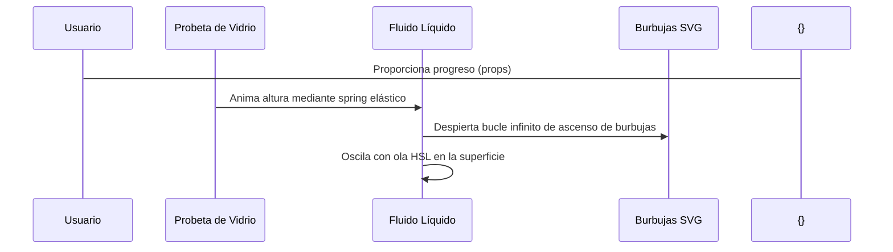

<!--
{
  "technicalName": "VerticalFillLiquidGlass",
  "targetPath": "src/components/ui/VerticalFillLiquidGlass.jsx",
  "dependencies": {
    "npm": {
      "framer-motion": "^11.0.0"
    },
    "internal": []
  },
  "type": "atom",
  "niches": []
}
-->

# VerticalFillLiquidGlass — Medidor Vertical de Vidrio Líquido

## 1. Propósito y Casos de Uso
El `VerticalFillLiquidGlass` es un medidor de progreso vertical alternativo para metas de facturación, existencias en caja o límites de almacenamiento. Su propósito es captar la atención del desarrollador y del cliente mediante un fluido HSL interactivo y un movimiento ascendente de burbujas SVG.

## 2. Especificación Visual y Estilos
- **Efecto de Cristal:** Glassmorphic real utilizando `backdrop-blur-md` y contorno fino brillante.
- **Burbujas Ascendentes:** Círculos SVG animados que oscilan lateralmente y suben con desvanecimiento de opacidad progresivo.

## 3. Código React Completo y 100% Funcional

```jsx
import React from 'react';
import { motion } from 'framer-motion';

export default function VerticalFillLiquidGlass({
  progress = 50, // 0 a 100
  title = 'Metas de Venta',
  valueLabel = '$ 2.500.000',
  className = ''
}) {
  const clampedProgress = Math.max(0, Math.min(100, progress));

  // Genera burbujas con coordenadas y tiempos pseudo-aleatorios
  const bubbles = Array.from({ length: 6 }).map((_, i) => ({
    id: i,
    size: Math.random() * 4 + 3,
    delay: Math.random() * 2,
    duration: Math.random() * 3 + 2,
    left: `${Math.random() * 60 + 20}%`
  }));

  return (
    <div className={`flex flex-col items-center p-4 bg-[var(--color-surface-2)] border border-[var(--color-border)] rounded-2xl w-44 ${className}`}>
      {/* Contenedor Probeta de Vidrio */}
      <div className="relative w-16 h-56 rounded-full border-2 border-white/20 bg-white/5 backdrop-blur-md overflow-hidden shadow-inner flex flex-col justify-end">
        {/* Nivel de Líquido */}
        <motion.div
          initial={{ height: '0%' }}
          animate={{ height: `${clampedProgress}%` }}
          transition={{ type: 'spring', stiffness: 45, damping: 15 }}
          className="relative w-full bg-gradient-to-t from-[var(--color-primary)]/80 to-[var(--color-primary)] shadow-[0_0_15px_rgba(var(--color-primary-rgb),0.5)]"
        >
          {/* Ola en la Superficie */}
          <motion.div
            animate={{
              y: [-2, 2, -2],
              scaleY: [0.97, 1.03, 0.97]
            }}
            transition={{
              repeat: Infinity,
              duration: 3,
              ease: 'easeInOut'
            }}
            className="absolute top-0 left-0 w-full h-3 bg-white/20 blur-[1px] rounded-t-full"
          />

          {/* Render de burbujas flotantes */}
          {clampedProgress > 10 &&
            bubbles.map((bubble) => (
              <motion.div
                key={bubble.id}
                initial={{ y: '100%', opacity: 0 }}
                animate={{
                  y: [200, -20],
                  opacity: [0, 0.7, 0]
                }}
                transition={{
                  duration: bubble.duration,
                  delay: bubble.delay,
                  repeat: Infinity,
                  ease: 'easeOut'
                }}
                className="absolute rounded-full bg-white/40 shadow-sm"
                style={{
                  width: bubble.size,
                  height: bubble.size,
                  left: bubble.left,
                  bottom: 0
                }}
              />
            ))}
        </motion.div>
      </div>

      <div className="mt-4 text-center">
        <h4 className="text-xs font-bold text-[var(--color-text)]">{title}</h4>
        <p className="text-[11px] text-[var(--color-text-muted)] font-medium mt-0.5">{valueLabel}</p>
        <span className="inline-block mt-2 text-[10px] font-bold bg-[var(--color-primary)]/10 text-[var(--color-primary)] px-2 py-0.5 rounded-full">
          {clampedProgress}%
        </span>
      </div>
    </div>
  );
}
```

## 4. Lógica de Estado y Ciclo de Vida
Ejecuta la animación de altura vertical mediante físicas de resorte `spring` de Framer Motion. Mapea un bucle de traducción infinita con retraso y duración variable para cada una de las esferas burbuja en el DOM, controlando que no se rendericen si el progreso es menor al 10% para evitar glitches visuales en la base de la probeta.

## 5. Flujo Operativo y Secuencia de Interacción


