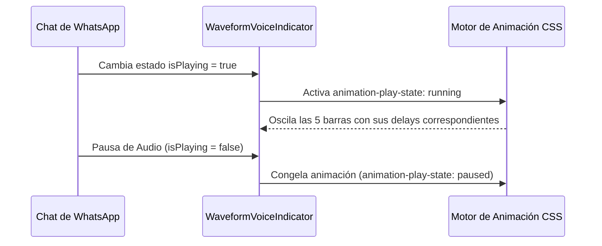

<!--
{
  "resource": "WaveformVoiceIndicator",
  "technicalName": "WaveformVoiceIndicator",
  "targetPath": "src/components/common/WaveformVoiceIndicator.jsx",
  "type": "atom",
  "niches": [],
  "dependencies": {
    "npm": {},
    "internal": []
  }
}
-->

# WaveformVoiceIndicator (Indicador de Onda de Voz)

Indicador animado de ondas de voz y entrada de audio que simula ecualizaciones reales. Combina alturas variables mediante keyframes elásticos staggered de flexión vertical. Diseñado para interfaces de chat omnicanal de soporte de voz.

## 1. Propósito y Casos de Uso
- **Mensajes de voz de WhatsApp**: Representa el estado de reproducción o grabación de un audio del cliente.
- **Asistentes de voz IA**: Simula el procesamiento e interpretación del habla.
- **Llamadas WebRTC**: Indicador visual de voz activa en llamadas de soporte.

## 2. Especificación Visual y Estilos (Tailwind CSS)
- **Flexión Vertical Staggered**: Oscilación de altura (`scaleY`) de 5 columnas elásticas con alturas base diferentes.
- **Transiciones Fluida**: El rebote continuo da una sensación de volumen y respuesta en vivo.
- **Variabilidad de Volumen**: El sandbox permite simular "Volumen Alto" incrementando el tamaño del rebote.

## 3. Código React Completo y Portable

```jsx
import React from 'react';

export default function WaveformVoiceIndicator({
  isPlaying = true,
  amplitude = 'normal', // 'low', 'normal', 'high'
  color = 'bg-[var(--color-primary)]',
  className = ''
}) {
  const ampClass = amplitude === 'high' ? 'scale-y-[1.6]' : amplitude === 'low' ? 'scale-y-[0.6]' : 'scale-y-[1]';

  return (
    <div className={`flex items-end justify-center gap-1 h-6 py-1 select-none ${className}`}>
      {/* Línea 1 */}
      <div 
        className={`w-0.5 rounded-full ${color} animate-barWave ${isPlaying ? 'running' : 'paused'} ${ampClass}`}
        style={{ animationDelay: '0.1s', minHeight: '6px' }}
      />
      {/* Línea 2 */}
      <div 
        className={`w-0.5 rounded-full ${color} animate-barWave ${isPlaying ? 'running' : 'paused'} ${ampClass}`}
        style={{ animationDelay: '0.3s', minHeight: '12px' }}
      />
      {/* Línea 3 */}
      <div 
        className={`w-0.5 rounded-full ${color} animate-barWave ${isPlaying ? 'running' : 'paused'} ${ampClass}`}
        style={{ animationDelay: '0s', minHeight: '16px' }}
      />
      {/* Línea 4 */}
      <div 
        className={`w-0.5 rounded-full ${color} animate-barWave ${isPlaying ? 'running' : 'paused'} ${ampClass}`}
        style={{ animationDelay: '0.4s', minHeight: '10px' }}
      />
      {/* Línea 5 */}
      <div 
        className={`w-0.5 rounded-full ${color} animate-barWave ${isPlaying ? 'running' : 'paused'} ${ampClass}`}
        style={{ animationDelay: '0.2s', minHeight: '6px' }}
      />

      {/* Estilos CSS Inline para Keyframes */}
      <style dangerouslySetInnerHTML={{__html: `
        @keyframes barWave {
          0%, 100% {
            transform: scaleY(0.4);
          }
          50% {
            transform: scaleY(1.2);
          }
        }
        .animate-barWave {
          animation: barWave 1.2s infinite ease-in-out;
          transform-origin: bottom;
        }
        .running {
          animation-play-state: running;
        }
        .paused {
          animation-play-state: paused;
          transform: scaleY(0.4) !important;
        }
      `}} />
    </div>
  );
}
```

## 4. Lógica de Estado y Ciclo de Vida
El componente consume el booleano `isPlaying` para pausar la animación de CSS (`animation-play-state: paused`) sin destruir los nodos del DOM. Esto previene parpadeos de renderizado al pausar/reproducir audios en la bandeja del chat de WhatsApp.

## 5. Secuencia de Interacción


