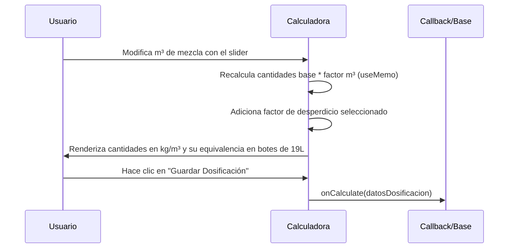

<!--
{
  "resource": "CalculadoraDosificacionConcreto",
  "technicalName": "CalculadoraDosificacionConcreto",
  "targetPath": "src/components/common/CalculadoraDosificacionConcreto.jsx",
  "dependencies": {
    "npm": {
      "lucide-react": "^0.294.0"
    },
    "internal": []
  },
  "type": "component",
  "niches": [
    "contractors"
  ]
}
-->

# Calculadora de Dosificación de Concreto (CalculadoraDosificacionConcreto)

## Biblioteca de Componentes: Contratistas y Construcción

Este componente permite calcular la cantidad exacta de materiales (cemento, arena, grava y agua) requeridos para mezclar un determinado volumen de concreto (en metros cúbicos) según la resistencia estructural deseada (PSI / MPa).

---

## 💎 Propósito y Casos de Uso
En el sector constructivo, la mala dosificación debilita las estructuras (columnas, vigas, losas) o produce sobrecostos por desperdicio de cemento. Este componente interactivo resuelve:
1. **Dosificación Técnica Normalizada**: Permite seleccionar la resistencia del concreto (desde 1500 PSI para firmes hasta 3500 PSI para columnas y losas de alta resistencia).
2. **Equivalencia a Medida Práctica (Botes/Sacos)**: Convierte los metros cúbicos y kilogramos a unidades prácticas de obra (sacos de cemento de 50kg, botes de 19 litros) para facilitar el trabajo físico.
3. **Optimización de Desperdicio**: Integra un factor de merma o desperdicio configurable (normalmente entre 5% y 15%).

---

## 🎨 Especificación Visual y Estilos (Tailwind CSS)
* **Visualizador de Proporciones**: Gráfico de pastel o conjunto de barras HSL proporcionales que indican el porcentaje en peso/volumen de cada componente de la mezcla.
* **Resumen de Resultados**: Tarjetas con fondos de superficie `bg-[var(--color-surface-2)]/50` y contornos `border-[var(--color-border)]` para fácil lectura táctil.
* **Foco Interactivo**: Slider de volumen en m³ y controles numéricos sincronizados bidireccionalmente.

---

## 3. Código React Completo

```jsx
import React, { useState, useMemo } from 'react';
import { Layers, Droplet, Calculator, AlertCircle, ShoppingBag, Info } from 'lucide-react';
import CustomSelect from '../../ui/CustomSelect';

export default function CalculadoraDosificacionConcreto({
  onCalculate,
  resistenciasBase = [
    {
      value: '3000',
      label: '3000 PSI (21 MPa) - Losas, Columnas y Vigas',
      proporcion: '1 : 2 : 2 (Cemento : Arena : Grava)',
      cementoKg: 350,
      arenaM3: 0.56,
      gravaM3: 0.84,
      aguaLtr: 180,
      usoSugerido: 'Ideal para elementos estructurales principales que requieren alta resistencia.'
    },
    {
      value: '2500',
      label: '2500 PSI (17.5 MPa) - Zapatas y Vigas de amarre',
      proporcion: '1 : 2 : 3 (Cemento : Arena : Grava)',
      cementoKg: 300,
      arenaM3: 0.48,
      gravaM3: 0.96,
      aguaLtr: 170,
      usoSugerido: 'Recomendado para vigas secundarias, cimentaciones corridas y zapatas.'
    },
    {
      value: '2000',
      label: '2000 PSI (14 MPa) - Firmes, Pisos y Andenes',
      proporcion: '1 : 2 : 4 (Cemento : Arena : Grava)',
      cementoKg: 260,
      arenaM3: 0.42,
      gravaM3: 1.0,
      aguaLtr: 160,
      usoSugerido: 'Adecuado para pisos peatonales, andenes, contrapisos y firmes de garajes.'
    },
    {
      value: '1500',
      label: '1500 PSI (10 MPa) - Concreto de Limpieza',
      proporcion: '1 : 3 : 5 (Cemento : Arena : Grava)',
      cementoKg: 210,
      arenaM3: 0.5,
      gravaM3: 1.0,
      aguaLtr: 160,
      usoSugerido: 'Uso exclusivo para plantillas de limpieza o rellenos sin carga estructural.'
    }
  ]
}) {
  const [volumen, setVolumen] = useState(2.0); // m3
  const [resistencia, setResistencia] = useState('3000');
  const [desperdicio, setDesperdicio] = useState(10); // %

  const resistenciaActiva = useMemo(() => {
    return resistenciasBase.find(r => r.value === resistencia) || resistenciasBase[0];
  }, [resistencia, resistenciasBase]);

  const materialesCalculados = useMemo(() => {
    const factorMult = volumen * (1 + desperdicio / 100);
    const cementoTotalKg = resistenciaActiva.cementoKg * factorMult;
    const arenaTotalM3 = resistenciaActiva.arenaM3 * factorMult;
    const gravaTotalM3 = resistenciaActiva.gravaM3 * factorMult;
    const aguaTotalLtr = resistenciaActiva.aguaLtr * factorMult;

    // Equivalencia en unidades prácticas de obra
    const sacosCemento50kg = Math.ceil(cementoTotalKg / 50);
    const botesArena19L = Math.ceil((arenaTotalM3 * 1000) / 19); // 1m3 = 1000 Litros
    const botesGrava19L = Math.ceil((gravaTotalM3 * 1000) / 19);
    const botesAgua19L = Math.ceil(aguaTotalLtr / 19);

    return {
      cementoKg: Math.round(cementoTotalKg),
      sacosCemento50kg,
      arenaM3: Number(arenaTotalM3.toFixed(2)),
      botesArena19L,
      gravaM3: Number(gravaTotalM3.toFixed(2)),
      botesGrava19L,
      aguaLtr: Math.round(aguaTotalLtr),
      botesAgua19L
    };
  }, [volumen, resistenciaActiva, desperdicio]);

  const handleSave = () => {
    if (onCalculate) {
      onCalculate({
        volumen,
        resistencia: resistenciaActiva.value,
        materiales: materialesCalculados
      });
    }
  };

  return (
    <div className="w-full max-w-4xl mx-auto bg-[var(--color-surface)] border border-[var(--color-border)] rounded-2xl p-6 shadow-xl text-[var(--color-text)]">
      {/* Cabecera */}
      <div className="flex items-center gap-3 pb-5 border-b border-[var(--color-border)] mb-6">
        <div className="p-3 bg-[var(--color-primary)]/10 rounded-xl text-[var(--color-primary)]">
          <Layers className="w-6 h-6" />
        </div>
        <div>
          <h2 className="text-xl font-bold">Calculadora de Dosificación</h2>
          <p className="text-sm text-[var(--color-text-muted)]">Cálculo de mezcla de concreto por m³</p>
        </div>
      </div>

      <div className="grid grid-cols-1 lg:grid-cols-12 gap-6">
        {/* Entradas */}
        <div className="lg:col-span-6 flex flex-col gap-5">
          {/* Slider volumen */}
          <div className="bg-[var(--color-surface-2)]/40 border border-[var(--color-border)] p-4 rounded-xl">
            <label className="block text-sm font-semibold mb-2">Volumen de Concreto (m³)</label>
            <div className="flex items-center gap-4">
              <input
                type="range"
                min="0.5"
                max="50"
                step="0.5"
                value={volumen}
                onChange={(e) => setVolumen(Number(e.target.value))}
                className="w-full accent-[var(--color-primary)]"
              />
              <input
                type="number"
                step="0.1"
                value={volumen}
                onChange={(e) => setVolumen(Math.max(0.1, Number(e.target.value)))}
                className="w-20 px-3 py-1.5 bg-[var(--color-bg)] border border-[var(--color-border)] rounded-lg text-center font-bold focus:border-[var(--color-primary)] focus:outline-none"
              />
            </div>
          </div>

          {/* Selector Resistencia */}
          <div>
            <label className="block text-xs text-[var(--color-text-muted)] mb-1">Resistencia Estructural Requerida</label>
            <CustomSelect
              value={resistencia}
              onChange={setResistencia}
              options={resistenciasBase.map(r => ({ value: r.value, label: r.label }))}
            />
          </div>

          {/* Desperdicio */}
          <div className="bg-[var(--color-surface-2)]/20 border border-[var(--color-border)] p-4 rounded-xl">
            <div className="flex justify-between items-center mb-2">
              <label className="text-sm font-semibold">Factor de Desperdicio / Merma</label>
              <span className="text-sm font-bold text-[var(--color-primary)]">{desperdicio}%</span>
            </div>
            <input
              type="range"
              min="0"
              max="20"
              value={desperdicio}
              onChange={(e) => setDesperdicio(Number(e.target.value))}
              className="w-full accent-[var(--color-primary)]"
            />
            <p className="text-[10px] text-[var(--color-text-muted)] mt-1.5">
              * Se recomienda adicionar entre 5% y 10% por pérdida de material en transporte y colocación.
            </p>
          </div>

          {/* Nota de Uso Sugerido */}
          <div className="bg-blue-500/10 border border-blue-500/20 p-4 rounded-xl flex items-start gap-2.5 text-blue-400 text-xs">
            <Info className="w-4.5 h-4.5 shrink-0 mt-0.5" />
            <div>
              <p className="font-semibold">Relación de mezcla: {resistenciaActiva.proporcion}</p>
              <p className="mt-1 text-[var(--color-text-muted)]">{resistenciaActiva.usoSugerido}</p>
            </div>
          </div>
        </div>

        {/* Resultados */}
        <div className="lg:col-span-6 flex flex-col gap-6">
          <div className="bg-[var(--color-surface-2)]/50 border border-[var(--color-border)] p-5 rounded-2xl flex flex-col gap-5 h-full justify-between">
            <div>
              <h3 className="text-base font-bold pb-3 border-b border-[var(--color-border)] mb-4">Materiales Requeridos</h3>

              <div className="grid grid-cols-1 sm:grid-cols-2 gap-4">
                {/* Cemento */}
                <div className="p-4 bg-[var(--color-bg)]/60 border border-[var(--color-border)] rounded-xl flex flex-col gap-1">
                  <span className="text-[10px] text-[var(--color-text-muted)] uppercase tracking-wider font-bold">Cemento</span>
                  <span className="text-xl font-bold">{materialesCalculados.cementoKg} kg</span>
                  <span className="text-xs text-emerald-400 font-semibold flex items-center gap-1">
                    <ShoppingBag className="w-3.5 h-3.5" />
                    ~{materialesCalculados.sacosCemento50kg} Sacos (50kg)
                  </span>
                </div>

                {/* Agua */}
                <div className="p-4 bg-[var(--color-bg)]/60 border border-[var(--color-border)] rounded-xl flex flex-col gap-1">
                  <span className="text-[10px] text-[var(--color-text-muted)] uppercase tracking-wider font-bold">Agua</span>
                  <span className="text-xl font-bold">{materialesCalculados.aguaLtr} Ltr</span>
                  <span className="text-xs text-blue-400 font-semibold flex items-center gap-1">
                    <Droplet className="w-3.5 h-3.5" />
                    ~{materialesCalculados.botesAgua19L} Botes (19L)
                  </span>
                </div>

                {/* Arena */}
                <div className="p-4 bg-[var(--color-bg)]/60 border border-[var(--color-border)] rounded-xl flex flex-col gap-1">
                  <span className="text-[10px] text-[var(--color-text-muted)] uppercase tracking-wider font-bold">Arena Fina/Media</span>
                  <span className="text-xl font-bold">{materialesCalculados.arenaM3} m³</span>
                  <span className="text-xs text-[var(--color-text-muted)]">
                    ~{materialesCalculados.botesArena19L} Botes de 19L
                  </span>
                </div>

                {/* Grava */}
                <div className="p-4 bg-[var(--color-bg)]/60 border border-[var(--color-border)] rounded-xl flex flex-col gap-1">
                  <span className="text-[10px] text-[var(--color-text-muted)] uppercase tracking-wider font-bold">Grava Triturada</span>
                  <span className="text-xl font-bold">{materialesCalculados.gravaM3} m³</span>
                  <span className="text-xs text-[var(--color-text-muted)]">
                    ~{materialesCalculados.botesGrava19L} Botes de 19L
                  </span>
                </div>
              </div>
            </div>

            <button
              onClick={handleSave}
              className="w-full py-3 bg-[var(--color-primary)] hover:bg-[var(--color-primary-hover)] text-[var(--color-text)] font-bold rounded-xl flex items-center justify-center gap-2 shadow-lg shadow-[var(--color-primary)]/20 transition-all active:scale-[0.98] mt-4"
            >
              <Calculator className="w-4 h-4" />
              Guardar Dosificación
            </button>
          </div>
        </div>
      </div>
    </div>
  );
}
```

---

## 4. Lógica de Estado y Ciclo de Vida
1. **`volumen`**: Estado numérico que controla los metros cúbicos de mezcla requeridos. Sincronizado dinámicamente mediante slider e input numérico.
2. **`resistencia`**: Código clave del tipo de mezcla (PSI). Modifica las constantes volumétricas por m³ para cemento, arena, grava y agua.
3. **`desperdicio`**: Porcentaje extra a añadir para contrarrestar las pérdidas de vaciado físicas en obra.

---

## 5. Flujo Operativo y Secuencia de Interacción


