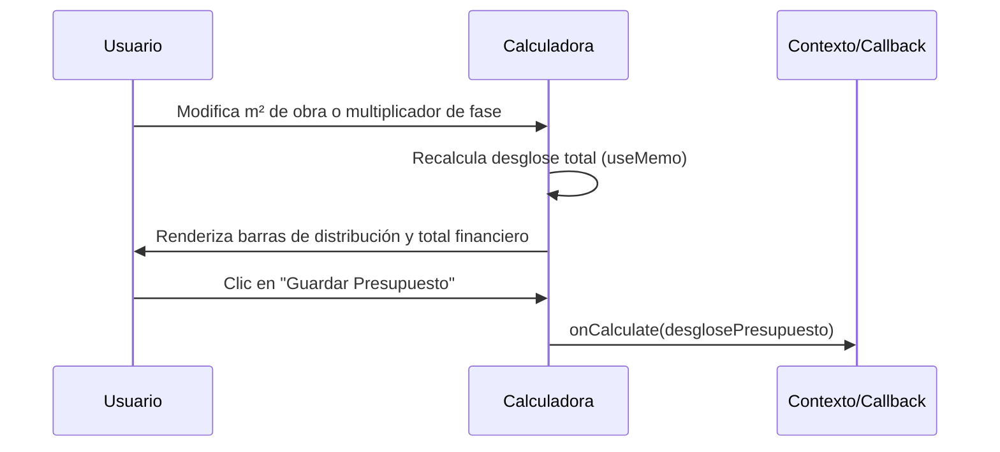

<!--
{
  "resource": "CalculadoraPresupuestoObra",
  "technicalName": "CalculadoraPresupuestoObra",
  "targetPath": "src/components/common/CalculadoraPresupuestoObra.jsx",
  "dependencies": {
    "npm": {
      "lucide-react": "^0.294.0"
    },
    "internal": []
  },
  "type": "component",
  "niches": [
    "contractors"
  ]
}
-->

# Calculadora de Presupuesto de Obra (CalculadoraPresupuestoObra)

## Biblioteca de Componentes: Contratistas y Construcción

Este componente permite estimar de forma detallada y por etapas (Cimentación, Estructura, Muros/Albañilería, Acabados, Instalaciones) los costos proyectados de mano de obra, materiales y herramientas para un proyecto de construcción o remodelación.

---

## 💎 Propósito y Casos de Uso
En el sector de contratistas y construcción, cotizar con rapidez y precisión es crítico. Este componente unifica:
1. **Estimación Rápida por Metros Cuadrados**: Permite ingresar el área total y un factor de costo base.
2. **Desglose de Costos por Fase**: Detalla qué porcentaje de la inversión se destina a cimentación, estructura o acabados.
3. **Resumen de Recursos**: Divide el presupuesto total en materiales (cemento, acero, ladrillos), mano de obra (albañiles, ayudantes) y equipos/herramientas.

---

## 🎨 Especificación Visual y Estilos (Tailwind CSS)
* **Contenedor Principal**: Card premium con fondo de superficie translúcido `bg-[var(--color-surface)]` y bordes finos `border border-[var(--color-border)]`.
* **Desglose de Porcentaje**: Barras de progreso horizontales animadas que cambian de color según el peso de la etapa.
* **Campos de Formulario**: Integración de inputs con bordes de foco interactivos `focus:border-[var(--color-primary)]` y fondo `bg-[var(--color-bg)]/50`.
* **Selectores**: Uso estricto del selector interactivo `CustomSelect` para elegir la etapa actual a añadir.

---

## 3. Código React Completo

```jsx
import React, { useState, useMemo } from 'react';
import { Plus, Trash2, RotateCcw, Calculator, DollarSign } from 'lucide-react';
import CustomSelect from '../../ui/CustomSelect';

export default function CalculadoraPresupuestoObra({
  onCalculate,
  confirmAction,
  etapasBase = [
    { value: 'cimentacion', label: 'Cimentación y Excavación', costoM2: 120 },
    { value: 'estructura', label: 'Estructura (Columnas/Vigas)', costoM2: 180 },
    { value: 'albañileria', label: 'Albañilería y Muros', costoM2: 100 },
    { value: 'instalaciones', label: 'Instalaciones (Eléctrica/Plomería)', costoM2: 90 },
    { value: 'acabados', label: 'Acabados y Pintura', costoM2: 140 }
  ]
}) {
  const [area, setArea] = useState(60);
  const [items, setItems] = useState([
    { id: '1', etapaKey: 'cimentacion', manoObraPercent: 40, materialesPercent: 60, multiplicador: 1.0 },
    { id: '2', etapaKey: 'estructura', manoObraPercent: 35, materialesPercent: 65, multiplicador: 1.0 }
  ]);

  const [nuevaEtapa, setNuevaEtapa] = useState('albañileria');
  const [nuevoManoObra, setNuevoManoObra] = useState(40);
  const [nuevoMateriales, setNuevoMateriales] = useState(60);

  const agregarEtapa = () => {
    const existe = items.some(it => it.etapaKey === nuevaEtapa);
    if (existe) return;

    setItems([
      ...items,
      {
        id: Date.now().toString(),
        etapaKey: nuevaEtapa,
        manoObraPercent: Number(nuevoManoObra),
        materialesPercent: Number(nuevoMateriales),
        multiplicador: 1.0
      }
    ]);
  };

  const eliminarEtapa = (id) => {
    setItems(items.filter(it => it.id !== id));
  };

  const actualizarMultiplicador = (id, valor) => {
    setItems(items.map(it => it.id === id ? { ...it, multiplicador: Number(valor) } : it));
  };

  const desglosePresupuesto = useMemo(() => {
    let costoTotal = 0;
    let costoMateriales = 0;
    let costoManoObra = 0;
    const etapasDesglose = [];

    items.forEach(item => {
      const configBase = etapasBase.find(e => e.value === item.etapaKey);
      if (!configBase) return;

      const costoEtapaBase = configBase.costoM2 * area * item.multiplicador;
      const materiales = (costoEtapaBase * item.materialesPercent) / 100;
      const manoObra = (costoEtapaBase * item.manoObraPercent) / 100;

      costoTotal += costoEtapaBase;
      costoMateriales += materiales;
      costoManoObra += manoObra;

      etapasDesglose.push({
        label: configBase.label,
        total: costoEtapaBase,
        materiales,
        manoObra
      });
    });

    return {
      costoTotal,
      costoMateriales,
      costoManoObra,
      etapasDesglose
    };
  }, [items, area, etapasBase]);

  const handleReset = async () => {
    const confirmed = await confirmAction({
      title: '¿Reiniciar presupuesto?',
      message: 'Esta acción eliminará todas las etapas agregadas y restaurará los valores por defecto.',
      confirmText: 'Confirmar',
      cancelText: 'Cancelar'
    });

    if (confirmed) {
      setArea(60);
      setItems([
        { id: '1', etapaKey: 'cimentacion', manoObraPercent: 40, materialesPercent: 60, multiplicador: 1.0 }
      ]);
    }
  };

  return (
    <div className="w-full max-w-4xl mx-auto bg-[var(--color-surface)] border border-[var(--color-border)] rounded-2xl p-6 shadow-xl text-[var(--color-text)]">
      {/* Cabecera */}
      <div className="flex flex-col md:flex-row md:items-center justify-between gap-4 pb-6 border-b border-[var(--color-border)] mb-6">
        <div className="flex items-center gap-3">
          <div className="p-3 bg-[var(--color-primary)]/10 rounded-xl text-[var(--color-primary)]">
            <Calculator className="w-6 h-6" />
          </div>
          <div>
            <h2 className="text-xl font-bold">Calculadora de Presupuesto</h2>
            <p className="text-sm text-[var(--color-text-muted)]">Estimación por fases y materiales de obra</p>
          </div>
        </div>
        <button
          onClick={handleReset}
          className="flex items-center justify-center gap-2 px-4 py-2 border border-[var(--color-border)] hover:bg-[var(--color-surface-2)] text-sm font-medium rounded-xl transition-colors"
        >
          <RotateCcw className="w-4 h-4" />
          Reiniciar
        </button>
      </div>

      <div className="grid grid-cols-1 lg:grid-cols-12 gap-6">
        {/* Panel Izquierdo: Configuración */}
        <div className="lg:col-span-7 flex flex-col gap-6">
          {/* Área Total */}
          <div className="bg-[var(--color-surface-2)]/40 border border-[var(--color-border)] p-4 rounded-xl">
            <label className="block text-sm font-semibold mb-2">Área del Proyecto (m²)</label>
            <div className="flex items-center gap-4">
              <input
                type="range"
                min="10"
                max="500"
                value={area}
                onChange={(e) => setArea(Number(e.target.value))}
                className="w-full accent-[var(--color-primary)]"
              />
              <input
                type="number"
                value={area}
                onChange={(e) => setArea(Math.max(1, Number(e.target.value)))}
                className="w-20 px-3 py-1.5 bg-[var(--color-bg)] border border-[var(--color-border)] rounded-lg text-center font-bold focus:border-[var(--color-primary)] focus:outline-none"
              />
            </div>
          </div>

          {/* Formulario Agregar Etapa */}
          <div className="bg-[var(--color-surface-2)]/20 border border-[var(--color-border)] p-4 rounded-xl">
            <h3 className="text-sm font-semibold mb-3">Agregar Fase de Obra</h3>
            <div className="grid grid-cols-1 sm:grid-cols-2 gap-4 mb-4">
              <div>
                <label className="block text-xs text-[var(--color-text-muted)] mb-1">Fase / Etapa</label>
                <CustomSelect
                  value={nuevaEtapa}
                  onChange={setNuevaEtapa}
                  options={etapasBase.map(e => ({ value: e.value, label: e.label }))}
                />
              </div>
              <div className="grid grid-cols-1 sm:grid-cols-2 gap-2">
                <div>
                  <label className="block text-xs text-[var(--color-text-muted)] mb-1">Mano Obra %</label>
                  <input
                    type="number"
                    min="0"
                    max="100"
                    value={nuevoManoObra}
                    onChange={(e) => {
                      const mo = Math.min(100, Math.max(0, Number(e.target.value)));
                      setNuevoManoObra(mo);
                      setNuevoMateriales(100 - mo);
                    }}
                    className="w-full px-3 py-1.5 bg-[var(--color-bg)] border border-[var(--color-border)] rounded-lg text-center focus:border-[var(--color-primary)] focus:outline-none"
                  />
                </div>
                <div>
                  <label className="block text-xs text-[var(--color-text-muted)] mb-1">Materiales %</label>
                  <input
                    type="number"
                    min="0"
                    max="100"
                    value={nuevoMateriales}
                    onChange={(e) => {
                      const mat = Math.min(100, Math.max(0, Number(e.target.value)));
                      setNuevoMateriales(mat);
                      setNuevoManoObra(100 - mat);
                    }}
                    className="w-full px-3 py-1.5 bg-[var(--color-bg)] border border-[var(--color-border)] rounded-lg text-center focus:border-[var(--color-primary)] focus:outline-none"
                  />
                </div>
              </div>
            </div>
            <button
              onClick={agregarEtapa}
              className="w-full py-2 bg-[var(--color-primary)] hover:bg-[var(--color-primary-hover)] text-[var(--color-text)] font-medium rounded-xl flex items-center justify-center gap-2 transition-colors"
            >
              <Plus className="w-4 h-4" />
              Añadir a Estimación
            </button>
          </div>

          {/* Listado de Etapas Agregadas */}
          <div className="flex flex-col gap-3">
            <h3 className="text-sm font-semibold">Etapas en Cotización</h3>
            {items.length === 0 ? (
              <div className="text-center py-6 text-sm text-[var(--color-text-muted)] bg-[var(--color-surface-2)]/20 border border-dashed border-[var(--color-border)] rounded-xl">
                No hay fases agregadas. Agrega una arriba.
              </div>
            ) : (
              items.map(item => {
                const conf = etapasBase.find(e => e.value === item.etapaKey);
                if (!conf) return null;
                const costoFase = conf.costoM2 * area * item.multiplicador;

                return (
                  <div key={item.id} className="flex flex-col sm:flex-row items-start sm:items-center justify-between gap-3 p-4 bg-[var(--color-surface-2)]/60 border border-[var(--color-border)] rounded-xl">
                    <div className="flex-1">
                      <p className="font-bold text-sm">{conf.label}</p>
                      <p className="text-xs text-[var(--color-text-muted)] mt-0.5">
                        Base: ${conf.costoM2}/m² | MO: {item.manoObraPercent}% - MAT: {item.materialesPercent}%
                      </p>
                    </div>
                    <div className="flex items-center gap-3 w-full sm:w-auto justify-between sm:justify-end">
                      <div className="flex items-center gap-1.5">
                        <label className="text-xs text-[var(--color-text-muted)]">Mult:</label>
                        <input
                          type="number"
                          step="0.1"
                          min="0.5"
                          max="3.0"
                          value={item.multiplicador}
                          onChange={(e) => actualizarMultiplicador(item.id, e.target.value)}
                          className="w-16 px-1.5 py-1 bg-[var(--color-bg)] border border-[var(--color-border)] rounded text-center text-xs focus:outline-none"
                        />
                      </div>
                      <div className="text-right">
                        <span className="font-bold text-sm text-[var(--color-primary)]">
                          ${costoFase.toLocaleString()}
                        </span>
                      </div>
                      <button
                        onClick={() => eliminarEtapa(item.id)}
                        className="p-1.5 text-red-500 hover:bg-red-500/10 rounded-lg transition-colors"
                      >
                        <Trash2 className="w-4 h-4" />
                      </button>
                    </div>
                  </div>
                );
              })
            )}
          </div>
        </div>

        {/* Panel Derecho: Resumen Financiero */}
        <div className="lg:col-span-5 flex flex-col gap-6">
          <div className="bg-[var(--color-surface-2)]/50 border border-[var(--color-border)] p-6 rounded-2xl flex flex-col gap-6 sticky top-6">
            <h3 className="text-base font-bold pb-3 border-b border-[var(--color-border)]">Resumen Presupuestario</h3>

            {/* Total */}
            <div className="flex flex-col gap-1">
              <span className="text-xs text-[var(--color-text-muted)] uppercase tracking-wider font-semibold">Costo Total Estimado</span>
              <div className="flex items-baseline gap-1 text-[var(--color-primary)] font-extrabold text-3xl">
                <span className="text-lg font-bold">$</span>
                <span>{desglosePresupuesto.costoTotal.toLocaleString(undefined, { minimumFractionDigits: 0, maximumFractionDigits: 0 })}</span>
                <span className="text-xs text-[var(--color-text-muted)] font-normal ml-1">COP</span>
              </div>
            </div>

            {/* Barras de distribución */}
            <div className="flex flex-col gap-4">
              <div>
                <div className="flex justify-between text-xs font-semibold mb-1">
                  <span>Materiales ({((desglosePresupuesto.costoMateriales / (desglosePresupuesto.costoTotal || 1)) * 100).toFixed(0)}%)</span>
                  <span>${desglosePresupuesto.costoMateriales.toLocaleString()}</span>
                </div>
                <div className="w-full bg-[var(--color-bg)] h-2 rounded-full overflow-hidden">
                  <div
                    className="bg-emerald-500 h-full transition-all duration-500"
                    style={{ width: `${(desglosePresupuesto.costoMateriales / (desglosePresupuesto.costoTotal || 1)) * 100}%` }}
                  />
                </div>
              </div>

              <div>
                <div className="flex justify-between text-xs font-semibold mb-1">
                  <span>Mano de Obra ({((desglosePresupuesto.costoManoObra / (desglosePresupuesto.costoTotal || 1)) * 100).toFixed(0)}%)</span>
                  <span>${desglosePresupuesto.costoManoObra.toLocaleString()}</span>
                </div>
                <div className="w-full bg-[var(--color-bg)] h-2 rounded-full overflow-hidden">
                  <div
                    className="bg-[var(--color-primary)] h-full transition-all duration-500"
                    style={{ width: `${(desglosePresupuesto.costoManoObra / (desglosePresupuesto.costoTotal || 1)) * 100}%` }}
                  />
                </div>
              </div>
            </div>

            {/* Listado de Fases Desglosadas */}
            <div className="flex flex-col gap-3 pt-3 border-t border-[var(--color-border)]">
              <h4 className="text-xs font-bold text-[var(--color-text-muted)] uppercase tracking-wider">Aporte por Fase</h4>
              {desglosePresupuesto.etapasDesglose.map((et, idx) => (
                <div key={idx} className="flex justify-between text-xs font-medium">
                  <span>{et.label}</span>
                  <span className="font-semibold">${et.total.toLocaleString()}</span>
                </div>
              ))}
            </div>

            <button
              onClick={() => onCalculate?.(desglosePresupuesto)}
              className="w-full py-3 bg-[var(--color-primary)] hover:bg-[var(--color-primary-hover)] text-[var(--color-text)] font-bold rounded-xl flex items-center justify-center gap-2 shadow-lg shadow-[var(--color-primary)]/20 transition-all active:scale-[0.98]"
            >
              <DollarSign className="w-4 h-4" />
              Guardar Presupuesto
            </button>
          </div>
        </div>
      </div>
    </div>
  );
}
```

---

## 4. Lógica de Estado y Ciclo de Vida
1. **`items`**: Matriz de objetos que modela la lista activa de fases en la estimación del presupuesto.
2. **`area`**: Estado que maneja los metros cuadrados totales de la obra de forma bidireccional mediante rango y número.
3. **`desglosePresupuesto`**: Mapeo memorizado (`useMemo`) que recalcula todos los subtotales de materiales, mano de obra y el costo total de la obra cuando se modifica la lista de fases o los metros de área de trabajo.

---

## 5. Flujo Operativo y Secuencia de Interacción


