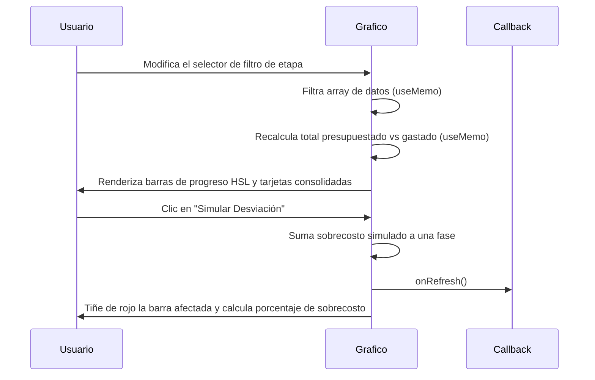

<!--
{
  "resource": "GraficoPresupuestoVsGasto",
  "technicalName": "GraficoPresupuestoVsGasto",
  "targetPath": "src/components/admin/sandboxes/GraficoPresupuestoVsGastoSandbox.jsx",
  "dependencies": {
    "npm": {
      "lucide-react": "^0.294.0"
    },
    "internal": []
  },
  "type": "component",
  "niches": [
    "contractors"
  ]
}
-->

# Gráfico de Presupuesto vs Gasto (GraficoPresupuestoVsGasto)

## Biblioteca de Componentes: Contratistas y Construcción

Este componente visual e informativo representa de forma clara las desviaciones financieras de una obra, comparando el presupuesto asignado contra el gasto acumulado real (mano de obra, insumos, fletes) por etapa constructiva, alertando visualmente ante sobrecostos.

---

## 💎 Propósito y Casos de Uso
El control de costos evita que una obra quede desfinanciada. Este gráfico interactivo permite:
1. **Detección Rápida de Sobrecostos**: Las barras cambian a color rojo o naranja brillante si el gasto ejecutado sobrepasa el presupuesto planificado en una fase.
2. **Desglose por Disciplina de Gasto**: El panel detalla cuánto se ha gastado en materiales frente a mano de obra y equipos en la fase activa.
3. **Filtros por Fase de Obra**: Selector rápido para alternar entre el resumen general consolidado o fases de excavación, estructura o pintura.

---

## 🎨 Especificación Visual y Estilos (Tailwind CSS)
* **Lienzo Gráfico**: Barras lado a lado de alto contraste visual. Presupuesto en tono neutro/primario desaturado, gasto en color primario vibrante (o rojo alerta ante desviaciones).
* **Indicador de Desviación**: Chips dinámicos `bg-red-500/10 text-red-400` que calculan el porcentaje exacto de sobrecosto en tiempo real.
* **Selectores**: Integración obligatoria de `CustomSelect` para filtrar los frentes de cotización.

---

## 3. Código React Completo

```jsx
import React, { useState, useMemo } from 'react';
import { BarChart3, AlertCircle, DollarSign, TrendingUp, TrendingDown, RefreshCw } from 'lucide-react';
import CustomSelect from '../../ui/CustomSelect';

export default function GraficoPresupuestoVsGasto({
  onRefresh,
  datosIniciales = [
    { etapa: 'cimentacion', label: 'Cimentación', presupuestado: 12000000, gastado: 11500000 },
    { etapa: 'estructura', label: 'Estructura', presupuestado: 18000000, gastado: 21200000 },
    { etapa: 'albañileria', label: 'Albañilería', presupuestado: 10000000, gastado: 9800000 },
    { etapa: 'instalaciones', label: 'Instalaciones', presupuestado: 9000000, gastado: 11800000 },
    { etapa: 'acabados', label: 'Acabados', presupuestado: 14000000, gastado: 12100000 }
  ]
}) {
  const [etapaFiltro, setEtapaFiltro] = useState('todas');
  const [datos, setDatos] = useState(datosIniciales);

  const filteredDatos = useMemo(() => {
    if (etapaFiltro === 'todas') return datos;
    return datos.filter(d => d.etapa === etapaFiltro);
  }, [etapaFiltro, datos]);

  const resumenConsolidado = useMemo(() => {
    let totalPresupuesto = 0;
    let totalGastado = 0;

    filteredDatos.forEach(d => {
      totalPresupuesto += d.presupuestado;
      totalGastado += d.gastado;
    });

    const desviacionVal = totalGastado - totalPresupuesto;
    const desviacionPct = (desviacionVal / (totalPresupuesto || 1)) * 100;
    const tieneSobrecosto = totalGastado > totalPresupuesto;

    return {
      totalPresupuesto,
      totalGastado,
      desviacionVal: Math.abs(desviacionVal),
      desviacionPct: Number(desviacionPct.toFixed(1)),
      tieneSobrecosto
    };
  }, [filteredDatos]);

  const handleSimulateOverrun = () => {
    // Aumentar aleatoriamente el gasto de una etapa para simular sobrecosto
    setDatos(datos.map(d =>
      d.etapa === 'albañileria'
        ? { ...d, gastado: d.gastado + 2500000 }
        : d
    ));
    if (onRefresh) {
      onRefresh();
    }
  };

  const handleReset = () => {
    setDatos(datosIniciales);
  };

  return (
    <div className="w-full max-w-4xl mx-auto bg-[var(--color-surface)] border border-[var(--color-border)] rounded-2xl p-6 shadow-xl text-[var(--color-text)]">
      {/* Cabecera */}
      <div className="flex flex-col sm:flex-row sm:items-center justify-between gap-4 pb-5 border-b border-[var(--color-border)] mb-6">
        <div className="flex items-center gap-3">
          <div className="p-3 bg-[var(--color-primary)]/10 rounded-xl text-[var(--color-primary)]">
            <BarChart3 className="w-6 h-6" />
          </div>
          <div>
            <h2 className="text-xl font-bold">Presupuesto vs Gasto</h2>
            <p className="text-sm text-[var(--color-text-muted)]">Control de desviaciones financieras por fase de obra</p>
          </div>
        </div>

        <div className="flex items-center gap-2 flex-wrap sm:flex-nowrap">
          <div className="w-40">
            <CustomSelect
              value={etapaFiltro}
              onChange={setEtapaFiltro}
              options={[
                { value: 'todas', label: 'Todas las Fases' },
                { value: 'cimentacion', label: 'Cimentación' },
                { value: 'estructura', label: 'Estructura' },
                { value: 'albañileria', label: 'Albañilería' },
                { value: 'instalaciones', label: 'Instalaciones' },
                { value: 'acabados', label: 'Acabados' }
              ]}
            />
          </div>
          <button
            onClick={handleSimulateOverrun}
            className="px-3 py-2 text-xs font-semibold border border-[var(--color-border)] hover:bg-[var(--color-surface-2)] rounded-xl transition-all flex items-center gap-1.5 shrink-0"
          >
            <RefreshCw className="w-3.5 h-3.5" />
            Simular Desviación
          </button>
          <button
            onClick={handleReset}
            className="px-3 py-2 text-xs font-semibold text-[var(--color-text-muted)] hover:text-[var(--color-text)] transition-colors"
          >
            Restablecer
          </button>
        </div>
      </div>

      <div className="grid grid-cols-1 lg:grid-cols-12 gap-6">
        {/* Lado Izquierdo: Gráfico CSS */}
        <div className="lg:col-span-7 flex flex-col gap-6">
          <div className="bg-[var(--color-surface-2)]/20 border border-[var(--color-border)] p-6 rounded-xl flex flex-col gap-6 justify-between min-h-[300px]">
            <div className="flex flex-col gap-5 justify-end h-full">
              {filteredDatos.map(d => {
                const maxVal = Math.max(...datos.map(x => Math.max(x.presupuestado, x.gastado)));
                const pctPres = (d.presupuestado / maxVal) * 100;
                const pctGast = (d.gastado / maxVal) * 100;
                const sobrepasa = d.gastado > d.presupuestado;

                return (
                  <div key={d.etapa} className="flex flex-col gap-1.5">
                    <span className="text-xs font-bold">{d.label}</span>
                    <div className="flex flex-col gap-1">
                      {/* Presupuestado */}
                      <div className="flex items-center gap-2">
                        <div
                          className="bg-[var(--color-text-muted)]/20 h-3 rounded-md transition-all duration-500"
                          style={{ width: `${pctPres}%` }}
                        />
                        <span className="text-[10px] text-[var(--color-text-muted)] font-mono">
                          ${d.presupuestado.toLocaleString()}
                        </span>
                      </div>
                      {/* Gastado */}
                      <div className="flex items-center gap-2">
                        <div
                          className={`h-3 rounded-md transition-all duration-500 ${
                            sobrepasa ? 'bg-red-500 shadow-md shadow-red-500/10' : 'bg-[var(--color-primary)] shadow-md shadow-[var(--color-primary)]/5'
                          }`}
                          style={{ width: `${pctGast}%` }}
                        />
                        <span className={`text-[10px] font-mono font-bold ${sobrepasa ? 'text-red-400' : 'text-[var(--color-primary)]'}`}>
                          ${d.gastado.toLocaleString()}
                        </span>
                      </div>
                    </div>
                  </div>
                );
              })}
            </div>
            
            {/* Leyenda */}
            <div className="flex gap-4 text-xs pt-3 border-t border-[var(--color-border)]/40 mt-2">
              <div className="flex items-center gap-1.5">
                <div className="w-3 h-3 bg-[var(--color-text-muted)]/20 rounded" />
                <span className="text-[var(--color-text-muted)]">Presupuestado</span>
              </div>
              <div className="flex items-center gap-1.5">
                <div className="w-3 h-3 bg-[var(--color-primary)] rounded" />
                <span className="text-[var(--color-text-muted)]">Gasto Real</span>
              </div>
              <div className="flex items-center gap-1.5">
                <div className="w-3 h-3 bg-red-500 rounded" />
                <span className="text-[var(--color-text-muted)]">Exceso / Desviación</span>
              </div>
            </div>
          </div>
        </div>

        {/* Lado Derecho: Indicadores Consolidados */}
        <div className="lg:col-span-5 flex flex-col gap-4 justify-between">
          <div className="bg-[var(--color-surface-2)]/40 border border-[var(--color-border)] p-5 rounded-xl flex flex-col gap-4">
            <h3 className="text-xs font-bold text-[var(--color-text-muted)] uppercase tracking-wider">Consolidado</h3>

            {/* Presupuesto Total */}
            <div className="flex flex-col gap-0.5">
              <span className="text-[10px] text-[var(--color-text-muted)] uppercase font-semibold">Presupuesto Estimado</span>
              <span className="text-lg font-bold text-[var(--color-text)]">
                ${resumenConsolidado.totalPresupuesto.toLocaleString()} COP
              </span>
            </div>

            {/* Gasto Total */}
            <div className="flex flex-col gap-0.5">
              <span className="text-[10px] text-[var(--color-text-muted)] uppercase font-semibold">Gasto Acumulado</span>
              <span className="text-lg font-bold text-[var(--color-text)]">
                ${resumenConsolidado.totalGastado.toLocaleString()} COP
              </span>
            </div>

            {/* Desviación */}
            <div className="pt-3 border-t border-[var(--color-border)]/40 flex flex-col gap-1.5">
              <span className="text-[10px] text-[var(--color-text-muted)] uppercase font-semibold">Estado de Desviación</span>
              
              {resumenConsolidado.desviacionVal === 0 ? (
                <div className="text-xs text-[var(--color-text-muted)]">Equilibrado al 100%.</div>
              ) : resumenConsolidado.tieneSobrecosto ? (
                <div className="flex flex-col gap-1">
                  <div className="flex items-center gap-1.5 text-xs text-red-400 font-bold">
                    <AlertCircle className="w-4 h-4 shrink-0" />
                    <span>Sobrecosto de +{resumenConsolidado.desviacionPct}%</span>
                  </div>
                  <span className="text-xs text-[var(--color-text-muted)]">
                    Exceso neto: <span className="font-semibold text-red-400">${resumenConsolidado.desviacionVal.toLocaleString()} COP</span>
                  </span>
                </div>
              ) : (
                <div className="flex flex-col gap-1">
                  <div className="flex items-center gap-1.5 text-xs text-emerald-400 font-bold">
                    <TrendingDown className="w-4 h-4 shrink-0" />
                    <span>Ahorro del {resumenConsolidado.desviacionPct}%</span>
                  </div>
                  <span className="text-xs text-[var(--color-text-muted)]">
                    Bajo el presupuesto por: <span className="font-semibold text-emerald-400">${resumenConsolidado.desviacionVal.toLocaleString()} COP</span>
                  </span>
                </div>
              )}
            </div>
          </div>
        </div>
      </div>
    </div>
  );
}
```

---

## 4. Lógica de Estado y Ciclo de Vida
1. **`etapaFiltro`**: Filtro activo del gráfico para aislar frentes de obra.
2. **`datos`**: Estado mutable del presupuesto vs gasto por fase. Se proporciona simulación de sobreejecución reactiva.
3. **`resumenConsolidado`**: Cálculo de diferencias y porcentajes monetarios mediante `useMemo` dinámico.

---

## 5. Flujo Operativo y Secuencia de Interacción


