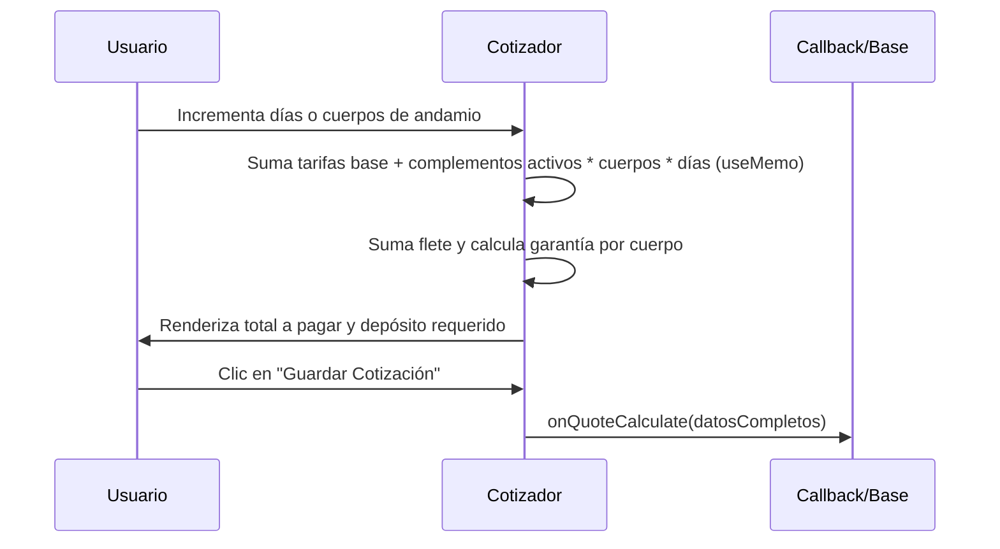

<!--
{
  "resource": "SelectorAlquilerAndamios",
  "technicalName": "SelectorAlquilerAndamios",
  "targetPath": "src/components/admin/sandboxes/SelectorAlquilerAndamiosSandbox.jsx",
  "dependencies": {
    "npm": {
      "lucide-react": "^0.294.0"
    },
    "internal": []
  },
  "type": "component",
  "niches": [
    "contractors"
  ]
}
-->

# Selector de Alquiler de Andamios (SelectorAlquilerAndamios)

## Biblioteca de Componentes: Contratistas y Construcción

Este componente permite cotizar y seleccionar el alquiler de equipos de acceso seguro a alturas, tales como cuerpos de andamio tubular estándar, andamios multidireccionales certificados, plataformas metálicas, escaleras y ruedas de traslado.

---

## 💎 Propósito y Casos de Uso
En el desarrollo de fachadas, techos o instalaciones elevadas, los contratistas requieren calcular los costos de andamios por días de uso. Este componente facilita:
1. **Cotización Rápida por Equipos**: El usuario puede configurar la cantidad de cuerpos, plataformas, ruedas y el tiempo de alquiler en días.
2. **Identificación de Tipo de Equipo**: Selector interactivo entre andamios tradicionales de marco (económicos) y multidireccionales certificados (de alta seguridad y carga).
3. **Desglose de Garantías y Fletes**: Calcula de forma automática el depósito reembolsable de garantía y el flete de envío/recolección.

---

## 🎨 Especificación Visual y Estilos (Tailwind CSS)
* **Accesorios y Complementos**: Grid responsivo `grid-cols-2 sm:grid-cols-3 gap-3` para complementos lógicos (ruedas, plataformas de seguridad).
* **Desglose Económico**: Tarjeta de cotización lateral con fondos `bg-[var(--color-surface-2)]/40` y clases de bordes finos.
* **Selectores**: Uso de `CustomSelect` para configurar la referencia base del andamio.

---

## 3. Código React Completo

```jsx
import React, { useState, useMemo } from 'react';
import { ShieldCheck, Truck, RotateCcw, Calendar, Check, Layers } from 'lucide-react';
import CustomSelect from '../../ui/CustomSelect';

export default function SelectorAlquilerAndamios({
  onQuoteCalculate,
  tiposAndamio = [
    { value: 'estandar', label: 'Andamio Tubular Estándar (Marco 1.5m)', tarifaDia: 8000, depositoCuerpo: 150000, desc: 'Ideal para pintura interior y albañilería ligera.' },
    { value: 'multidireccional', label: 'Andamio Multidireccional Certificado', tarifaDia: 18000, depositoCuerpo: 450000, desc: 'Recomendado para trabajo estructural pesado en fachadas.' }
  ],
  accesoriosBase = [
    { id: 'plataforma', label: 'Plataforma Metálica Antideslizante', tarifaDia: 2000, checked: true },
    { id: 'ruedas', label: 'Juego de Ruedas Giratorias con Freno', tarifaDia: 3000, checked: false },
    { id: 'niveladores', label: 'Tornillos Niveladores de Base (4 und)', tarifaDia: 1500, checked: false }
  ]
}) {
  const [tipo, setTipo] = useState('estandar');
  const [cuerpos, setCuerpos] = useState(2);
  const [dias, setDias] = useState(7);
  const [accesorios, setAccesorios] = useState(accesoriosBase);
  const [envioRequerido, setEnvioRequerido] = useState(true);

  const andamioActivo = useMemo(() => {
    return tiposAndamio.find(t => t.value === tipo) || tiposAndamio[0];
  }, [tipo, tiposAndamio]);

  const toggleAccesorio = (id) => {
    setAccesorios(accesorios.map(a => a.id === id ? { ...a, checked: !a.checked } : a));
  };

  const cotizacion = useMemo(() => {
    const costoAndamios = andamioActivo.tarifaDia * cuerpos * dias;
    
    let costoAccesorios = 0;
    accesorios.forEach(acc => {
      if (acc.checked) {
        costoAccesorios += acc.tarifaDia * cuerpos * dias;
      }
    });

    const subtotalAlquiler = costoAndamios + costoAccesorios;
    const flete = envioRequerido ? 60000 : 0;
    const depositoGarantia = andamioActivo.depositoCuerpo * cuerpos;
    const totalPagar = subtotalAlquiler + flete;

    return {
      costoAndamios,
      costoAccesorios,
      subtotalAlquiler,
      flete,
      depositoGarantia,
      totalPagar
    };
  }, [andamioActivo, cuerpos, dias, accesorios, envioRequerido]);

  const handleSave = () => {
    if (onQuoteCalculate) {
      onQuoteCalculate({
        tipo: andamioActivo.value,
        cuerpos,
        dias,
        accesorios: accesorios.filter(a => a.checked).map(a => a.id),
        envioRequerido,
        cotizacion
      });
    }
  };

  return (
    <div className="w-full max-w-4xl mx-auto bg-[var(--color-surface)] border border-[var(--color-border)] rounded-2xl p-6 shadow-xl text-[var(--color-text)]">
      {/* Cabecera */}
      <div className="flex items-center gap-3 pb-5 border-b border-[var(--color-border)] mb-6">
        <div className="p-3 bg-[var(--color-primary)]/10 rounded-xl text-[var(--color-primary)]">
          <Layers className="w-6 h-6" />
        </div>
        <div>
          <h2 className="text-xl font-bold">Alquiler de Andamios y Equipos</h2>
          <p className="text-sm text-[var(--color-text-muted)]">Cotizador de andamios tubulares y certificados</p>
        </div>
      </div>

      <div className="grid grid-cols-1 lg:grid-cols-12 gap-6">
        {/* Entradas */}
        <div className="lg:col-span-7 flex flex-col gap-5">
          {/* Tipo de Andamio */}
          <div>
            <label className="block text-xs text-[var(--color-text-muted)] mb-1">Tipo de Estructura de Andamio</label>
            <CustomSelect
              value={tipo}
              onChange={setTipo}
              options={tiposAndamio.map(t => ({ value: t.value, label: t.label }))}
            />
            <p className="text-xs text-[var(--color-text-muted)] mt-1.5 italic">
              {andamioActivo.desc}
            </p>
          </div>

          {/* Cuerpos y Días */}
          <div className="grid grid-cols-1 sm:grid-cols-2 gap-4">
            <div className="bg-[var(--color-surface-2)]/40 border border-[var(--color-border)] p-4 rounded-xl">
              <label className="block text-xs text-[var(--color-text-muted)] mb-1.5 font-bold">Cantidad de Cuerpos</label>
              <div className="flex items-center justify-between">
                <button
                  onClick={() => setCuerpos(Math.max(1, cuerpos - 1))}
                  className="w-8 h-8 rounded-lg bg-[var(--color-bg)] border border-[var(--color-border)] flex items-center justify-center font-bold hover:bg-[var(--color-surface-2)]"
                >
                  -
                </button>
                <span className="font-extrabold text-lg">{cuerpos}</span>
                <button
                  onClick={() => setCuerpos(cuerpos + 1)}
                  className="w-8 h-8 rounded-lg bg-[var(--color-bg)] border border-[var(--color-border)] flex items-center justify-center font-bold hover:bg-[var(--color-surface-2)]"
                >
                  +
                </button>
              </div>
            </div>

            <div className="bg-[var(--color-surface-2)]/40 border border-[var(--color-border)] p-4 rounded-xl">
              <label className="block text-xs text-[var(--color-text-muted)] mb-1.5 font-bold">Días de Alquiler</label>
              <div className="flex items-center justify-between">
                <button
                  onClick={() => setDias(Math.max(1, dias - 1))}
                  className="w-8 h-8 rounded-lg bg-[var(--color-bg)] border border-[var(--color-border)] flex items-center justify-center font-bold hover:bg-[var(--color-surface-2)]"
                >
                  -
                </button>
                <span className="font-extrabold text-lg">{dias}</span>
                <button
                  onClick={() => setDias(dias + 1)}
                  className="w-8 h-8 rounded-lg bg-[var(--color-bg)] border border-[var(--color-border)] flex items-center justify-center font-bold hover:bg-[var(--color-surface-2)]"
                >
                  +
                </button>
              </div>
            </div>
          </div>

          {/* Accesorios */}
          <div className="flex flex-col gap-2.5">
            <label className="text-xs font-bold text-[var(--color-text-muted)] uppercase tracking-wider">Accesorios Adicionales (por cuerpo)</label>
            <div className="grid grid-cols-1 sm:grid-cols-2 gap-3">
              {accesorios.map(acc => (
                <button
                  key={acc.id}
                  onClick={() => toggleAccesorio(acc.id)}
                  className={`flex items-center justify-between p-3 rounded-xl border text-left transition-all ${
                    acc.checked
                      ? 'bg-[var(--color-primary)]/10 border-[var(--color-primary)]/40 text-[var(--color-primary)]'
                      : 'bg-[var(--color-surface-2)]/30 border-[var(--color-border)] hover:border-[var(--color-border)]/80 text-[var(--color-text-muted)]'
                  }`}
                >
                  <div className="flex flex-col">
                    <span className="text-xs font-semibold text-[var(--color-text)]">{acc.label}</span>
                    <span className="text-[10px] text-[var(--color-text-muted)] mt-0.5">
                      +${acc.tarifaDia.toLocaleString()}/día
                    </span>
                  </div>
                  <div className={`w-4 h-4 rounded border flex items-center justify-center ${
                    acc.checked ? 'bg-[var(--color-primary)] border-transparent text-white' : 'border-[var(--color-border)]'
                  }`}>
                    {acc.checked && <Check className="w-3 h-3" />}
                  </div>
                </button>
              ))}
            </div>
          </div>

          {/* Envío a obra */}
          <button
            onClick={() => setEnvioRequerido(!envioRequerido)}
            className={`flex items-center justify-between p-4 rounded-xl border transition-all ${
              envioRequerido
                ? 'bg-emerald-500/10 border-emerald-500/40 text-emerald-400'
                : 'bg-[var(--color-surface-2)]/30 border-[var(--color-border)] hover:border-[var(--color-border)]/80'
            }`}
          >
            <div className="flex items-center gap-3">
              <Truck className="w-5 h-5 text-emerald-500" />
              <div className="flex flex-col text-left">
                <span className="text-xs font-bold text-[var(--color-text)]">Servicio de Transporte (Entrega y Retiro)</span>
                <span className="text-[10px] text-[var(--color-text-muted)]">Flete fijo consolidado de despacho</span>
              </div>
            </div>
            <div className={`w-4 h-4 rounded border flex items-center justify-center ${
              envioRequerido ? 'bg-emerald-500 border-transparent text-white' : 'border-[var(--color-border)]'
            }`}>
              {envioRequerido && <Check className="w-3.5 h-3.5" />}
            </div>
          </button>
        </div>

        {/* Cotización Financiera */}
        <div className="lg:col-span-5">
          <div className="bg-[var(--color-surface-2)]/50 border border-[var(--color-border)] p-6 rounded-2xl flex flex-col gap-6 sticky top-6">
            <h3 className="text-base font-bold pb-3 border-b border-[var(--color-border)]">Desglose de Cotización</h3>

            <div className="flex flex-col gap-3 text-xs">
              <div className="flex justify-between">
                <span className="text-[var(--color-text-muted)]">Alquiler Base ({cuerpos} cuerpos)</span>
                <span>${cotizacion.costoAndamios.toLocaleString()} COP</span>
              </div>

              <div className="flex justify-between">
                <span className="text-[var(--color-text-muted)]">Accesorios / Complementos</span>
                <span>${cotizacion.costoAccesorios.toLocaleString()} COP</span>
              </div>

              <div className="flex justify-between">
                <span className="text-[var(--color-text-muted)]">Servicio de Flete</span>
                <span>${cotizacion.flete.toLocaleString()} COP</span>
              </div>

              <div className="flex justify-between pt-3 border-t border-[var(--color-border)]/40 font-bold text-sm text-[var(--color-text)]">
                <span>Subtotal Alquiler</span>
                <span>${cotizacion.subtotalAlquiler.toLocaleString()} COP</span>
              </div>
            </div>

            {/* Depósito reembolsable */}
            <div className="p-4 bg-[var(--color-bg)]/80 border border-[var(--color-border)] rounded-xl flex items-start gap-3">
              <ShieldCheck className="w-5 h-5 text-emerald-500 shrink-0 mt-0.5" />
              <div className="flex flex-col gap-0.5">
                <span className="text-[10px] text-[var(--color-text-muted)] uppercase tracking-wider font-bold">Depósito en Garantía (Reembolsable)</span>
                <span className="text-sm font-bold text-emerald-400">${cotizacion.depositoGarantia.toLocaleString()} COP</span>
              </div>
            </div>

            {/* Total Neto */}
            <div className="flex flex-col gap-1 pt-3 border-t border-[var(--color-border)]">
              <span className="text-xs text-[var(--color-text-muted)] uppercase font-semibold">Total a Pagar (Con flete)</span>
              <span className="text-2xl font-extrabold text-[var(--color-primary)]">${cotizacion.totalPagar.toLocaleString()} COP</span>
            </div>

            <button
              onClick={handleSave}
              className="w-full py-3 bg-[var(--color-primary)] hover:bg-[var(--color-primary-hover)] text-white font-bold rounded-xl flex items-center justify-center gap-2 shadow-lg shadow-[var(--color-primary)]/20 transition-all active:scale-[0.98]"
            >
              Guardar Cotización
            </button>
          </div>
        </div>
      </div>
    </div>
  );
}
```

---

## 4. Lógica de Estado y Ciclo de Vida
1. **`tipo`**: Referencia del andamio elegido. Modifica tanto la tarifa de alquiler por día como el valor unitario de la garantía.
2. **`cuerpos` / `dias`**: Estados enteros que multiplican dinámicamente el valor total de renta.
3. **`accesorios`**: Array de objetos de complementos con selectores de activación rápida.

---

## 5. Flujo Operativo y Secuencia de Interacción


