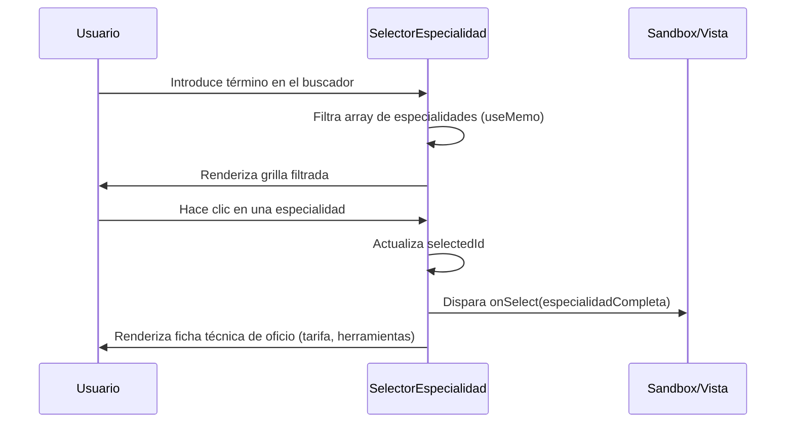

<!--
{
  "resource": "SelectorEspecialidadContratistas",
  "technicalName": "SelectorEspecialidadContratistas",
  "targetPath": "src/components/admin/sandboxes/SelectorEspecialidadContratistasSandbox.jsx",
  "dependencies": {
    "npm": {
      "lucide-react": "^0.294.0"
    },
    "internal": []
  },
  "type": "component",
  "niches": [
    "contractors"
  ]
}
-->

# Selector de Especialidad de Contratistas (SelectorEspecialidadContratistas)

## Biblioteca de Componentes: Contratistas y Construcción

Este componente visual interactivo permite filtrar y seleccionar especialistas y contratistas según su especialidad técnica (Albañilería, Plomería, Electricidad, Carpintería, Pintura, Climatización), mostrando tarifas nominales de mercado, certificaciones requeridas y herramientas mínimas por oficio.

---

## 💎 Propósito y Casos de Uso
En obras y remodelaciones multilaterales, la contratación de mano de obra calificada debe estar bien segmentada. Este selector gráfico permite:
1. **Asignación Rápida a Frentes de Trabajo**: Los directores de obra pueden seleccionar y cotizar cuadrillas de distintas especialidades en tiempo real.
2. **Control de Presupuestos de Contrato**: Visualización rápida del rango de coste por hora o por jornada (día de 8 horas) de cada especialidad.
3. **Validación de Equipamiento**: Muestra qué kit de herramientas de protección y trabajo debe aportar obligatoriamente el especialista.

---

## 🎨 Especificación Visual y Estilos (Tailwind CSS)
* **Cuadrícula de Especialidades**: Grid adaptable `grid-cols-1 sm:grid-cols-2 lg:grid-cols-3 gap-4`.
* **Tarjetas Interactivas**: Tarjeta premium con `bg-[var(--color-surface)]` y bordes finos `border border-[var(--color-border)]`. Las tarjetas seleccionadas se iluminan con un borde y sombra de marca `border-[var(--color-primary)]` y `shadow-[var(--color-primary)]/10`.
* **Estados de Interacción**: Animación elástica de escala `hover:scale-[1.02] hover:-translate-y-0.5` con transiciones de color de 200ms.

---

## 3. Código React Completo

```jsx
import React, { useState, useMemo } from 'react';
import { Hammer, Droplet, Bolt, Paintbrush, ShieldCheck, Flame, Layers, Search } from 'lucide-react';

export default function SelectorEspecialidadContratistas({
  onSelect,
  especialidadesBase = [
    {
      id: 'albañil',
      label: 'Albañilería y Obras Grises',
      icon: Layers,
      tarifaJornada: 120000,
      certificaciones: ['Trabajo en Alturas Básica', 'Seguridad Ocupacional'],
      herramientas: ['Cuchara de albañil', 'Nivel de burbuja', 'Plomada', 'Mezcladora'],
      color: 'amber'
    },
    {
      id: 'plomero',
      label: 'Plomería e Hidráulica',
      icon: Droplet,
      tarifaJornada: 110000,
      certificaciones: ['Soldadura Termofusión', 'Manejo de Tuberías PVC/PPR'],
      herramientas: ['Llave para tubos', 'Cortatubos', 'Soplete de gas', 'Prensa de banco'],
      color: 'blue'
    },
    {
      id: 'electricista',
      label: 'Electricidad Residencial/Industrial',
      icon: Bolt,
      tarifaJornada: 130000,
      certificaciones: ['Matrícula Conte/Copnia', 'Certificación RETIE Vigente'],
      herramientas: ['Multímetro digital', 'Pinza voltiamperimétrica', 'Pelacables', 'Destornilladores dieléctricos'],
      color: 'yellow'
    },
    {
      id: 'pintor',
      label: 'Pintura y Acabados Secos',
      icon: Paintbrush,
      tarifaJornada: 90000,
      certificaciones: ['Trabajo en Alturas Avanzado (para fachadas)'],
      herramientas: ['Pistola airless', 'Rodillos y brochas premium', 'Lijadora orbital', 'Espátulas'],
      color: 'green'
    },
    {
      id: 'soldador',
      label: 'Herrería y Soldadura Estructural',
      icon: Flame,
      tarifaJornada: 140000,
      certificaciones: ['Soldadura AWS D1.1 (Estructuras)', 'Manejo de Oxicorte'],
      herramientas: ['Inversor de soldadura', 'Careta fotosensible', 'Esmeril angular', 'Escuadras magnéticas'],
      color: 'red'
    },
    {
      id: 'instalador_hvac',
      label: 'Climatización e Instalaciones HVAC',
      icon: Hammer,
      tarifaJornada: 135000,
      certificaciones: ['Manejo de Gases Refrigerantes', 'Técnico HVAC certificado'],
      herramientas: ['Manómetro digital', 'Bomba de vacío', 'Pestañadora de tubos', 'Detector de fugas'],
      color: 'cyan'
    }
  ]
}) {
  const [selectedId, setSelectedId] = useState(especialidadesBase[0].id);
  const [searchQuery, setSearchQuery] = useState('');

  const filteredEspecialidades = useMemo(() => {
    return especialidadesBase.filter(esp =>
      esp.label.toLowerCase().includes(searchQuery.toLowerCase()) ||
      esp.id.toLowerCase().includes(searchQuery.toLowerCase())
    );
  }, [searchQuery, especialidadesBase]);

  const selectedEspecialidad = useMemo(() => {
    return especialidadesBase.find(esp => esp.id === selectedId) || null;
  }, [selectedId, especialidadesBase]);

  const handleSelect = (id) => {
    setSelectedId(id);
    const esp = especialidadesBase.find(e => e.id === id);
    if (esp && onSelect) {
      onSelect(esp);
    }
  };

  // Asignar colores dinámicos seguros HSL
  const getIconColor = (colorName) => {
    switch (colorName) {
      case 'amber': return 'text-amber-500 bg-amber-500/10 border-amber-500/20';
      case 'blue': return 'text-blue-500 bg-blue-500/10 border-blue-500/20';
      case 'yellow': return 'text-yellow-500 bg-yellow-500/10 border-yellow-500/20';
      case 'green': return 'text-green-500 bg-green-500/10 border-green-500/20';
      case 'red': return 'text-red-500 bg-red-500/10 border-red-500/20';
      case 'cyan': return 'text-cyan-500 bg-cyan-500/10 border-cyan-500/20';
      default: return 'text-[var(--color-primary)] bg-[var(--color-primary)]/10 border-[var(--color-primary)]/20';
    }
  };

  return (
    <div className="w-full max-w-5xl mx-auto bg-[var(--color-surface)] border border-[var(--color-border)] rounded-2xl p-6 shadow-xl text-[var(--color-text)]">
      {/* Barra superior */}
      <div className="flex flex-col md:flex-row md:items-center justify-between gap-4 pb-5 border-b border-[var(--color-border)] mb-6">
        <div>
          <h2 className="text-xl font-bold">Especialidades de Contratación</h2>
          <p className="text-sm text-[var(--color-text-muted)]">Selecciona el perfil técnico para tu obra</p>
        </div>
        <div className="relative w-full md:w-72">
          <input
            type="text"
            placeholder="Buscar especialidad..."
            value={searchQuery}
            onChange={(e) => setSearchQuery(e.target.value)}
            className="w-full pl-9 pr-4 py-2 bg-[var(--color-bg)] border border-[var(--color-border)] rounded-xl text-sm focus:border-[var(--color-primary)] focus:outline-none placeholder-[var(--color-text-muted)]/50"
          />
          <Search className="w-4 h-4 text-[var(--color-text-muted)] absolute left-3 top-3" />
        </div>
      </div>

      <div className="grid grid-cols-1 lg:grid-cols-12 gap-6">
        {/* Lado Izquierdo: Tarjetas */}
        <div className="lg:col-span-7 flex flex-col gap-4">
          <div className="grid grid-cols-1 sm:grid-cols-2 gap-4 max-h-[460px] overflow-y-auto pr-2 py-1">
            {filteredEspecialidades.length === 0 ? (
              <div className="col-span-2 text-center py-10 text-sm text-[var(--color-text-muted)]">
                No se encontraron especialidades que coincidan con la búsqueda.
              </div>
            ) : (
              filteredEspecialidades.map(esp => {
                const IconComp = esp.icon;
                const isSelected = esp.id === selectedId;
                const colorClasses = getIconColor(esp.color);

                return (
                  <button
                    key={esp.id}
                    onClick={() => handleSelect(esp.id)}
                    className={`flex flex-col items-start text-left p-4 rounded-xl border transition-all duration-200 hover:scale-[1.02] hover:-translate-y-0.5 ${
                      isSelected
                        ? 'bg-[var(--color-surface-2)] border-[var(--color-primary)] shadow-md shadow-[var(--color-primary)]/5'
                        : 'bg-[var(--color-surface-2)]/30 border-[var(--color-border)] hover:border-[var(--color-border)]/80'
                    }`}
                  >
                    <div className={`p-2.5 rounded-lg border ${colorClasses} mb-3`}>
                      <IconComp className="w-5 h-5" />
                    </div>
                    <span className="font-bold text-sm leading-tight mb-1">{esp.label}</span>
                    <span className="text-xs text-[var(--color-text-muted)]">
                      Tarifa: ${esp.tarifaJornada.toLocaleString()} COP / día
                    </span>
                  </button>
                );
              })
            )}
          </div>
        </div>

        {/* Lado Derecho: Ficha del perfil seleccionado */}
        <div className="lg:col-span-5">
          {selectedEspecialidad ? (
            <div className="bg-[var(--color-surface-2)]/40 border border-[var(--color-border)] p-5 rounded-xl flex flex-col gap-5 sticky top-6">
              <div>
                <span className="text-[10px] uppercase font-bold tracking-wider px-2 py-0.5 rounded bg-[var(--color-primary)]/10 text-[var(--color-primary)] border border-[var(--color-primary)]/20">
                  Ficha de Oficio
                </span>
                <h3 className="text-base font-bold mt-2">{selectedEspecialidad.label}</h3>
              </div>

              {/* Tarifa y Estimación */}
              <div className="bg-[var(--color-bg)]/50 border border-[var(--color-border)] p-4 rounded-xl flex flex-col gap-1">
                <span className="text-xs text-[var(--color-text-muted)]">Tarifa Nominal por Jornada</span>
                <span className="text-2xl font-bold text-[var(--color-primary)]">
                  ${selectedEspecialidad.tarifaJornada.toLocaleString()} <span className="text-xs text-[var(--color-text-muted)] font-normal">COP/Día (8h)</span>
                </span>
                <span className="text-[10px] text-[var(--color-text-muted)] mt-1">
                  * Tarifa estimada promedio para contratista independiente.
                </span>
              </div>

              {/* Requisitos / Certificaciones */}
              <div>
                <h4 className="text-xs font-bold text-[var(--color-text-muted)] uppercase tracking-wider mb-2 flex items-center gap-1.5">
                  <ShieldCheck className="w-3.5 h-3.5 text-emerald-500" />
                  Certificaciones Críticas
                </h4>
                <ul className="flex flex-col gap-1.5">
                  {selectedEspecialidad.certificaciones.map((cert, idx) => (
                    <li key={idx} className="text-xs flex items-start gap-2">
                      <span className="w-1.5 h-1.5 bg-emerald-500 rounded-full mt-1.5 shrink-0" />
                      <span>{cert}</span>
                    </li>
                  ))}
                </ul>
              </div>

              {/* Herramientas Mínimas Obligatorias */}
              <div>
                <h4 className="text-xs font-bold text-[var(--color-text-muted)] uppercase tracking-wider mb-2 flex items-center gap-1.5">
                  <Hammer className="w-3.5 h-3.5 text-[var(--color-primary)]" />
                  Herramientas y EPP Requerido
                </h4>
                <div className="flex flex-wrap gap-1.5">
                  {selectedEspecialidad.herramientas.map((h, idx) => (
                    <span
                      key={idx}
                      className="text-[10px] bg-[var(--color-bg)]/80 border border-[var(--color-border)] px-2 py-1 rounded-md text-[var(--color-text)]"
                    >
                      {h}
                    </span>
                  ))}
                </div>
              </div>
            </div>
          ) : (
            <div className="h-full border border-dashed border-[var(--color-border)] rounded-xl flex items-center justify-center p-10 text-sm text-[var(--color-text-muted)]">
              Ninguna especialidad seleccionada.
            </div>
          )}
        </div>
      </div>
    </div>
  );
}
```

---

## 4. Lógica de Estado y Ciclo de Vida
1. **`selectedId`**: Guarda el identificador de la especialidad activa para desplegar sus detalles y resaltar su tarjeta.
2. **`searchQuery`**: Estado enlazado al input de búsqueda para filtrar la grilla en tiempo real.
3. **`filteredEspecialidades`**: Lista memorizada mediante `useMemo` para recalcular el conjunto visualizado sin causar renders redundantes al modificar el estado superior del dashboard.

---

## 5. Flujo Operativo y Secuencia de Interacción


