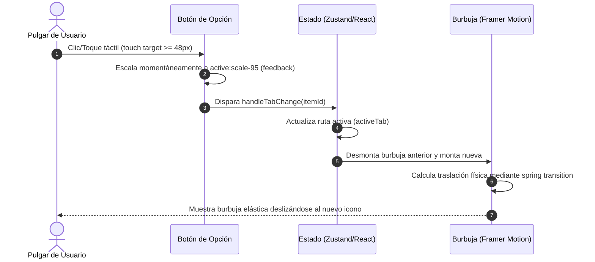

<!--
{
  "resource": "AnimatedNavbarMobile",
  "technicalName": "AnimatedNavbarMobile",
  "targetPath": "src/components/common/AnimatedNavbarMobile.jsx",
  "type": "component",
  "niches": ["retail_clothing", "grocery_food", "distribuidoras-beauty", "petshops-locales", "moda-local-calzado"],
  "dependencies": {
    "npm": {
      "framer-motion": "^11.0.0",
      "lucide-react": "^0.300.0"
    },
    "internal": []
  }
}
-->

# 📱 Barra de Navegación Animada Móvil (`AnimatedNavbarMobile`)

Barra de navegación táctil inferior (Bottom Navigation Bar) premium diseñada específicamente para aplicaciones móviles y PWAs (Progressive Web Apps). Incorpora una burbuja de fondo elástica e interactiva usando Framer Motion que acompaña suavemente el toque del pulgar del usuario al cambiar de ruta, ofreciendo una experiencia táctil fluida y nativa.

---

## 1. Propósito y Casos de Uso
En dispositivos móviles, las barras de navegación laterales o los menús de hamburguesa tradicionales requieren un esfuerzo cognitivo y físico mayor (por la distancia del pulgar en pantallas grandes). Este componente resuelve ese problema colocando los accesos directos principales en la zona de toque más cómoda (zona inferior).

### Casos de Uso:
* Barra de navegación principal en la versión PWA móvil de tiendas de ropa y retail.
* Menú inferior táctil para aplicaciones de entrega o pedidos.
* Navegación principal rápida en catálogos y portales autogestionados.

---

## 2. Especificación Visual y Estilos
* **Glassmorphism:** Fondo translúcido con efecto blur (`bg-[var(--color-surface)]/85 backdrop-blur-xl`) para una integración visual moderna con el contenido en scroll.
* **Borde Premium:** Línea de división superior sutil con la variable semántica de borde del ecosistema.
* **Burbuja Elástica:** Indicador de selección ovalado con un fondo suave de color de marca (`bg-[var(--color-primary)]/15`) y animación física tipo resorte (`spring`).
* **Touch Targets Seguro:** Botones dimensionados a una altura unificada de `h-16` garantizando un área de clic superior a `48x48px` para evitar toques accidentales.
* **Exclusión Mutua:** Oculto por defecto en pantallas de escritorio mediante la clase de corte `sm:hidden`.

---

## 3. Código React Completo

```jsx
import React, { useState } from 'react';
import { motion } from 'framer-motion';
import { Home, Search, ShoppingBag, User } from 'lucide-react';

// Opciones de navegación por defecto (Regla de 3 a 5 opciones)
const DEFAULT_ITEMS = [
  { id: 'home', label: 'Inicio', icon: Home },
  { id: 'catalog', label: 'Catálogo', icon: Search },
  { id: 'cart', label: 'Carrito', icon: ShoppingBag },
  { id: 'profile', label: 'Perfil', icon: User },
];

/**
 * AnimatedNavbarMobile — Barra de navegación inferior animada para móviles.
 * 
 * @param {string} [activeTab] - ID de la pestaña activa (controlado externamente).
 * @param {function} [onChange] - Callback disparado al cambiar de pestaña.
 * @param {Array} [items] - Opciones personalizadas de navegación.
 */
export default function AnimatedNavbarMobile({ 
  activeTab: externalActiveTab, 
  onChange, 
  items = DEFAULT_ITEMS 
}) {
  const [localActiveTab, setLocalActiveTab] = useState('home');
  
  const activeTab = externalActiveTab !== undefined ? externalActiveTab : localActiveTab;

  const handleTabChange = (itemId) => {
    if (externalActiveTab === undefined) {
      setLocalActiveTab(itemId);
    }
    if (onChange) {
      onChange(itemId);
    }
  };

  return (
    <nav className="fixed bottom-0 left-0 z-50 w-full bg-[var(--color-surface)]/85 backdrop-blur-xl border-t border-[var(--color-border)] pb-safe sm:hidden">
      <div className="flex items-center justify-around h-16 px-2">
        {items.map((item) => {
          const Icon = item.icon;
          const isActive = activeTab === item.id;

          return (
            <button
              key={item.id}
              onClick={() => handleTabChange(item.id)}
              aria-label={item.label}
              className={`relative flex flex-col items-center justify-center w-full h-full min-h-[48px] min-w-[48px] active:scale-95 transition-all duration-200 ease-in-out cursor-pointer ${
                isActive ? 'text-[var(--color-primary)]' : 'text-[var(--color-text-muted)]'
              }`}
            >
              {/* Burbuja elástica de fondo */}
              {isActive && (
                <motion.div
                  layoutId="active-nav-bubble"
                  className="absolute inset-0 w-12 h-12 mx-auto mt-1 bg-[var(--color-primary)]/15 rounded-full"
                  transition={{
                    type: 'spring',
                    stiffness: 400,
                    damping: 25,
                    mass: 0.8
                  }}
                />
              )}
              
              <Icon 
                className="w-[22px] h-[22px] z-10" 
                strokeWidth={isActive ? 2.5 : 2} 
              />
              <span className="text-[10px] font-bold z-10 mt-1 truncate max-w-full px-1">
                {item.label}
              </span>
            </button>
          );
        })}
      </div>
    </nav>
  );
}
```

---

## 4. Lógica de Estado y Ciclo de Vida
* **Estado Híbrido:** El componente opera de forma *no controlada* por defecto (usando `localActiveTab` para pruebas y montajes rápidos en Playgrounds), pero muta automáticamente a *controlado* cuando se suministra la prop `activeTab`, permitiendo la sincronización con enrutadores como React Router o gestores de estado global como Zustand.
* **LayoutId de Framer Motion:** La directiva `layoutId="active-nav-bubble"` es la clave para la animación de transición fluida. Cuando una burbuja se desmonta y otra se monta en un elemento diferente con el mismo `layoutId`, Framer Motion calcula automáticamente la diferencia física de posiciones (caja del botón) y desplaza la burbuja mediante una transición elástica ininterrumpida.

---

## 5. Flujo Operativo y Secuencia de Interacción


