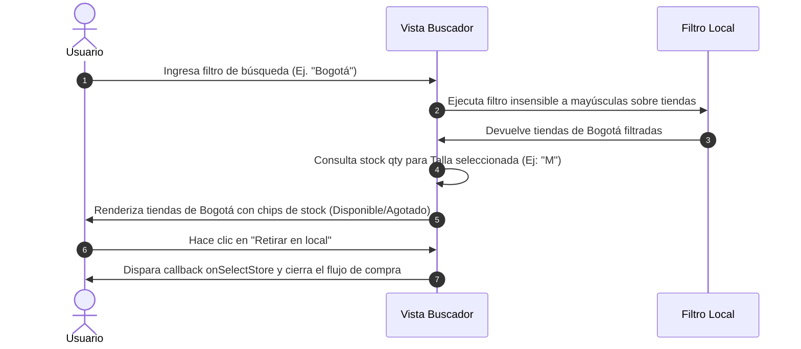

<!--
{
  "resource": "BuscadorDisponibilidadTiendas",
  "technicalName": "BuscadorDisponibilidadTiendas",
  "type": "component",
  "niches": [
    "retail_clothing",
    "moda-local-calzado"
  ],
  "targetPath": "src/components/ui/BuscadorDisponibilidadTiendas.jsx",
  "dependencies": {
    "npm": {},
    "internal": []
  }
}
-->

# Buscador de Disponibilidad en Tiendas (BuscadorDisponibilidadTiendas)

Componente O2O (Online-to-Offline) que permite verificar en tiempo real si el producto y la talla consultada están disponibles en stock en alguna de las sucursales físicas de la marca, facilitando el retiro inmediato o compra local.

---

## 1. Propósito y Casos de Uso
1.  **Ficha de Detalle de Producto:** Enlace/Drawer debajo del CTA de compra que muestra "Ver disponibilidad en tiendas".
2.  **Selector de Envío / Retiro:** Integrar en el Checkout para listar sucursales aptas para el retiro físico ("Click & Collect") del pedido.

---

## 2. Especificación Visual y Estilos (Tailwind CSS)
*   **Contenedor Principal:** Panel estructurado con fondo de cristal (`backdrop-blur-xl bg-[var(--color-surface)]/20 border border-[var(--color-border)]`) y bordes curvos elásticos.
*   **Formulario de Búsqueda:** Campo de texto premium con ícono de búsqueda SVG incrustado y dropdown dinámico de autocompletado de ciudades/sucursales.
*   **Listado de Sucursales:** Tarjetas interactivas con indicadores semánticos de stock:
    *   `Disponible` (Verde: `bg-emerald-500/10 text-emerald-500 border-emerald-500/20`)
    *   `Últimas unidades` (Naranja: `bg-amber-500/10 text-amber-500 border-amber-500/20`)
    *   `Agotado` (Rojo: `bg-rose-500/10 text-rose-500 border-rose-500/20`)
*   **Detalles del Local:** Dirección física con link externo a mapas (`target="_blank"`), horario comercial y número telefónico con marcado directo.

---

## 3. Código React Completo (React 19 & JSX)

```jsx
import React, { useState, useMemo } from 'react';

const STORES_DEFAULT = [
  {
    id: 'store-1',
    name: 'Prototipe Moda - Centro Comercial Andino',
    city: 'Bogotá',
    address: 'Carrera 11 # 82-71, Local 102',
    phone: '+57 311 000 0001',
    hours: 'Lun - Sáb: 10:00 AM - 8:00 PM',
    stock: { 'S': 5, 'M': 8, 'L': 0, 'XL': 3 },
    coords: 'https://maps.google.com/?q=CC+Andino+Bogota'
  },
  {
    id: 'store-2',
    name: 'Prototipe Moda - Unicentro',
    city: 'Bogotá',
    address: 'Avenida 15 # 124-30, Local 345',
    phone: '+57 311 000 0002',
    hours: 'Lun - Dom: 10:00 AM - 9:00 PM',
    stock: { 'S': 0, 'M': 2, 'L': 4, 'XL': 0 },
    coords: 'https://maps.google.com/?q=Unicentro+Bogota'
  },
  {
    id: 'store-3',
    name: 'Prototipe Moda - El Tesoro',
    city: 'Medellín',
    address: 'Carrera 25A # 1A Sur-45, Local 410',
    phone: '+57 311 000 0003',
    hours: 'Lun - Sáb: 10:00 AM - 9:00 PM',
    stock: { 'S': 12, 'M': 15, 'L': 7, 'XL': 8 },
    coords: 'https://maps.google.com/?q=Parque+Comercial+El+Tesoro+Medellin'
  },
  {
    id: 'store-4',
    name: 'Prototipe Moda - Chipichape',
    city: 'Cali',
    address: 'Calle 38N # 6N-35, Local A-12',
    phone: '+57 311 000 0004',
    hours: 'Lun - Sáb: 10:00 AM - 8:00 PM',
    stock: { 'S': 0, 'M': 0, 'L': 0, 'XL': 0 },
    coords: 'https://maps.google.com/?q=Chipichape+Cali'
  }
];

export default function BuscadorDisponibilidadTiendas({
  selectedSize = 'M',
  stores = STORES_DEFAULT,
  onSelectStore = null
}) {
  const [searchQuery, setSearchQuery] = useState('');

  const filteredStores = useMemo(() => {
    const query = searchQuery.toLowerCase().trim();
    if (!query) return stores;
    return stores.filter(store => 
      store.name.toLowerCase().includes(query) || 
      store.city.toLowerCase().includes(query) ||
      store.address.toLowerCase().includes(query)
    );
  }, [searchQuery, stores]);

  const getStockBadge = (stockQty) => {
    if (stockQty === 0) {
      return {
        label: 'Agotado',
        classes: 'bg-rose-500/10 text-rose-500 dark:text-rose-400 border-rose-500/20'
      };
    }
    if (stockQty <= 3) {
      return {
        label: `Últimas ${stockQty} uds.`,
        classes: 'bg-amber-500/10 text-amber-500 dark:text-amber-400 border-amber-500/20'
      };
    }
    return {
      label: 'Disponible',
      classes: 'bg-emerald-500/10 text-emerald-500 dark:text-emerald-400 border-emerald-500/20'
    };
  };

  return (
    <div 
      id="buscador-disponibilidad-tiendas-container"
      className="w-full max-w-sm p-5 rounded-2xl bg-[var(--color-surface)]/20 border border-[var(--color-border)] text-[var(--color-text)] shadow-xl backdrop-blur-xl animate-fade-in"
    >
      <div className="mb-4">
        <span className="text-[10px] font-black uppercase tracking-wider text-indigo-500 dark:text-indigo-400">Verificar Stock en Tienda</span>
        <h3 className="text-sm font-bold text-[var(--color-text)] mt-0.5">Disponibilidad para Talla {selectedSize}</h3>
      </div>

      {/* Input de Búsqueda */}
      <div className="relative mb-4" id="search-input-wrapper">
        <div className="absolute inset-y-0 left-0 pl-3 flex items-center pointer-events-none">
          <svg className="h-4 w-4 text-[var(--color-text-muted)]" fill="none" viewBox="0 0 24 24" stroke="currentColor">
            <path strokeLinecap="round" strokeLinejoin="round" strokeWidth={2} d="M21 21l-6-6m2-5a7 7 0 11-14 0 7 7 0 0114 0z" />
          </svg>
        </div>
        <input
          id="store-search-field"
          type="text"
          placeholder="Buscar ciudad o centro comercial..."
          value={searchQuery}
          onChange={(e) => setSearchQuery(e.target.value)}
          className="w-full bg-[var(--color-surface-2)] border border-[var(--color-border)] rounded-xl py-2 pl-9 pr-8 text-xs text-[var(--color-text)] placeholder-[var(--color-text-muted)]/60 focus:outline-none focus:border-indigo-500 focus:ring-1 focus:ring-indigo-500/35 transition-all"
        />
        {searchQuery && (
          <button
            type="button"
            onClick={() => setSearchQuery('')}
            className="absolute inset-y-0 right-0 pr-3 flex items-center text-[var(--color-text-muted)] hover:text-[var(--color-text)] transition-colors"
          >
            <svg className="h-4 w-4" fill="none" viewBox="0 0 24 24" stroke="currentColor">
              <path strokeLinecap="round" strokeLinejoin="round" strokeWidth={2.5} d="M6 18L18 6M6 6l12 12" />
            </svg>
          </button>
        )}
      </div>

      {/* Listado de Locales */}
      <div className="space-y-3 max-h-72 overflow-y-auto pr-1 scrollbar-thin" id="stores-results-list">
        {filteredStores.length > 0 ? (
          filteredStores.map(store => {
            const stockQty = store.stock[selectedSize] ?? 0;
            const badge = getStockBadge(stockQty);
            const isClickAndCollectAvailable = stockQty > 0;

            return (
              <div 
                key={store.id}
                className="p-4 bg-[var(--color-bg)]/80 border border-[var(--color-border)] rounded-2xl flex flex-col justify-between gap-3 hover:border-indigo-500/30 transition-all duration-300"
              >
                <div className="flex justify-between items-start gap-3">
                  <div className="min-w-0">
                    <span className="text-[12px] font-bold text-[var(--color-text)] block leading-tight">{store.name}</span>
                    <span className="text-[10px] text-[var(--color-text-muted)] block mt-1 leading-normal">{store.address}</span>
                  </div>
                  <span className={`text-[10px] font-black uppercase tracking-wider px-2 py-0.5 rounded-lg border ${badge.classes} shrink-0`}>
                    {badge.label}
                  </span>
                </div>

                <div className="flex flex-wrap gap-x-3 gap-y-1 text-[10px] text-[var(--color-text-muted)] border-t border-[var(--color-border)]/40 pt-2.5">
                  <div className="flex items-center gap-1.5">
                    <svg className="w-3.5 h-3.5 text-indigo-500 dark:text-indigo-400" fill="none" viewBox="0 0 24 24" stroke="currentColor">
                      <path strokeLinecap="round" strokeLinejoin="round" strokeWidth={2} d="M12 8v4l3 3m6-3a9 9 0 11-18 0 9 9 0 0118 0z" />
                    </svg>
                    {store.hours}
                  </div>
                  <a 
                    href={`tel:${store.phone.replace(/\s+/g, '')}`}
                    className="flex items-center gap-1.5 hover:text-indigo-500 dark:hover:text-indigo-400 transition-colors"
                  >
                    <svg className="w-3.5 h-3.5 text-indigo-500 dark:text-indigo-400" fill="none" viewBox="0 0 24 24" stroke="currentColor">
                      <path strokeLinecap="round" strokeLinejoin="round" strokeWidth={2} d="M3 5a2 2 0 012-2h3.28a1 1 0 01.94.725l.548 2.2a1 1 0 01-.321.988l-1.305.98a10.582 10.582 0 004.872 4.872l.98-1.305a1 1 0 01.988-.321l2.2.548a1 1 0 01.725.94V19a2 2 0 01-2 2h-1C9.716 21 3 14.284 3 6V5z" />
                    </svg>
                    {store.phone}
                  </a>
                </div>

                <div className="flex gap-2.5 pt-2 border-t border-[var(--color-border)]/20 mt-1">
                  <a
                    href={store.coords}
                    target="_blank"
                    rel="noopener noreferrer"
                    className="flex-1 bg-[var(--color-surface-2)] hover:bg-[var(--color-surface)] border border-[var(--color-border)] text-[11px] font-bold py-2 rounded-xl text-center flex items-center justify-center gap-1.5 transition-all text-[var(--color-text)]"
                  >
                    Mapa
                  </a>
                  {isClickAndCollectAvailable && onSelectStore && (
                    <button
                      type="button"
                      onClick={() => onSelectStore(store)}
                      className="flex-1 bg-indigo-650 hover:bg-indigo-550 !text-white text-[11px] font-bold py-2 px-3 rounded-xl shadow-lg shadow-indigo-650/10 active:scale-98 transition-all cursor-pointer"
                    >
                      Retirar en local
                    </button>
                  )}
                </div>
              </div>
            );
          })
        ) : (
          <div className="text-center py-8 bg-[var(--color-surface-2)]/30 border border-dashed border-[var(--color-border)] rounded-2xl">
            <span className="text-xs text-[var(--color-text-muted)] block font-semibold">No hay sucursales</span>
          </div>
        )}
      </div>
    </div>
  );
}
```

---

## 🔄 Diagrama de Secuencia de Consulta

