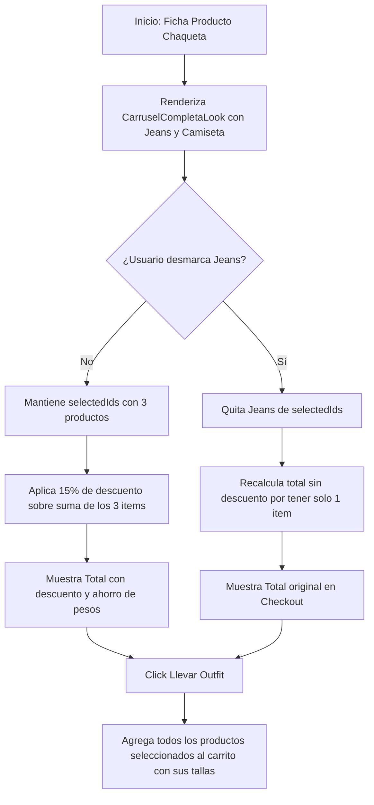

<!--
{
  "resource": "CarruselCompletaLook",
  "technicalName": "CarruselCompletaLook",
  "type": "component",
  "niches": [
    "retail_clothing",
    "moda-local-calzado"
  ],
  "targetPath": "src/components/ui/CarruselCompletaLook.jsx",
  "dependencies": {
    "npm": {},
    "internal": []
  }
}
-->

# Carrusel Completa el Look (CarruselCompletaLook)

Componente de conversión y venta cruzada (cross-selling) premium. Muestra el producto actual enlazado con 2 o 3 accesorios o prendas sugeridas para armar un outfit completo. Permite seleccionar tallas/variantes individuales de los productos relacionados y agregarlos todos al carrito en un solo clic con un descuento promocional por lote.

---

## 1. Propósito y Casos de Uso
1.  **Ficha de Detalle de Prenda:** Sección "Completa el look" o "Combínalo con" debajo de la descripción principal en e-commerce de moda.
2.  **Popup de Confirmación de Adición:** Ofrecer el look completo en un modal deslizante cuando el usuario añade una prenda base al carrito.

---

## 2. Especificación Visual y Estilos (Tailwind CSS)
*   **Contenedor Principal:** Panel horizontal responsivo con fondo premium translúcido (`backdrop-blur-xl bg-[var(--color-surface)]/20 border border-[var(--color-border)]`), sombras decorativas y bordes curvos elásticos.
*   **Visualizador de Ecuación de Compra:** Ficha visual tipo `[ Producto Principal ] + [ Accesorio 1 ] + [ Accesorio 2 ] = [ Combo con Descuento ]` para motivar la compra agrupada.
*   **Tarjetas de Producto Simplificadas:** Cards compactas que exponen imagen, precio original, precio con descuento del combo y un micro-selector de talla simplificado.
*   **Botón de Conversión CTA:** Botón principal con degradado cromático animado que cambia dinámicamente el precio final sumado en tiempo real al marcar o desmarcar productos.

---

## 3. Código React Completo (React 19 & JSX)

```jsx
import React, { useState, useMemo } from 'react';

export default function CarruselCompletaLook({
  mainProduct = {
    id: 'main-1',
    name: 'Chaqueta Denim Premium',
    price: 180000,
    image: 'https://images.unsplash.com/photo-1576995853123-5a10305d93c0?w=300&auto=format&fit=crop&q=80',
    sizes: ['S', 'M', 'L']
  },
  relatedProducts = [
    {
      id: 'rel-1',
      name: 'Jeans Slim Fit Dark',
      price: 120000,
      image: 'https://images.unsplash.com/photo-1541099649105-f69ad21f3246?w=300&auto=format&fit=crop&q=80',
      sizes: ['28', '30', '32', '34']
    },
    {
      id: 'rel-2',
      name: 'Camiseta Básica Pima',
      price: 60000,
      image: 'https://images.unsplash.com/photo-1521572267360-ee0c2909d518?w=300&auto=format&fit=crop&q=80',
      sizes: ['S', 'M', 'L', 'XL']
    }
  ],
  discountPercentage = 15,
  onAddLookToCart = null
}) {
  const [selectedIds, setSelectedIds] = useState([mainProduct.id, ...relatedProducts.map(p => p.id)]);
  
  // Tallas seleccionadas por producto
  const [selectedSizes, setSelectedSizes] = useState(() => {
    const initial = { [mainProduct.id]: mainProduct.sizes[0] };
    relatedProducts.forEach(p => {
      initial[p.id] = p.sizes[0];
    });
    return initial;
  });

  const toggleProductSelect = (id) => {
    if (id === mainProduct.id) return; // El producto principal no se puede desmarcar
    setSelectedIds(prev => 
      prev.includes(id) ? prev.filter(item => item !== id) : [...prev, id]
    );
  };

  const handleSizeChange = (prodId, size) => {
    setSelectedSizes(prev => ({
      ...prev,
      [prodId]: size
    }));
  };

  const totals = useMemo(() => {
    let originalSum = mainProduct.price;
    relatedProducts.forEach(p => {
      if (selectedIds.includes(p.id)) {
        originalSum += p.price;
      }
    });

    const hasDiscount = selectedIds.length >= 2;
    const discount = hasDiscount ? Math.round(originalSum * (discountPercentage / 100)) : 0;
    const final = originalSum - discount;

    return {
      original: originalSum,
      discount,
      final,
      hasDiscount
    };
  }, [selectedIds, mainProduct, relatedProducts, discountPercentage]);

  const handleBuyBundle = () => {
    const bundleItems = [];
    
    // Producto base
    bundleItems.push({
      id: mainProduct.id,
      name: mainProduct.name,
      price: mainProduct.price,
      selectedSize: selectedSizes[mainProduct.id]
    });

    // Relacionados seleccionados
    relatedProducts.forEach(p => {
      if (selectedIds.includes(p.id)) {
        bundleItems.push({
          id: p.id,
          name: p.name,
          price: p.price,
          selectedSize: selectedSizes[p.id]
        });
      }
    });

    if (onAddLookToCart) {
      onAddLookToCart(bundleItems, totals.final);
    }
  };

  return (
    <div 
      id="carrusel-completa-look-container"
      className="w-full max-w-2xl mx-auto p-5 rounded-2xl bg-[var(--color-surface)]/20 border border-[var(--color-border)] text-[var(--color-text)] shadow-2xl backdrop-blur-xl animate-fade-in"
    >
      <div className="mb-4">
        <span className="text-[10px] font-black uppercase tracking-wider text-indigo-500 dark:text-indigo-400">Oferta Especial Outfit</span>
        <h3 className="text-base font-bold text-[var(--color-text)] mt-0.5">Completa el Look & Ahorra un {discountPercentage}%</h3>
      </div>

      {/* Grilla del Look Completo */}
      <div className="grid grid-cols-1 md:grid-cols-[1fr_auto_200px] gap-6 items-center">
        
        {/* Lista de Prendas del Outfit */}
        <div className="flex flex-wrap md:flex-nowrap gap-4 items-center overflow-x-auto pb-2 scrollbar-thin">
          
          {/* Card Producto Principal */}
          <div 
            className="flex gap-3 p-3 bg-[var(--color-bg)]/80 border border-[var(--color-border)] rounded-2xl w-60 shrink-0 relative"
            id={`product-card-${mainProduct.id}`}
          >
            <div className="absolute top-2.5 left-2.5 bg-indigo-650 text-[9px] font-black text-white px-2 py-0.5 rounded-lg shadow-md uppercase">
              Base
            </div>
            
            <div className="flex-1 min-w-0 flex flex-col justify-between">
              <span className="text-xs font-bold text-[var(--color-text)] block truncate">{mainProduct.name}</span>
              <span className="text-xs font-black text-indigo-500 dark:text-indigo-400 block">${mainProduct.price.toLocaleString()} COP</span>
              
              {/* Tallas en Botones Premium */}
              <div className="flex gap-1.5 mt-1.5 flex-wrap">
                {mainProduct.sizes.map(s => {
                  const isSelected = selectedSizes[mainProduct.id] === s;
                  return (
                    <button
                      key={s}
                      type="button"
                      onClick={() => handleSizeChange(mainProduct.id, s)}
                      className={`px-2 py-0.5 rounded-lg text-[9px] font-bold border transition-all cursor-pointer ${
                        isSelected 
                          ? 'bg-indigo-600 border-indigo-600 text-white shadow-sm shadow-indigo-600/10'
                          : 'bg-[var(--color-surface-2)] border-[var(--color-border)] text-[var(--color-text-muted)] hover:border-indigo-500/50'
                      }`}
                    >
                      {s}
                    </button>
                  );
                })}
              </div>
            </div>
          </div>

          {/* Icono de Suma */}
          <div className="text-[var(--color-text-muted)] font-bold text-lg hidden md:block">+</div>

          {/* Cards Relacionados */}
          {relatedProducts.map(p => {
            const isSelected = selectedIds.includes(p.id);
            return (
              <div 
                key={p.id}
                onClick={() => toggleProductSelect(p.id)}
                className={`flex gap-3 p-3 rounded-2xl w-60 shrink-0 border cursor-pointer transition-all duration-300 ${
                  isSelected 
                    ? 'bg-[var(--color-bg)]/90 border-indigo-500 shadow-md shadow-indigo-500/5' 
                    : 'bg-[var(--color-bg)]/40 border-[var(--color-border)] opacity-60 hover:opacity-85'
                }`}
                id={`product-card-${p.id}`}
              >
                <div className="relative">
                  
                  {/* Checkbox circular */}
                  <div className={`absolute -top-1.5 -left-1.5 w-4.5 h-4.5 rounded-full border flex items-center justify-center transition-all ${
                    isSelected ? 'bg-indigo-600 border-indigo-600 text-white' : 'bg-[var(--color-surface-2)] border-[var(--color-border)]'
                  }`}>
                    {isSelected && (
                      <svg className="w-2.5 h-2.5" fill="none" viewBox="0 0 24 24" stroke="currentColor">
                        <path strokeLinecap="round" strokeLinejoin="round" strokeWidth={3} d="M5 13l4 4L19 7" />
                      </svg>
                    )}
                  </div>
                </div>

                <div 
                  className="flex-1 min-w-0 flex flex-col justify-between"
                  onClick={(e) => e.stopPropagation()} // Previene toggle al interactuar con las tallas
                >
                  <span className="text-xs font-bold text-[var(--color-text)] block truncate">{p.name}</span>
                  <span className="text-xs font-black text-indigo-500 dark:text-indigo-400 block">${p.price.toLocaleString()} COP</span>
                  
                  {/* Tallas en Botones Premium */}
                  <div className="flex gap-1.5 mt-1.5 flex-wrap">
                    {p.sizes.map(s => {
                      const isSelectedSize = selectedSizes[p.id] === s;
                      return (
                        <button
                          key={s}
                          type="button"
                          onClick={() => handleSizeChange(p.id, s)}
                          className={`px-2 py-0.5 rounded-lg text-[9px] font-bold border transition-all cursor-pointer ${
                            isSelectedSize 
                              ? 'bg-indigo-600 border-indigo-600 text-white shadow-sm shadow-indigo-600/10'
                              : 'bg-[var(--color-surface-2)] border-[var(--color-border)] text-[var(--color-text-muted)] hover:border-indigo-500/50'
                          }`}
                        >
                          {s}
                        </button>
                      );
                    })}
                  </div>
                </div>
              </div>
            );
          })}
        </div>

        {/* Separador móvil */}
        <div className="h-px bg-[var(--color-border)]/55 w-full md:hidden" />

        {/* Bloque de Total y Botón Compra Lote */}
        <div className="flex flex-col justify-center items-center md:items-start text-center md:text-left bg-[var(--color-surface-2)]/30 p-4 rounded-2xl border border-[var(--color-border)]">
          <span className="text-[9px] font-black uppercase tracking-wider text-[var(--color-text-muted)]">Total Outfit</span>
          
          <div className="my-1.5">
            {totals.hasDiscount && (
              <span className="text-xs text-[var(--color-text-muted)] line-through block">
                ${totals.original.toLocaleString()}
              </span>
            )}
            <span className="text-xl font-black text-[var(--color-text)] block tracking-tight">
              ${totals.final.toLocaleString()} COP
            </span>
          </div>

          {totals.hasDiscount && (
            <span className="text-[10px] text-emerald-500 dark:text-emerald-400 font-bold block mb-3 bg-emerald-500/5 px-2 py-0.5 rounded-lg border border-emerald-500/10">
              Ahorras ${totals.discount.toLocaleString()} COP
            </span>
          )}

          <button
            type="button"
            onClick={handleBuyBundle}
            className="w-full bg-indigo-600 hover:bg-indigo-550 !text-white text-xs font-bold py-2.5 px-3 rounded-xl shadow-lg shadow-indigo-600/10 active:scale-98 transition-all cursor-pointer"
          >
            Llevar Outfit completo
          </button>
        </div>

      </div>
    </div>
  );
}
```

---

## 🔄 Diagrama de Flujo del Lote Completo

