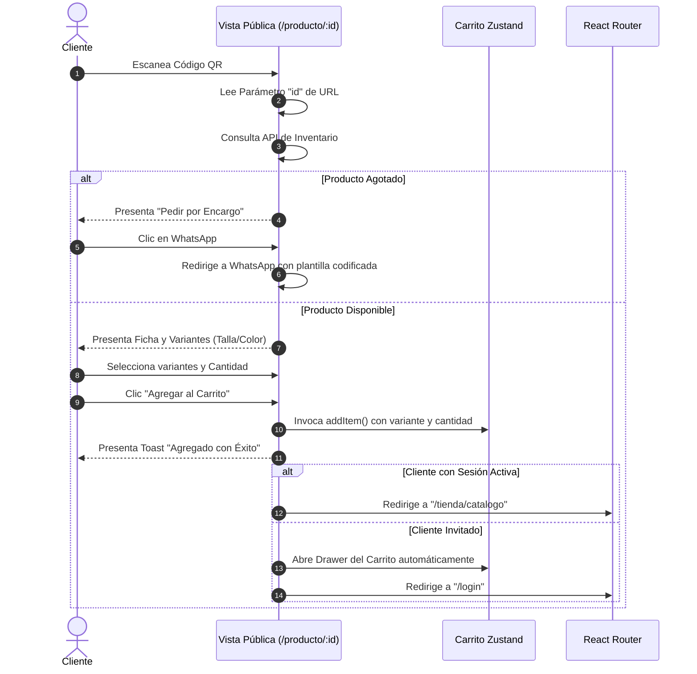

# Componente de Compra Rápida por Código QR (White-Label QR Purchase Flow)

## 1. Propósito y Casos de Uso
Este módulo permite la **compra directa y visualización pública** de productos escaneados mediante códigos QR autogenerados en el panel administrativo. Al escanearse el código de un artículo, el cliente es redirigido directamente a una vista detallada sin necesidad de registrarse inicialmente. Permite:
- Consultar de manera asíncrona la información del artículo y sus variantes de stock (talla/color) mediante URL pública parametrizada.
- Añadir el artículo directamente al carro de compras global.
- Redirigir de forma condicional: si el usuario tiene sesión activa, regresa al catálogo tradicional con el artículo agregado; si el usuario es invitado, abre el Drawer del Carrito y lo guía al Checkout de manera no-intrusiva.
- Soportar solicitudes de encargo vía WhatsApp si el artículo está temporalmente agotado, utilizando color HSL configurable.

---

## 2. Especificación Visual y Estilos
El componente está construido bajo estándares estrictos de **Marca Blanca y diseño HSL**, adaptándose dinámicamente a los tokens del cliente final:
- **Layout Adaptativo:** Diseño optimizado para teléfonos móviles (Mobile-first) con un ancho máximo de `max-w-md` y centrado elegante en pantallas de escritorio.
- **Micro-interacciones:** Botones interactivos con escalado activo (`active:scale-95`), transiciones fluidas de `300ms` y hover dinámico.
- **Grayscale de Agotados:** Si el producto está totalmente agotado, la imagen sufre un difuminado (`opacity-50`) y filtro de escala de grises (`grayscale`), acompañado de un badge flotante con desenfoque de fondo (`backdrop-blur-sm`).
- **Zigzag / Glow:** Efecto glow con sombras suaves HSL para artículos con promoción activa.

---

## 3. Props y API
El componente está diseñado de forma modular y stateless en su lógica de servicios, aceptando la inyección de hooks y variables a través de props:

```tsx
interface QRProductPublicDetailProps {
  /** ID del producto obtenido de los parámetros de la URL */
  productId: string;
  /** Hook / función para consultar los datos del producto */
  useProductQuery: (id: string) => { data: any; isLoading: boolean; isError: boolean };
  /** Hook / función para consultar las categorías */
  useCategoriesQuery: () => { data: any[] };
  /** Estado de sesión del usuario */
  currentUser: any;
  /** Acción para agregar un elemento al carrito global */
  addItemToCart: (item: any, qty: number) => void;
  /** Acción para abrir el drawer del carrito visualmente */
  openCartDrawer: () => void;
  /** Callback de redirección tras agregar al carro */
  onNavigate: (route: string) => void;
  /** Callback para abrir el chat de WhatsApp oficial */
  onWhatsAppChat: (options: { message: string }) => void;
  /** Formateador de moneda localizado (ej. COP, USD) */
  formatPriceFn: (price: number) => string;
  /** Color primario de WhatsApp para el botón de encargo */
  encargoButtonColor?: string;
  /** Componente inyectado para el selector de cantidad táctil */
  QuantitySelectorComponent: React.ComponentType<{
    value: number;
    onChange: (val: number) => void;
    min: number;
    max: number;
  }>;
}
```

---

## 4. Código React Completo y Funcional
A continuación se presenta la implementación modular, limpia y agnóstica sin dependencias rígidas:

```jsx
import { useState, useMemo, useEffect } from 'react';

// Constantes de colores para variantes de productos
const DEFAULT_COLOR_MAP = {
  'rojo': '#EF4444',
  'azul': '#3B82F6',
  'verde': '#10B981',
  'amarillo': '#EAB308',
  'naranja': '#F97316',
  'morado': '#8B5CF6',
  'rosa': '#EC4899',
  'negro': '#171717',
  'blanco': '#FFFFFF',
  'gris': '#6B7280',
  'cafe': '#78350F',
  'café': '#78350F',
  'beige': '#F5F5DC',
  'celeste': '#38BDF8',
  'vino': '#7F1D1D',
  'dorado': '#D4AF37',
  'plateado': '#C0C0C0',
  'marron': '#78350F',
  'marrón': '#78350F',
};

function getCssColor(colorName, customColorMap = {}) {
  if (!colorName) return '#ccc';
  const normalized = colorName.toLowerCase().trim();
  const mergedMap = { ...DEFAULT_COLOR_MAP, ...customColorMap };
  if (mergedMap[normalized]) return mergedMap[normalized];
  
  let hash = 0;
  for (let i = 0; i < normalized.length; i++) {
    hash = normalized.charCodeAt(i) + ((hash << 5) - hash);
  }
  return '#' + (hash & 0x00FFFFFF).toString(16).toUpperCase().padStart(6, '0');
}

export function QRProductPublicDetail({
  productId,
  useProductQuery,
  useCategoriesQuery,
  currentUser,
  addItemToCart,
  openCartDrawer,
  onNavigate,
  onWhatsAppChat,
  formatPriceFn,
  encargoButtonColor = '#25D366',
  QuantitySelectorComponent
}) {
  const { data: product, isLoading, isError } = useProductQuery(productId);
  const { data: categories = [] } = useCategoriesQuery();

  const [selectedTalla, setSelectedTalla] = useState(null);
  const [selectedColor, setSelectedColor] = useState(null);
  const [cantidad, setCantidad] = useState(1);
  const [error, setError] = useState('');
  const [showToast, setShowToast] = useState(false);

  // Resolver nombre de categoría
  const matchedCat = useMemo(() => {
    if (!product || !categories.length) return '';
    const cat = categories.find(c => c.id === product.categoriaId);
    return cat ? cat.nombre : product.categoria;
  }, [product, categories]);

  // Filtrar variantes con stock disponible
  const availableVariants = useMemo(() => {
    if (!product || !product.variantes) return [];
    return product.variantes.filter(v => (v.stock || 0) > 0);
  }, [product]);

  // Verificar si está completamente agotado
  const isFullyOutOfStock = useMemo(() => {
    if (!product || !product.variantes || product.variantes.length === 0) return false;
    return product.variantes.every(v => (v.stock || 0) <= 0);
  }, [product]);

  // WhatsApp para pedidos de encargo
  const handleRequestEncargo = () => {
    const msg = `🛍️ Hola, me interesa el producto *${product.nombre}* pero veo que está agotado. ¿Es posible pedirlo por encargo?`;
    onWhatsAppChat({ message: msg });
  };

  // Obtener tallas de las variantes disponibles
  const tallas = useMemo(() => {
    const t = new Set(availableVariants.map(v => v.talla).filter(Boolean));
    return Array.from(t);
  }, [availableVariants]);

  // Obtener colores disponibles de acuerdo a la talla seleccionada
  const colores = useMemo(() => {
    let validVariants = availableVariants;
    if (selectedTalla) {
      validVariants = validVariants.filter(v => v.talla === selectedTalla);
    }
    const c = new Set(validVariants.map(v => v.color).filter(Boolean));
    return Array.from(c);
  }, [availableVariants, selectedTalla]);

  // Resetear estados al cambiar de producto
  useEffect(() => {
    if (product) {
      setSelectedTalla(null);
      setSelectedColor(null);
      setCantidad(1);
      setError('');
      
      const vars = product.variantes?.filter(v => v.stock > 0) || [];
      const t = Array.from(new Set(vars.map(v => v.talla).filter(Boolean)));
      const c = Array.from(new Set(vars.map(v => v.color).filter(Boolean)));
      
      if (t.length === 1) setSelectedTalla(t[0]);
      if (c.length === 1) setSelectedColor(c[0]);
    }
  }, [product]);

  // Variante seleccionada actual
  const currentVariant = useMemo(() => {
    if (!product) return null;
    return availableVariants.find(v => 
      (v.talla === selectedTalla || (!v.talla && !selectedTalla)) &&
      (v.color === selectedColor || (!v.color && !selectedColor))
    );
  }, [availableVariants, selectedTalla, selectedColor, product]);

  const handleAddToCart = () => {
    setError('');
    
    if (tallas.length > 0 && !selectedTalla) {
      setError('Por favor selecciona una talla');
      return;
    }
    if (colores.length > 0 && !selectedColor) {
      setError('Por favor selecciona un color');
      return;
    }

    if (!currentVariant) {
      setError('Esta combinación no está disponible actualmente');
      return;
    }

    const actualPrice = (product.tienePromocion && product.precioPromo < product.precioBase)
      ? product.precioPromo
      : product.precioBase;

    addItemToCart({
      productId: product.id,
      variantId: currentVariant.id,
      nombre: product.nombre,
      precio: actualPrice,
      talla: selectedTalla,
      color: selectedColor,
      imageUrl: product.imageUrl,
      maxStock: currentVariant.stock,
    }, cantidad);

    setShowToast(true);
    setTimeout(() => {
      setShowToast(false);
      if (currentUser) {
        onNavigate('/tienda/catalogo');
      } else {
        openCartDrawer();
        onNavigate('/login');
      }
    }, 1200);
  };

  if (isLoading) {
    return (
      <div className="min-h-screen bg-app flex flex-col items-center justify-center p-6">
        <div className="w-10 h-10 border-4 border-primary/20 border-t-primary rounded-full animate-spin" />
        <p className="text-sm font-black text-muted uppercase tracking-widest mt-4">Cargando producto...</p>
      </div>
    );
  }

  if (isError || !product) {
    return (
      <div className="min-h-screen bg-app flex flex-col items-center justify-center p-6 text-center">
        <div className="w-16 h-16 rounded-full bg-orange-500/10 text-orange-500 flex items-center justify-center mb-4">
          <svg viewBox="0 0 24 24" width="28" height="28" stroke="currentColor" fill="none" strokeWidth="2.5" strokeLinecap="round" strokeLinejoin="round">
            <circle cx="12" cy="12" r="10" />
            <line x1="12" y1="8" x2="12" y2="12" />
            <line x1="12" y1="16" x2="12.01" y2="16" />
          </svg>
        </div>
        <h2 className="text-lg font-black text-app uppercase tracking-wider mb-2">Producto no disponible</h2>
        <p className="text-sm text-muted max-w-xs mb-8">
          Este producto fue eliminado o desactivado por la tienda.<br />
          ¡Pero tenemos muchos más productos esperándote!
        </p>
        <div className="flex flex-col gap-3 w-full max-w-xs">
          <button
            onClick={() => onNavigate('/tienda/catalogo')}
            className="h-12 px-6 bg-primary text-white font-bold text-sm rounded-2xl active:scale-95 transition-all shadow-md shadow-primary/20 border-none cursor-pointer"
          >
            Ver catálogo completo
          </button>
          <button
            onClick={() => onNavigate('/')}
            className="h-11 px-6 bg-surface-2 text-muted font-semibold text-xs uppercase tracking-wider rounded-2xl border border-app active:scale-95 transition-all cursor-pointer"
          >
            Ir al Inicio
          </button>
        </div>
      </div>
    );
  }

  return (
    <div className="min-h-screen bg-app pb-32 relative">
      {/* Header flotante */}
      <header className="fixed top-0 inset-x-0 h-16 bg-surface/80 backdrop-blur-md border-b border-app flex items-center justify-between px-4 z-40">
        <button
          onClick={() => onNavigate(-1)}
          className="w-10 h-10 rounded-full bg-surface hover:bg-surface-2 border border-app flex items-center justify-center text-app transition-colors cursor-pointer"
        >
          <svg viewBox="0 0 24 24" width="16" height="16" stroke="currentColor" fill="none" strokeWidth="2.5" strokeLinecap="round" strokeLinejoin="round">
            <line x1="19" y1="12" x2="5" y2="12" />
            <polyline points="12 19 5 12 12 5" />
          </svg>
        </button>
        <span className="text-xs font-black text-muted uppercase tracking-widest">Detalle de Producto</span>
        <div className="w-10 h-10" />
      </header>

      {/* Contenido principal */}
      <main className="max-w-md mx-auto pt-24 px-4">
        {/* Imagen del producto */}
        <div className="relative w-full aspect-square bg-surface rounded-3xl overflow-hidden border border-app shadow-sm">
          {product.imageUrl ? (
            
          ) : (
            <div className="w-full h-full flex flex-col items-center justify-center text-muted">
              <svg viewBox="0 0 24 24" width="64" height="64" stroke="currentColor" fill="none" strokeWidth="1.5" className="opacity-30 mb-2">
                <rect x="3" y="3" width="18" height="18" rx="2" ry="2" />
                <circle cx="8.5" cy="8.5" r="1.5" />
                <polyline points="21 15 16 10 5 21" />
              </svg>
            </div>
          )}

          {/* Badge Agotado */}
          {isFullyOutOfStock && (
            <div className="absolute inset-0 flex items-center justify-center">
              <div className="bg-black/60 backdrop-blur-sm px-5 py-2.5 rounded-full flex items-center gap-2">
                <svg viewBox="0 0 24 24" width="14" height="14" stroke="#FB923C" fill="none" strokeWidth="2.5">
                  <circle cx="12" cy="12" r="10" />
                  <polyline points="12 6 12 12 16 14" />
                </svg>
                <span className="text-white font-black text-xs uppercase tracking-widest">Temporalmente agotado</span>
              </div>
            </div>
          )}

          {/* Badge de Promoción */}
          {product.tienePromocion && !isFullyOutOfStock && (
            <div className="absolute top-4 left-4 py-1.5 px-3 rounded-full bg-primary text-white font-bold text-[10px] uppercase tracking-wider flex items-center gap-1.5 shadow-lg shadow-primary/20">
              <svg viewBox="0 0 24 24" width="11" height="11" stroke="currentColor" fill="none" strokeWidth="2.5">
                <path d="M12 2l3.09 6.26L22 9.27l-5 4.87 1.18 6.88L12 17.77l-6.18 3.25L7 14.14 2 9.27l6.91-1.01L12 2z" />
              </svg>
              <span>Oferta especial</span>
            </div>
          )}
        </div>

        {/* Ficha técnica */}
        <div className="mt-6">
          <div className="flex items-center justify-between">
            <span className="text-[10px] font-black text-primary uppercase tracking-widest bg-primary-soft px-2.5 py-1 rounded-md">
              {matchedCat || 'Destacado'}
            </span>
          </div>

          <h1 className="text-2xl font-black text-app tracking-tight mt-3 leading-tight">
            {product.nombre}
          </h1>

          {/* Precios */}
          <div className="mt-3 flex items-baseline gap-2.5">
            {product.tienePromocion && product.precioPromo < product.precioBase ? (
              <>
                <span className="text-3xl font-black text-primary">
                  {formatPriceFn(product.precioPromo)}
                </span>
                <span className="text-sm text-muted line-through font-semibold">
                  {formatPriceFn(product.precioBase)}
                </span>
              </>
            ) : (
              <span className="text-3xl font-black text-primary">
                {formatPriceFn(product.precioBase)}
              </span>
            )}
          </div>

          {/* Descripción */}
          {product.descripcion && (
            <p className="text-sm text-muted mt-4 leading-relaxed font-medium">
              {product.descripcion}
            </p>
          )}
        </div>

        {/* Selección de Talla */}
        {tallas.length > 0 && (
          <div className="mt-8 border-t border-app pt-6">
            <h3 className="text-xs font-bold text-app uppercase tracking-wider mb-3">Talla</h3>
            <div className="flex flex-wrap gap-2">
              {tallas.map(t => (
                <button
                  key={t}
                  onClick={() => {
                    setSelectedTalla(t);
                    if (selectedColor) {
                      const hasColor = availableVariants.some(v => v.talla === t && v.color === selectedColor);
                      if (!hasColor) setSelectedColor(null);
                    }
                    setError('');
                  }}
                  className={`h-10 px-4 rounded-xl text-sm font-semibold transition-all border-2 active:scale-95 cursor-pointer ${
                    selectedTalla === t 
                      ? 'border-primary bg-primary text-white' 
                      : 'border-app bg-transparent text-muted hover:border-primary/50'
                  }`}
                >
                  {t}
                </button>
              ))}
            </div>
          </div>
        )}

        {/* Selección de Color */}
        {colores.length > 0 && (
          <div className="mt-6 border-t border-app pt-6">
            <h3 className="text-xs font-bold text-app uppercase tracking-wider mb-3 flex justify-between">
              <span>Color</span>
              {selectedColor && <span className="text-primary font-black uppercase">{selectedColor}</span>}
            </h3>
            <div className="flex flex-wrap gap-3">
              {colores.map(c => {
                const cssColor = getCssColor(c);
                const isWhite = cssColor === '#FFFFFF' || cssColor.toLowerCase() === '#fff';
                const isSelected = selectedColor === c;
                
                return (
                  <button
                    key={c}
                    onClick={() => {
                      setSelectedColor(c);
                      setError('');
                    }}
                    title={c}
                    className={`w-12 h-12 rounded-full flex items-center justify-center transition-all active:scale-95 cursor-pointer ${
                      isSelected ? 'ring-2 ring-primary ring-offset-2 ring-offset-white' : 'ring-1 ring-app hover:ring-primary/50'
                    }`}
                  >
                    <span 
                      className={`w-10 h-10 rounded-full shadow-inner ${isWhite ? 'border border-app' : ''}`}
                      style={{ backgroundColor: cssColor }}
                    />
                  </button>
                );
              })}
            </div>
          </div>
        )}

        {/* Estatus de stock variante */}
        {currentVariant && (
          <p className={`text-xs font-bold mt-4 ${currentVariant.stock === 0 ? 'text-red-500' : 'text-green-600'}`}>
            {currentVariant.stock === 0 ? 'Esta combinación está agotada' : `${currentVariant.stock} unidades disponibles`}
          </p>
        )}
      </main>

      {/* Sticky footer para comprar */}
      <footer className="fixed bottom-0 inset-x-0 bg-surface/90 backdrop-blur-md border-t border-app p-4 pb-6 flex flex-col gap-3 z-30">
        {isFullyOutOfStock ? (
          <div className="max-w-md mx-auto w-full space-y-3">
            <div className="flex items-center gap-2 bg-orange-500/10 border border-orange-500/20 rounded-xl px-3 py-2.5">
              <svg viewBox="0 0 24 24" width="14" height="14" stroke="#F97316" fill="none" strokeWidth="2.5" className="shrink-0">
                <circle cx="12" cy="12" r="10" /><polyline points="12 6 12 12 16 14" />
              </svg>
              <p className="text-xs text-orange-600 font-semibold leading-snug">
                Este producto está temporalmente agotado. Puedes pedirlo por encargo y te avisamos cuando llegue.
              </p>
            </div>
            <button
              onClick={handleRequestEncargo}
              className="w-full h-14 rounded-2xl font-bold text-sm uppercase tracking-wider text-white hover:opacity-90 active:scale-95 transition-all duration-300 flex items-center justify-center gap-2.5 shadow-lg cursor-pointer border-none"
              style={{ backgroundColor: encargoButtonColor, boxShadow: `0 10px 15px -3px ${encargoButtonColor}33` }}
            >
              <svg viewBox="0 0 24 24" width="20" height="20" stroke="currentColor" fill="none" strokeWidth="2" strokeLinecap="round" strokeLinejoin="round">
                <path d="M21 11.5a8.38 8.38 0 0 1-.9 3.8 8.5 8.5 0 0 1-7.6 4.7 8.38 8.38 0 0 1-3.8-.9L3 21l1.9-5.7a8.38 8.38 0 0 1-.9-3.8 8.5 8.5 0 0 1 4.7-7.6 8.38 8.38 0 0 1 3.8-.9h.5a8.48 8.48 0 0 1 8 8v.5z" />
              </svg>
              <span>Pedir por Encargo vía WhatsApp</span>
            </button>
          </div>
        ) : (
          <>
            {error && (
              <p className="text-xs text-red-500 bg-red-500/10 border border-red-500/20 p-2.5 rounded-xl font-bold text-center leading-none">
                {error}
              </p>
            )}
            <div className="flex gap-3 max-w-md mx-auto w-full">
              <QuantitySelectorComponent
                value={cantidad}
                onChange={setCantidad}
                min={1}
                max={currentVariant?.stock || 10}
              />
              <button
                onClick={handleAddToCart}
                className="flex-1 h-14 rounded-2xl font-bold text-sm uppercase tracking-wider bg-primary text-white hover:opacity-90 shadow-lg shadow-primary/20 active:scale-95 transition-all duration-300 flex items-center justify-center gap-2 cursor-pointer border-none"
              >
                <svg viewBox="0 0 24 24" width="18" height="18" stroke="currentColor" fill="none" strokeWidth="2.5" strokeLinecap="round" strokeLinejoin="round">
                  <path d="M6 2L3 6v14a2 2 0 0 0 2 2h14a2 2 0 0 0 2-2V6l-3-4z" />
                  <line x1="3" y1="6" x2="21" y2="6" />
                  <path d="M16 10a4 4 0 0 1-8 0" />
                </svg>
                <span>Agregar al Carrito</span>
              </button>
            </div>
          </>
        )}
      </footer>

      {/* Notificación Flotante Toast */}
      {showToast && (
        <div className="fixed bottom-24 left-1/2 -translate-x-1/2 px-5 py-3.5 rounded-2xl shadow-2xl border border-green-500/20 bg-green-500 text-white flex items-center gap-3 z-[100] text-sm font-extrabold w-[90%] max-w-sm">
          <div className="w-6 h-6 rounded-full bg-white/20 flex items-center justify-center shrink-0">
            <svg viewBox="0 0 24 24" width="14" height="14" stroke="currentColor" fill="none" strokeWidth="3" strokeLinecap="round" strokeLinejoin="round">
              <polyline points="20 6 9 17 4 12"/>
            </svg>
          </div>
          <span className="mt-0.5">Agregado al carrito de compras</span>
        </div>
      )}
    </div>
  );
}
```

---

## 5. Lógica de Estado y Ciclo de Vida
1. **Inicialización y Carga:** El componente recibe el `productId` e invoca de forma asíncrona la consulta reactiva `useProductQuery`. Mientras se resuelven los datos, renderiza un cargador circular neutro que respeta el color primario de la marca.
2. **Preselección Inteligente de Única Opción (UX Premium):** Un efecto observa el objeto `product` resuelto. Si el producto solo cuenta con una única Talla o un único Color viable en su inventario, el componente autoselecciona la opción automáticamente para evitar clics innecesarios del usuario.
3. **Control Dinámico de Dimensiones Cruzadas:** El hook de memorización `colores` evalúa en tiempo real si hay una talla seleccionada. Si la hay, reduce las opciones del catálogo de colores únicamente a aquellas variantes que cuenten con stock disponible para esa talla específica, previniendo errores de preselección inválida.
4. **Resistencia a Transiciones Rápidas:** Si el usuario escanea un QR diferente de forma consecutiva, los estados de variantes seleccionadas se limpian a `null` de forma reactiva.

---

## 6. Integración de Servicios Externos
- **Generador de Códigos QR (Admin):** El panel de administración utiliza la API de codificación abierta `https://api.qrserver.com/v1/create-qr-code/` sin requerir API keys. Genera una imagen PNG dinámica de `200x200px` codificando la URL física del cliente:
  `{window.location.origin}/producto/{productId}`
- **WhatsApp Deep Linking:** Para solicitudes de encargo, delega la codificación al callback `onWhatsAppChat`, sanitizando caracteres conflictivos en el texto de redirección.

---

## 7. Flujo Operativo y Secuencia de Interacción


---

## 8. Ejemplo de Uso Declarativo
A continuación se detalla cómo integrar el componente modular dentro del ruteador central del cliente:

```jsx
import { useParams, useNavigate } from 'react-router-dom';
import { QRProductPublicDetail } from '../../components/catalog/QRProductPublicDetail';
import { useProduct, useCategories } from '../../hooks/useInventory';
import useCartStore from '../../store/cartStore';
import useAuthStore from '../../store/authStore';
import { formatCurrency } from '../../utils/formatters';
import { openWhatsAppChat } from '../../services/whatsappService';
import QuantitySelector from '../../components/ui/QuantitySelector';

export default function ProductPublicDetailPage() {
  const { id } = useParams();
  const navigate = useNavigate();
  const { user } = useAuthStore();
  const { addItem, openCart } = useCartStore();

  return (
    <QRProductPublicDetail
      productId={id}
      useProductQuery={useProduct}
      useCategoriesQuery={useCategories}
      currentUser={user}
      addItemToCart={addItem}
      openCartDrawer={openCart}
      onNavigate={navigate}
      onWhatsAppChat={openWhatsAppChat}
      formatPriceFn={formatCurrency}
      encargoButtonColor="#22C55E"
      QuantitySelectorComponent={QuantitySelector}
    />
  );
}
```

---

## 9. Origen del Componente
Este componente de marca blanca fue extraído y perfeccionado a partir del flujo de compra física implementado en:
- **Vista Detalle:** [ProductPublicDetail.jsx](file:///D:/PROTOTIPE/App%20Ventas/src/pages/client/ProductPublicDetail.jsx) — que gestiona la presentación de variantes e integraciones de WhatsApp.
- **Controlador Administrativo:** [AdminInventory.jsx](file:///D:/PROTOTIPE/App%20Ventas/src/pages/admin/AdminInventory.jsx) (Líneas 456-515) — que maneja la generación de QRs en el lado del Ecosistema y su posterior descarga como PNG de alta definición.
- **Intercepción de Catálogo:** [ClientCatalog.jsx](file:///D:/PROTOTIPE/App%20Ventas/src/pages/client/ClientCatalog.jsx) (Líneas 160-190) — que orquesta la carga inteligente de parámetros QR en caché y su apertura asíncrona.
