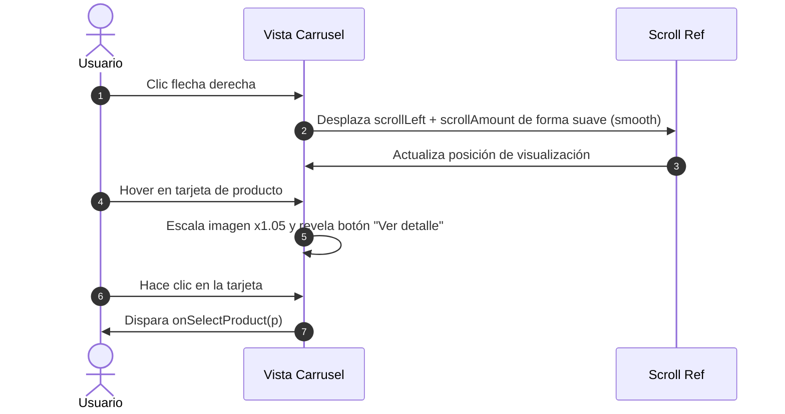

<!--
{
  "resource": "DeslizadorProductosSimilares",
  "technicalName": "DeslizadorProductosSimilares",
  "type": "component",
  "niches": [
    "retail_clothing",
    "moda-local-calzado"
  ],
  "targetPath": "src/components/ui/DeslizadorProductosSimilares.jsx",
  "dependencies": {
    "npm": {},
    "internal": []
  }
}
-->

# Deslizador de Productos Similares (DeslizadorProductosSimilares)

Componente de navegación e incrementación de conversión en ficha de producto. Presenta un carrusel interactivo fluido de prendas recomendadas que comparten el mismo estilo, corte o patrón de diseño. Incluye micro-interacciones de hover con ampliación de imagen y badge dinámico de precio.

---

## 1. Propósito y Casos de Uso
1.  **Carrusel en Detalle de Producto:** Mostrar alternativas de diseño de la misma categoría de ropa debajo de la ficha principal.
2.  **Visor de Outfits:** Recomendar segundas opciones de la misma silueta si una talla no está disponible.

---

## 2. Especificación Visual y Estilos (Tailwind CSS)
*   **Contenedor del Slider:** Carrusel con scroll horizontal fluido (`overflow-x-auto scrollbar-none snap-x`), botones de navegación flotantes a los extremos izquierdo y derecho.
*   **Tarjetas de Producto:** Bordes curvos premium con transiciones de escala al hacer hover (`hover:-translate-y-1 hover:shadow-lg`), fondo translúcido adaptativo (`bg-[var(--color-surface)]/20 border border-[var(--color-border)]`).
*   **Badge de Calificación:** Mini tag con icono de estrella y fondo ámbar suave en la esquina superior.
*   **Acciones Rápidas:** Botón flotante para vista rápida o añadir directo al carrito que aparece al hacer hover sobre la tarjeta.

---

## 3. Código React Completo (React 19 & JSX)

```jsx
import React, { useRef } from 'react';

const PRODUCTS_DEFAULT = [
  {
    id: 'sim-1',
    name: 'Camisa Lino Classic',
    price: 95000,
    rating: 4.8,
    image: 'https://images.unsplash.com/photo-1596755094514-f87e34085b2c?w=300&auto=format&fit=crop&q=80',
    colors: ['#FFFFFF', '#E0D6C8', '#8FA4B5']
  },
  {
    id: 'sim-2',
    name: 'Camisa Oxford Stripes',
    price: 110000,
    rating: 4.6,
    image: 'https://images.unsplash.com/photo-1589310244383-7d885a19ef3b?w=300&auto=format&fit=crop&q=80',
    colors: ['#DCE6F1', '#F5E2E4']
  },
  {
    id: 'sim-3',
    name: 'Camiseta Algodón Supima',
    price: 75000,
    rating: 4.9,
    image: 'https://images.unsplash.com/photo-1521572267360-ee0c2909d518?w=300&auto=format&fit=crop&q=80',
    colors: ['#1A1A1A', '#FFFFFF', '#6B7280']
  },
  {
    id: 'sim-4',
    name: 'Camisa Guayabera Relax',
    price: 125000,
    rating: 4.7,
    image: 'https://images.unsplash.com/photo-1603252109303-2751441dd157?w=300&auto=format&fit=crop&q=80',
    colors: ['#EAEFF2', '#EFECE1']
  }
];

export default function DeslizadorProductosSimilares({
  products = PRODUCTS_DEFAULT,
  onSelectProduct = null
}) {
  const scrollContainerRef = useRef(null);

  const scroll = (direction) => {
    if (scrollContainerRef.current) {
      const { scrollLeft, clientWidth } = scrollContainerRef.current;
      const scrollAmount = clientWidth * 0.75;
      scrollContainerRef.current.scrollTo({
        left: direction === 'left' ? scrollLeft - scrollAmount : scrollLeft + scrollAmount,
        behavior: 'smooth'
      });
    }
  };

  return (
    <div 
      id="deslizador-productos-similares-container"
      className="w-full relative group/slider p-4"
    >
      <div className="flex justify-between items-center mb-4 px-1">
        <h3 className="text-sm font-bold text-[var(--color-text)]">Productos Similares</h3>
        
        {/* Controles de scroll */}
        <div className="flex gap-2">
          <button
            type="button"
            onClick={() => scroll('left')}
            className="w-7 h-7 rounded-xl border border-[var(--color-border)] bg-[var(--color-surface-2)] text-[var(--color-text)] flex items-center justify-center hover:bg-indigo-600 hover:text-white transition-all duration-300 cursor-pointer shadow-sm"
          >
            <svg className="w-4 h-4" fill="none" viewBox="0 0 24 24" stroke="currentColor">
              <path strokeLinecap="round" strokeLinejoin="round" strokeWidth={2.5} d="M15 19l-7-7 7-7" />
            </svg>
          </button>
          <button
            type="button"
            onClick={() => scroll('right')}
            className="w-7 h-7 rounded-xl border border-[var(--color-border)] bg-[var(--color-surface-2)] text-[var(--color-text)] flex items-center justify-center hover:bg-indigo-600 hover:text-white transition-all duration-300 cursor-pointer shadow-sm"
          >
            <svg className="w-4 h-4" fill="none" viewBox="0 0 24 24" stroke="currentColor">
              <path strokeLinecap="round" strokeLinejoin="round" strokeWidth={2.5} d="M9 5l7 7-7 7" />
            </svg>
          </button>
        </div>
      </div>

      {/* Contenedor del Carrusel */}
      <div
        ref={scrollContainerRef}
        className="flex gap-4 overflow-x-auto scroll-smooth snap-x snap-mandatory scrollbar-none py-4"
        style={{ scrollbarWidth: 'none', msOverflowStyle: 'none' }}
      >
        {products.map(p => (
          <div
            key={p.id}
            onClick={() => onSelectProduct && onSelectProduct(p)}
            className="w-48 shrink-0 bg-[var(--color-surface)]/20 border border-[var(--color-border)] rounded-2xl p-3 flex flex-col justify-between snap-start cursor-pointer hover:-translate-y-1 hover:border-indigo-500/40 hover:shadow-xl transition-all duration-300 group/card"
          >
            <div className="relative aspect-[3/4] rounded-xl overflow-hidden bg-[var(--color-surface-2)] mb-3">
              
              
              {/* Rating Tag */}
              <div className="absolute top-2 right-2 bg-[var(--color-surface)]/90 backdrop-blur-md px-1.5 py-0.5 rounded-lg border border-[var(--color-border)] text-[9px] font-bold text-amber-500 flex items-center gap-0.5">
                <svg className="w-2.5 h-2.5 fill-current" viewBox="0 0 24 24">
                  <path d="M12 17.27L18.18 21l-1.64-7.03L22 9.24l-7.19-.61L12 2 9.19 8.63 2 9.24l5.46 4.73L5.82 21z" />
                </svg>
                {p.rating}
              </div>

              {/* Botón Ver Más */}
              <div className="absolute inset-0 bg-[var(--color-bg)]/20 opacity-0 group-hover/card:opacity-100 transition-opacity flex items-center justify-center">
                <span className="bg-indigo-600 !text-white text-[10px] font-bold py-1.5 px-3 rounded-lg shadow-lg shadow-indigo-650/15 scale-90 group-hover/card:scale-100 transition-all duration-300">
                  Ver detalle
                </span>
              </div>
            </div>

            {/* Metadatos */}
            <div className="space-y-1">
              <span className="text-[11px] font-bold text-[var(--color-text)] block truncate leading-tight">{p.name}</span>
              <span className="text-xs font-black text-indigo-500 dark:text-indigo-400 block">${p.price.toLocaleString()}</span>
              
              {/* Círculos de color */}
              <div className="flex gap-1 pt-1.5">
                {p.colors.map(col => (
                  <span
                    key={col}
                    className="w-2.5 h-2.5 rounded-full border border-[var(--color-border)]/40 shadow-sm"
                    style={{ backgroundColor: col }}
                  />
                ))}
              </div>
            </div>
          </div>
        ))}
      </div>
    </div>
  );
}
```

---

## 4. Lógica de Estado y Ciclo de Vida
*   **Scroll Horizontal:** Mediante la referencia reactiva `scrollContainerRef`, controlando las coordenadas relativas en píxeles según la resolución de pantalla.
*   **Hover Animación:** Controlado por Tailwind para aislar la animación de escala de imagen de la tarjeta principal y evitar desbordes de caja.

---

## 5. Flujo Operativo y Secuencia de Interacción

