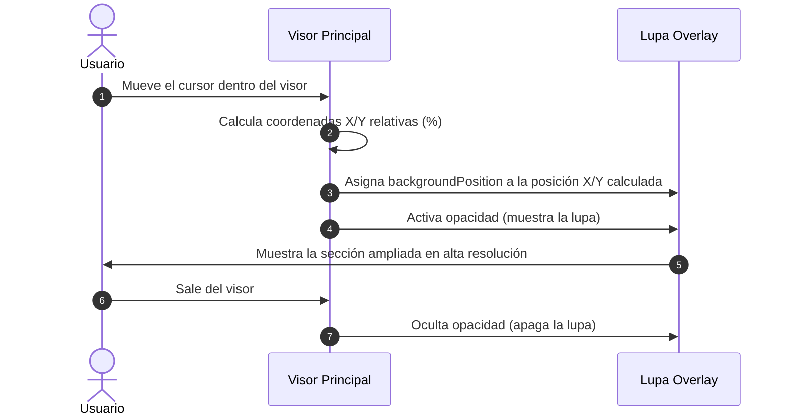

<!--
{
  "resource": "GaleriaZoomHover",
  "technicalName": "GaleriaZoomHover",
  "type": "component",
  "niches": [
    "retail_clothing",
    "moda-local-calzado"
  ],
  "targetPath": "src/components/ui/GaleriaZoomHover.jsx",
  "dependencies": {
    "npm": {},
    "internal": []
  }
}
-->

# Galería con Zoom en Hover (GaleriaZoomHover)

Componente de visualización de producto premium que presenta un carrusel de miniaturas y una imagen principal interactiva. Al pasar el cursor (hover) o arrastrar en móvil, se activa una lupa virtual que magnifica la textura y los detalles de las costuras de la prenda sin recargar la página.

---

## 1. Propósito y Casos de Uso
1.  **Ficha de Detalle de Producto:** Componente de cabecera en tiendas de calzado, ropa o joyería fina donde el detalle del material es crítico para la conversión.
2.  **Visor de Catálogo de Arte o Muebles:** Visualización de texturas de maderas, acabados o lienzos.

---

## 2. Especificación Visual y Estilos (Tailwind CSS)
*   **Contenedor Principal:** Grilla responsiva de dos columnas en escritorio (`md:grid-cols-[80px_1fr]`) o fila vertical en móviles.
*   **Miniaturas:** Tarjetas compactas con transición suave de opacidad e indicador de borde HSL activo (`border-primary hover:border-primary/50`).
*   **Contenedor de Lupa (Zoom Box):** Panel flotante de aumento absoluto (`absolute pointer-events-none`) o zoom interno dentro de la misma tarjeta (`overflow-hidden`) con interpolación de coordenadas.
*   **Indicador de Estado:** Shimmer skeleton durante la carga de las imágenes de alta resolución para evitar saltos visuales (CLS).

---

## 3. Código React Completo (React 19 & JSX)

```jsx
import React, { useState, useRef, useEffect } from 'react';

export default function GaleriaZoomHover({
  images = [],
  zoomScale = 2,
  className = ''
}) {
  const [activeIndex, setActiveIndex] = useState(0);
  const [zoomStyle, setZoomStyle] = useState({ display: 'none' });
  const containerRef = useRef(null);
  const [isLoading, setIsLoading] = useState(false);

  const activeImage = images[activeIndex] || {
    url: 'https://images.unsplash.com/photo-1542291026-7eec264c27ff?w=600&auto=format&fit=crop&q=80',
    highResUrl: 'https://images.unsplash.com/photo-1542291026-7eec264c27ff?w=1200&auto=format&fit=crop&q=90',
    alt: 'Zapato deportivo rojo'
  };

  useEffect(() => {
    setIsLoading(true);
  }, [activeIndex]);

  const handleMouseMove = (e) => {
    if (!containerRef.current) return;
    
    const { left, top, width, height } = containerRef.current.getBoundingClientRect();
    
    // Coordenadas relativas en porcentaje (0 a 100)
    const x = ((e.clientX - left) / width) * 100;
    const y = ((e.clientY - top) / height) * 100;

    setZoomStyle({
      display: 'block',
      backgroundImage: `url(${activeImage.highResUrl || activeImage.url})`,
      backgroundPosition: `${x}% ${y}%`,
      backgroundSize: `${width * zoomScale}px ${height * zoomScale}px`
    });
  };

  const handleMouseLeave = () => {
    setZoomStyle({ display: 'none' });
  };

  return (
    <div 
      id="galeria-zoom-hover-wrapper"
      className={`flex flex-col md:flex-row gap-4 w-full ${className}`}
    >
      {/* Miniaturas en Vertical (Escritorio) / Horizontal (Móvil) */}
      <div 
        id="galeria-thumbnails"
        className="flex flex-row md:flex-col gap-2 order-2 md:order-1 overflow-x-auto md:overflow-visible py-1 md:py-0"
      >
        {images.map((img, idx) => (
          <button
            key={idx}
            type="button"
            onClick={() => setActiveIndex(idx)}
            className={`relative w-16 h-16 rounded-xl overflow-hidden border transition-all duration-300 shrink-0 cursor-pointer ${
              idx === activeIndex
                ? 'border-indigo-500 ring-2 ring-indigo-500/25 scale-95 shadow-md shadow-indigo-500/10'
                : 'border-[var(--color-border)] hover:border-indigo-500/50 hover:scale-102'
            }`}
          >
            
          </button>
        ))}
      </div>

      {/* Visor de Imagen Principal */}
      <div className="flex-1 order-1 md:order-2">
        <div
          ref={containerRef}
          onMouseMove={handleMouseMove}
          onMouseLeave={handleMouseLeave}
          className="relative w-full aspect-square rounded-2xl bg-[var(--color-surface-2)] border border-[var(--color-border)] overflow-hidden cursor-crosshair group shadow-lg"
          id="zoom-main-image-viewport"
        >
          {/* Shimmer de Carga */}
          {isLoading && (
            <div className="absolute inset-0 bg-[var(--color-bg)]/50 flex items-center justify-center">
              <div className="w-8 h-8 rounded-full border-2 border-indigo-500 border-t-transparent animate-spin"></div>
            </div>
          )}

           setIsLoading(false)}
            className={`w-full h-full object-cover transition-opacity duration-300 ${
              isLoading ? 'opacity-0' : 'opacity-100'
            }`}
          />

          {/* Lupa / Overlay de Zoom */}
          <div
            className="absolute inset-0 pointer-events-none rounded-2xl transition-opacity duration-200 border-2 border-indigo-500/20 bg-no-repeat shadow-inner opacity-0 group-hover:opacity-100"
            style={zoomStyle}
          />
          
          {/* Indicador Flotante de Acción */}
          <div className="absolute bottom-3 right-3 bg-[var(--color-surface)]/75 backdrop-blur-md border border-[var(--color-border)] text-[10px] font-bold text-[var(--color-text)] px-2.5 py-1 rounded-lg pointer-events-none flex items-center gap-1.5 shadow-sm opacity-100 group-hover:opacity-0 transition-opacity">
            <svg className="w-3.5 h-3.5 text-indigo-500 dark:text-indigo-400" fill="none" viewBox="0 0 24 24" stroke="currentColor">
              <path strokeLinecap="round" strokeLinejoin="round" strokeWidth={2} d="M21 21l-6-6m2-5a7 7 0 11-14 0 7 7 0 0114 0z" />
            </svg>
            Pasa el cursor para ver detalles
          </div>
        </div>
      </div>
    </div>
  );
}
```

---

## 🔄 Diagrama de Secuencia de Visualización

