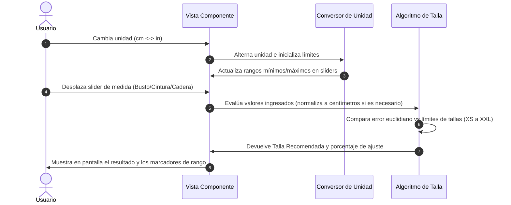

<!--
{
  "resource": "GuiaMedidasTallaIdeal",
  "technicalName": "GuiaMedidasTallaIdeal",
  "type": "component",
  "niches": [
    "retail_clothing",
    "moda-local-calzado"
  ],
  "targetPath": "src/components/ui/GuiaMedidasTallaIdeal.jsx",
  "dependencies": {
    "npm": {},
    "internal": []
  }
}
-->

# Guía de Medidas y Talla Ideal (GuiaMedidasTallaIdeal)

Componente interactivo premium que actúa como asistente de tallaje. Permite al usuario ingresar sus medidas corporales (Busto/Pecho, Cintura, Cadera) en centímetros o pulgadas y calcula de forma reactiva la recomendación exacta de su talla, mostrando de forma visual en qué parte del rango se encuentra para evitar devoluciones.

---

## 1. Propósito y Casos de Uso
1.  **Ficha de Producto de Ropa:** Integración como botón/modal de "Encuentra tu talla ideal" en el catálogo de retail de moda.
2.  **Onboarding de Perfil de Cliente:** Formulario de registro donde el usuario pre-guarda sus medidas para compras automáticas.
3.  **Asistente Personalizado B2B:** Herramienta para agentes de ventas o soporte al cliente para sugerir tallaje correcto por teléfono.

---

## 2. Especificación Visual y Estilos (Tailwind CSS)
*   **Contenedor Principal:** Tarjeta premium con fondo translúcido (`backdrop-blur-xl bg-[var(--color-surface)]/20 border border-[var(--color-border)]`), esquinas redondeadas y sombras elásticas.
*   **Selector de Unidades:** Switch animado en horizontal (`flex-row`) con micro-interacciones al alternar entre `Centímetros (cm)` y `Pulgadas (in)`.
*   **Sliders / Inputs de Entrada:** Controles interactivos con rangos dinámicos en base a la unidad seleccionada, con etiquetas flotantes e íconos vectoriales SVG.
*   **Feedback de Recomendación:** Bloque destacado con degradado animado HSL de marca, indicando la talla sugerida y el porcentaje de coincidencia.
*   **Visualizador de Rangos (Progress Bar Semántica):** Barras de progreso horizontales por cada medida que grafican el punto exacto del usuario respecto a los límites de la talla recomendada.

---

## 3. Código React Completo (React 19 & JSX)

```jsx
import React, { useState, useMemo } from 'react';

// Rango de medidas por talla por defecto (Centímetros)
const TABLA_MEDIDAS_DEFAULT = [
  { talla: 'XS', busto: [78, 83], cintura: [60, 65], cadera: [86, 91] },
  { talla: 'S',  busto: [84, 89], cintura: [66, 71], cadera: [92, 97] },
  { talla: 'M',  busto: [90, 95], cintura: [72, 77], cadera: [98, 103] },
  { talla: 'L',  busto: [96, 101], cintura: [78, 83], cadera: [104, 109] },
  { talla: 'XL', busto: [102, 107], cintura: [84, 89], cadera: [110, 115] },
  { talla: 'XXL', busto: [108, 113], cintura: [90, 95], cadera: [116, 121] }
];

export default function GuiaMedidasTallaIdeal({
  tablaMedidas = TABLA_MEDIDAS_DEFAULT,
  onTallaSugerida = null,
  accentColorClass = 'text-primary'
}) {
  const [unit, setUnit] = useState('cm'); // 'cm' o 'in'
  
  // Estados de medidas en Centímetros internos por defecto
  const [busto, setBusto] = useState(88); // 88 cm
  const [cintura, setCintura] = useState(70); // 70 cm
  const [cadera, setCadera] = useState(96); // 96 cm

  // Conversores de unidades
  const toDisplay = (val) => {
    if (unit === 'in') {
      return (val / 2.54).toFixed(1);
    }
    return Math.round(val);
  };

  const handleSliderChange = (type, val) => {
    const numericVal = parseFloat(val);
    const cmVal = unit === 'in' ? numericVal * 2.54 : numericVal;
    
    if (type === 'busto') setBusto(cmVal);
    if (type === 'cintura') setCintura(cmVal);
    if (type === 'cadera') setCadera(cmVal);
  };

  // Límites según unidad para sliders
  const limits = useMemo(() => {
    return unit === 'cm'
      ? { busto: { min: 70, max: 130 }, cintura: { min: 50, max: 110 }, cadera: { min: 80, max: 140 } }
      : { busto: { min: 27.5, max: 51.2 }, cintura: { min: 19.6, max: 43.3 }, cadera: { min: 31.5, max: 55.1 } };
  }, [unit]);

  // Algoritmo de Talla Recomendada (Menor distancia de error euclidiano ponderado)
  const recomendacion = useMemo(() => {
    let mejorTalla = 'XS';
    let menorDiferencia = Infinity;
    let coincidenciaPorcentaje = 0;

    tablaMedidas.forEach((item) => {
      // Centro del rango
      const cBusto = (item.busto[0] + item.busto[1]) / 2;
      const cCintura = (item.cintura[0] + item.cintura[1]) / 2;
      const cCadera = (item.cadera[0] + item.cadera[1]) / 2;

      // Distancia cuadrática ponderada (Busto/Pecho y Cadera suelen tener más peso en el ajuste)
      const diffB = Math.pow(busto - cBusto, 2) * 1.2;
      const diffCi = Math.pow(cintura - cCintura, 2) * 0.8;
      const diffCa = Math.pow(cadera - cCadera, 2) * 1.0;
      
      const totalDiff = Math.sqrt(diffB + diffCi + diffCa);

      if (totalDiff < menorDiferencia) {
        menorDiferencia = totalDiff;
        mejorTalla = item.talla;
        
        // Calcular porcentaje de ajuste (100% es perfecto, decae según error)
        const maxMedida = Math.max(busto, cintura, cadera);
        const errRatio = totalDiff / maxMedida;
        coincidenciaPorcentaje = Math.max(0, Math.min(100, Math.round((1 - errRatio) * 100)));
      }
    });

    if (onTallaSugerida) {
      onTallaSugerida(mejorTalla);
    }

    // Obtener los rangos de la talla recomendada
    const tallaMatch = tablaMedidas.find((item) => item.talla === mejorTalla) || tablaMedidas[0];

    return {
      talla: mejorTalla,
      match: tallaMatch,
      score: coincidenciaPorcentaje
    };
  }, [busto, cintura, cadera, tablaMedidas, onTallaSugerida]);

  // Calcula el porcentaje visual dentro del rango
  const getRangePercentage = (val, range) => {
    const [min, max] = range;
    if (val < min) return 0;
    if (val > max) return 100;
    return ((val - min) / (max - min)) * 100;
  };

  return (
    <div 
      id="guia-medidas-talla-ideal-container"
      className="w-full max-w-md mx-auto p-6 rounded-2xl bg-[var(--color-surface)]/20 border border-[var(--color-border)] text-[var(--color-text)] shadow-2xl backdrop-blur-xl"
    >
      <div className="flex justify-between items-center mb-6">
        <div>
          <h3 className="text-lg font-bold tracking-tight text-[var(--color-text)]">Guía de Talla Ideal</h3>
          <p className="text-xs text-[var(--color-text-muted)]">Ingresa tus medidas para recomendar tu talla</p>
        </div>
        
        {/* Selector de Unidades Premium */}
        <div className="flex items-center bg-[var(--color-surface-2)] border border-[var(--color-border)] rounded-lg p-0.5" id="unit-selector">
          <button
            type="button"
            onClick={() => setUnit('cm')}
            className={`px-3 py-1 text-xs font-semibold rounded-md transition-all duration-300 cursor-pointer ${
              unit === 'cm'
                ? 'bg-indigo-600 text-[var(--color-text)] shadow-md'
                : 'text-[var(--color-text-muted)] hover:text-[var(--color-text)]'
            }`}
          >
            cm
          </button>
          <button
            type="button"
            onClick={() => setUnit('in')}
            className={`px-3 py-1 text-xs font-semibold rounded-md transition-all duration-300 cursor-pointer ${
              unit === 'in'
                ? 'bg-indigo-600 text-[var(--color-text)] shadow-md'
                : 'text-[var(--color-text-muted)] hover:text-[var(--color-text)]'
            }`}
          >
            in
          </button>
        </div>
      </div>

      <div className="space-y-6">
        {/* Input Busto */}
        <div className="space-y-2">
          <div className="flex justify-between text-sm">
            <span className="font-medium text-[var(--color-text)]">Pecho / Busto</span>
            <span className="font-bold text-indigo-500 dark:text-indigo-400">
              {toDisplay(busto)} {unit}
            </span>
          </div>
          <input
            id="input-slider-busto"
            type="range"
            min={limits.busto.min}
            max={limits.busto.max}
            step="0.1"
            value={unit === 'in' ? (busto / 2.54).toFixed(1) : Math.round(busto)}
            onChange={(e) => handleSliderChange('busto', e.target.value)}
            className="w-full h-1.5 bg-[var(--color-border)] rounded-lg appearance-none cursor-pointer accent-indigo-500 focus:outline-none"
          />
        </div>

        {/* Input Cintura */}
        <div className="space-y-2">
          <div className="flex justify-between text-sm">
            <span className="font-medium text-[var(--color-text)]">Cintura</span>
            <span className="font-bold text-indigo-500 dark:text-indigo-400">
              {toDisplay(cintura)} {unit}
            </span>
          </div>
          <input
            id="input-slider-cintura"
            type="range"
            min={limits.cintura.min}
            max={limits.cintura.max}
            step="0.1"
            value={unit === 'in' ? (cintura / 2.54).toFixed(1) : Math.round(cintura)}
            onChange={(e) => handleSliderChange('cintura', e.target.value)}
            className="w-full h-1.5 bg-[var(--color-border)] rounded-lg appearance-none cursor-pointer accent-indigo-500 focus:outline-none"
          />
        </div>

        {/* Input Cadera */}
        <div className="space-y-2">
          <div className="flex justify-between text-sm">
            <span className="font-medium text-[var(--color-text)]">Cadera</span>
            <span className="font-bold text-indigo-500 dark:text-indigo-400">
              {toDisplay(cadera)} {unit}
            </span>
          </div>
          <input
            id="input-slider-cadera"
            type="range"
            min={limits.cadera.min}
            max={limits.cadera.max}
            step="0.1"
            value={unit === 'in' ? (cadera / 2.54).toFixed(1) : Math.round(cadera)}
            onChange={(e) => handleSliderChange('cadera', e.target.value)}
            className="w-full h-1.5 bg-[var(--color-border)] rounded-lg appearance-none cursor-pointer accent-indigo-500 focus:outline-none"
          />
        </div>
      </div>

      {/* Bloque de Recomendación de Talla */}
      <div 
        id="resultado-talla-sugerida"
        className="mt-8 p-5 rounded-xl bg-gradient-to-br from-indigo-500/10 via-indigo-550/5 to-transparent border border-indigo-500/20 shadow-inner flex flex-col items-center justify-center text-center relative overflow-hidden"
      >
        <div className="absolute top-0 right-0 p-3 opacity-15">
          <svg className="w-16 h-16 text-indigo-400" fill="none" viewBox="0 0 24 24" stroke="currentColor">
            <path strokeLinecap="round" strokeLinejoin="round" strokeWidth={1.5} d="M9 5H7a2 2 0 00-2 2v12a2 2 0 002 2h10a2 2 0 002-2V7a2 2 0 00-2-2h-2M9 5a2 2 0 002 2h2a2 2 0 002-2M9 5a2 2 0 012-2h2a2 2 0 012 2m-3 7h3m-3 4h3m-6-4h.01M9 16h.01" />
          </svg>
        </div>

        <span className="text-xs font-semibold uppercase tracking-wider text-indigo-500 dark:text-indigo-400">Talla Recomendada</span>
        <div className="text-5xl font-black text-indigo-650 dark:text-indigo-400 my-2 tracking-tighter drop-shadow-md select-none">
          {recomendacion.talla}
        </div>
        <span className="text-xs text-[var(--color-text-muted)] flex items-center gap-1.5 font-bold">
          <span className="inline-block w-2.5 h-2.5 rounded-full bg-emerald-500"></span>
          Coincidencia del {recomendacion.score}%
        </span>
      </div>

      {/* Indicadores Visuales de Ajuste de Rango */}
      <div className="mt-6 space-y-3 bg-[var(--color-surface-2)]/30 p-4 rounded-xl border border-[var(--color-border)]">
        <h4 className="text-xs font-bold uppercase tracking-wider text-[var(--color-text-muted)] mb-2">Ajuste de tu Talla {recomendacion.talla}</h4>
        
        {/* Ajuste Busto */}
        <div className="space-y-1">
          <div className="flex justify-between text-xs">
            <span className="text-[var(--color-text-muted)]">Medida de Pecho</span>
            <span className="text-[var(--color-text)] font-bold">
              {toDisplay(recomendacion.match.busto[0])} - {toDisplay(recomendacion.match.busto[1])} {unit}
            </span>
          </div>
          <div className="h-2 bg-[var(--color-surface-2)] rounded-full overflow-hidden border border-[var(--color-border)]/40 flex relative">
            <div 
              className="h-full bg-indigo-500/20 absolute"
              style={{
                left: '20%',
                width: '60%'
              }}
            />
            <div 
              className="w-3 h-3 rounded-full bg-indigo-500 border-2 border-[var(--color-bg)] absolute -top-0.5 -translate-x-1/2 transition-all duration-300"
              style={{
                left: `${getRangePercentage(busto, recomendacion.match.busto)}%`
              }}
            />
          </div>
        </div>

        {/* Ajuste Cintura */}
        <div className="space-y-1">
          <div className="flex justify-between text-xs">
            <span className="text-[var(--color-text-muted)]">Medida de Cintura</span>
            <span className="text-[var(--color-text)] font-bold">
              {toDisplay(recomendacion.match.cintura[0])} - {toDisplay(recomendacion.match.cintura[1])} {unit}
            </span>
          </div>
          <div className="h-2 bg-[var(--color-surface-2)] rounded-full overflow-hidden border border-[var(--color-border)]/40 flex relative">
            <div 
              className="h-full bg-indigo-500/20 absolute"
              style={{
                left: '20%',
                width: '60%'
              }}
            />
            <div 
              className="w-3 h-3 rounded-full bg-indigo-500 border-2 border-[var(--color-bg)] absolute -top-0.5 -translate-x-1/2 transition-all duration-300"
              style={{
                left: `${getRangePercentage(cintura, recomendacion.match.cintura)}%`
              }}
            />
          </div>
        </div>

        {/* Ajuste Cadera */}
        <div className="space-y-1">
          <div className="flex justify-between text-xs">
            <span className="text-[var(--color-text-muted)]">Medida de Cadera</span>
            <span className="text-[var(--color-text)] font-bold">
              {toDisplay(recomendacion.match.cadera[0])} - {toDisplay(recomendacion.match.cadera[1])} {unit}
            </span>
          </div>
          <div className="h-2 bg-[var(--color-surface-2)] rounded-full overflow-hidden border border-[var(--color-border)]/40 flex relative">
            <div 
              className="h-full bg-indigo-500/20 absolute"
              style={{
                left: '20%',
                width: '60%'
              }}
            />
            <div 
              className="w-3 h-3 rounded-full bg-indigo-500 border-2 border-[var(--color-bg)] absolute -top-0.5 -translate-x-1/2 transition-all duration-300"
              style={{
                left: `${getRangePercentage(cadera, recomendacion.match.cadera)}%`
              }}
            />
          </div>
        </div>
      </div>
    </div>
  );
}
```

---

## 🔄 Diagrama de Interacción de Entrada y Cálculo

