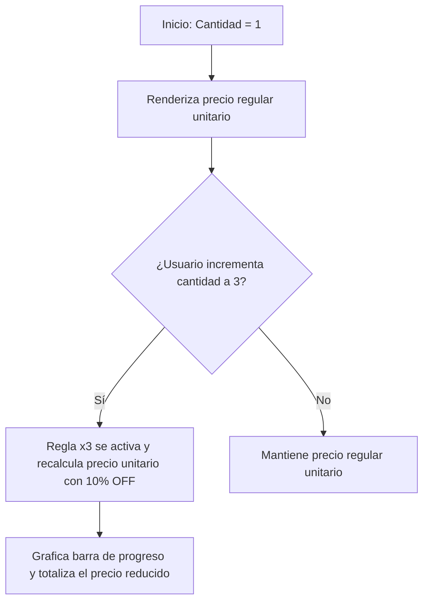

<!--
{
  "resource": "InsigniasDescuentoVolumen",
  "technicalName": "InsigniasDescuentoVolumen",
  "type": "component",
  "niches": [
    "retail_clothing",
    "moda-local-calzado"
  ],
  "targetPath": "src/components/ui/InsigniasDescuentoVolumen.jsx",
  "dependencies": {
    "npm": {},
    "internal": []
  }
}
-->

# Insignias de Descuento por Volumen (InsigniasDescuentoVolumen)

Componente de checkout e incentivación de compra al por mayor o mayoreo. Muestra de forma interactiva una escala de precios con insignias dinámicas según la cantidad seleccionada. Grafica el progreso hacia el siguiente escalón de descuento y totaliza en tiempo real el precio unitario y de lote.

---

## 1. Propósito y Casos de Uso
1.  **Ficha de Producto de Ropa B2B/Mayorista:** Exponer precios más bajos por docena o media docena de prendas.
2.  **Carrito de Compras (Checkout):** Mostrar barra de progreso indicando "Agrega 2 prendas más para desbloquear un 10% de descuento adicional".

---

## 2. Especificación Visual y Estilos (Tailwind CSS)
*   **Contenedor Principal:** Panel estructurado con fondo de marca translúcido (`bg-[var(--color-surface)]/20 border border-[var(--color-border)]`) y bordes curvos elásticos.
*   **Escala de Descuentos:** Cuadrícula o lista vertical de tarjetas de nivel. La tarjeta activa recibe un marco de color destacado (`border-indigo-500 bg-indigo-600/5`).
*   **Barra de Progreso:** Línea horizontal premium de carga (`bg-indigo-650`) con indicador de porcentaje flotante.

---

## 3. Código React Completo (React 19 & JSX)

```jsx
import React, { useMemo } from 'react';

const RULES_DEFAULT = [
  { quantity: 1, discountPercentage: 0, label: 'Precio Regular' },
  { quantity: 3, discountPercentage: 10, label: 'Pack Mayorista' },
  { quantity: 6, discountPercentage: 20, label: 'Lote Distribuidor' }
];

export default function InsigniasDescuentoVolumen({
  rules = RULES_DEFAULT,
  currentQuantity = 1,
  basePrice = 80000
}) {
  // Ordena las reglas por cantidad ascendente
  const sortedRules = useMemo(() => {
    return [...rules].sort((a, b) => a.quantity - b.quantity);
  }, [rules]);

  // Identifica el nivel activo y el siguiente nivel
  const activeRule = useMemo(() => {
    let active = sortedRules[0];
    sortedRules.forEach(r => {
      if (currentQuantity >= r.quantity) {
        active = r;
      }
    });
    return active;
  }, [sortedRules, currentQuantity]);

  const nextRule = useMemo(() => {
    return sortedRules.find(r => r.quantity > currentQuantity) || null;
  }, [sortedRules, currentQuantity]);

  // Calcula precios
  const calculatedPrices = useMemo(() => {
    const discountFactor = 1 - (activeRule.discountPercentage / 100);
    const unitPrice = Math.round(basePrice * discountFactor);
    const totalPrice = unitPrice * currentQuantity;

    return {
      unitPrice,
      totalPrice,
      saving: (basePrice - unitPrice) * currentQuantity
    };
  }, [activeRule, currentQuantity, basePrice]);

  // Progreso en porcentaje para la barra de carga
  const progressPercent = useMemo(() => {
    if (!nextRule) return 100;
    const currentTierQty = activeRule.quantity;
    const nextTierQty = nextRule.quantity;
    const progress = ((currentQuantity - currentTierQty) / (nextTierQty - currentTierQty)) * 100;
    return Math.max(0, Math.min(100, Math.round(progress)));
  }, [activeRule, nextRule, currentQuantity]);

  return (
    <div 
      id="insignias-descuento-volumen-container"
      className="w-full max-w-sm p-5 rounded-2xl bg-[var(--color-surface)]/20 border border-[var(--color-border)] text-[var(--color-text)] shadow-xl backdrop-blur-xl animate-fade-in"
    >
      <div className="mb-4">
        <span className="text-[10px] font-black uppercase tracking-wider text-indigo-500 dark:text-indigo-400">Escala de Precios</span>
        <h3 className="text-sm font-bold text-[var(--color-text)] mt-0.5">Descuentos por Cantidad</h3>
      </div>

      {/* Grid de Reglas */}
      <div className="grid grid-cols-3 gap-2.5 mb-4" id="rules-grid">
        {sortedRules.map(r => {
          const isActive = activeRule.id === r.id || activeRule.quantity === r.quantity;
          return (
            <div
              key={r.quantity}
              className={`p-2.5 rounded-xl border text-center flex flex-col justify-between transition-all duration-350 ${
                isActive
                  ? 'bg-indigo-600/10 border-indigo-500 shadow-md shadow-indigo-600/5'
                  : 'bg-[var(--color-surface-2)]/40 border-[var(--color-border)] opacity-70'
              }`}
            >
              <div>
                <span className="text-[10px] font-black text-[var(--color-text)] block">x{r.quantity}+ uds.</span>
                <span className="text-[9px] text-[var(--color-text-muted)] block mt-0.5 leading-tight">{r.label}</span>
              </div>
              <span className={`text-[10px] font-black block mt-2.5 ${r.discountPercentage > 0 ? 'text-emerald-500 dark:text-emerald-400' : 'text-[var(--color-text)]'}`}>
                {r.discountPercentage > 0 ? `${r.discountPercentage}% OFF` : 'Precio base'}
              </span>
            </div>
          );
        })}
      </div>

      {/* Barra de Progreso */}
      {nextRule && (
        <div className="space-y-1.5 mb-4" id="tier-progress-bar-wrapper">
          <div className="flex justify-between text-[10px] text-[var(--color-text-muted)]">
            <span>Faltan {nextRule.quantity - currentQuantity} unidades para el {nextRule.discountPercentage}% OFF</span>
            <span className="font-bold">{progressPercent}%</span>
          </div>
          <div className="h-1.5 bg-[var(--color-surface-2)] rounded-full overflow-hidden border border-[var(--color-border)]/40">
            <div 
              className="h-full bg-indigo-600 transition-all duration-500 shadow-sm"
              style={{ width: `${progressPercent}%` }}
            />
          </div>
        </div>
      )}

      {/* Resumen de Compra */}
      <div className="bg-[var(--color-surface-2)]/30 border border-[var(--color-border)]/65 p-3.5 rounded-xl flex flex-col gap-2">
        <div className="flex justify-between text-xs">
          <span className="text-[var(--color-text-muted)]">Precio unitario:</span>
          <span className="font-bold text-[var(--color-text)]">
            ${calculatedPrices.unitPrice.toLocaleString()} COP
          </span>
        </div>
        <div className="flex justify-between items-baseline border-t border-[var(--color-border)]/20 pt-2">
          <span className="text-xs font-semibold text-[var(--color-text-muted)]">Total ({currentQuantity} uds):</span>
          <span className="text-lg font-black text-indigo-500 dark:text-indigo-400">
            ${calculatedPrices.totalPrice.toLocaleString()} COP
          </span>
        </div>
        {calculatedPrices.saving > 0 && (
          <div className="mt-1 text-[10px] text-emerald-500 dark:text-emerald-400 font-bold text-center bg-emerald-500/5 border border-emerald-500/10 py-1 rounded-lg">
            ¡Ahorras ${calculatedPrices.saving.toLocaleString()} COP en esta compra!
          </div>
        )}
      </div>
    </div>
  );
}
```

---

## 4. Lógica de Estado y Ciclo de Vida
*   **Recálculo Automático por Memorización:** El componente utiliza hooks `useMemo` para evitar re-renders y recalcular las escalas de precio, el nivel de descuento correspondiente y el porcentaje de progreso de forma síncrona ante cambios en `currentQuantity`.

---

## 5. Flujo Operativo y Secuencia de Interacción

