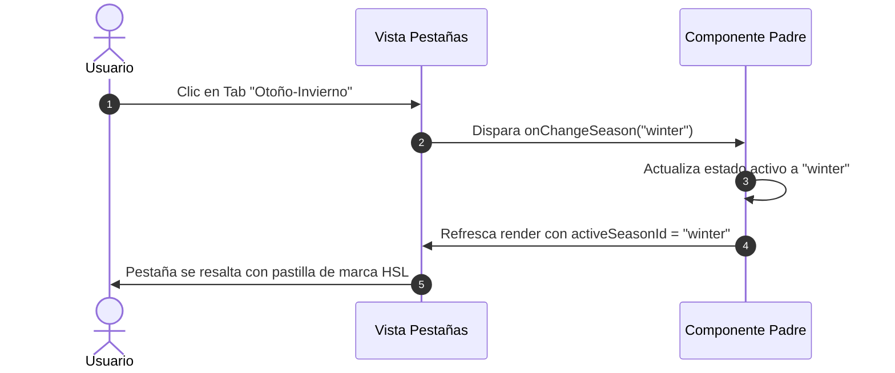

<!--
{
  "resource": "PestanasFiltroTemporada",
  "technicalName": "PestanasFiltroTemporada",
  "type": "component",
  "niches": [
    "retail_clothing",
    "moda-local-calzado"
  ],
  "targetPath": "src/components/ui/PestanasFiltroTemporada.jsx",
  "dependencies": {
    "npm": {},
    "internal": []
  }
}
-->

# Pestañas de Filtro por Temporada (PestanasFiltroTemporada)

Componente de navegación rápida para catálogos y colecciones de retail. Proporciona una hilera deslizable de tabs horizontales premium con contadores de productos y transiciones fluidas de indicador activo con pastilla deslizante y efecto de marca.

---

## 1. Propósito y Casos de Uso
1.  **Filtro de Catálogo de Ropa:** Alternar de forma veloz entre colecciones de temporada (Otoño-Invierno, Primavera-Verano, Deportivo).
2.  **Home Page Landing:** Banner de selección de temporada destacada para redirigir al usuario.

---

## 2. Especificación Visual y Estilos (Tailwind CSS)
*   **Contenedor de Pestañas:** Scroll horizontal sin barra visual (`overflow-x-auto scrollbar-none flex-row flex-nowrap`).
*   **Botón Tab:** Botón interactivo con micro-escala, mostrando el nombre de la colección y un chip numérico atenuado con el conteo de items.
*   **Efecto Activo:** Pastilla o píldora con fondo de marca (`bg-indigo-600/10 text-indigo-500 border border-indigo-500/20 shadow-md`) para destacar la selección de forma premium y legible en cualquier tema.

---

## 3. Código React Completo (React 19 & JSX)

```jsx
import React from 'react';

const SEASONS_DEFAULT = [
  { id: 'all', label: 'Ver Todo', count: 245 },
  { id: 'winter', label: 'Otoño-Invierno 🍁', count: 85 },
  { id: 'summer', label: 'Primavera-Verano ☀️', count: 110 },
  { id: 'sports', label: 'Activewear / Deportivo ⚡', count: 50 }
];

export default function PestanasFiltroTemporada({
  seasons = SEASONS_DEFAULT,
  activeSeasonId = 'all',
  onChangeSeason = null
}) {
  return (
    <div 
      id="pestanas-filtro-temporada-wrapper"
      className="w-full overflow-x-auto scrollbar-none flex gap-2.5 p-1 border-b border-[var(--color-border)]/40"
      style={{ scrollbarWidth: 'none', msOverflowStyle: 'none' }}
    >
      {seasons.map(s => {
        const isActive = activeSeasonId === s.id;
        return (
          <button
            key={s.id}
            type="button"
            onClick={() => onChangeSeason && onChangeSeason(s.id)}
            className={`px-4 py-2 rounded-xl text-xs font-bold transition-all duration-300 flex items-center gap-2 shrink-0 cursor-pointer ${
              isActive
                ? 'bg-indigo-600/15 text-indigo-500 border border-indigo-500/20 shadow-md shadow-indigo-600/5 scale-98'
                : 'bg-[var(--color-surface-2)] border border-[var(--color-border)] text-[var(--color-text-muted)] hover:border-indigo-500/40 hover:text-[var(--color-text)]'
            }`}
            id={`tab-season-${s.id}`}
          >
            <span>{s.label}</span>
            <span className={`text-[10px] px-1.5 py-0.25 rounded-md font-black ${
              isActive 
                ? 'bg-indigo-600 text-white' 
                : 'bg-[var(--color-surface)] text-[var(--color-text-muted)]'
            }`}>
              {s.count}
            </span>
          </button>
        );
      })}
    </div>
  );
}
```

---

## 4. Lógica de Estado y Ciclo de Vida
*   **Filtro Unidireccional:** El componente no almacena estado local propio del filtro de forma interna; lee de forma reactiva la prop `activeSeasonId` para delegar el control del estado a la base de datos o componente de catálogo superior.

---

## 5. Flujo Operativo y Secuencia de Interacción

