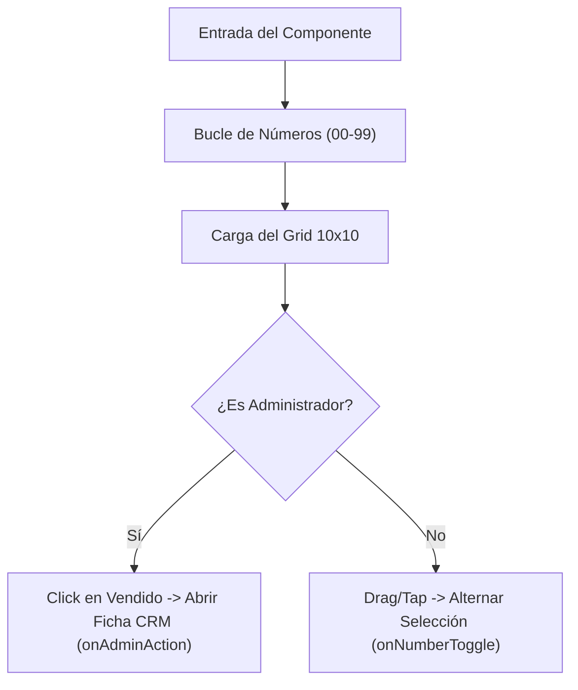

<!--
{
  "technicalName": "RaffleNumberSelector",
  "targetPath": "src/components/common/RaffleNumberSelector.jsx",
  "dependencies": {
    "npm": {},
    "internal": []
  }
}
-->

# Selector de Boletas de Rifa Premium (`RaffleNumberSelector`)

Componente premium de marca blanca para la selección interactiva de números de rifa/lotería en un rango de `00` a `99` (100 números). Soporta selección por arrastre de dedo (Swipe-to-Select), efecto ruleta para elecciones aleatorias (Lucky Draw), sincronización de estados y un panel CRM de administración para consultar compradores de boletas en tiempo real.

---

## 1. Propósito y Casos de Uso
- **Tiendas de Rifas y Loterías Locales:** Ideal para integrar en flujos de compra donde el cliente prefiere elegir su boleto de la suerte de forma visual.
- **Venta Presencial POS:** Permite al tendero bloquear o asignar números directamente desde el mostrador físico pulsando la cuadrícula.

---

## 2. Especificación Visual y Estilos (Tailwind CSS)
- **Cuadrícula Responsiva:** Cuadrícula de 10 columnas que mantiene una relación de aspecto perfecta (`aspect-square`) en todos los tamaños de pantalla.
- **Brillo de Foco HSL:** Las celdas hover/foco proyectan un brillo elástico utilizando las variables HSL corporativas de la marca.
- **Tachado SVG Dinámico:** Los números vendidos muestran una diagonal dibujada dinámicamente mediante SVG para una estética limpia sin texto sobrescrito.

---

## 3. Código React Completo

```jsx
import React, { useState, useEffect, useRef } from 'react';

export default function RaffleNumberSelector({
  soldNumbers = [],
  reservedNumbers = [],
  selectedNumbers = [],
  clientDetails = {}, // Formato: { '05': { name: 'Juan', phone: '3001112222', time: '06-06 10:15' } }
  color1 = 'var(--color-primary, #6366f1)',
  color2 = 'var(--color-accent, #3b82f6)',
  isAdmin = false,
  onNumberToggle = () => {},
  onAdminAction = () => {}, // (number, action, detail) -> action: 'detail'
  onQuickPick = () => {}
}) {
  const [luckySpinning, setLuckySpinning] = useState(false);
  const [spinHighlight, setSpinHighlight] = useState(null);
  const [manualInput, setManualInput] = useState('');
  const containerRef = useRef(null);
  const isDraggingRef = useRef(false);
  const dragSelectedRef = useRef(new Set());

  // Genera 100 números de 00 a 99
  const numbersList = Array.from({ length: 100 }, (_, i) => {
    return i.toString().padStart(2, '0');
  });

  // Manejar Selección Manual Escrita
  const handleManualSelect = () => {
    if (!manualInput) return;
    const paddedNum = manualInput.padStart(2, '0');
    if (parseInt(paddedNum, 10) < 0 || parseInt(paddedNum, 10) > 99) {
      alert("Número fuera de rango (00 a 99)");
      return;
    }
    if (soldNumbers.includes(paddedNum)) {
      alert(`El número ${paddedNum} ya está vendido`);
      return;
    }
    if (reservedNumbers.includes(paddedNum)) {
      alert(`El número ${paddedNum} ya está reservado`);
      return;
    }
    onNumberToggle(paddedNum);
    setManualInput('');
    if (navigator.vibrate) navigator.vibrate(10);
  };

  // Lógica de Selección por Arrastre (Touch/Drag Selection)
  useEffect(() => {
    if (isAdmin) return; // Solo clientes pueden arrastrar para seleccionar

    const handlePointerDown = (e) => {
      if (e.button !== 0) return; // Permitir solo clic primario
      isDraggingRef.current = true;
      dragSelectedRef.current.clear();
      
      const cell = e.target.closest('[data-number]');
      if (cell) {
        const num = cell.getAttribute('data-number');
        if (!soldNumbers.includes(num) && !reservedNumbers.includes(num)) {
          dragSelectedRef.current.add(num);
          onNumberToggle(num);
          if (navigator.vibrate) navigator.vibrate(10);
        }
      }
    };

    const handlePointerMove = (e) => {
      if (!isDraggingRef.current) return;
      const element = document.elementFromPoint(e.clientX, e.clientY);
      if (!element) return;
      
      const cell = element.closest('[data-number]');
      if (cell) {
        const num = cell.getAttribute('data-number');
        if (!soldNumbers.includes(num) && !reservedNumbers.includes(num) && !dragSelectedRef.current.has(num)) {
          dragSelectedRef.current.add(num);
          onNumberToggle(num);
          if (navigator.vibrate) navigator.vibrate(10);
        }
      }
    };

    const handlePointerUp = () => {
      isDraggingRef.current = false;
    };

    const container = containerRef.current;
    if (container) {
      container.addEventListener('pointerdown', handlePointerDown);
      window.addEventListener('pointermove', handlePointerMove);
      window.addEventListener('pointerup', handlePointerUp);
    }

    return () => {
      if (container) {
        container.removeEventListener('pointerdown', handlePointerDown);
      }
      window.removeEventListener('pointermove', handlePointerMove);
      window.removeEventListener('pointerup', handlePointerUp);
    };
  }, [soldNumbers, reservedNumbers, isAdmin, onNumberToggle]);

  // Simulación de "Lucky Draw" (Ruleta)
  const triggerLuckyDraw = (count = 1) => {
    if (luckySpinning) return;
    setLuckySpinning(true);

    const available = numbersList.filter(n => !soldNumbers.includes(n) && !reservedNumbers.includes(n) && !selectedNumbers.includes(n));
    if (available.length < count) {
      alert("No hay suficientes números disponibles.");
      setLuckySpinning(false);
      return;
    }

    let iterations = 0;
    const maxIterations = 20;
    const intervalTime = 60;

    const interval = setInterval(() => {
      const randomIdx = Math.floor(Math.random() * available.length);
      setSpinHighlight(available[randomIdx]);
      iterations++;

      if (iterations >= maxIterations) {
        clearInterval(interval);
        setSpinHighlight(null);
        setLuckySpinning(false);

        // Selección final
        const shuffled = [...available].sort(() => 0.5 - Math.random());
        const selected = shuffled.slice(0, count);
        selected.forEach(num => onNumberToggle(num));
      }
    }, intervalTime);
  };

  const getStatus = (num) => {
    if (soldNumbers.includes(num)) return 'sold';
    if (reservedNumbers.includes(num)) return 'reserved';
    if (selectedNumbers.includes(num)) return 'selected';
    if (luckySpinning && spinHighlight === num) return 'spinning';
    return 'available';
  };

  return (
    <div className="w-full max-w-xl mx-auto bg-slate-900/60 backdrop-blur-xl border border-white/10 p-5 rounded-3xl text-white shadow-2xl relative overflow-hidden">
      {/* Cabecera */}
      <div className="flex flex-col sm:flex-row sm:items-center justify-between gap-4 mb-6">
        <div>
          <h3 className="text-lg font-black tracking-tight uppercase bg-gradient-to-r from-white to-slate-400 bg-clip-text text-transparent">
            Panel de Boletas
          </h3>
          <p className="text-[10px] text-slate-400 mt-0.5">
            {isAdmin ? 'Mapeo de ventas y asignación CRM' : 'Desliza o presiona para seleccionar boletas'}
          </p>
        </div>

        {/* Triggers de Compra Rápida al Azar y Selección Manual */}
        {!isAdmin && (
          <div className="flex flex-wrap items-center gap-3 self-end">
            {/* Entrada Manual */}
            <div className="flex items-center gap-1">
              <input
                type="text"
                placeholder="N°"
                maxLength={2}
                value={manualInput}
                onChange={(e) => setManualInput(e.target.value.replace(/\D/g, ''))}
                onKeyDown={(e) => {
                  if (e.key === 'Enter') handleManualSelect();
                }}
                className="w-10 px-1.5 py-1 text-center text-xs font-bold bg-slate-950/60 border border-white/10 rounded-lg text-white placeholder-slate-600 focus:outline-none focus:border-indigo-500 transition"
              />
              <button
                onClick={handleManualSelect}
                className="px-2.5 py-1 text-[10px] font-black rounded-lg border border-indigo-500/20 bg-indigo-500/10 hover:bg-indigo-500/20 text-indigo-400 transition cursor-pointer"
              >
                Elegir
              </button>
            </div>

            <div className="h-4 w-px bg-white/10 hidden sm:block" />

            <div className="flex items-center gap-1.5">
              <span className="text-[10px] text-slate-500 font-bold uppercase tracking-wider mr-1">Azar:</span>
              {[1, 3, 5].map((qty) => (
                <button
                  key={qty}
                  onClick={() => triggerLuckyDraw(qty)}
                  disabled={luckySpinning}
                  className="px-2.5 py-1 text-[10px] font-black rounded-lg border border-white/5 bg-slate-950/40 hover:bg-slate-950 hover:border-white/10 transition duration-300 disabled:opacity-40"
                >
                  +{qty}
                </button>
              ))}
            </div>
          </div>
        )}
      </div>

      {/* Grid 10x10 */}
      <div
        ref={containerRef}
        className="grid grid-cols-10 gap-1.5 touch-none select-none p-1.5 bg-slate-950/50 border border-white/5 rounded-2xl"
      >
        {numbersList.map((num) => {
          const status = getStatus(num);
          const detail = clientDetails[num];

          let cellClass = "";
          let cellStyle = {};

          if (status === 'sold') {
            cellClass = "bg-slate-800/40 border-slate-800 text-slate-600 cursor-pointer opacity-50";
          } else if (status === 'reserved') {
            cellClass = "bg-amber-500/10 border-amber-500/30 text-amber-400 animate-pulse cursor-pointer";
          } else if (status === 'selected') {
            cellClass = "border-transparent text-white font-black scale-105";
            cellStyle = {
              background: `linear-gradient(135deg, ${color1}, ${color2})`,
              boxShadow: `0 0 12px ${color1}50`,
              animation: 'elasticPop 300ms cubic-bezier(0.175, 0.885, 0.32, 1.275)'
            };
          } else if (status === 'spinning') {
            cellClass = "border-transparent text-white font-black scale-110";
            cellStyle = {
              background: 'linear-gradient(135deg, #ec4899, #8b5cf6)',
              animation: 'elasticPop 150ms infinite'
            };
          } else {
            cellClass = "bg-slate-900/40 border-white/5 text-slate-300 hover:border-white/20 hover:scale-105 transition-all duration-200 cursor-pointer";
          }

          return (
            <div
              key={num}
              data-number={num}
              style={cellStyle}
              className={`aspect-square border flex items-center justify-center text-[11px] sm:text-xs font-bold rounded-lg relative ${cellClass}`}
              onPointerDown={() => {
                if (isAdmin && (status === 'sold' || status === 'reserved')) {
                  onAdminAction(num, 'detail', detail);
                }
              }}
            >
              {num}
              {status === 'sold' && (
                <svg className="absolute inset-0 w-full h-full text-slate-700/80 pointer-events-none" viewBox="0 0 100 100" preserveAspectRatio="none">
                  <line x1="0" y1="100" x2="100" y2="0" stroke="currentColor" strokeWidth="2" />
                </svg>
              )}
            </div>
          );
        })}
      </div>

      {/* Leyenda */}
      <div className="flex flex-wrap items-center justify-center gap-x-5 gap-y-2 mt-5 text-[10px] font-medium text-slate-400 border-t border-white/5 pt-4">
        <div className="flex items-center gap-1.5">
          <div className="w-2.5 h-2.5 rounded bg-slate-900/40 border border-white/10" />
          <span>Disponible</span>
        </div>
        <div className="flex items-center gap-1.5">
          <div className="w-2.5 h-2.5 rounded" style={{ background: `linear-gradient(135deg, ${color1}, ${color2})` }} />
          <span>Seleccionado</span>
        </div>
        <div className="flex items-center gap-1.5">
          <div className="w-2.5 h-2.5 rounded bg-amber-500/10 border border-amber-500/30" />
          <span>Reservado</span>
        </div>
        <div className="flex items-center gap-1.5">
          <div className="w-2.5 h-2.5 rounded bg-slate-800/40 border border-slate-800 opacity-50 relative overflow-hidden">
            <div className="absolute inset-0 flex items-center justify-center text-slate-700"><span className="text-[6px]">/</span></div>
          </div>
          <span>Vendido</span>
        </div>
      </div>

      <style dangerouslySetInnerHTML={{__html: `
        @keyframes elasticPop {
          0% { transform: scale(0.8); }
          70% { transform: scale(1.15); }
          100% { transform: scale(1.05); }
        }
      `}} />
    </div>
  );
}
```

---

## 4. Lógica de Estado y Ciclo de Vida
1. **Swipe-to-Select con Pointer Events:** Evitamos registrar toques repetidos almacenando los elementos en un objeto `Set` dinámico (`dragSelectedRef`), el cual se limpia al levantar el puntero.
2. **Vibración de Feedback (Haptic):** Utiliza la API nativa `navigator.vibrate` para emitir una pequeña pulsación táctil (10ms) compatible con la mayoría de navegadores móviles Android.

---

## 5. Secuencia de Interacción (Flujo de Estados)



---

## 6. Ejemplo de Integración con Barra de Resumen Premium

A continuación se detalla cómo integrar el componente con un estado de React para mostrar la barra de resumen inferior con botones interactivos de deselección unitaria, confirmación con gradiente y deselección masiva ("Limpiar Selección"):

```jsx
import React, { useState } from 'react';
import RaffleNumberSelector from './RaffleNumberSelector';

export default function RafflePurchaseFlow() {
  const [selectedNumbers, setSelectedNumbers] = useState([]);

  const handleNumberToggle = (num) => {
    setSelectedNumbers((prev) =>
      prev.includes(num) ? prev.filter((n) => n !== num) : [...prev, num]
    );
  };

  const handleConfirm = () => {
    alert(`Procediendo a comprar boletas: ${selectedNumbers.sort().join(', ')}`);
  };

  return (
    <div className="w-full p-4 bg-slate-900 min-h-screen">
      <RaffleNumberSelector
        selectedNumbers={selectedNumbers}
        onNumberToggle={handleNumberToggle}
        color1="#6366f1"
        color2="#3b82f6"
      />

      {selectedNumbers.length > 0 && (
        <div className="mt-4 p-4 max-w-xl mx-auto bg-slate-950/50 border border-white/5 rounded-2xl flex items-center justify-between animate-fade-in">
          <div>
            <h5 className="text-xs font-bold text-white uppercase tracking-wider">Boletas Seleccionadas</h5>
            <p className="text-lg font-black text-indigo-400 mt-1.5 flex gap-1.5 flex-wrap">
              {selectedNumbers.sort().map((n) => (
                <button
                  key={n}
                  onClick={() => handleNumberToggle(n)}
                  className="flex items-center gap-1.5 px-2.5 py-0.5 bg-indigo-500/20 hover:bg-red-500/20 border border-indigo-500/30 hover:border-red-500/30 rounded-lg text-xs text-white hover:text-red-200 transition duration-200 group cursor-pointer"
                >
                  <span>{n}</span>
                  <span className="text-[10px] text-indigo-400 group-hover:text-red-400 font-black">×</span>
                </button>
              ))}
            </p>
          </div>

          <div className="flex flex-col gap-2 min-w-[160px] self-center">
            <button
              onClick={handleConfirm}
              className="relative overflow-hidden px-4 py-2.5 bg-gradient-to-r from-indigo-600 via-purple-600 to-pink-600 hover:from-indigo-500 hover:via-purple-500 hover:to-pink-500 rounded-xl text-xs font-black text-white uppercase tracking-wider transition-all duration-300 hover:scale-[1.02] active:scale-[0.98] shadow-lg shadow-purple-500/25 hover:shadow-purple-500/50 cursor-pointer text-center"
            >
              Confirmar {selectedNumbers.length} boleta(s)
            </button>
            <button
              onClick={() => setSelectedNumbers([])}
              className="px-3 py-1.5 bg-slate-950/40 hover:bg-red-500/10 border border-white/5 hover:border-red-500/20 rounded-lg text-[10px] font-bold text-slate-400 hover:text-red-400 tracking-wider uppercase transition-all duration-200 cursor-pointer text-center"
            >
              Limpiar Selección
            </button>
          </div>
        </div>
      )}
    </div>
  );
}
```

