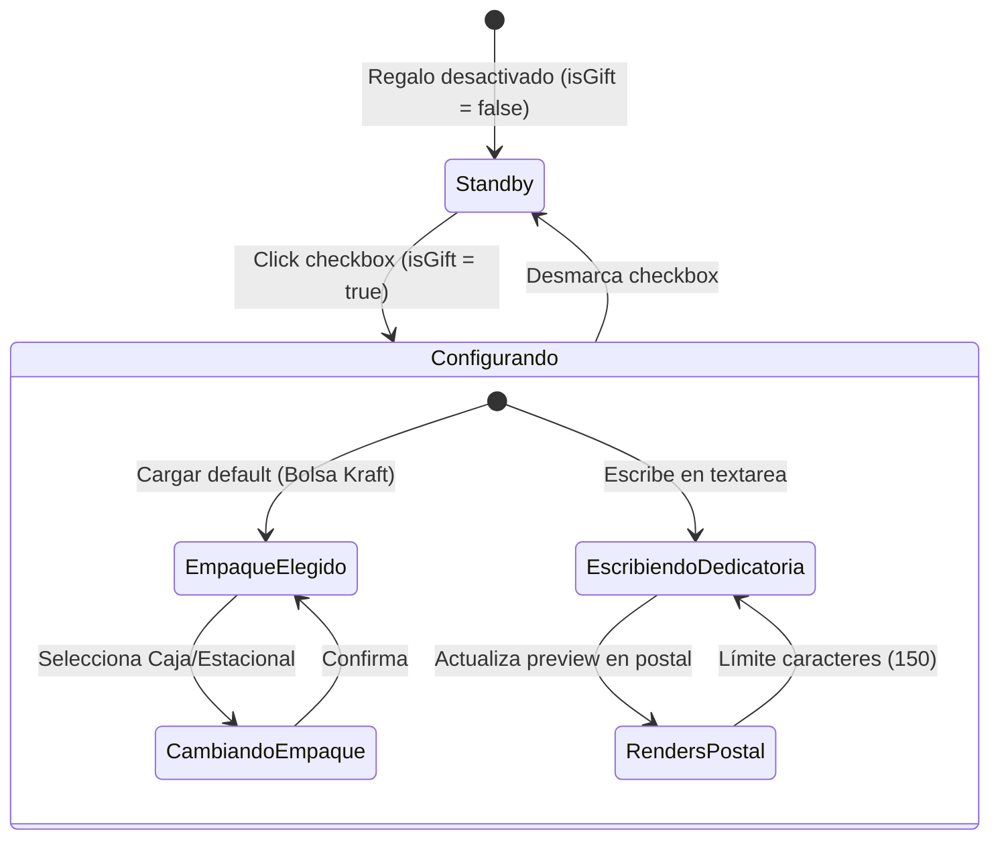

<!--
{
  "resource": "SelectorEmpaqueRegalo",
  "technicalName": "SelectorEmpaqueRegalo",
  "type": "component",
  "niches": [
    "retail_clothing",
    "moda-local-calzado"
  ],
  "targetPath": "src/components/ui/SelectorEmpaqueRegalo.jsx",
  "dependencies": {
    "npm": {},
    "internal": []
  }
}
-->

# Selector de Empaque de Regalo y Dedicatoria (SelectorEmpaqueRegalo)

Componente interactivo premium de valor agregado para checkout. Permite al usuario marcar el pedido como regalo, seleccionar un tipo de empaque físico (bolsa ecológica, caja de lujo o envoltura temática) y escribir una dedicatoria personalizada con vista previa interactiva en forma de tarjeta física.

---

## 1. Propósito y Casos de Uso
1.  **Checkout de Ecommerce:** Opción de adición de envoltorio de regalo justo antes del pago para incrementar el ticket promedio (AOV).
2.  **Carrito de Compras (Drawer):** Checkbox rápido para habilitar la envoltura en un solo clic.

---

## 2. Especificación Visual y Estilos (Tailwind CSS)
*   **Contenedor Principal:** Tarjeta premium con variables HSL de tema, bordes circulares y fondo translúcido (`backdrop-blur-xl bg-[var(--color-surface)]/20 border border-[var(--color-border)]`).
*   **Selector de Empaque:** Rejilla horizontal de botones interactivos con imágenes o íconos descriptivos y marcos de selección iluminados (`ring-2 ring-primary`).
*   **Vista Previa de la Dedicatoria:** Tarjeta postal virtual con tipografía manuscrita fluida (estilo Google Fonts/serif) que refleja el texto del usuario en tiempo real con efecto plegable de solapas.
*   **Controles de Entrada:** Contador de caracteres remanentes en el campo de texto con feedback visual elástico al llegar al límite.

---

## 3. Código React Completo (React 19 & JSX)

```jsx
import React, { useState, useEffect } from 'react';

const PACKAGING_OPTIONS = [
  { id: 'bag', name: 'Bolsa Ecológica', price: 3000, description: 'Papel kraft reciclado con lazo de yute.' },
  { id: 'box', name: 'Caja Premium', price: 8000, description: 'Caja rígida negra mate con cinta satinada.' },
  { id: 'holiday', name: 'Envoltura Estacional', price: 5000, description: 'Papel ilustrado de temporada.' }
];

export default function SelectorEmpaqueRegalo({
  options = PACKAGING_OPTIONS,
  onChange = null,
  maxChars = 150
}) {
  const [isGift, setIsGift] = useState(false);
  const [selectedPack, setSelectedPack] = useState(options[0]?.id || 'bag');
  const [message, setMessage] = useState('');

  const activePack = options.find(p => p.id === selectedPack) || options[0];

  useEffect(() => {
    if (onChange) {
      onChange({
        isGift,
        pack: isGift ? activePack : null,
        message: isGift ? message.trim() : ''
      });
    }
  }, [isGift, selectedPack, message, onChange, activePack]);

  return (
    <div 
      id="selector-empaque-regalo-container"
      className="w-full max-w-md mx-auto p-5 rounded-2xl bg-[var(--color-surface)]/20 border border-[var(--color-border)] text-[var(--color-text)] shadow-2xl backdrop-blur-xl animate-fade-in"
    >
      {/* Checkbox Principal */}
      <label 
        className="flex items-center gap-3.5 p-1 cursor-pointer select-none"
        id="gift-toggle-label"
      >
        <input
          id="gift-checkbox"
          type="checkbox"
          checked={isGift}
          onChange={(e) => setIsGift(e.target.checked)}
          className="w-4.5 h-4.5 rounded border-[var(--color-border)] bg-[var(--color-surface-2)] text-indigo-600 focus:ring-indigo-500 focus:ring-offset-[var(--color-bg)] cursor-pointer"
        />
        <div className="flex-1">
          <span className="text-xs font-bold text-[var(--color-text)] block">¿Es un regalo?</span>
          <span className="text-[10px] text-[var(--color-text-muted)] block">Añade empaque especial y tarjeta con mensaje</span>
        </div>
        <div className="text-indigo-500 dark:text-indigo-400 font-bold text-xs shrink-0 flex items-center gap-1">
          <svg className="w-3.5 h-3.5" fill="none" viewBox="0 0 24 24" stroke="currentColor">
            <path strokeLinecap="round" strokeLinejoin="round" strokeWidth={2} d="M20 7l-8-4-8 4m16 0l-8 4m8-4v10l-8 4m0-10L4 7m8 4v10M4 7v10l8 4" />
          </svg>
          Gifts
        </div>
      </label>

      {/* Contenido Expandible */}
      {isGift && (
        <div className="mt-5 space-y-5 border-t border-[var(--color-border)]/40 pt-4 animate-fade-in" id="gift-config-panel">
          
          {/* Selector de Empaque */}
          <div className="space-y-2">
            <span className="text-[10px] font-black uppercase tracking-wider text-[var(--color-text-muted)]">1. Selecciona el empaque</span>
            <div className="grid grid-cols-1 sm:grid-cols-3 gap-2.5" id="packaging-options-grid">
              {options.map(p => {
                const isSelected = selectedPack === p.id;
                return (
                  <button
                    key={p.id}
                    type="button"
                    onClick={() => setSelectedPack(p.id)}
                    className={`p-3 rounded-xl border text-left flex flex-col justify-between transition-all duration-300 cursor-pointer ${
                      isSelected
                        ? 'bg-indigo-600/10 border-indigo-500 shadow-md shadow-indigo-500/5'
                        : 'bg-[var(--color-surface-2)]/40 border-[var(--color-border)] hover:border-indigo-500/50'
                    }`}
                  >
                    <div>
                      <span className="text-[10px] font-bold text-[var(--color-text)] block truncate">{p.name}</span>
                      <span className="text-[8px] text-[var(--color-text-muted)] block mt-1 leading-normal line-clamp-2">{p.description}</span>
                    </div>
                    <span className="text-[10px] font-black text-indigo-500 dark:text-indigo-400 block mt-3">+ ${p.price.toLocaleString()}</span>
                  </button>
                );
              })}
            </div>
          </div>

          {/* Redacción de Mensaje */}
          <div className="space-y-1.5">
            <div className="flex justify-between text-[10px] uppercase font-black tracking-wider text-[var(--color-text-muted)]">
              <span>2. Mensaje de Dedicatoria</span>
              <span className={message.length >= maxChars ? 'text-rose-500 font-bold' : 'text-[var(--color-text-muted)]'}>
                {message.length} / {maxChars}
              </span>
            </div>
            <textarea
              id="gift-message-textarea"
              maxLength={maxChars}
              rows={3}
              value={message}
              onChange={(e) => setMessage(e.target.value)}
              placeholder="Escribe tu mensaje aquí (Ej: ¡Feliz Cumpleaños! Espero que te encante...)"
              className="w-full bg-[var(--color-surface-2)] border border-[var(--color-border)] rounded-xl p-2.5 text-xs text-[var(--color-text)] placeholder-[var(--color-text-muted)]/60 focus:outline-none focus:border-indigo-500 focus:ring-1 focus:ring-indigo-500/35 transition-all resize-none"
            />
          </div>

          {/* Vista Previa de Tarjeta Postal Premium */}
          <div className="space-y-2">
            <span className="text-[10px] font-black uppercase tracking-wider text-[var(--color-text-muted)] block">Vista previa de tu dedicatoria</span>
            <div 
              id="postal-card-preview"
              className="w-full aspect-[1.6/1] bg-[floralwhite] rounded-xl p-4 text-slate-800 border border-amber-900/10 shadow-inner flex flex-col justify-between relative overflow-hidden select-none"
              style={{
                fontFamily: "'Georgia', 'Times New Roman', serif"
              }}
            >
              {/* Sello o Decoración */}
              <div className="absolute top-3 right-3 opacity-15">
                <svg className="w-12 h-12 text-amber-900" fill="none" viewBox="0 0 24 24" stroke="currentColor">
                  <path strokeLinecap="round" strokeLinejoin="round" strokeWidth={1.5} d="M12 19l9 2-9-18-9 18 9-2zm0 0v-8" />
                </svg>
              </div>

              <div className="border-b border-amber-900/15 pb-1">
                <span className="text-[9px] uppercase tracking-wider font-bold text-amber-900/60 block">Para alguien especial</span>
              </div>

              {/* Mensaje manuscrito */}
              <div className="flex-1 flex items-center justify-center py-2">
                <p className="text-xs text-amber-950 text-center italic leading-relaxed break-words max-w-[90%] font-serif">
                  {message || 'El texto que escribas arriba se imprimirá aquí de forma elegante.'}
                </p>
              </div>

              <div className="flex justify-between items-end border-t border-amber-900/15 pt-1.5 text-[8px] text-amber-900/60 uppercase tracking-widest font-bold">
                <span>Con cariño</span>
                <span>Empaque: {activePack.name}</span>
              </div>
            </div>
          </div>

        </div>
      )}
    </div>
  );
}
```

---

## 🔄 Diagrama de Estado del Regalo

