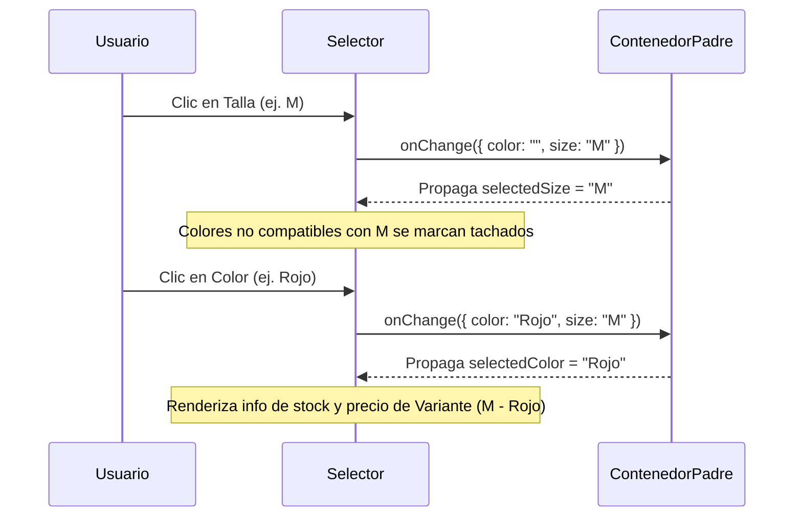

<!--
{
  "resource": "SelectorTallasColores",
  "technicalName": "SelectorTallasColores",
  "type": "component",
  "niches": [
    "retail_clothing",
    "moda-local-calzado",
    "distribuidoras-beauty"
  ],
  "targetPath": "src/components/ui/SelectorTallasColores.jsx",
  "dependencies": {
    "npm": {
      "framer-motion": "^11.0.0",
      "lucide-react": "^0.400.0"
    },
    "internal": []
  }
}
-->

# Selector de Tallas y Colores (`SelectorTallasColores`)

El componente `SelectorTallasColores` proporciona una interfaz premium, interactiva y táctil para que los usuarios seleccionen variantes de productos (tallas, colores) con retroalimentación de disponibilidad física de stock en tiempo real.

---

## 1. Propósito y Casos de Uso
*   **Selección de Variantes en E-Commerce:** Reemplaza los dropdowns nativos aburridos por botones de colores interactivos y chips de tallas elásticos.
*   **Validación de Stock:** Deshabilita o advierte automáticamente sobre combinaciones de tallas y colores agotadas.
*   **Visualización de Muestras:** Muestra colores sólidos o degradados mediante círculos estilizados.

---

## 2. Especificación Visual y Estilos (Tailwind CSS)
El componente consume variables HSL del ecosistema de marca blanca, permitiendo la adaptación automática de colores primarios y de superficie:
*   **Fondo de Botones:** `bg-[var(--color-surface)]` en reposo, y `bg-[var(--color-primary)]` para el ítem seleccionado.
*   **Micro-interacciones:** Escalamiento en hover (`hover:scale-105`) con resortes de Framer Motion.
*   **Accesibilidad (WCAG):** Contraste garantizado mediante bordes y estados de foco con sombras resplandecientes.

---

## 3. Código React Completo

```jsx
import React, { useMemo } from 'react';
import { motion, AnimatePresence } from 'framer-motion';
import { Check, AlertCircle } from 'lucide-react';

export default function SelectorTallasColores({
  options = [], // [{ id, size, color, colorHex, stock, price }]
  selectedSize = '',
  selectedColor = '',
  onChange, // ({ size, color }) => void
  disabled = false
}) {
  // Extraer valores únicos de tallas y colores
  const sizes = useMemo(() => {
    const set = new Set(options.map(o => o.size));
    return Array.from(set).filter(Boolean);
  }, [options]);

  const colors = useMemo(() => {
    const map = new Map();
    options.forEach(o => {
      if (o.color && !map.has(o.color)) {
        map.set(o.color, o.colorHex || '#cccccc');
      }
    });
    return Array.from(map.entries()).map(([name, hex]) => ({ name, hex }));
  }, [options]);

  // Verificar la disponibilidad de stock de un color específico
  const isColorAvailable = (colorName) => {
    // Si no hay talla seleccionada, es disponible si hay stock en alguna talla
    if (!selectedSize) {
      return options.some(o => o.color === colorName && o.stock > 0);
    }
    // Si hay talla seleccionada, verificar stock exacto de esa combinación
    return options.some(o => o.color === colorName && o.size === selectedSize && o.stock > 0);
  };

  // Verificar la disponibilidad de stock de una talla específica
  const isSizeAvailable = (sizeName) => {
    if (!selectedColor) {
      return options.some(o => o.size === sizeName && o.stock > 0);
    }
    return options.some(o => o.size === sizeName && o.color === selectedColor && o.stock > 0);
  };

  // Obtener stock e info de la combinación actual
  const currentVariant = useMemo(() => {
    if (!selectedSize || !selectedColor) return null;
    return options.find(o => o.size === selectedSize && o.color === selectedColor);
  }, [selectedSize, selectedColor, options]);

  const handleColorSelect = (colorName) => {
    if (disabled) return;
    onChange({
      color: colorName,
      size: selectedSize
    });
  };

  const handleSizeSelect = (sizeName) => {
    if (disabled) return;
    onChange({
      color: selectedColor,
      size: sizeName
    });
  };

  return (
    <div className="space-y-5 w-full max-w-sm select-none">
      {/* 🟢 Selector de Color */}
      {colors.length > 0 && (
        <div className="space-y-2">
          <div className="flex justify-between items-center">
            <span className="text-[10px] font-black uppercase tracking-widest text-[var(--color-text-muted)]">
              Color: <span className="text-[var(--color-text)] normal-case font-bold">{selectedColor || 'No seleccionado'}</span>
            </span>
          </div>
          <div className="flex flex-wrap gap-2.5 py-1">
            {colors.map(({ name, hex }) => {
              const available = isColorAvailable(name);
              const isSelected = selectedColor === name;

              return (
                <button
                  key={name}
                  type="button"
                  onClick={() => handleColorSelect(name)}
                  disabled={disabled}
                  className="relative p-0.5 rounded-full border border-transparent transition-all hover:scale-105 active:scale-95 group focus:outline-none cursor-pointer"
                  style={{
                    borderColor: isSelected ? 'var(--color-primary)' : 'transparent'
                  }}
                  title={name}
                >
                  <span
                    className="block w-6 h-6 rounded-full border border-black/10 relative shadow-sm"
                    style={{ backgroundColor: hex }}
                  >
                    <AnimatePresence>
                      {isSelected && (
                        <motion.span
                          initial={{ scale: 0, opacity: 0 }}
                          animate={{ scale: 1, opacity: 1 }}
                          exit={{ scale: 0, opacity: 0 }}
                          className="absolute inset-0 flex items-center justify-center bg-black/25 rounded-full"
                        >
                          <Check size={12} className="text-white" />
                        </motion.span>
                      )}
                    </AnimatePresence>
                    {!available && (
                      <span className="absolute inset-0 flex items-center justify-center bg-white/60 rounded-full">
                        <span className="w-6 h-0.5 bg-red-500/70 rotate-45 transform absolute" />
                      </span>
                    )}
                  </span>
                </button>
              );
            })}
          </div>
        </div>
      )}

      {/* 📐 Selector de Talla */}
      {sizes.length > 0 && (
        <div className="space-y-2">
          <div className="flex justify-between items-center">
            <span className="text-[10px] font-black uppercase tracking-widest text-[var(--color-text-muted)]">
              Talla: <span className="text-[var(--color-text)] normal-case font-bold">{selectedSize || 'No seleccionada'}</span>
            </span>
          </div>
          <div className="flex flex-wrap gap-2.5 py-1">
            {sizes.map(name => {
              const available = isSizeAvailable(name);
              const isSelected = selectedSize === name;

              return (
                <button
                  key={name}
                  type="button"
                  onClick={() => handleSizeSelect(name)}
                  disabled={disabled}
                  className={`relative px-3.5 py-1.5 rounded-xl text-[10px] font-bold border transition-all cursor-pointer select-none focus:outline-none ${
                    isSelected
                      ? 'bg-[var(--color-primary)] border-[var(--color-primary)] text-white shadow-lg shadow-indigo-600/10'
                      : available
                      ? 'bg-[var(--color-surface-2)] border-[var(--color-border)] text-[var(--color-text)] hover:bg-[var(--color-surface)] hover:scale-105 active:scale-95'
                      : 'bg-[var(--color-surface-2)]/30 border-[var(--color-border)]/50 text-[var(--color-text-muted)]/40 cursor-not-allowed line-through'
                  }`}
                >
                  {name}
                </button>
              );
            })}
          </div>
        </div>
      )}

      {/* 📦 Info de Disponibilidad e Inventario */}
      <AnimatePresence mode="wait">
        {selectedSize && selectedColor && currentVariant && (
          <motion.div
            initial={{ opacity: 0, y: 5 }}
            animate={{ opacity: 1, y: 0 }}
            exit={{ opacity: 0, y: 5 }}
            transition={{ duration: 0.15 }}
            className={`border rounded-2xl p-3 flex items-start gap-2.5 ${
              currentVariant.stock === 0
                ? 'bg-red-500/5 border-red-500/20 text-red-400'
                : currentVariant.stock <= 3
                ? 'bg-amber-500/5 border-amber-500/20 text-amber-400'
                : 'bg-emerald-500/5 border-emerald-500/20 text-emerald-400'
            }`}
          >
            <AlertCircle size={13} className="shrink-0 mt-0.5" />
            <div className="space-y-0.5">
              <span className="text-[10px] font-bold block">
                {currentVariant.stock === 0
                  ? 'Agotado'
                  : currentVariant.stock <= 3
                  ? `¡Últimas unidades! (${currentVariant.stock} disponibles)`
                  : 'Disponible en tienda'}
              </span>
              <span className="text-[9px] text-[var(--color-text-muted)] block">
                Precio unitario: ${currentVariant.price.toLocaleString()} COP
              </span>
            </div>
          </motion.div>
        )}
      </AnimatePresence>
    </div>
  );
}
```

---

## 4. Lógica de Estado y Ciclo de Vida
El componente es **stateless** (sin estado local persistido), lo que delega la gestión de estados globales al carrito (`useCartStore`) o al formulario de compra. El flujo de eventos se propaga a través de la función `onChange`, retornando la combinación seleccionada.

---

## 5. Secuencia de Interacción


