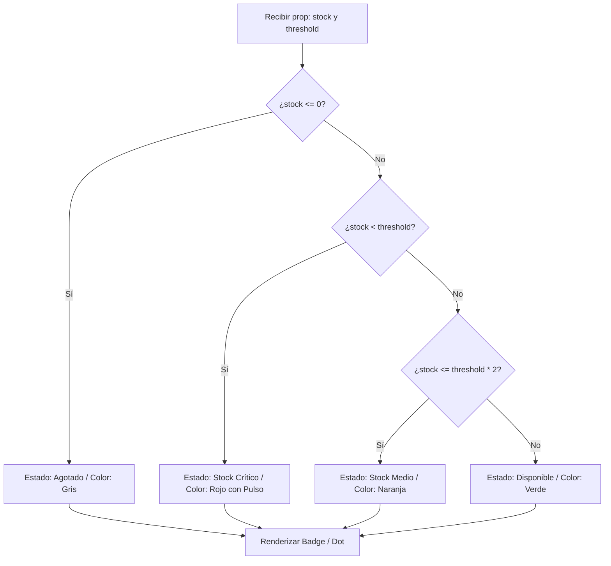

<!--
{
  "technicalName": "StockHeatmap",
  "targetPath": "src/components/common/StockHeatmap.jsx",
  "dependencies": {
    "npm": {},
    "internal": []
  }
}
-->

# Indicador de Stock Crítico (`StockHeatmap`)

## 1. Propósito y Casos de Uso
Átomo visual diseñado para reflejar de forma instantánea y semántica la abundancia, escasez o agotamiento del stock de un producto o de sus variantes específicas en un catálogo o pantalla de venta POS.
- **Urgencia en Checkout (Fomo):** Alerta a clientes finales si un producto está por agotarse, estimulando la conversión ética.
- **Eficiencia del Cajero:** Permite al cajero/vendedor identificar de un solo vistazo el nivel de inventario sin salir de la vista principal.

## 2. Especificación Visual y Estilos
Alineado con el sistema de diseño HSL de marca blanca y Tailwind CSS v4, libre de bordes oscuros fijos y sombras duras.

### Variante Mini-Badge (Píldora de Alerta para el Cliente)
- **Stock Amplio (> 10):** `bg-emerald-500/10 text-emerald-400 border border-emerald-500/20`
- **Stock Medio (5 a 10):** `bg-amber-500/10 text-amber-400 border border-amber-500/20`
- **Stock Crítico (1 a 4):** `bg-red-500/10 text-red-400 border border-red-500/25 animate-pulse`
- **Agotado (0):** `bg-slate-800/80 text-slate-400 border border-slate-700/30`

### Variante Grid-Indicator (Rejilla de Atributos del POS)
Representación compacta o anillo exterior para chips de tallas/colores:
- Borde superior o anillo glow (`ring-2 ring-red-500/60`) sobre la tarjeta de producto o chip selector si está en stock crítico.

## 3. Props y API del Componente

```jsx
<StockHeatmap stock={stock} threshold={threshold} showLabel={showLabel} variant={variant} />
```

### Tabla de Props
| Prop | Tipo | Default | Descripción |
| :--- | :--- | :--- | :--- |
| `stock` | `number` | *Requerido* | Unidades disponibles en inventario. |
| `threshold` | `number` | `5` | Umbral por debajo del cual se considera stock crítico. |
| `showLabel` | `boolean` | `true` | Muestra o esconde el texto descriptivo junto al color. |
| `variant` | `'badge' \| 'dot'` | `'badge'` | Formato visual (píldora con borde o punto luminoso simple). |

## 4. Código React Completo y 100% Funcional

Consúltalo en la ubicación física: [`StockHeatmap.jsx`](file:///d:/Aplicaciones/App%20Ventas/src/components/ui/StockHeatmap.jsx).

```jsx
import React from 'react';

export function StockHeatmap({ stock, threshold = 5, showLabel = true, variant = 'badge' }) {
  const getStatus = () => {
    if (stock <= 0) {
      return {
        label: 'Agotado',
        colorClass: 'bg-slate-800/80 text-slate-400 border-slate-700/30',
        dotClass: 'bg-slate-500'
      };
    }
    if (stock < threshold) {
      return {
        label: `¡Solo quedan ${stock} u!`,
        colorClass: 'bg-red-500/10 text-red-400 border-red-500/25 animate-pulse',
        dotClass: 'bg-red-500 shadow-[0_0_8px_rgba(239,68,68,0.5)]'
      };
    }
    if (stock <= threshold * 2) {
      return {
        label: 'Pocas unidades',
        colorClass: 'bg-amber-500/10 text-amber-400 border-amber-500/20',
        dotClass: 'bg-amber-500 shadow-[0_0_8px_rgba(245,158,11,0.5)]'
      };
    }
    return {
      label: 'Disponible',
      colorClass: 'bg-emerald-500/10 text-emerald-400 border-emerald-500/20',
      dotClass: 'bg-emerald-500 shadow-[0_0_8px_rgba(16,185,129,0.5)]'
    };
  };

  const status = getStatus();

  if (variant === 'dot') {
    return (
      <div className="flex items-center gap-1.5" title={`${status.label} (${stock} unidades)`}>
        <span className={`w-2 h-2 rounded-full transition-all ${status.dotClass}`} />
        {showLabel && <span className="text-[10px] font-bold text-[var(--color-text-muted)]">{status.label}</span>}
      </div>
    );
  }

  return (
    <div className={`px-2 py-0.5 rounded-lg border text-[9px] font-black uppercase tracking-wider inline-flex items-center gap-1.5 transition-all ${status.colorClass}`}>
      <span className={`w-1.5 h-1.5 rounded-full ${status.dotClass}`} />
      {showLabel && <span>{status.label}</span>}
    </div>
  );
}
```

## 5. Lógica de Estado y Ciclo de Vida
Componente funcional puro y stateless. Se re-renderiza y actualiza su estado visual en el DOM virtual cada vez que la prop de `stock` se modifica mediante transacciones o selección de variantes en el componente padre.

## 6. Flujo Operativo y Secuencia de Interacción


## 7. Ejemplo de Uso (Importación y Consumo)
```jsx
import { StockHeatmap } from './components/ui/StockHeatmap';

export function TarjetaProducto({ producto }) {
  return (
    <div className="border rounded-2xl p-4">
      
      <h3>{producto.nombre}</h3>
      <div className="mt-2">
        <StockHeatmap stock={producto.inventario} threshold={3} />
      </div>
    </div>
  );
}
```

## 8. Origen
- **Creado por:** Antigravity AI
- **Fecha de creación:** 2026-06-06
- **Versión:** 1.0
