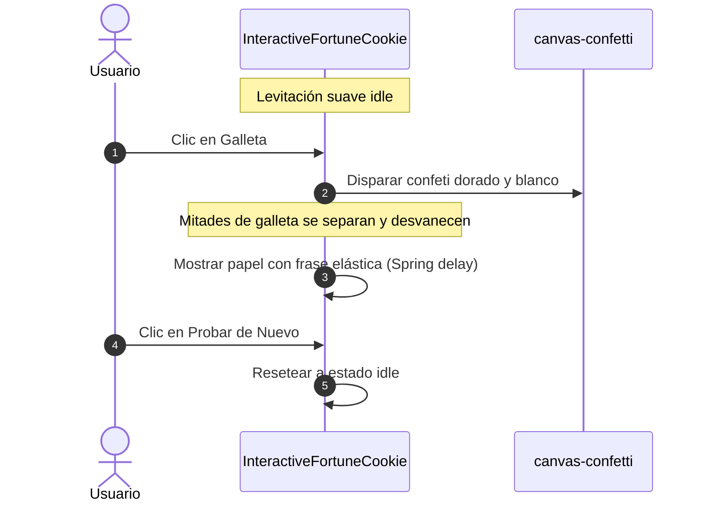

<!--
{
  "resource": "InteractiveFortuneCookie",
  "technicalName": "InteractiveFortuneCookie",
  "targetPath": "src/components/common/InteractiveFortuneCookie.jsx",
  "type": "component",
  "niches": ["retail_clothing", "wellness_podology", " grocery_food", "licores-cocteleria"],
  "dependencies": {
    "npm": {
      "framer-motion": "^11.0.0",
      "canvas-confetti": "^1.9.3",
      "lucide-react": "^0.300.0"
    },
    "internal": []
  }
}
-->

# Galleta de la Fortuna Interactiva (`InteractiveFortuneCookie`)

El componente `InteractiveFortuneCookie` es una micro-interacción gamificada premium y de marca blanca. Presenta una galleta de la fortuna SVG flotante que, al ser pulsada por el usuario, se fractura en dos mitades con giros opuestos y detona una explosión de partículas en tonos dorados/galleta para luego revelar un mensaje elástico de la fortuna o un cupón promocional oculto.

## 1. Propósito y Casos de Uso
* **Fidelización y Recompensas:** Ideal para pantallas de agradecimiento tras una compra, ruletas de lealtad o popups de cupones de descuento interactivos.
* **Integridad de Marca Blanca:** La galleta hereda automáticamente el color de la variable `--color-primary` y aplica un sombreado del 90% (`brightness-90`) a la mitad derecha para darle profundidad 3D sin depender de assets de imagen fijos.
* **Micro-interacciones:** Provee feedback táctil inmediato en móviles mediante animaciones de desvanecimiento rotacional y amortiguación elástica de tipo resorte (`spring`) en la tarjeta revelada.

---

## 2. Especificación Visual y Estilos (Tailwind CSS)
* **Contenedor General:** `min-h-[300px] p-8 overflow-visible` para dar holgura a las mitades desplazadas sin clipping.
* **Mitades SVG de la Galleta:** Heredan `text-[var(--color-primary)]` y se separan lateralmente con `exit={{ x: -60, y: 20, rotate: -45, opacity: 0 }}` e `exit={{ x: 60, y: 20, rotate: 45, opacity: 0 }}`.
* **Papel de la Fortuna:** Glassmorphism clásico con `bg-[var(--color-surface)]`, borde `border-[var(--color-border)]` y sombra `shadow-soft-2xl` con curvatura `rounded-xl`.
* **Botón de Reintento:** `text-[var(--color-primary)] bg-[var(--color-primary)]/10 hover:bg-[var(--color-primary)]/20 rounded-full`.

---

## 3. Código React Completo
Crea este archivo en [InteractiveFortuneCookie.jsx](file:///d:/PROTOTIPE/Plantillas%20Core/App%20Ventas/src/components/common/InteractiveFortuneCookie.jsx):

```jsx
import React, { useState } from 'react';
import { motion, AnimatePresence } from 'framer-motion';
import { Sparkles, RotateCcw, Quote } from 'lucide-react';
import confetti from 'canvas-confetti';

export default function InteractiveFortuneCookie({ 
  // Texto dinámico programable por el cliente o la base de datos
  fortuneText = "La organización hoy, será tu mayor ganancia de mañana.",
  author = "PROTOTIPE Ecosistema"
}) {
  const [isBroken, setIsBroken] = useState(false);

  const handleBreak = () => {
    if (isBroken) return;
    
    // Ráfaga de confeti premium sincronizada con la ruptura (colores dorados de galleta)
    const colors = ['#f59e0b', '#fcd34d', '#ffffff'];
    confetti({
      particleCount: 100,
      spread: 80,
      origin: { y: 0.6 },
      colors: colors,
      disableForReducedMotion: true,
      zIndex: 50
    });

    setIsBroken(true);
  };

  const handleReset = () => {
    setIsBroken(false);
  };

  return (
    <div className="relative flex flex-col items-center justify-center w-full min-h-[320px] p-8 overflow-visible">
      
      {/* EL PAPEL DE LA FORTUNA (Emerge elásticamente al romperse) */}
      <AnimatePresence>
        {isBroken && (
          <motion.div
            initial={{ opacity: 0, scale: 0.4, y: 50 }}
            animate={{ opacity: 1, scale: 1, y: 0 }}
            exit={{ opacity: 0, scale: 0.8, y: 20 }}
            transition={{ type: 'spring', damping: 15, stiffness: 200, delay: 0.2 }}
            className="absolute z-10 flex flex-col items-center w-full max-w-sm p-6 mx-auto bg-[var(--color-surface)] border border-[var(--color-border)] shadow-soft-2xl rounded-3xl backdrop-blur-md"
          >
            <Quote className="w-8 h-8 mb-3 text-[var(--color-primary)]/40" />
            <p className="text-base font-medium text-center text-[var(--color-text)] leading-relaxed">
              "{fortuneText}"
            </p>
            {author && (
              <span className="mt-3 text-[10px] font-semibold tracking-wider uppercase text-[var(--color-text-muted)]">
                — {author}
              </span>
            )}
            
            <button
              onClick={handleReset}
              aria-label="Romper otra galleta"
              className="mt-6 flex items-center justify-center gap-2 px-4 py-2 text-xs font-semibold text-[var(--color-primary)] bg-[var(--color-primary)]/10 hover:bg-[var(--color-primary)]/20 rounded-full transition-colors active:scale-95"
            >
              <RotateCcw size={14} />
              <span>Probar de nuevo</span>
            </button>
          </motion.div>
        )}
      </AnimatePresence>

      {/* CONTENEDOR DE LA GALLETA (Permanece montado para ejecutar la animación de apertura en sus mitades) */}
      <div className="relative z-20 flex items-center justify-center w-56 h-56 select-none">
        
        {/* PEQUEÑO PAPELITO QUE ASOMA ANTES DE ROMPERSE (Clave cognitiva para identificar la galleta de la fortuna) */}
        {!isBroken && (
          <motion.div
            initial={{ opacity: 0, y: 10, rotate: -5 }}
            animate={{ 
              opacity: 1, 
              y: [0, -4, 0],
              rotate: [-5, -8, -5]
            }}
            transition={{ 
              y: { repeat: Infinity, duration: 3, ease: 'easeInOut' },
              rotate: { repeat: Infinity, duration: 3, ease: 'easeInOut' }
            }}
            className="absolute top-12 z-10 px-2.5 py-1 bg-white border border-gray-200 shadow-sm rounded text-[8px] font-bold text-blue-600 tracking-widest uppercase pointer-events-none"
          >
            Lucky 🍀
          </motion.div>
        )}

        <motion.button
          onClick={handleBreak}
          aria-label="Romper galleta de la fortuna"
          animate={isBroken ? { scale: 0.9 } : { y: [0, -8, 0] }}
          transition={isBroken ? { duration: 0.2 } : { repeat: Infinity, duration: 3, ease: 'easeInOut' }}
          className="relative w-full h-full flex items-center justify-center cursor-pointer group active:scale-95 transition-transform duration-200 outline-none"
          disabled={isBroken}
        >
          {/* Halo interactivo al hover */}
          {!isBroken && (
            <div className="absolute inset-0 transition-opacity duration-300 rounded-full opacity-0 bg-[var(--color-primary)]/15 blur-2xl group-hover:opacity-100 -z-10"></div>
          )}

          <svg viewBox="0 0 100 100" className="w-44 h-44 drop-shadow-2xl overflow-visible">
            <defs>
              {/* Degradado para el cuerpo de la galleta (dorado cálido tostado con brillo) */}
              <linearGradient id="cookieBody" x1="0%" y1="0%" x2="0%" y2="100%">
                <stop offset="0%" stopColor="#ffe4b5" />
                <stop offset="60%" stopColor="#e5a95e" />
                <stop offset="100%" stopColor="#b3732d" />
              </linearGradient>
              {/* Degradado para las sombras de los pliegues y arrugas */}
              <linearGradient id="cookieShadow" x1="0%" y1="0%" x2="100%" y2="100%">
                <stop offset="0%" stopColor="#a06020" />
                <stop offset="100%" stopColor="#5d350b" />
              </linearGradient>
              {/* Degradado para los brillos de relieve superior */}
              <linearGradient id="cookieHighlight" x1="0%" y1="0%" x2="0%" y2="100%">
                <stop offset="0%" stopColor="#ffffff" stopOpacity="0.6" />
                <stop offset="100%" stopColor="#ffffff" stopOpacity="0" />
              </linearGradient>
            </defs>

            {/* Mitad Izquierda de la Galleta */}
            <motion.g
              animate={isBroken ? { x: -70, y: 35, rotate: -40, opacity: 0 } : { x: 0, y: 0, rotate: 0, opacity: 1 }}
              transition={{ duration: 0.6, ease: [0.16, 1, 0.3, 1] }}
            >
              {/* Cuerpo Principal (Curvatura alargada de media luna) */}
              <path 
                d="M 50,22 C 35,22 15,25 8,45 C 0,70 15,85 30,85 C 38,85 45,70 50,55 Z" 
                fill="url(#cookieBody)" 
              />
              {/* Pliegue de Sombra Interior */}
              <path 
                d="M 50,55 C 45,65 38,75 30,85 C 35,80 43,70 45,60 Z" 
                fill="url(#cookieShadow)" 
                opacity="0.85"
              />
              {/* Brillo en el borde superior */}
              <path 
                d="M 50,22 C 38,15 20,22 13,38 C 22,28 38,22 50,22 Z" 
                fill="url(#cookieHighlight)" 
              />
            </motion.g>

            {/* Mitad Derecha de la Galleta */}
            <motion.g
              animate={isBroken ? { x: 70, y: 35, rotate: 40, opacity: 0 } : { x: 0, y: 0, rotate: 0, opacity: 1 }}
              transition={{ duration: 0.6, ease: [0.16, 1, 0.3, 1] }}
            >
              {/* Cuerpo Principal */}
              <path 
                d="M 50,22 C 65,22 85,25 92,45 C 100,70 85,85 70,85 C 62,85 55,70 50,55 Z" 
                fill="url(#cookieBody)" 
                className="brightness-95"
              />
              {/* Pliegue de Sombra Interior */}
              <path 
                d="M 50,55 C 55,65 62,75 70,85 C 65,80 57,70 55,60 Z" 
                fill="url(#cookieShadow)" 
                opacity="0.95"
              />
              {/* Brillo en el borde superior */}
              <path 
                d="M 50,22 C 62,15 80,22 87,38 C 78,28 62,22 50,22 Z" 
                fill="url(#cookieHighlight)" 
              />
            </motion.g>
          </svg>

          {/* Micro-icono flotante central (Solo visible en estado cerrado) */}
          {!isBroken && (
            <div className="absolute flex items-center justify-center w-8 h-8 rounded-full bg-white/20 backdrop-blur-sm shadow-soft-sm text-white transition-opacity group-hover:scale-110">
              <Sparkles size={16} />
            </div>
          )}
        </motion.button>
      </div>
    </div>
  );
}

---

## 4. Lógica de Estado y Ciclo de Vida
* **Desacoplamiento del Evento Físico:** Al hacer clic en la galleta (`handleBreak`), se detona inmediatamente una explosión de partículas localizadas mediante `canvas-confetti` y se cambia el estado `isBroken` a `true` desmontando la galleta e introduciendo el papelito con un desfase de retardo (`delay: 0.1`) para dar fluidez.
* **Persistencia elástica:** La transición de entrada utiliza `type: 'spring', damping: 15` para lograr el efecto característico de rebote elástico premium.

---

## 5. Flujo Operativo y Secuencia de Interacción


