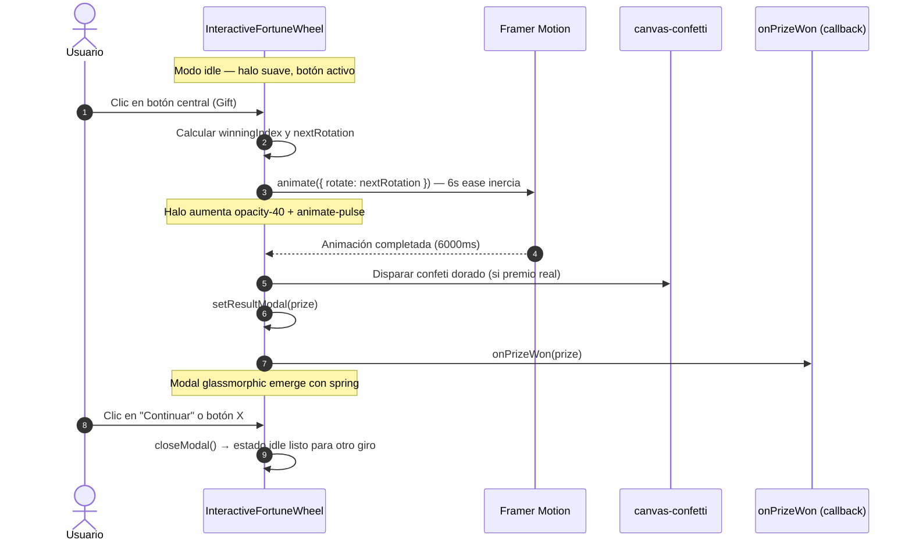

<!--
{
  "resource": "InteractiveFortuneWheel",
  "technicalName": "InteractiveFortuneWheel",
  "targetPath": "src/components/common/InteractiveFortuneWheel.jsx",
  "type": "component",
  "niches": [
    "retail_clothing",
    "grocery_food",
    "wellness_podology",
    "alimentos-artesanales",
    "distribuidoras-beauty",
    "licores-cocteleria",
    "coleccionismo-geek",
    "petshops-locales",
    "moda-local-calzado"
  ],
  "dependencies": {
    "npm": {
      "framer-motion": "^11.x",
      "canvas-confetti": "^1.9.x",
      "lucide-react": "^0.400.x"
    },
    "internal": []
  }
}
-->

# InteractiveFortuneWheel — Ruleta de la Fortuna Premium

## 1. Propósito y Casos de Uso

Componente de gamificación de alta fidelidad que renderiza una **ruleta de premios giratoria** con física de inercia real simulada por Framer Motion. Completamente parametrizable vía props o Zustand: acepta cualquier número de porciones (`prizes`) sin modificar el código de geometría.

**Casos de uso directos:**
- Pop-up post-checkout con ruleta de descuentos/cupones para incentivar la fidelización.
- Módulo de "Premio del Día" en e-commerce de ropa, belleza, alimentos o licorería.
- Mecánica de gamificación en el punto de venta físico integrada al POS.
- Motor de cupones conectado a `onPrizeWon` → Firestore → CartDrawer.

**Diferencial vs. `RaffleWheelOfFortune`:** En lugar de un gradiente estático, usa un `conic-gradient` matemáticamente calculado (`360 / prizes.length`) que se adapta automáticamente a cualquier número de premios (4, 6, 8, 12…). La física de la rotación simula verdadera inercia de detenida y no un sencillo `rotate: 3600`.

---

## 2. Especificación Visual y Estilos

| Token CSS | Uso |
|---|---|
| `var(--color-primary)` | Porciones pares + puntero + botón central + brillo |
| `var(--color-surface-2)` | Porciones impares |
| `var(--color-surface)` | Marco de borde + modal de resultado |
| `var(--color-border)` | Borde del modal glassmorphic |
| `var(--color-text-muted)` | Texto de instrucciones |
| `var(--color-text)` | Texto del modal y premios impares |

**Animación principal:** `ease: [0.2, 0.8, 0.2, 1]` durante 6 segundos — Bézier que simula inercia real (arranca rápido, frena suave con rebote).

**Halo Magnético:** `blur-3xl` sobre el `--color-primary` que pasa de `opacity-10` a `opacity-40 + animate-pulse` mientras gira.

---

## 3. Código React Completo

```jsx
import React, { useState } from 'react';
import { motion, AnimatePresence } from 'framer-motion';
import { Gift, X, Sparkles, Navigation } from 'lucide-react';
import confetti from 'canvas-confetti';

// Configuración por defecto (Totalmente inyectable desde Zustand o Props)
const DEFAULT_PRIZES = [
  { id: 1, label: "10% DCTO" },
  { id: 2, label: "Envío Gratis" },
  { id: 3, label: "Premio Sorpresa" },
  { id: 4, label: "Sigue Intentando" },
  { id: 5, label: "5% DCTO" },
  { id: 6, label: "2x1 Hoy" }
];

export default function InteractiveFortuneWheel({ 
  prizes = DEFAULT_PRIZES,
  onPrizeWon = (prize) => console.log("Premio ganado:", prize)
}) {
  const [isSpinning, setIsSpinning] = useState(false);
  const [rotation, setRotation] = useState(0);
  const [resultModal, setResultModal] = useState(null);

  // Cálculos geométricos para dibujar la ruleta dinámicamente
  const sliceAngle = 360 / prizes.length;
  
  // Generador del gradiente cónico dinámico usando tokens HSL de PROTOTIPE
  const wheelGradient = prizes.map((_, i) => {
    const color = i % 2 === 0 ? 'var(--color-primary)' : 'var(--color-surface-2)';
    return `${color} ${i * sliceAngle}deg ${(i + 1) * sliceAngle}deg`;
  }).join(', ');

  const handleSpin = () => {
    if (isSpinning) return;
    setIsSpinning(true);
    setResultModal(null);

    // Selección aleatoria matemática del premio
    const winningIndex = Math.floor(Math.random() * prizes.length);
    
    // Física de rotación real:
    // 1. Centro de la porción ganadora dentro del ciclo de 360°
    const sliceCenter = (winningIndex * sliceAngle) + (sliceAngle / 2);
    // 2. Ángulo necesario para que ese centro quede en la cima (0°)
    const targetRelativeAngle = 360 - sliceCenter;
    // 3. 5 vueltas de suspenso acumuladas sobre la rotación actual
    const extraSpins = 5 * 360;
    const nextRotation = rotation + extraSpins + targetRelativeAngle - (rotation % 360);

    setRotation(nextRotation);

    // Esperar a que la animación de física concluya (6 segundos)
    setTimeout(() => {
      setIsSpinning(false);
      
      // Confeti premium sólo si ganó un premio real
      if (prizes[winningIndex].label.toLowerCase() !== "sigue intentando") {
        confetti({
          particleCount: 150,
          spread: 90,
          origin: { y: 0.5 },
          colors: ['#f59e0b', '#fcd34d', '#ffffff'],
          disableForReducedMotion: true,
          zIndex: 60
        });
      }

      setResultModal(prizes[winningIndex]);
      onPrizeWon(prizes[winningIndex]);
    }, 6000);
  };

  const closeModal = () => setResultModal(null);

  return (
    <div className="relative flex flex-col items-center justify-center w-full min-h-[450px] p-6 overflow-hidden">
      
      {/* Halo Magnético Dinámico */}
      <div 
        className={`absolute inset-0 m-auto w-72 h-72 rounded-full bg-[var(--color-primary)] blur-3xl -z-10 transition-opacity duration-1000 ${
          isSpinning ? 'opacity-40 animate-pulse' : 'opacity-10'
        }`}
      />

      {/* CONTENEDOR PRINCIPAL */}
      <div className="relative flex items-center justify-center w-72 h-72">
        
        {/* Puntero Superior */}
        <div className="absolute -top-4 z-20 text-[var(--color-primary)] drop-shadow-md">
          <Navigation size={40} strokeWidth={3} className="fill-[var(--color-primary)] rotate-180" />
        </div>

        {/* Disco Giratorio */}
        <motion.div
          animate={{ rotate: rotation }}
          transition={{ duration: 6, ease: [0.2, 0.8, 0.2, 1] }}
          className="relative w-full h-full rounded-full shadow-soft-2xl border-4 border-[var(--color-surface)] overflow-hidden"
          style={{ background: `conic-gradient(${wheelGradient})` }}
        >
          {/* Etiquetas de premios */}
          {prizes.map((prize, i) => {
            const rotationAngle = (i * sliceAngle) + (sliceAngle / 2);
            const isDarkBg = i % 2 === 0;
            return (
              <div 
                key={prize.id}
                className="absolute top-0 left-0 w-full h-full flex items-start justify-center pt-6"
                style={{ transform: `rotate(${rotationAngle}deg)` }}
              >
                <span 
                  className={`text-xs font-bold uppercase tracking-wider ${isDarkBg ? 'text-white' : 'text-[var(--color-text)]'}`}
                  style={{ writingMode: 'vertical-rl', transform: 'rotate(180deg)' }}
                >
                  {prize.label}
                </span>
              </div>
            );
          })}
        </motion.div>

        {/* Botón Central (Eje) */}
        <button
          onClick={handleSpin}
          disabled={isSpinning}
          className="absolute z-10 flex items-center justify-center w-16 h-16 rounded-full bg-[var(--color-surface)] border-[6px] border-[var(--color-primary)] text-[var(--color-primary)] shadow-lg hover:scale-105 active:scale-95 transition-transform disabled:opacity-80 disabled:hover:scale-100 disabled:cursor-not-allowed outline-none"
          aria-label="Girar Ruleta"
        >
          <Gift size={24} strokeWidth={2.5} />
        </button>
      </div>

      <p className="mt-8 text-sm font-medium text-[var(--color-text-muted)]">
        {isSpinning ? "¡Cruzando los dedos! 🤞" : "Toca el regalo central para girar"}
      </p>

      {/* MODAL DE RESULTADO */}
      <AnimatePresence>
        {resultModal && (
          <div className="fixed inset-0 z-50 flex items-center justify-center p-4 bg-black/40 backdrop-blur-sm">
            <div className="absolute inset-0 z-40" onClick={closeModal}></div>
            <motion.div
              initial={{ scale: 0.8, opacity: 0, y: 30 }}
              animate={{ scale: 1, opacity: 1, y: 0 }}
              exit={{ scale: 0.9, opacity: 0, y: 20 }}
              transition={{ type: 'spring', damping: 20, stiffness: 300 }}
              className="relative z-50 w-full max-w-sm p-8 text-center overflow-hidden rounded-3xl bg-[var(--color-surface)] shadow-soft-2xl border border-[var(--color-border)]"
            >
              <div className="absolute top-0 left-0 w-full h-32 bg-gradient-to-b from-[var(--color-primary)]/20 to-transparent -z-10 pointer-events-none"></div>
              <button
                onClick={closeModal}
                className="absolute top-4 right-4 p-1.5 text-[var(--color-text-muted)] hover:text-[var(--color-text)] bg-[var(--color-surface-2)] rounded-full transition-colors active:scale-95"
              >
                <X size={18} />
              </button>
              <div className="flex items-center justify-center w-16 h-16 mx-auto mb-4 rounded-full bg-[var(--color-primary)]/15 text-[var(--color-primary)]">
                <Sparkles size={32} strokeWidth={2.5} />
              </div>
              <h3 className="text-2xl font-display font-bold text-[var(--color-text)] leading-tight mb-2">
                {resultModal.label.toLowerCase() === "sigue intentando" ? "¡Casi lo logras!" : "¡Felicidades!"}
              </h3>
              <p className="text-[var(--color-text-muted)] mb-6">
                {resultModal.label.toLowerCase() === "sigue intentando" 
                  ? "La suerte te acompañará en la próxima vuelta." 
                  : `Has ganado: ${resultModal.label}. Tu premio ha sido agregado a tu cuenta.`}
              </p>
              <button 
                onClick={closeModal}
                className="w-full py-3 text-sm font-bold !text-white transition-transform rounded-xl bg-[var(--color-primary)] hover:bg-[var(--color-primary)]/90 active:scale-95 shadow-soft-md"
              >
                Continuar
              </button>
            </motion.div>
          </div>
        )}
      </AnimatePresence>
    </div>
  );
}
```

---

## 4. Lógica de Estado y Ciclo de Vida

| Estado | Tipo | Descripción |
|---|---|---|
| `isSpinning` | `boolean` | Bloquea el botón central durante la física de 6s |
| `rotation` | `number` | Ángulo acumulado de rotación para que no retroceda en giradas sucesivas |
| `resultModal` | `object \| null` | Premio ganador revelado tras la detención física |

**Cálculo de ángulo ganador:**
1. `sliceCenter = (winningIndex × sliceAngle) + (sliceAngle / 2)` — Centro de la porción en el sistema de coordenadas del disco.
2. `targetRelativeAngle = 360 - sliceCenter` — Desplazamiento necesario para que ese punto quede en la cima (12 en punto).
3. `nextRotation = rotation + 5×360 + targetRelativeAngle - (rotation % 360)` — Acumulado con 5 vueltas de suspenso.

**Integración con Motor de Cupones:** `onPrizeWon(prize)` puede ser remplazado por un dispatcher de Zustand que invoque `cuponesStore.reclamarCupon(prize.couponCode)` y luego aplique el descuento al CartDrawer activo.

---

## 5. Flujo Operativo y Secuencia de Interacción


