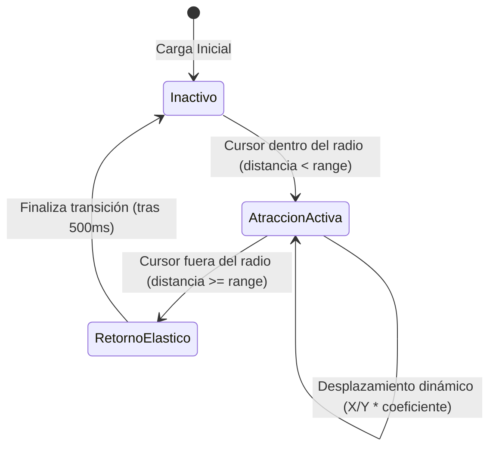

# Botón Magnético Reactivo (`MagneticButton`)

Componente de llamada a la acción (CTA) premium con atracción gravitacional hacia el cursor del ratón. Al aproximar el puntero dentro de un radio determinado, el botón y su contenido se desplazan suavemente siguiendo el cursor, creando una sensación de "succión" o magnetismo de alta fidelidad.

---

## 1. Propósito y Casos de Uso
- **Llamadas a la Acción de Alta Conversión:** Perfecto para botones de pago, adición al carrito o envío de formularios críticos donde se desea capturar la atención visual y mejorar el engagement táctil en escritorio.
- **Microinteracciones Premium:** Enriquece la experiencia del usuario con comportamientos físicos responsivos y dinámicos que se perciben sofisticados.

---

## 2. Especificación Visual y Estilos (Tailwind CSS)
- **Física de Atracción:** Desplazamiento independiente en dos capas (el botón exterior se desplaza más rápido, mientras que el texto/icono interno se desplaza con menor amplitud para un efecto parallax de profundidad).
- **Consumo HSL:** Utiliza la paleta de colores activa (`bg-[var(--color-primary)]` y `text-white` para el estado primario, o superficies translúcidas `bg-[var(--color-surface-2)]` con bordes).
- **Efectos de Transición:** Retornos elásticos mediante transiciones de transformación CSS personalizadas con curvas de aceleración Bezier (`transition-transform duration-500 cubic-bezier(0.25, 1, 0.5, 1)`).

---

## 3. Código React Completo

```jsx
import React, { useState, useRef, useEffect } from 'react';

export default function MagneticButton({
  children,
  onClick,
  className = '',
  range = 80, // Radio de atracción en píxeles
  attraction = 0.35, // Intensidad de la atracción (0 a 1)
  innerAttraction = 0.18, // Intensidad de atracción del contenido interno (efecto parallax)
  variant = 'primary' // 'primary' | 'secondary' | 'outline'
}) {
  const buttonRef = useRef(null);
  const [position, setPosition] = useState({ x: 0, y: 0 });
  const [innerPosition, setInnerPosition] = useState({ x: 0, y: 0 });
  const [isHovered, setIsHovered] = useState(false);

  useEffect(() => {
    const button = buttonRef.current;
    if (!button) return;

    const handleMouseMove = (e) => {
      const rect = button.getBoundingClientRect();
      // Encontrar el centro del botón
      const btnCenterX = rect.left + rect.width / 2;
      const btnCenterY = rect.top + rect.height / 2;

      // Distancia entre el cursor y el centro del botón
      const distanceX = e.clientX - btnCenterX;
      const distanceY = e.clientY - btnCenterY;
      const distance = Math.sqrt(distanceX * distanceX + distanceY * distanceY);

      if (distance < range) {
        setIsHovered(true);
        // Calcular el desplazamiento magnético
        const targetX = distanceX * attraction;
        const targetY = distanceY * attraction;
        const innerTargetX = distanceX * innerAttraction;
        const innerTargetY = distanceY * innerAttraction;

        setPosition({ x: targetX, y: targetY });
        setInnerPosition({ x: innerTargetX, y: innerTargetY });
      } else {
        if (isHovered) {
          handleMouseLeave();
        }
      }
    };

    const handleMouseLeave = () => {
      setIsHovered(false);
      setPosition({ x: 0, y: 0 });
      setInnerPosition({ x: 0, y: 0 });
    };

    window.addEventListener('mousemove', handleMouseMove);
    button.addEventListener('mouseleave', handleMouseLeave);

    return () => {
      window.removeEventListener('mousemove', handleMouseMove);
      button.removeEventListener('mouseleave', handleMouseLeave);
    };
  }, [range, attraction, innerAttraction, isHovered]);

  const variantClasses = {
    primary: 'bg-[var(--color-primary)] hover:bg-[var(--color-primary-hover)] text-white shadow-lg shadow-indigo-500/20 border-transparent',
    secondary: 'bg-[var(--color-surface-2)] text-[var(--color-text)] border-[var(--color-border)] hover:bg-[var(--color-border)]',
    outline: 'bg-transparent text-[var(--color-primary)] border-[var(--color-primary)] hover:bg-[var(--color-primary)]/10'
  }[variant] || 'bg-[var(--color-primary)] text-white';

  return (
    <button
      ref={buttonRef}
      onClick={onClick}
      style={{
        transform: `translate3d(${position.x}px, ${position.y}px, 0)`,
        transition: isHovered ? 'none' : 'transform 0.5s cubic-bezier(0.25, 1, 0.5, 1)'
      }}
      className={`relative inline-flex items-center justify-center px-6 py-3 rounded-2xl border text-xs font-black uppercase tracking-widest cursor-pointer select-none active:scale-95 will-change-transform ${variantClasses} ${className}`}
    >
      <span
        className="relative block pointer-events-none will-change-transform"
        style={{
          transform: `translate3d(${innerPosition.x}px, ${innerPosition.y}px, 0)`,
          transition: isHovered ? 'none' : 'transform 0.5s cubic-bezier(0.25, 1, 0.5, 1)'
        }}
      >
        {children}
      </span>
    </button>
  );
}
```

---

## 4. Lógica de Estado y Ciclo de Vida
1. **Detección Global de Ratón:** El hook registra un listener `mousemove` en el objeto global `window` para rastrear la cercanía incluso antes de ingresar físicamente al área del botón.
2. **Coordenadas Relativas:** Calcula dinámicamente la posición del centro del botón en el puerto de vista (`rect.left + rect.width / 2`) para admitir layouts responsivos y redimensionamientos de pantalla fluidos.
3. **Resorte de Retorno:** Al salir del rango de atracción (`range`), la transición CSS toma el relevo con curvas Bezier elásticas para centrar el elemento sin saltos visuales toscos.

---

## 5. Secuencia de Interacción (Flujo de Estados)


