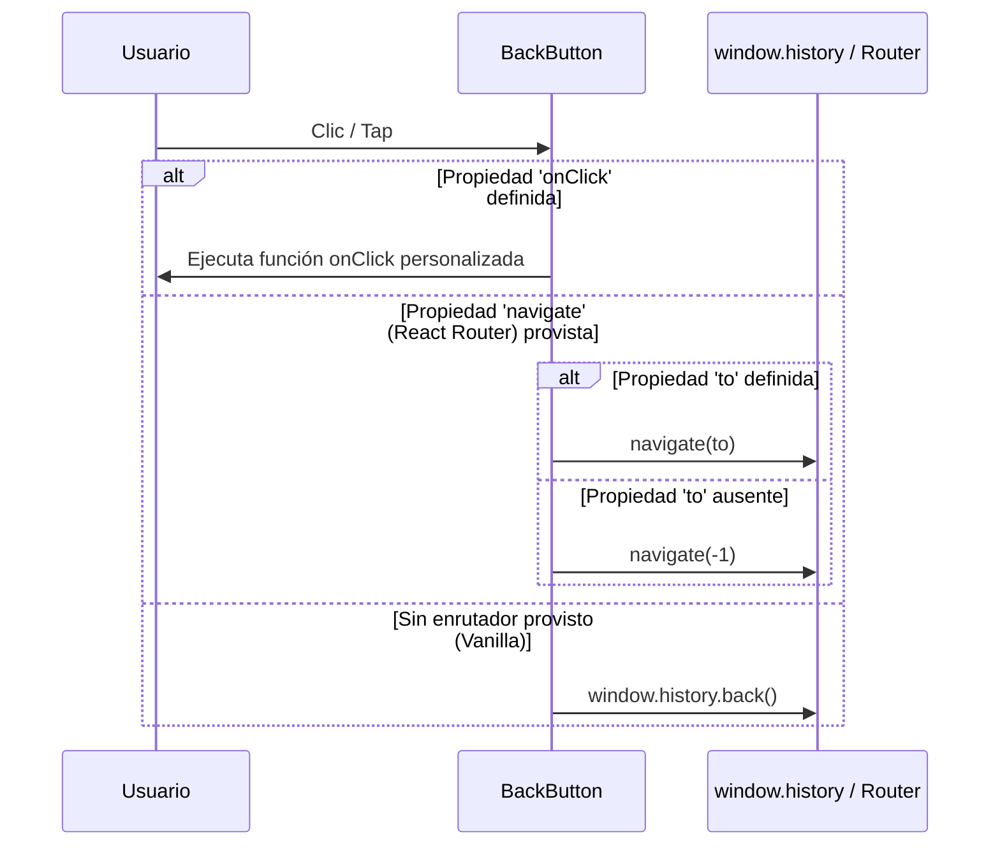

# Botón de Regreso (BackButton Component)

Componente atómico de navegación diseñado para estandarizar la acción de regresar a la pantalla anterior o navegar a una ruta definida de forma segura, garantizando transiciones de interfaz homogéneas y desacoplamiento absoluto de enrutadores o librerías de iconos.

---

## 1. Propósito y Casos de Uso
* **Estandarización visual:** Unifica la interfaz de botones de navegación hacia atrás en cabeceras de administración y flujos de cliente.
* **Flexibilidad de navegación:** Soporta de manera híbrida la navegación nativa mediante callbacks directos (`onClick`) para proyectos vanilla/Next.js/Remix, o retrocesos automáticos usando React Router si se le pasa la prop `navigate`.

---

## 2. Especificación Visual y Estilos
* **Contenedor Principal:**
  * Estructura: Botón circular con bordes redondeados y escala de pulsación activa.
  * Estilos de Fallback: Aplica un diseño estético por defecto con variables CSS estándar y sombreado suave, permitiendo una personalización total a través de la propiedad `className` o `style`.

---

## 3. Código React Completo y 100% Funcional
```jsx
import React from 'react';

/**
 * SVG Nativo de Flecha Izquierda (Evita dependencia obligatoria de Lucide/Heroicons)
 */
const DefaultArrowLeftIcon = ({ size }) => (
  <svg 
    xmlns="http://www.w3.org/2000/svg" 
    width={size} 
    height={size} 
    viewBox="0 0 24 24" 
    fill="none" 
    stroke="currentColor" 
    strokeWidth="2" 
    strokeLinecap="round" 
    strokeLinejoin="round"
  >
    <path d="m12 19-7-7 7-7M5 12h14"/>
  </svg>
);

/**
 * Componente atómico de navegación para ir atrás.
 * Totalmente desacoplado de dependencias de enrutamiento e íconos.
 */
export default function BackButton({ 
  to = null, 
  onClick = null,
  navigate = null,
  className = '',
  style = {},
  icon = null,
  size = 18
}) {
  
  const handleBack = (e) => {
    if (onClick) {
      onClick(e);
      return;
    }
    
    if (navigate) {
      if (to) {
        navigate(to);
      } else {
        navigate(-1);
      }
    } else {
      // Fallback a navegación de historial nativa del navegador
      window.history.back();
    }
  };

  const renderedIcon = icon || <DefaultArrowLeftIcon size={size} />;

  const defaultStyles = {
    width: '40px',
    height: '40px',
    borderRadius: '12px',
    backgroundColor: 'var(--color-surface, #ffffff)',
    border: '1px solid var(--color-border, rgba(229, 229, 229, 1))',
    color: 'var(--color-text, #171717)',
    display: 'flex',
    alignItems: 'center',
    justifyContent: 'center',
    cursor: 'pointer',
    transition: 'all 0.2s ease-in-out',
    boxShadow: '0 1px 2px 0 rgba(0, 0, 0, 0.05)',
    ...style
  };

  return (
    <button
      onClick={handleBack}
      style={className ? style : defaultStyles}
      className={`active:scale-95 hover:opacity-90 transition-transform ${className}`}
      aria-label="Regresar a la página anterior"
    >
      {renderedIcon}
    </button>
  );
}
```

---

## 4. Lógica de Estado y Ciclo de Vida
* **Desacoplado de Estado Global:** Componente puro y sin dependencias de Zustand o base de datos.
* **Control del Historial:** Si no se suministra un enrutador de framework (React Router, Next.js, etc.), utiliza el objeto global del navegador `window.history.back()` como mecanismo de retroceso seguro garantizando un funcionamiento inmediato tras importar.

---

## 5. Flujo Operativo y Secuencia de Interacción


---

## 6. Ejemplo de Uso (Importación y Consumo)
### Caso A: Uso en proyecto con React Router (`react-router-dom`)
```jsx
import React from 'react';
import { useNavigate } from 'react-router-dom';
import BackButton from './ui/BackButton';

export function Header() {
  const navigate = useNavigate();

  return (
    <div className="flex items-center gap-4">
      <BackButton navigate={navigate} />
      <h1>Detalles de Facturación</h1>
    </div>
  );
}
```

### Caso B: Redirección condicional con Next.js/Router manual
```jsx
import React from 'react';
import { useRouter } from 'next/router';
import BackButton from './ui/BackButton';

export function Navigation() {
  const router = useRouter();

  return (
    <BackButton 
      onClick={() => router.push('/dashboard')} 
      className="custom-btn-style"
    />
  );
}
```

---

## 7. Origen
* **Extraído de:** [BackButton.jsx](file:///D:/PROTOTIPE/App%20Ventas/src/components/ui/BackButton.jsx)
* **Fecha de extracción:** 2026-05-29
* **Versión:** 2.0 (Desacoplado de enrutadores rígidos e íconos externos).
