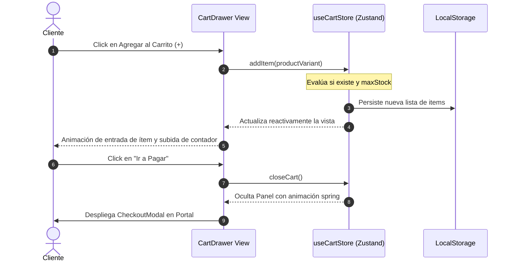

# Módulo de Carrito de Compras (`Cart_Completo`)

Este módulo proporciona un sistema integral de carrito de compras premium para aplicaciones de comercio electrónico. Se compone de un store global reactivo y persistente utilizando **Zustand** y un componente visual tipo panel deslizable lateral (**Drawer**) construido con **Tailwind CSS** y animado de manera fluida con **Framer Motion**.

---

## 1. Propósito y Casos de Uso

El módulo soluciona la gestión del estado temporal de compras del usuario de manera persistente, reactiva e intuitiva. 

### Casos de Uso:
* **Tiendas Minoristas y Mayoristas:** Agrupación dinámica de variantes (talla, color) del mismo producto físico con control estricto de topes de stock (`maxStock`).
* **Experiencia de Usuario Premium (UX):** Transición deslizante lateral acelerada por hardware, micro-animaciones en controles de cantidad y un estado vacío enriquecido que reactiva la navegación comercial.
* **Persistencia Local Automática:** Evita la pérdida del carrito en recargas accidentales o redirecciones de pago de pasarelas de terceros.

---

## 2. Especificación Visual y Estilos

El diseño visual está alineado con un estándar premium de marca blanca utilizando variables de entorno de color CSS y bordes suavizados:
* **Backdrop:** Fondo oscuro translúcido con efecto de desenfoque de fondo (`backdrop-blur-sm`) y transición suave de opacidad.
* **Drawer Panel:** Panel lateral derecho con sombra premium (`shadow-2xl`) y transiciones de muelle elástico (*spring physics*).
* **Controles de Cantidad:** Botones redondos táctiles interactivos con hover de color-mix y escala al presionar (`active:scale-95`).
* **Empty State:** Ilustración con micro-badge de pulso comercial que invita a explorar el catálogo.

### Variables CSS y Extensiones Tailwind Requeridas

> [!IMPORTANT]
> `CartDrawer` usa clases Tailwind **extendidas** que no existen en una instalación base de Tailwind. Sin ellas el componente se verá roto. Configura `tailwind.config.js` del proyecto destino con las extensiones indicadas.

**Variables CSS (definir en `:root`):**
```css
:root {
  /* Color primario de marca — reemplaza con el HSL de tu cliente */
  --color-primary-hsl: 262 83% 58%;
}
```

**Extensiones en `tailwind.config.js`:**
```js
theme: {
  extend: {
    colors: {
      // Color de acento de marca — soporta opacidad con /20, /10, etc.
      primary: ({ opacityValue }) =>
        opacityValue
          ? `hsl(var(--color-primary-hsl) / ${opacityValue})`
          : 'hsl(var(--color-primary-hsl))',
      'primary-hover': 'hsl(var(--color-primary-hsl) / 0.85)',
      neutral: {
        // Grises adicionales entre los estándar de Tailwind
        850: '#1c1c1c',  // entre neutral-800 (#262626) y neutral-900 (#171717)
      }
    }
  }
}
```

**Dependencias npm:**
```bash
npm install framer-motion  # AnimatePresence + motion.div
npm install zustand        # Para cartStore.js (persist middleware)
```

---

## 3. Código React Completo y 100% Funcional

### A. Store de Estado Global: `cartStore.js`
Este store maneja la persistencia en `localStorage` bajo la clave `cart-storage` y ofrece métodos computados limpios para totales.

```javascript
import { create } from 'zustand'
import { persist } from 'zustand/middleware'

/**
 * Store reactivo del carrito de compras.
 * Persiste en localStorage para resiliencia durante la navegación.
 */
export const useCartStore = create(
  persist(
    (set, get) => ({
      // ─── ESTADO ───────────────────────────────────────────────────────────
      items: [],          // [{ productId, variantId, nombre, precio, talla, color, imageUrl, cantidad, maxStock }]
      isOpen: false,      // Controla si el drawer lateral está desplegado

      // ─── ACCIONES ─────────────────────────────────────────────────────────
      /**
       * Agrega un producto con variante al carrito o incrementa su cantidad.
       * @param {object} item - Producto con variante seleccionada
       * @param {number} qtyToAdd - Cantidad a agregar (por defecto 1)
       */
      addItem: (item, qtyToAdd = 1) => set((state) => {
        const key = `${item.productId}-${item.variantId}`
        const existing = state.items.find(
          (i) => `${i.productId}-${i.variantId}` === key
        )
        
        const limit = item.maxStock ?? existing?.maxStock
        
        if (existing) {
          const newQty = limit !== undefined 
            ? Math.min(existing.cantidad + qtyToAdd, limit) 
            : existing.cantidad + qtyToAdd
          
          return {
            items: state.items.map((i) =>
              `${i.productId}-${i.variantId}` === key
                ? { ...i, cantidad: newQty }
                : i
            ),
          }
        }

        const newQty = limit !== undefined 
          ? Math.min(qtyToAdd, limit) 
          : qtyToAdd
        
        return { items: [...state.items, { ...item, cantidad: newQty }] }
      }),

      /**
       * Decrementa la cantidad de una variante. Si llega a 1 y se decrementa, se elimina.
       * @param {string} productId
       * @param {string} variantId
       */
      removeItem: (productId, variantId) => set((state) => {
        const key = `${productId}-${variantId}`
        const existing = state.items.find(
          (i) => `${i.productId}-${i.variantId}` === key
        )
        if (!existing) return state
        if (existing.cantidad === 1) {
          return { items: state.items.filter((i) => `${i.productId}-${i.variantId}` !== key) }
        }
        return {
          items: state.items.map((i) =>
            `${i.productId}-${i.variantId}` === key
              ? { ...i, cantidad: i.cantidad - 1 }
              : i
          ),
        }
      }),

      /**
       * Elimina por completo una variante del carrito (sin importar su cantidad).
       */
      deleteItem: (productId, variantId) => set((state) => ({
        items: state.items.filter(
          (i) => !(i.productId === productId && i.variantId === variantId)
        ),
      })),

      clearCart: () => set({ items: [] }),
      openCart: () => set({ isOpen: true }),
      closeCart: () => set({ isOpen: false }),

      // ─── MÉTODOS COMPUTADOS (SELECTORES) ──────────────────────────────────
      /**
       * Calcula el precio total sumado de todos los artículos.
       */
      getTotal: () => {
        const { items } = get()
        return items.reduce((sum, i) => sum + i.precio * i.cantidad, 0)
      },

      /**
       * Retorna el número de artículos individuales en el carrito.
       */
      getCount: () => {
        const { items } = get()
        return items.reduce((sum, i) => sum + i.cantidad, 0)
      },
    }),
    { name: 'cart-storage' }
  )
)
```

### B. Componente Visual Premium: `CartDrawer.jsx`
Implementación portable con íconos inyectables como props y SVG fallbacks nativos. No requiere `lucide-react`.

```jsx
import React from 'react'
import { motion, AnimatePresence } from 'framer-motion'

// ─── Íconos SVG inline (fallbacks portables — no requieren lucide-react) ─────
const _IconX = ({ size = 18 }) => (
  <svg width={size} height={size} viewBox="0 0 24 24" fill="none" stroke="currentColor" strokeWidth={2.5} strokeLinecap="round" strokeLinejoin="round">
    <line x1="18" y1="6" x2="6" y2="18"/><line x1="6" y1="6" x2="18" y2="18"/>
  </svg>
)
const _IconTrash = ({ size = 15 }) => (
  <svg width={size} height={size} viewBox="0 0 24 24" fill="none" stroke="currentColor" strokeWidth={2} strokeLinecap="round" strokeLinejoin="round">
    <polyline points="3 6 5 6 21 6"/><path d="M19 6l-1 14H6L5 6"/>
    <path d="M10 11v6M14 11v6M9 6V4h6v2"/>
  </svg>
)
const _IconBag = ({ size = 24 }) => (
  <svg width={size} height={size} viewBox="0 0 24 24" fill="none" stroke="currentColor" strokeWidth={2} strokeLinecap="round" strokeLinejoin="round">
    <path d="M6 2L3 6v14a2 2 0 002 2h14a2 2 0 002-2V6l-3-4z"/>
    <line x1="3" y1="6" x2="21" y2="6"/><path d="M16 10a4 4 0 01-8 0"/>
  </svg>
)
const _IconArrow = ({ size = 16 }) => (
  <svg width={size} height={size} viewBox="0 0 24 24" fill="none" stroke="currentColor" strokeWidth={2} strokeLinecap="round" strokeLinejoin="round">
    <line x1="5" y1="12" x2="19" y2="12"/><polyline points="12 5 19 12 12 19"/>
  </svg>
)
const _IconMinus = ({ size = 12 }) => (
  <svg width={size} height={size} viewBox="0 0 24 24" fill="none" stroke="currentColor" strokeWidth={2.5} strokeLinecap="round">
    <line x1="5" y1="12" x2="19" y2="12"/>
  </svg>
)
const _IconPlus = ({ size = 12 }) => (
  <svg width={size} height={size} viewBox="0 0 24 24" fill="none" stroke="currentColor" strokeWidth={2.5} strokeLinecap="round">
    <line x1="12" y1="5" x2="12" y2="19"/><line x1="5" y1="12" x2="19" y2="12"/>
  </svg>
)
const _IconStar = ({ size = 14 }) => (
  <svg width={size} height={size} viewBox="0 0 24 24" fill="currentColor">
    <path d="M12 2l2.09 6.41H21l-5.55 4.03 2.09 6.41L12 14.9l-5.55 3.95 2.09-6.41L3 8.41h6.91z"/>
  </svg>
)

export default function CartDrawer({ 
  isOpen, 
  onClose, 
  items, 
  onAddItem, 
  onRemoveItem, 
  onDeleteItem, 
  total, 
  onCheckout,
  onContinueShopping,
  formatCurrency = (value) => `$${value.toLocaleString()}`,
  // ─── Íconos inyectables (opcional) ────────────────────────────────────────
  // Pasa componentes de cualquier librería: { close: <XIcon/>, trash: <TrashIcon/>, ... }
  // Si no se pasan, se usan los SVG inline de arriba.
  icons = {}
}) {
  const IClose = icons.close ?? <_IconX size={18} />
  const ITrash = icons.trash ?? <_IconTrash size={15} />
  const IBag   = icons.bag   ?? <_IconBag size={28} />
  const IBagSm = icons.bagSm ?? <_IconBag size={18} />
  const IArrow = icons.arrow ?? <_IconArrow size={16} />
  const IMinus = icons.minus ?? <_IconMinus size={12} />
  const IPlus  = icons.plus  ?? <_IconPlus size={12} />
  const IStar  = icons.star  ?? <_IconStar size={14} />
  return (
    <AnimatePresence>
      {isOpen && (
        <div className="fixed inset-0 z-50 flex justify-end overflow-hidden">
          {/* Backdrop Translúcido con Blur */}
          <motion.div
            initial={{ opacity: 0 }}
            animate={{ opacity: 1 }}
            exit={{ opacity: 0 }}
            transition={{ duration: 0.2 }}
            onClick={onClose}
            className="absolute inset-0 bg-black/40 backdrop-blur-sm"
          />

          {/* Drawer Lateral */}
          <motion.div
            initial={{ x: '100%' }}
            animate={{ x: 0 }}
            exit={{ x: '100%' }}
            transition={{ type: 'spring', damping: 28, stiffness: 280 }}
            className="relative z-10 w-full max-w-md h-full bg-neutral-900 border-l border-neutral-800 shadow-2xl flex flex-col"
          >
            {/* Cabecera */}
            <div className="p-5 border-b border-neutral-800 flex items-center justify-between">
              <div className="flex items-center gap-2.5">
                <div className="w-9 h-9 rounded-xl bg-primary/10 flex items-center justify-center text-primary">
                  {IBagSm}
                </div>
                <div>
                  <h2 className="text-base font-bold text-white leading-none">Mi Carrito</h2>
                  <p className="text-xs text-neutral-400 mt-1">
                    {items.length} {items.length === 1 ? 'ítem seleccionado' : 'ítems seleccionados'}
                  </p>
                </div>
              </div>
              <button 
                onClick={onClose}
                className="w-8 h-8 rounded-lg hover:bg-neutral-800 flex items-center justify-center text-neutral-400 hover:text-white transition-colors"
              >
                {IClose}
              </button>
            </div>

            {/* Listado de Productos */}
            <div className="flex-1 overflow-y-auto p-5 space-y-4">
              {items.length === 0 ? (
                /* Estado Vacío Premium Interactiva */
                <div className="h-full flex flex-col items-center justify-center text-center p-6 select-none">
                  <div className="relative mb-4">
                    <div className="w-16 h-16 rounded-full bg-neutral-800 flex items-center justify-center text-neutral-500">
                      {IBag}
                    </div>
                    {/* Badge animado de pulso */}
                    <span className="absolute top-0 right-0 flex h-3.5 w-3.5">
                      <span className="animate-ping absolute inline-flex h-full w-full rounded-full bg-primary opacity-75"></span>
                      <span className="relative inline-flex rounded-full h-3.5 w-3.5 bg-primary"></span>
                    </span>
                  </div>
                  <h3 className="text-base font-semibold text-white">Tu carrito está vacío</h3>
                  <p className="text-xs text-neutral-400 max-w-xs mt-1.5 leading-relaxed">
                    ¡Explora nuestro catálogo y agrega tus productos favoritos de temporada!
                  </p>
                  <button
                    onClick={onContinueShopping}
                    className="mt-6 px-5 py-2.5 bg-neutral-800 hover:bg-neutral-700 text-white rounded-xl text-xs font-bold transition-all active:scale-95 flex items-center gap-1.5 border border-neutral-700"
                  >
                    <span className="text-yellow-400 animate-pulse">{IStar}</span>
                    Explorar Catálogo
                  </button>
                </div>
              ) : (
                /* Contenedor de Items */
                items.map((item) => {
                  const key = `${item.productId}-${item.variantId}`
                  const limitReached = item.maxStock !== undefined && item.cantidad >= item.maxStock

                  return (
                    <motion.div
                      key={key}
                      layout
                      initial={{ opacity: 0, y: 10 }}
                      animate={{ opacity: 1, y: 0 }}
                      exit={{ opacity: 0, x: 20 }}
                      className="p-3 bg-neutral-800/40 border border-neutral-800 rounded-2xl flex gap-3 relative group"
                    >
                      {/* Imagen con fallback */}
                      <div className="w-20 h-20 rounded-xl bg-neutral-800 overflow-hidden flex-shrink-0 relative border border-neutral-700/50">
                        {item.imageUrl ? (
                          
                        ) : (
                          <div className="w-full h-full flex items-center justify-center text-neutral-600 bg-neutral-800">
                            <_IconBag size={24} />
                          </div>
                        )}
                      </div>

                      {/* Información */}
                      <div className="flex-1 flex flex-col min-w-0">
                        <div className="flex items-start justify-between gap-1">
                          <h4 className="text-sm font-bold text-white truncate max-w-[180px]" title={item.nombre}>
                            {item.nombre}
                          </h4>
                          <button
                            onClick={() => onDeleteItem(item.productId, item.variantId)}
                            className="text-neutral-500 hover:text-red-400 p-1 rounded transition-colors"
                            title="Eliminar del carrito"
                          >
                            {ITrash}
                          </button>
                        </div>

                        {/* Atributos / Variantes Dinámicas */}
                        <div className="flex flex-wrap gap-1.5 mt-1">
                          {item.atributos && Object.entries(item.atributos).length > 0 ? (
                            Object.entries(item.atributos).map(([key, val]) => (
                              <span key={key} className="px-2 py-0.5 rounded-md bg-neutral-800 text-[10px] font-bold text-neutral-300 border border-neutral-700/50">
                                {key}: {val}
                              </span>
                            ))
                          ) : (
                            [item.talla, item.color].filter(Boolean).map((val, idx) => (
                              <span key={idx} className="px-2 py-0.5 rounded-md bg-neutral-800 text-[10px] font-bold text-neutral-300 border border-neutral-700/50">
                                {val}
                              </span>
                            ))
                          )}
                        </div>

                        {/* Controles de cantidad y precio */}
                        <div className="flex items-center justify-between mt-auto pt-2">
                          <div className="flex items-center gap-1.5 bg-neutral-900 border border-neutral-800 rounded-xl p-1">
                            <button
                              onClick={() => onRemoveItem(item.productId, item.variantId)}
                              className="w-6 h-6 rounded-lg bg-neutral-800 text-neutral-400 hover:text-white flex items-center justify-center hover:bg-neutral-700 active:scale-90 transition-all border border-neutral-700/35"
                            >
                              {IMinus}
                            </button>
                            <span className="text-xs font-bold text-white w-5 text-center select-none">
                              {item.cantidad}
                            </span>
                            <button
                              onClick={() => onAddItem(item, 1)}
                              disabled={limitReached}
                              className={`w-6 h-6 rounded-lg flex items-center justify-center transition-all border border-neutral-700/35 ${
                                limitReached 
                                  ? 'bg-neutral-800 text-neutral-600 cursor-not-allowed' 
                                  : 'bg-neutral-800 text-neutral-400 hover:text-white hover:bg-neutral-700 active:scale-90'
                              }`}
                              title={limitReached ? 'Stock máximo alcanzado' : 'Incrementar cantidad'}
                            >
                              {IPlus}
                            </button>
                          </div>
                          
                          <span className="text-sm font-black text-primary">
                            {formatCurrency(item.precio * item.cantidad)}
                          </span>
                        </div>
                      </div>
                    </motion.div>
                  );
                })
              )}
            </div>

            {/* Footer con Resumen */}
            {items.length > 0 && (
              <div className="p-5 border-t border-neutral-800 bg-neutral-900 z-10">
                <div className="flex items-center justify-between mb-4">
                  <span className="text-xs font-semibold text-neutral-400">Total Estimado</span>
                  <span className="text-xl font-black text-primary">{formatCurrency(total)}</span>
                </div>

                <div className="space-y-2">
                  <button
                    onClick={onCheckout}
                    className="w-full h-12 bg-primary text-white hover:bg-primary-hover active:scale-95 transition-all rounded-xl font-bold text-sm flex items-center justify-center gap-1.5 shadow-lg shadow-primary/20"
                  >
                    Ir a Pagar
                    {IArrow}
                  </button>
                  
                  <button
                    onClick={onClose}
                    className="w-full h-10 bg-transparent text-neutral-400 hover:text-white rounded-xl text-xs font-semibold transition-colors active:scale-95"
                  >
                    Seguir comprando
                  </button>
                </div>
              </div>
            )}
          </motion.div>
        </div>
      )}
    </AnimatePresence>
  );
}
```

---

## 4. Lógica de Estado y Ciclo de Vida

El estado reactivo se acopla limpiamente mediante las acciones de Zustand:

1. **Inicialización:** Al montarse el store por primera vez, recupera las variantes y cantidades guardadas en `localStorage` bajo `cart-storage`.
2. **Control de Stock Mínimo/Máximo:** La acción `addItem` compara la cantidad acumulada contra la propiedad `maxStock` provista por la variante del producto físico. Si se alcanza el tope de inventario, se bloquea visualmente el botón `+`.
3. **Agrupación Unicidad:** Cada artículo se identifica con la clave compuesta `${productId}-${variantId}`. Esto permite almacenar de forma separada camisas rojas talla M y camisas rojas talla L del mismo modelo.
4. **Desmontado:** Las suscripciones de Framer Motion se limpian automáticamente al cerrarse el drawer, evitando fugas de memoria en renders subsiguientes.

---

## 5. Flujo Operativo e Interacción

El siguiente diagrama detalla la interacción entre el Cliente, la Interfaz del Drawer, el Store de Zustand y el LocalStorage:



---

## 6. Origen en la Aplicación

Los componentes de esta especificación se extrajeron y mejoraron a partir de los archivos de origen de la aplicación de producción:
* **Zustand Store original:** [`cartStore.js`](file:///d:/Aplicaciones/App%20Ventas/src/store/cartStore.js) (Líneas 1-100)
* **Drawer visual original:** [`CartDrawer.jsx`](file:///d:/Aplicaciones/App%20Ventas/src/components/client/cart/CartDrawer.jsx) (Líneas 1-201)
