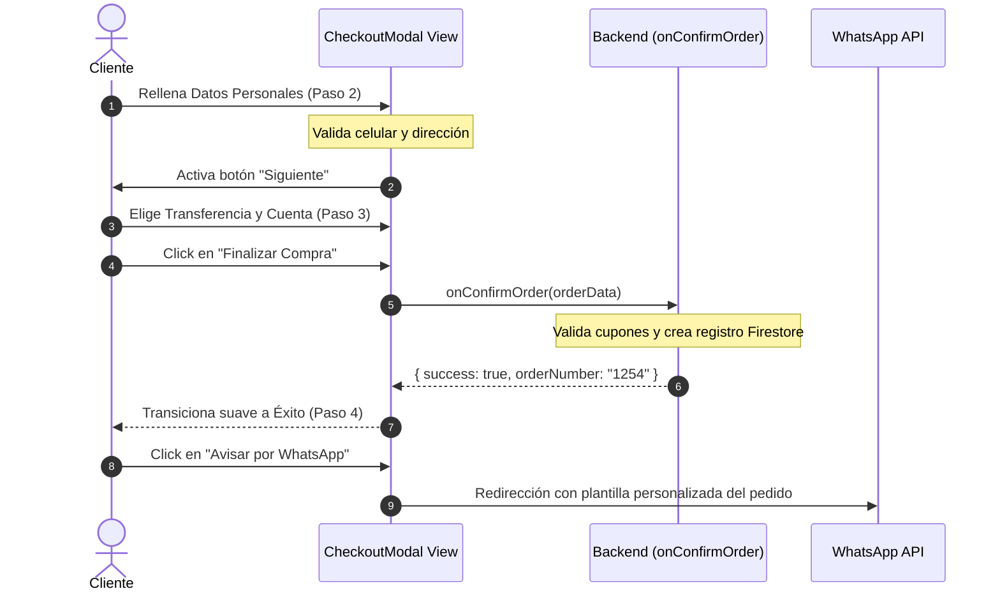

<!--
{
  "technicalName": "Checkout_Modal",
  "targetPath": "src/components/ui/Checkout_Modal.jsx",
  "dependencies": {
    "npm": {},
    "internal": []
  }
}
-->

# Modal de Checkout Multipaso (`Checkout_Modal`)

Este módulo proporciona una interfaz de pago y formalización de pedidos tipo "wizard" multipaso de alta fidelidad. Es ideal para aplicaciones de marca blanca y comercio electrónico móvil (mobile-first), encapsulando la navegación por pasos, validación dinámica de datos de entrega y cálculo de subtotales con cupones.

---

## 1. Propósito y Casos de Uso

El módulo gestiona la fase final de conversión comercial de la aplicación, guiando al usuario por un embudo de 4 pasos claros sin sobrecargar la pantalla.

### Casos de Uso:
* **Flujo Multipaso Dirigido (Wizard):** Divide el registro de información en (1) Método de entrega, (2) Información de contacto y dirección, (3) Método de pago, y (4) Pantalla de éxito.
* **Feature Flags de Opciones de Pago:** Oculta reactivamente la opción de fiado/crédito si los créditos están deshabilitados globalmente.
* **Integración Omnicanal (WhatsApp):** Automatiza la redacción y apertura de un mensaje estructurado y amigable hacia el chat del negocio para confirmar el pedido.
* **Gestión Flexible de Envíos:** Soporta retiro en local físico, despacho a domicilio con costo dinámico y entregas virtuales.

---

## 2. Especificación Visual y Estilos

El diseño visual aprovecha el componente maestro de modales de la biblioteca e incorpora los siguientes refinamientos:
* **Stepper Indicador de Progreso:** Línea visual interactiva en la parte superior que cambia de color y escala al avanzar o retroceder de paso.
* **Validación de Errores Visuales:** Campos de entrada con bordes rojos y alertas inline si no cumplen con las validaciones requeridas de tipo o longitud.
* **Botones Táctiles Premium:** Animación activa de escala (`active:scale-95`) y sombreado pulsante sobre el botón de acción principal ("Finalizar Compra").

### Variables CSS y Extensiones Tailwind Requeridas

> [!IMPORTANT]
> `CheckoutModal` usa `bg-action` (botón Finalizar Compra) y `bg-neutral-850` (fondos de opciones) que **no existen en Tailwind base**. Sin ellas la UI del paso 3 se ve rota.

**Variables CSS (`:root`):**
```css
:root {
  --color-primary-hsl: 262 83% 58%; /* Color primario de marca */
  --color-action-hsl: 142 76% 36%;  /* Color de acción/CTA (verde en App Ventas) */
}
```

**`tailwind.config.js`:**
```js
theme: {
  extend: {
    colors: {
      primary: ({ opacityValue }) =>
        opacityValue ? `hsl(var(--color-primary-hsl) / ${opacityValue})` : 'hsl(var(--color-primary-hsl))',
      'primary-hover': 'hsl(var(--color-primary-hsl) / 0.85)',
      // Color de acción (botón Finalizar Compra)
      action: ({ opacityValue }) =>
        opacityValue ? `hsl(var(--color-action-hsl) / ${opacityValue})` : 'hsl(var(--color-action-hsl))',
      neutral: {
        450: '#737373', // entre 400 y 500
        850: '#1c1c1c', // entre 800 y 900
      }
    }
  }
}
```

**Dependencias:** `npm install framer-motion`

---

## 3. Código React Completo y 100% Funcional

### Componente Visual: `CheckoutModal.jsx`
Implementación 100% portable y parametrizada con control de estado interno.

```jsx
import React, { useState, useEffect } from 'react'
import { motion, AnimatePresence } from 'framer-motion'

// ─── Íconos SVG inline (fallbacks portables — no requieren lucide-react) ─────
const _IconX         = ({ size = 18 }) => <svg width={size} height={size} viewBox="0 0 24 24" fill="none" stroke="currentColor" strokeWidth={2.5} strokeLinecap="round" strokeLinejoin="round"><line x1="18" y1="6" x2="6" y2="18"/><line x1="6" y1="6" x2="18" y2="18"/></svg>
const _IconMapPin    = ({ size = 16 }) => <svg width={size} height={size} viewBox="0 0 24 24" fill="none" stroke="currentColor" strokeWidth={2} strokeLinecap="round" strokeLinejoin="round"><path d="M21 10c0 7-9 13-9 13S3 17 3 10a9 9 0 0118 0z"/><circle cx="12" cy="10" r="3"/></svg>
const _IconCard      = ({ size = 16 }) => <svg width={size} height={size} viewBox="0 0 24 24" fill="none" stroke="currentColor" strokeWidth={2} strokeLinecap="round" strokeLinejoin="round"><rect x="1" y="4" width="22" height="16" rx="2"/><line x1="1" y1="10" x2="23" y2="10"/></svg>
const _IconCircleOk  = ({ size = 36 }) => <svg width={size} height={size} viewBox="0 0 24 24" fill="none" stroke="currentColor" strokeWidth={2} strokeLinecap="round" strokeLinejoin="round"><path d="M22 11.08V12a10 10 0 11-5.93-9.14"/><polyline points="22 4 12 14.01 9 11.01"/></svg>
const _IconChevronR  = ({ size = 14 }) => <svg width={size} height={size} viewBox="0 0 24 24" fill="none" stroke="currentColor" strokeWidth={2.5} strokeLinecap="round" strokeLinejoin="round"><polyline points="9 18 15 12 9 6"/></svg>
const _IconStore     = ({ size = 20 }) => <svg width={size} height={size} viewBox="0 0 24 24" fill="none" stroke="currentColor" strokeWidth={2} strokeLinecap="round" strokeLinejoin="round"><path d="M3 9l9-7 9 7v11a2 2 0 01-2 2H5a2 2 0 01-2-2z"/><polyline points="9 22 9 12 15 12 15 22"/></svg>
const _IconTruck     = ({ size = 20 }) => <svg width={size} height={size} viewBox="0 0 24 24" fill="none" stroke="currentColor" strokeWidth={2} strokeLinecap="round" strokeLinejoin="round"><rect x="1" y="3" width="15" height="13"/><polygon points="16 8 20 8 23 11 23 16 16 16 16 8"/><circle cx="5.5" cy="18.5" r="2.5"/><circle cx="18.5" cy="18.5" r="2.5"/></svg>
const _IconUser      = ({ size = 16 }) => <svg width={size} height={size} viewBox="0 0 24 24" fill="none" stroke="currentColor" strokeWidth={2} strokeLinecap="round" strokeLinejoin="round"><path d="M20 21v-2a4 4 0 00-4-4H8a4 4 0 00-4 4v2"/><circle cx="12" cy="7" r="4"/></svg>
const _IconPhone     = ({ size = 16 }) => <svg width={size} height={size} viewBox="0 0 24 24" fill="none" stroke="currentColor" strokeWidth={2} strokeLinecap="round" strokeLinejoin="round"><path d="M22 16.92v3a2 2 0 01-2.18 2 19.79 19.79 0 01-8.63-3.07A19.5 19.5 0 013.07 9.8 19.79 19.79 0 01.01 1.22 2 2 0 012 0h3a2 2 0 012 1.72c.127.96.361 1.903.7 2.81a2 2 0 01-.45 2.11L6.91 7.91a16 16 0 006.16 6.16l1.27-.73a2 2 0 012.11-.45c.907.339 1.85.573 2.81.7A2 2 0 0122 16.92z"/></svg>
const _IconTag       = ({ size = 16 }) => <svg width={size} height={size} viewBox="0 0 24 24" fill="none" stroke="currentColor" strokeWidth={2} strokeLinecap="round" strokeLinejoin="round"><path d="M20.59 13.41l-7.17 7.17a2 2 0 01-2.83 0L2 12V2h10l8.59 8.59a2 2 0 010 2.82z"/><line x1="7" y1="7" x2="7.01" y2="7"/></svg>
const _IconCheck     = ({ size = 10 }) => <svg width={size} height={size} viewBox="0 0 24 24" fill="none" stroke="currentColor" strokeWidth={3} strokeLinecap="round" strokeLinejoin="round"><polyline points="20 6 9 17 4 12"/></svg>
const _IconAlert     = ({ size = 10 }) => <svg width={size} height={size} viewBox="0 0 24 24" fill="none" stroke="currentColor" strokeWidth={2} strokeLinecap="round" strokeLinejoin="round"><circle cx="12" cy="12" r="10"/><line x1="12" y1="8" x2="12" y2="12"/><line x1="12" y1="16" x2="12.01" y2="16"/></svg>

// Constantes estándar de métodos de pago
export const PAYMENT_METHODS = {
  CASH: 'efectivo',
  TRANSFER: 'transferencia',
  CREDIT: 'credito'
}

export default function CheckoutModal({
  isOpen,
  onClose,
  items = [],
  totalPrice = 0,
  creditsEnabled = true,
  bankAccounts = [],
  deliverySettings = {
    pickup: { enabled: true, address: 'Local Principal' },
    shipping: { enabled: true, cost: 2000 }
  },
  onConfirmOrder,  // async ({ orderData }) => Promise<{ success, orderNumber, trackingToken }>
  onRedirectToWhatsApp, // ({ orderNumber, message }) => void
  // Validador de cupón inyectable
  onValidateCoupon = null,
  formatCurrency = (value) => `$${value.toLocaleString()}`,
  icons = {}
}) {
  const IClose    = icons.close    ?? <_IconX size={18} />
  const IMapPin   = icons.mapPin   ?? <_IconMapPin size={16} />
  const ICard     = icons.card     ?? <_IconCard size={16} />
  const ICircleOk = icons.circleOk ?? <_IconCircleOk size={36} />
  const IChevronR = icons.chevronR ?? <_IconChevronR size={14} />
  const IStore    = icons.store    ?? <_IconStore size={20} />
  const ITruck    = icons.truck    ?? <_IconTruck size={20} />
  const IUser     = icons.user     ?? <_IconUser size={16} />
  const IPhone    = icons.phone    ?? <_IconPhone size={16} />
  const ITag      = icons.tag      ?? <_IconTag size={16} />
  const ICheck    = icons.check    ?? <_IconCheck size={10} />
  const IAlert    = icons.alert    ?? <_IconAlert size={10} />
  
  // ESTADOS LOCALES
  const [step, setStep] = useState(1)
  const [isPending, setIsPending] = useState(false)
  const [isCouponLoading, setIsCouponLoading] = useState(false)
  const [orderNumber, setOrderNumber] = useState('')
  const [trackingToken, setTrackingToken] = useState('')
  const [errors, setErrors] = useState({})
  
  // Datos del formulario
  const [formData, setFormData] = useState({
    tipoEntrega: 'domicilio',
    nombre: '',
    celular: '',
    direccion: '',
    barrio: '',
    metodoPago: '',
    cuentaBancoId: '',
    cuponCodigo: '',
    descuentoAplicado: 0
  })

  // LOGICA DE COSTOS Y TOTALES
  const getShippingCost = () => {
    if (formData.tipoEntrega === 'domicilio' && deliverySettings.shipping?.enabled) {
      return deliverySettings.shipping.cost || 0
    }
    return 0
  }

  const getFinalTotal = () => {
    return Math.max(0, totalPrice - formData.descuentoAplicado + getShippingCost())
  }

  // VALIDACIONES
  const validateStep = (currentStep) => {
    const newErrors = {}
    if (currentStep === 1) {
      if (!formData.tipoEntrega) newErrors.tipoEntrega = 'Debe seleccionar un método de entrega'
    }
    if (currentStep === 2) {
      if (!formData.nombre.trim()) newErrors.nombre = 'El nombre es obligatorio'
      if (!formData.celular.trim()) {
        newErrors.celular = 'El celular es obligatorio'
      } else if (formData.celular.replace(/\D/g, '').length < 8) {
        newErrors.celular = 'Número celular no válido'
      }
      if (formData.tipoEntrega === 'domicilio' && !formData.direccion.trim()) {
        newErrors.direccion = 'La dirección es obligatoria'
      }
    }
    if (currentStep === 3) {
      if (!formData.metodoPago) newErrors.metodoPago = 'Debe seleccionar un método de pago'
      if (formData.metodoPago === PAYMENT_METHODS.TRANSFER && !formData.cuentaBancoId && bankAccounts.length > 1) {
        newErrors.cuentaBancoId = 'Debe seleccionar una cuenta bancaria'
      }
    }
    setErrors(newErrors)
    return Object.keys(newErrors).length === 0
  }

  const handleNext = () => {
    if (validateStep(step)) {
      setStep((prev) => prev + 1)
    }
  }

  const handleBack = () => {
    setStep((prev) => Math.max(1, prev - 1))
  }

  // CONFIRMACIÓN DEL PEDIDO
  const handleCheckout = async () => {
    if (!validateStep(3)) return
    
    setIsPending(true)
    try {
      const orderData = {
        items,
        subtotal: totalPrice,
        costoEnvio: getShippingCost(),
        descuento: formData.descuentoAplicado,
        total: getFinalTotal(),
        cliente: {
          nombre: formData.nombre,
          celular: formData.celular,
          direccion: formData.direccion,
          barrio: formData.barrio
        },
        entrega: formData.tipoEntrega,
        metodoPago: formData.metodoPago,
        cuentaBancoId: formData.cuentaBancoId,
        cupon: formData.cuponCodigo || null
      }

      const result = await onConfirmOrder(orderData)
      if (result && result.success) {
        setOrderNumber(result.orderNumber)
        setTrackingToken(result.trackingToken || '')
        setStep(4)
      }
    } catch (err) {
      console.error('Error al procesar el pedido:', err)
      setErrors({ global: 'Ocurrió un error inesperado al enviar el pedido.' })
    } finally {
      setIsPending(false)
    }
  }

  // VALIDACIÓN Y APLICACIÓN DE CUPÓN
  const handleApplyCoupon = async () => {
    if (!formData.cuponCodigo.trim() || !onValidateCoupon) return
    setIsCouponLoading(true)
    try {
      const result = await onValidateCoupon(formData.cuponCodigo.trim(), totalPrice)
      if (result.valid) {
        setFormData(prev => ({ ...prev, descuentoAplicado: result.discount }))
        setErrors(prev => ({ ...prev, cupon: null }))
      } else {
        setErrors(prev => ({ ...prev, cupon: result.error || 'Cupón no válido' }))
      }
    } catch {
      setErrors(prev => ({ ...prev, cupon: 'Error al validar el cupón.' }))
    } finally {
      setIsCouponLoading(false)
    }
  }

  const handleWhatsAppNotify = () => {
    const selectedBank = bankAccounts.find(a => a.id === formData.cuentaBancoId) || bankAccounts[0]
    let message = `*NUEVO PEDIDO #${orderNumber}*\n`
    message += `*Cliente:* ${formData.nombre}\n`
    message += `*Celular:* ${formData.celular}\n`
    message += `*Entrega:* ${formData.tipoEntrega === 'domicilio' ? `Domicilio (${formData.direccion})` : 'Retiro en Local'}\n`
    message += `*Método de Pago:* ${formData.metodoPago === PAYMENT_METHODS.CASH ? 'Efectivo' : formData.metodoPago === PAYMENT_METHODS.TRANSFER ? 'Transferencia' : 'Crédito'}\n`
    if (formData.metodoPago === PAYMENT_METHODS.TRANSFER && selectedBank) {
      message += `*Banco Destino:* ${selectedBank.banco} (Ahorros - ${selectedBank.numeroCuenta})\n`
    }
    message += `-------------------------\n`
    items.forEach(i => {
      // Formateo dinámico y agnóstico de atributos/variantes (sin asumir talla/color fijos)
      const attrs = i.atributos 
        ? Object.entries(i.atributos).map(([k, v]) => `${k}: ${v}`).join(', ') 
        : [i.talla, i.color].filter(Boolean).join(', ')
      message += `- ${i.cantidad}x ${i.nombre} ${attrs ? `[${attrs}]` : ''} [${formatCurrency(i.precio)} c/u]\n`
    })
    message += `-------------------------\n`
    message += `*Total a Pagar:* ${formatCurrency(getFinalTotal())}\n`
    
    onRedirectToWhatsApp({ orderNumber, message })
  }

  useEffect(() => {
    if (!isOpen) {
      setStep(1)
      setFormData({
        tipoEntrega: 'domicilio',
        nombre: '',
        celular: '',
        direccion: '',
        barrio: '',
        metodoPago: '',
        cuentaBancoId: '',
        cuponCodigo: '',
        descuentoAplicado: 0
      })
      setErrors({})
    }
  }, [isOpen])

  if (!isOpen) return null

  return (
    <div className="fixed inset-0 z-50 flex items-center justify-center p-4">
      <div className="absolute inset-0 bg-black/60 backdrop-blur-sm" onClick={onClose} />
      <div className="relative z-10 w-full max-w-lg bg-neutral-900 border border-neutral-800 rounded-3xl overflow-hidden shadow-2xl flex flex-col max-h-[90vh]">
        {step < 4 && (
          <div className="p-5 border-b border-neutral-800 flex items-center justify-between">
            <div>
              <h2 className="text-base font-bold text-white leading-none">Proceso de Pago</h2>
              <div className="flex items-center gap-1.5 mt-2.5">
                {[1, 2, 3].map((s) => (
                  <div key={s} className="flex items-center">
                    <div 
                      className={`w-5 h-5 rounded-full flex items-center justify-center text-[10px] font-bold transition-all duration-300 ${
                        step === s 
                          ? 'bg-primary text-white scale-110 shadow shadow-primary' 
                          : step > s 
                            ? 'bg-emerald-500 text-white' 
                            : 'bg-neutral-800 text-neutral-400'
                      }`}
                    >
                      {step > s ? ICheck : s}
                    </div>
                    {s < 3 && <div className={`w-8 h-0.5 transition-colors duration-300 ${step > s ? 'bg-emerald-500' : 'bg-neutral-800'}`} />}
                  </div>
                ))}
              </div>
            </div>
            <button onClick={onClose} className="w-8 h-8 rounded-lg hover:bg-neutral-800 flex items-center justify-center text-neutral-400 hover:text-white transition-colors">
              {IClose}
            </button>
          </div>
        )}

        <div className="flex-1 overflow-y-auto p-6">
          <AnimatePresence mode="wait">
            {step === 1 && (
              <motion.div key="step1" initial={{ opacity: 0, x: 20 }} animate={{ opacity: 1, x: 0 }} exit={{ opacity: 0, x: -20 }} className="space-y-4">
                <h3 className="text-sm font-semibold text-white">¿Cómo deseas recibir tu compra?</h3>
                <div className="grid grid-cols-1 gap-3">
                  {deliverySettings.shipping?.enabled && (
                    <div onClick={() => setFormData({ ...formData, tipoEntrega: 'domicilio' })} className={`p-4 rounded-2xl border-2 flex items-center gap-4 cursor-pointer transition-all ${formData.tipoEntrega === 'domicilio' ? 'border-primary bg-primary/5' : 'border-neutral-850 bg-neutral-850 hover:border-neutral-800'}`}>
                      <div className={`p-2.5 rounded-xl ${formData.tipoEntrega === 'domicilio' ? 'bg-primary/20 text-primary' : 'bg-neutral-800 text-neutral-400'}`}>{ITruck}</div>
                      <div className="flex-1 min-w-0">
                        <p className="text-xs font-bold text-white leading-none">Entrega a Domicilio</p>
                        <p className="text-[10px] text-neutral-400 mt-1 leading-relaxed">Recibe tus artículos directo en casa por {formatCurrency(deliverySettings.shipping.cost || 0)}</p>
                      </div>
                    </div>
                  )}
                  {deliverySettings.pickup?.enabled && (
                    <div onClick={() => setFormData({ ...formData, tipoEntrega: 'retiro' })} className={`p-4 rounded-2xl border-2 flex items-center gap-4 cursor-pointer transition-all ${formData.tipoEntrega === 'retiro' ? 'border-primary bg-primary/5' : 'border-neutral-850 bg-neutral-850 hover:border-neutral-800'}`}>
                      <div className={`p-2.5 rounded-xl ${formData.tipoEntrega === 'retiro' ? 'bg-primary/20 text-primary' : 'bg-neutral-800 text-neutral-400'}`}>{IStore}</div>
                      <div className="flex-1 min-w-0">
                        <p className="text-xs font-bold text-white leading-none">Retiro en Local</p>
                        <p className="text-[10px] text-neutral-400 mt-1 leading-relaxed">Pasa por nuestro punto físico sin costos adicionales en {deliverySettings.pickup.address}</p>
                      </div>
                    </div>
                  )}
                </div>
              </motion.div>
            )}

            {step === 2 && (
              <motion.div key="step2" initial={{ opacity: 0, x: 20 }} animate={{ opacity: 1, x: 0 }} exit={{ opacity: 0, x: -20 }} className="space-y-4">
                <h3 className="text-sm font-semibold text-white">Completa tus datos personales</h3>
                <div>
                  <label className="text-[10px] font-bold text-neutral-400 block mb-1">Nombre Completo</label>
                  <div className="relative">
                    <span style={{position:'absolute', left:'14px', top:'14px', color:'#737373', pointerEvents:'none'}}>{IUser}</span>
                    <input type="text" value={formData.nombre} onChange={(e) => setFormData({ ...formData, nombre: e.target.value })} placeholder="Ej: Sergio Agudelo" className={`w-full h-11 bg-neutral-900 border text-xs text-white rounded-xl pl-10 pr-4 focus:outline-none focus:border-primary transition-colors ${errors.nombre ? 'border-red-500' : 'border-neutral-800'}`} />
                  </div>
                  {errors.nombre && <p className="text-[10px] font-semibold text-red-500 mt-1 flex items-center gap-1">{IAlert}{errors.nombre}</p>}
                </div>
                <div>
                  <label className="text-[10px] font-bold text-neutral-400 block mb-1">Celular de Contacto</label>
                  <div className="relative">
                    <span style={{position:'absolute', left:'14px', top:'14px', color:'#737373', pointerEvents:'none'}}>{IPhone}</span>
                    <input type="tel" value={formData.celular} onChange={(e) => setFormData({ ...formData, celular: e.target.value.replace(/\s/g, '') })} placeholder="Ej: 3001234567" className={`w-full h-11 bg-neutral-900 border text-xs text-white rounded-xl pl-10 pr-4 focus:outline-none focus:border-primary transition-colors ${errors.celular ? 'border-red-500' : 'border-neutral-800'}`} />
                  </div>
                  {errors.celular && <p className="text-[10px] font-semibold text-red-500 mt-1 flex items-center gap-1">{IAlert}{errors.celular}</p>}
                </div>
                {formData.tipoEntrega === 'domicilio' && (
                  <div className="space-y-4 animate-fadeIn">
                    <div>
                      <label className="text-[10px] font-bold text-neutral-400 block mb-1">Dirección de Envío</label>
                      <div className="relative">
                        <span style={{position:'absolute', left:'14px', top:'14px', color:'#737373', pointerEvents:'none'}}>{IMapPin}</span>
                        <input type="text" value={formData.direccion} onChange={(e) => setFormData({ ...formData, direccion: e.target.value })} placeholder="Ej: Calle 45 # 12-34 Apto 301" className={`w-full h-11 bg-neutral-900 border text-xs text-white rounded-xl pl-10 pr-4 focus:outline-none focus:border-primary transition-colors ${errors.direccion ? 'border-red-500' : 'border-neutral-800'}`} />
                      </div>
                      {errors.direccion && <p className="text-[10px] font-semibold text-red-500 mt-1 flex items-center gap-1">{IAlert}{errors.direccion}</p>}
                    </div>
                  </div>
                )}
              </motion.div>
            )}

            {step === 3 && (
              <motion.div key="step3" initial={{ opacity: 0, x: 20 }} animate={{ opacity: 1, x: 0 }} exit={{ opacity: 0, x: -20 }} className="space-y-5">
                <div>
                  <h3 className="text-sm font-semibold text-white mb-3">Selecciona un Método de Pago</h3>
                  <div className="grid grid-cols-1 gap-2.5">
                    <div onClick={() => setFormData({ ...formData, metodoPago: PAYMENT_METHODS.CASH, cuentaBancoId: '' })} className={`p-3 rounded-xl border flex items-center gap-3 cursor-pointer transition-all ${formData.metodoPago === PAYMENT_METHODS.CASH ? 'border-primary bg-primary/5' : 'border-neutral-800 bg-neutral-850'}`}>
                      <div className="p-2 rounded-lg bg-neutral-850 text-neutral-300">{ICard}</div>
                      <span className="text-xs font-bold text-white flex-1">Efectivo contra entrega</span>
                    </div>
                    <div onClick={() => setFormData({ ...formData, metodoPago: PAYMENT_METHODS.TRANSFER })} className={`p-3 rounded-xl border flex flex-col gap-3 cursor-pointer transition-all ${formData.metodoPago === PAYMENT_METHODS.TRANSFER ? 'border-primary bg-primary/5' : 'border-neutral-800 bg-neutral-850'}`}>
                      <div className="flex items-center gap-3">
                        <div className="p-2 rounded-lg bg-neutral-850 text-neutral-300">{ICard}</div>
                        <span className="text-xs font-bold text-white flex-1">Transferencia Bancaria</span>
                      </div>
                      {formData.metodoPago === PAYMENT_METHODS.TRANSFER && bankAccounts.length > 0 && (
                        <div className="p-3 bg-neutral-900/60 rounded-lg space-y-2 border border-neutral-800 animate-fadeIn select-all">
                          {bankAccounts.map((account) => (
                            <div key={account.id} onClick={(e) => { e.stopPropagation(); setFormData({ ...formData, cuentaBancoId: account.id }) }} className={`p-2 rounded-md border text-left cursor-pointer transition-colors ${formData.cuentaBancoId === account.id ? 'border-primary bg-primary/10' : 'border-transparent hover:bg-neutral-800'}`}>
                              <p className="text-[10px] font-bold text-white leading-none">{account.banco}</p>
                              <p className="text-[10px] text-neutral-450 mt-1 leading-none">Ahorros - {account.numeroCuenta}</p>
                            </div>
                          ))}
                        </div>
                      )}
                    </div>
                    {creditsEnabled && (
                      <div onClick={() => setFormData({ ...formData, metodoPago: PAYMENT_METHODS.CREDIT, cuentaBancoId: '' })} className={`p-3 rounded-xl border flex items-center gap-3 cursor-pointer transition-all ${formData.metodoPago === PAYMENT_METHODS.CREDIT ? 'border-primary bg-primary/5' : 'border-neutral-800 bg-neutral-850'}`}>
                        <div className="p-2 rounded-lg bg-neutral-850 text-neutral-300">{ICard}</div>
                        <span className="text-xs font-bold text-white flex-1">Anotar a Crédito (Fiado)</span>
                      </div>
                    )}
                  </div>
                </div>

                <div className="p-4 bg-neutral-850 border border-neutral-800 rounded-2xl space-y-2">
                  <div className="flex justify-between items-center text-xs text-neutral-400"><span>Subtotal:</span><span>{formatCurrency(totalPrice)}</span></div>
                  {formData.descuentoAplicado > 0 && <div className="flex justify-between items-center text-xs text-emerald-400"><span>Cupón aplicado:</span><span>- {formatCurrency(formData.descuentoAplicado)}</span></div>}
                  {getShippingCost() > 0 && <div className="flex justify-between items-center text-xs text-neutral-400"><span>Costo de envío:</span><span>+ {formatCurrency(getShippingCost())}</span></div>}
                  <div className="flex justify-between items-center pt-2 border-t border-neutral-800"><span className="text-xs font-bold text-white">Total a pagar:</span><span className="text-lg font-black text-primary">{formatCurrency(getFinalTotal())}</span></div>
                </div>

                {onValidateCoupon && (
                  <div>
                    <h3 className="text-xs font-semibold text-neutral-400 mb-2">¿Tienes un cupón de descuento?</h3>
                    <div className="flex gap-2">
                      <div className="relative flex-1">
                        <span style={{position:'absolute', left:'14px', top:'14px', color:'#737373', pointerEvents:'none'}}>{ITag}</span>
                        <input type="text" value={formData.cuponCodigo} onChange={(e) => setFormData({ ...formData, cuponCodigo: e.target.value.toUpperCase(), descuentoAplicado: 0 })} placeholder="Ej: VERANO20" disabled={formData.descuentoAplicado > 0} className="w-full h-11 bg-neutral-900 border border-neutral-800 text-xs text-white rounded-xl pl-10 pr-4 focus:outline-none focus:border-primary transition-colors uppercase disabled:opacity-60" />
                      </div>
                      <button onClick={handleApplyCoupon} disabled={!formData.cuponCodigo.trim() || isCouponLoading || formData.descuentoAplicado > 0} className="h-11 px-4 bg-primary text-white text-xs font-bold rounded-xl disabled:opacity-50 active:scale-95 transition-all">{isCouponLoading ? '...' : formData.descuentoAplicado > 0 ? '✓ Ok' : 'Aplicar'}</button>
                    </div>
                    {errors.cupon && <p className="text-[10px] font-semibold text-red-500 mt-1.5 flex items-center gap-1">{IAlert}{errors.cupon}</p>}
                    {formData.descuentoAplicado > 0 && <p className="text-[10px] font-semibold text-emerald-400 mt-1.5">✓ Descuento de {formatCurrency(formData.descuentoAplicado)} aplicado correctamente</p>}
                  </div>
                )}
              </motion.div>
            )}

            {step === 4 && (
              <motion.div key="step4" initial={{ opacity: 0, scale: 0.95 }} animate={{ opacity: 1, scale: 1 }} className="text-center py-6 flex flex-col items-center justify-center space-y-4">
                <div className="w-16 h-16 rounded-full bg-emerald-500/10 text-emerald-500 flex items-center justify-center animate-pulse">{ICircleOk}</div>
                <div>
                  <h2 className="text-lg font-black text-white leading-none">¡Pedido Registrado con Éxito!</h2>
                  <p className="text-xs text-neutral-450 mt-1.5 leading-relaxed">Tu pedido ha sido creado con la referencia <span className="font-mono font-bold text-white">#{orderNumber}</span>.</p>
                </div>
                <div className="w-full flex flex-col gap-2 pt-4">
                  <button onClick={handleWhatsAppNotify} className="w-full h-12 bg-emerald-600 hover:bg-emerald-500 text-white font-bold rounded-xl text-xs transition-all active:scale-95 flex items-center justify-center gap-1.5 shadow-lg shadow-emerald-500/20">Avisar por WhatsApp</button>
                  <button onClick={onClose} className="w-full h-11 bg-transparent hover:bg-neutral-800 text-neutral-400 hover:text-white rounded-xl text-xs font-semibold transition-colors">Volver a la tienda</button>
                </div>
              </motion.div>
            )}
          </AnimatePresence>
        </div>

        {step < 4 && (
          <div className="p-5 border-t border-neutral-800 bg-neutral-900/60 flex items-center gap-3">
            {step > 1 && (
              <button onClick={handleBack} disabled={isPending} className="px-5 h-11 bg-transparent hover:bg-neutral-850 text-neutral-400 hover:text-white font-bold text-xs rounded-xl transition-colors border border-neutral-800">Atrás</button>
            )}
            {step < 3 ? (
              <button onClick={handleNext} className="flex-1 h-11 bg-primary text-white hover:bg-primary-hover active:scale-95 transition-all font-bold text-xs rounded-xl flex items-center justify-center gap-1">
                Siguiente
                {IChevronR}
              </button>
            ) : (
              <button 
                onClick={handleCheckout} 
                disabled={isPending} 
                className="flex-1 h-11 bg-action text-white hover:bg-emerald-700 active:scale-95 transition-all font-bold text-xs rounded-xl flex items-center justify-center"
              >
                {isPending ? (
                  <div className="w-5 h-5 border-2 border-white/20 border-t-white rounded-full animate-spin" />
                ) : (
                  'Finalizar Compra'
                )}
              </button>
            )}
          </div>
        )}
      </div>
    </div>
  )
}
```

---

## 4. Lógica de Estado y Ciclo de Vida

El componente se diseña con un ciclo de vida robusto y desacoplado:

1. **Montado y Reset:** Cada vez que el modal se activa (`isOpen === true`), limpia estados previos e inicializa el paso en `1`.
2. **Validación Dinámica de Paso:**
   - *Paso 1:* Comprueba que el tipo de entrega esté seleccionado.
   - *Paso 2:* Valida longitud del celular (mínimo 8 dígitos) e inyecta la obligatoriedad de la dirección de despacho exclusivamente si se seleccionó `domicilio`.
   - *Paso 3:* Valida la obligatoriedad de elegir un método de pago y la cuenta de transferencia correspondiente si hay múltiples cuentas.
3. **Cálculo y Subtotales:** Las funciones computadas locales (`getShippingCost`, `getFinalTotal`) calculan en tiempo real los valores consolidados reactivamente a cada cambio.
4. **Desmontado:** Limpia los listeners de teclado y previene colisiones visuales con capas de portales de modales comunes.

---

## 5. Flujo Operativo e Interacción

El siguiente diagrama de secuencia modela el proceso de compra multipaso y la integración externa:



---

## 6. Origen en la Aplicación

Los componentes de esta especificación se extrajeron y mejoraron a partir de los archivos de origen de la aplicación de producción:
* **Modal de Pago original:** [`CheckoutModal.jsx`](file:///d:/Aplicaciones/App%20Ventas/src/components/client/checkout/CheckoutModal.jsx) (Líneas 1-946)
