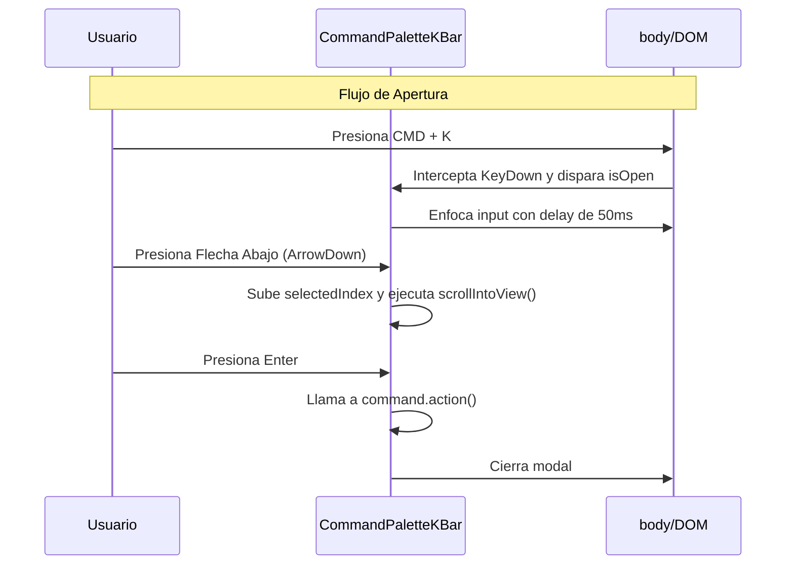

# CommandPaletteKBar — Paleta de Comandos Globales CMD+K

## 1. Propósito y Casos de Uso
El `CommandPaletteKBar` es una barra de búsqueda modal flotante que actúa como atajo universal para navegar y ejecutar acciones en la aplicación mediante el teclado. Optimiza la productividad de administradores y cajeros en el POS eliminando la necesidad de hacer clic a través de menús jerárquicos.

### Casos de Uso Principales:
* **Navegación Rápida:** Cambiar entre las pestañas del dashboard (Inicio, CRM, Facturación, Ajustes) instantáneamente.
* **Acciones Operativas:** Disparar modales para "Crear Producto", "Registrar Venta" o "Ver latencia de red" desde cualquier vista.
* **Búsqueda Rápida de Entidades:** Localizar un cliente por nombre o un producto por SKU e ir directamente a su ficha detallada.

---

## 2. Especificación Visual y Estilos
* **Overlay Fondo:** Filtro de desenfoque y opacidad para concentrar la atención (`bg-slate-950/70 backdrop-blur-sm`).
* **Contenedor Flotante:** Posicionado en la parte superior-centro (`mt-[10vh]`), bordes redondeados (`rounded-3xl`), sombra profunda (`shadow-2xl`) y fondo de cristal (`bg-slate-900/95 border border-slate-800`).
* **Input de Búsqueda:** Campo de texto sin bordes con un icono de lupa inline a la izquierda y un atajo `ESC` de cierre a la derecha.
* **Lista de Resultados:** Altura máxima limitada con scroll suave, separadores por categoría de acción, y resaltado del elemento enfocado (`bg-indigo-600/10 text-indigo-400`).

---

## 3. Código React Completo y 100% Funcional
Este componente escucha el teclado a nivel global, filtra un array de comandos con coincidencia fuzzy y gestiona el foco activo por índice para permitir la navegación completa con las flechas de dirección (`ArrowUp`, `ArrowDown`) y confirmación (`Enter`).

```jsx
import React, { useState, useEffect, useRef } from 'react';
import ReactDOM from 'react-dom';

/**
 * CommandPaletteKBar Component
 * @param {boolean} isOpen - Estado del modal de la paleta.
 * @param {function} onClose - Callback para cerrar la paleta.
 * @param {Array} commands - Lista de comandos disponibles: { id, title, category, action, shortcut }
 */
export default function CommandPaletteKBar({
  isOpen,
  onClose,
  commands = []
}) {
  const [search, setSearch] = useState('');
  const [selectedIndex, setSelectedIndex] = useState(0);
  const listRef = useRef(null);
  const inputRef = useRef(null);

  // Escuchar combinaciones de teclas globales para abrir y cerrar
  useEffect(() => {
    const handleKeyDownGlobal = (e) => {
      if ((e.metaKey || e.ctrlKey) && e.key.toLowerCase() === 'k') {
        e.preventDefault();
        if (isOpen) onClose();
        else onClose(); // Lógica de alternancia controlada por el padre
      }
      if (e.key === 'Escape' && isOpen) {
        e.preventDefault();
        onClose();
      }
    };
    window.addEventListener('keydown', handleKeyDownGlobal);
    return () => window.removeEventListener('keydown', handleKeyDownGlobal);
  }, [isOpen, onClose]);

  // Sincronizar foco inicial en el input
  useEffect(() => {
    if (isOpen) {
      setSearch('');
      setSelectedIndex(0);
      const timer = setTimeout(() => inputRef.current?.focus(), 50);
      return () => clearTimeout(timer);
    }
  }, [isOpen]);

  // Filtrar comandos
  const filteredCommands = commands.filter(cmd =>
    cmd.title.toLowerCase().includes(search.toLowerCase()) ||
    cmd.category.toLowerCase().includes(search.toLowerCase())
  );

  // Resetear índice al buscar
  useEffect(() => {
    setSelectedIndex(0);
  }, [search]);

  // Gestor de navegación por teclado en la lista
  const handleKeyDown = (e) => {
    if (filteredCommands.length === 0) return;

    if (e.key === 'ArrowDown') {
      e.preventDefault();
      setSelectedIndex(prev => (prev + 1) % filteredCommands.length);
    } else if (e.key === 'ArrowUp') {
      e.preventDefault();
      setSelectedIndex(prev => (prev - 1 + filteredCommands.length) % filteredCommands.length);
    } else if (e.key === 'Enter') {
      e.preventDefault();
      const targetCmd = filteredCommands[selectedIndex];
      if (targetCmd) {
        targetCmd.action();
        onClose();
      }
    }
  };

  // Auto-scroll para mantener el elemento enfocado a la vista
  useEffect(() => {
    if (listRef.current) {
      const activeElement = listRef.current.children[selectedIndex];
      if (activeElement) {
        activeElement.scrollIntoView({ block: 'nearest' });
      }
    }
  }, [selectedIndex]);

  if (!isOpen) return null;

  return ReactDOM.createPortal(
    <div className="fixed inset-0 z-[99999] flex justify-center p-4">
      {/* Backdrop de Cristal */}
      <div className="absolute inset-0 bg-slate-950/75 backdrop-blur-sm animate-fade-in" onClick={onClose} />

      {/* Caja de la Paleta */}
      <div className="relative w-full max-w-lg bg-slate-900/95 border border-slate-800 rounded-3xl shadow-2xl flex flex-col h-[400px] mt-[10vh] overflow-hidden z-10 animate-fade-in-up">
        {/* Campo de búsqueda */}
        <div className="flex items-center gap-3 px-5 py-4 border-b border-slate-800 shrink-0">
          <svg className="w-4 h-4 text-slate-500 shrink-0" fill="none" stroke="currentColor" viewBox="0 0 24 24">
            <path strokeLinecap="round" strokeLinejoin="round" strokeWidth="2.5" d="M21 21l-6-6m2-5a7 7 0 11-14 0 7 7 0 0114 0z" />
          </svg>
          <input
            ref={inputRef}
            type="text"
            value={search}
            onChange={(e) => setSearch(e.target.value)}
            onKeyDown={handleKeyDown}
            placeholder="Escribe un comando o navega por las opciones..."
            className="w-full bg-transparent border-none outline-none text-xs text-slate-100 placeholder-slate-500"
          />
          <kbd className="hidden sm:inline-flex items-center gap-0.5 px-2 py-1 bg-slate-800 border border-slate-700 rounded-lg text-[9px] font-bold text-slate-400 select-none">
            ESC
          </kbd>
        </div>

        {/* Lista de Resultados */}
        <div className="flex-1 overflow-y-auto p-3 space-y-1.5" ref={listRef}>
          {filteredCommands.length > 0 ? (
            filteredCommands.map((cmd, idx) => {
              // Cabecera de categoría si cambia la anterior
              const showCategory = idx === 0 || filteredCommands[idx - 1].category !== cmd.category;
              return (
                <div key={cmd.id}>
                  {showCategory && (
                    <div className="text-[9px] font-black uppercase tracking-widest text-slate-500 px-3 py-1.5 mt-2 select-none">
                      {cmd.category}
                    </div>
                  )}
                  <div
                    onClick={() => { cmd.action(); onClose(); }}
                    className={`flex items-center justify-between px-3 py-2.5 rounded-xl cursor-pointer transition-all ${
                      selectedIndex === idx
                        ? 'bg-indigo-600/15 text-indigo-400 font-bold scale-[1.01]'
                        : 'text-slate-300 hover:bg-slate-800/40 hover:text-slate-200'
                    }`}
                  >
                    <div className="flex items-center gap-2.5">
                      <span className="text-xs">{cmd.title}</span>
                    </div>
                    {cmd.shortcut && (
                      <span className="font-mono text-[9px] text-slate-500 bg-slate-950 px-2 py-0.5 rounded-lg border border-slate-800">
                        {cmd.shortcut}
                      </span>
                    )}
                  </div>
                </div>
              );
            })
          ) : (
            <div className="text-center py-10 space-y-2">
              <span className="text-2xl">🔍</span>
              <p className="text-xs text-slate-500">No se encontraron comandos para "{search}"</p>
            </div>
          )}
        </div>
      </div>
    </div>,
    document.body
  );
}
```

---

## 4. Lógica de Estado y Ciclo de Vida
1. **Escucha Global Activa:** El hook de ventana captura `keydown`. Intercepta combinaciones de teclas usando `e.metaKey` (tecla comando Mac) o `e.ctrlKey` (Windows) junto con la tecla `K`, aplicando un preventDefault para evitar el comportamiento de búsqueda nativo del navegador.
2. **Ciclo de Foco:** Al abrirse el modal, se dispara un timer corto de `50ms` para asegurar que el DOM del input se haya montado antes de llamar a `.focus()`.
3. **Mapeo de Categoría Dinámico:** Para mantener el estilo visual bento/categorizado, la renderización verifica si el índice anterior pertenece a la misma categoría, pintando el banner de división al vuelo.

---

## 5. Secuencia de Interacción

