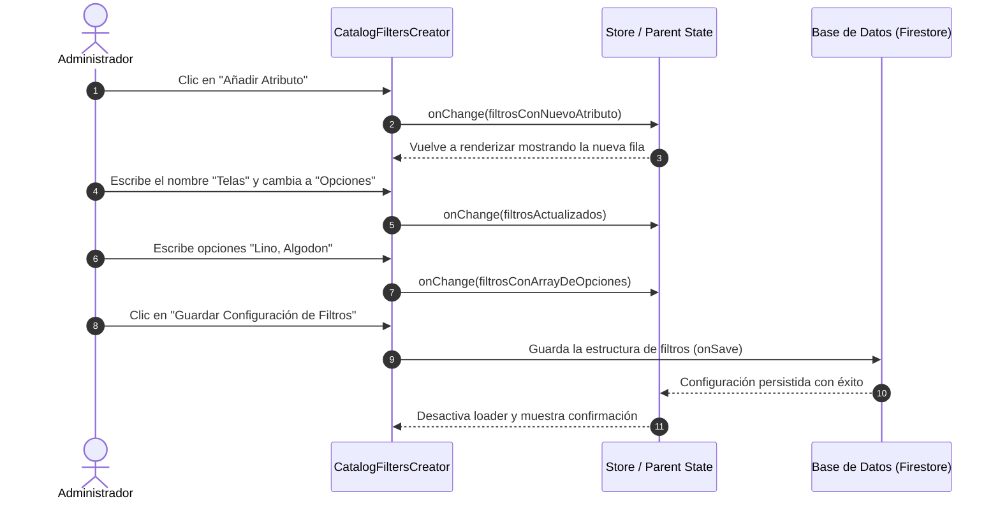

<!--
{
  "technicalName": "CatalogFiltersCreator",
  "targetPath": "src/components/ui/CatalogFiltersCreator.jsx",
  "dependencies": {
    "npm": {},
    "internal": []
  },
  "type": "component",
  "niches": [
    "retail_clothing",
    "grocery_food",
    "distribuidoras-beauty",
    "petshops-locales",
    "moda-local-calzado",
    "alimentacion-saludable",
    "home-office-ergonomia",
    "licores-cocteleria",
    "coleccionismo-geek"
  ]
}
-->

# Creador de Filtros de Catálogo (CatalogFiltersCreator)

## 1. Propósito y Casos de Uso

El componente `CatalogFiltersCreator` es una potente herramienta administrativa de marca blanca para configurar y estructurar de manera dinámica el catálogo de cualquier comercio electrónico. 

Permite al comerciante/administrador:
1. **Activar/Desactivar Dimensiones Estándar:** Habilitar y deshabilitar mediante controles tipo switch (`Toggle`) las dimensiones básicas del producto: Categorías, Tallas y Colores.
2. **Crear Atributos Personalizados ("Campos Extra"):** Añadir campos de metadatos ilimitados (ej. Marca, Material, Sabor, Género, Voltaje) de forma dinámica.
3. **Definir Tipos de Campo:** Asignar si el atributo será de tipo **Texto Libre** (ideal para descripciones breves) o de tipo **Opciones Predefinidas** (`select`), separando los valores con comas para auto-generar filtros de chips clicables en el catálogo del cliente.
4. **Administrar en Tiempo Real:** Interfaz intuitiva y adaptativa para añadir, alternar tipos, editar opciones y eliminar atributos con guards y alertas de estado.

---

## 2. Especificación Visual y Estilos (Tailwind CSS)

El diseño del componente ofrece una experiencia fluida y profesional:
* **Estructura Modular:** Dividido en secciones bien delimitadas (Filtros Básicos en rejilla responsiva y Atributos Personalizados en cascada).
* **Campos Flexibles:** Entradas de texto de tamaño uniforme, bordes suaves y selectores premium de tipo "pestaña deslizante" con transiciones de color.
* **Alertas y Placeholders:** Indicaciones claras e informativas (como la instrucción "separa las opciones con comas") y un estado vacío animado (`empty state`) en caso de no tener atributos configurados.
* **Alineación Adaptativa:** Ajuste automático a pantallas móviles (flex-col) y de escritorio (flex-row) para maximizar la legibilidad y área táctil de interacción.

---

## 3. Código React Completo y 100% Funcional

Para garantizar su portabilidad, el componente es **stateless** (funcional puro controlado), gestionando sus actualizaciones a través del callback `onChange`. No requiere librerías externas de iconos (`lucide-react` se sustituye por SVGs inline).

```jsx
import React from 'react';

/**
 * Iconos SVG Inline para evitar dependencias
 */
const PlusIcon = () => (
  <svg xmlns="http://www.w3.org/2000/svg" width="16" height="16" viewBox="0 0 24 24" fill="none" stroke="currentColor" strokeWidth="2" strokeLinecap="round" strokeLinejoin="round"><path d="M5 12h14"/><path d="M12 5v14"/></svg>
);

const TrashIcon = () => (
  <svg xmlns="http://www.w3.org/2000/svg" width="16" height="16" viewBox="0 0 24 24" fill="none" stroke="currentColor" strokeWidth="2" strokeLinecap="round" strokeLinejoin="round"><path d="M3 6h18"/><path d="M19 6v14c0 1-1 2-2 2H7c-1 0-2-1-2-2V6"/><path d="M8 6V4c0-1 1-2 2-2h4c1 0 2 1 2 2v2"/><line x1="10" x2="10" y1="11" y2="17"/><line x1="14" x2="14" y1="11" y2="17"/></svg>
);

/**
 * Componente Principal: CatalogFiltersCreator
 */
export default function CatalogFiltersCreator({
  filters = {
    categories: true,
    sizes: true,
    colors: true,
    customAttributes: []
  },
  onChange = () => {},
  isSaving = false,
  onSave = null
}) {
  
  // Alterna switches básicos (categories, sizes, colors)
  const handleToggleBasic = (key) => {
    const updated = {
      ...filters,
      [key]: !filters[key]
    };
    onChange(updated);
  };

  // Añade un nuevo atributo personalizado con ID único temporal
  const handleAddAttribute = () => {
    const current = filters.customAttributes || [];
    const updated = {
      ...filters,
      customAttributes: [
        ...current,
        {
          id: 'attr-' + Date.now(),
          name: '',
          type: 'text',
          options: []
        }
      ]
    };
    onChange(updated);
  };

  // Modifica propiedades de un atributo específico
  const handleAttributeChange = (index, field, value) => {
    const current = [...(filters.customAttributes || [])];
    
    if (field === 'options') {
      // Divide por comas y limpia espacios del inicio de cada opción
      current[index].options = value.split(',').map(s => s.trimStart());
    } else {
      current[index][field] = value;
      // Limpiar opciones si cambia a tipo texto
      if (field === 'type' && value === 'text') {
        current[index].options = [];
      }
    }

    const updated = {
      ...filters,
      customAttributes: current
    };
    onChange(updated);
  };

  // Elimina un atributo personalizado de la lista
  const handleRemoveAttribute = (index) => {
    const current = [...(filters.customAttributes || [])];
    current.splice(index, 1);
    const updated = {
      ...filters,
      customAttributes: current
    };
    onChange(updated);
  };

  return (
    <div className="bg-white rounded-3xl border border-slate-100 shadow-sm overflow-hidden max-w-4xl mx-auto">
      <div className="p-5 sm:p-6 space-y-8">
        
        {/* Sección 1: Filtros de Dimensiones Estándar */}
        <div>
          <h3 className="text-sm font-extrabold text-slate-800 uppercase tracking-wider mb-4">
            Dimensiones Estándar
          </h3>
          <div className="grid grid-cols-1 sm:grid-cols-3 gap-4">
            {[
              { key: 'categories', label: 'Categorías', desc: 'Agrupa y filtra por líneas de producto (ej. Calzado).' },
              { key: 'sizes', label: 'Tallas', desc: 'Habilita filtros de tallas (ej. S, M, L o 38, 39).' },
              { key: 'colors', label: 'Colores', desc: 'Selector visual de paleta por variante.' }
            ].map(filter => (
              <div 
                key={filter.key} 
                className="flex items-start justify-between gap-3 p-4 rounded-2xl border border-slate-100 bg-slate-50/50 hover:bg-slate-50 transition-colors"
              >
                <div className="space-y-1">
                  <p className="text-sm font-bold text-slate-800">{filter.label}</p>
                  <p className="text-[11px] text-slate-400 leading-relaxed">{filter.desc}</p>
                </div>
                
                {/* Toggle Switch Personalizado */}
                <label className="relative inline-flex items-center cursor-pointer shrink-0 mt-1">
                  <input 
                    type="checkbox" 
                    className="sr-only peer"
                    checked={!!filters[filter.key]}
                    onChange={() => handleToggleBasic(filter.key)} 
                  />
                  <div className="w-10 h-5.5 bg-slate-200 peer-focus:outline-none rounded-full peer peer-checked:after:translate-x-full after:content-[''] after:absolute after:top-[2px] after:left-[2px] after:bg-white after:border-slate-300 after:border after:rounded-full after:h-4.5 after:w-4.5 after:transition-all peer-checked:bg-emerald-500 shadow-inner"></div>
                </label>

              </div>
            ))}
          </div>
        </div>

        {/* Sección 2: Creador de Atributos Personalizados */}
        <div className="border-t border-slate-100 pt-6">
          <div className="flex justify-between items-center mb-4">
            <div>
              <h3 className="text-sm font-extrabold text-slate-800 uppercase tracking-wider">
                Atributos Personalizados
              </h3>
              <p className="text-xs text-slate-400 mt-0.5">
                Crea dimensiones adicionales adaptadas a tu nicho de negocio.
              </p>
            </div>
            
            <button 
              type="button" 
              onClick={handleAddAttribute}
              className="flex items-center gap-1.5 px-3 py-2 bg-emerald-50 text-emerald-600 hover:bg-emerald-100 rounded-xl text-xs font-extrabold transition-colors cursor-pointer"
            >
              <PlusIcon /> Añadir Atributo
            </button>
          </div>

          <div className="space-y-3.5">
            {filters.customAttributes?.map((attr, index) => (
              <div 
                key={attr.id} 
                className="flex flex-col sm:flex-row sm:items-start gap-3.5 p-4 bg-slate-50/50 border border-slate-100 rounded-2xl relative"
              >
                
                {/* 1. Nombre del Atributo */}
                <div className="flex-1 w-full">
                  <label className="block text-[10px] font-bold text-slate-400 uppercase mb-1.5">Nombre del filtro</label>
                  <input 
                    type="text" 
                    placeholder="Ej. Marca, Material, Sabor" 
                    value={attr.name || ''}
                    onChange={(e) => handleAttributeChange(index, 'name', e.target.value)}
                    className="w-full h-10 px-3 rounded-xl border border-slate-200 bg-white text-sm text-slate-800 focus:outline-none focus:border-emerald-500 transition-colors font-semibold" 
                  />
                </div>

                {/* 2. Selector de Tipo */}
                <div className="w-full sm:w-auto shrink-0">
                  <label className="block text-[10px] font-bold text-slate-400 uppercase mb-1.5">Tipo de entrada</label>
                  <div className="flex bg-white border border-slate-200 rounded-xl overflow-hidden h-10 p-0.5">
                    <button 
                      type="button" 
                      onClick={() => handleAttributeChange(index, 'type', 'text')}
                      className={`px-4.5 rounded-lg text-xs font-extrabold transition-all cursor-pointer ${attr.type === 'text' ? 'bg-emerald-500 text-white shadow-sm' : 'text-slate-500 hover:bg-slate-50'}`}
                    >
                      Texto
                    </button>
                    <button 
                      type="button" 
                      onClick={() => handleAttributeChange(index, 'type', 'select')}
                      className={`px-4.5 rounded-lg text-xs font-extrabold transition-all cursor-pointer ${attr.type === 'select' ? 'bg-emerald-500 text-white shadow-sm' : 'text-slate-500 hover:bg-slate-50'}`}
                    >
                      Opciones
                    </button>
                  </div>
                </div>

                {/* 3. Entrada de Opciones (Solo si es tipo Select) */}
                {attr.type === 'select' && (
                  <div className="flex-[1.5] w-full">
                    <label className="block text-[10px] font-bold text-slate-400 uppercase mb-1.5">Opciones del filtro</label>
                    <input 
                      type="text" 
                      placeholder="Ej. Nike, Adidas, Puma"
                      value={attr.options ? attr.options.join(', ') : ''}
                      onChange={(e) => handleAttributeChange(index, 'options', e.target.value)}
                      className="w-full h-10 px-3 rounded-xl border border-slate-200 bg-white text-sm text-slate-800 focus:outline-none focus:border-emerald-500 transition-colors font-medium" 
                    />
                    <p className="text-[9px] text-slate-400 mt-1 px-1">Separa las opciones con comas.</p>
                  </div>
                )}

                {/* 4. Botón de Eliminar */}
                <div className="sm:self-end">
                  <button 
                    type="button"
                    onClick={() => handleRemoveAttribute(index)}
                    className="w-full sm:w-10 h-10 flex items-center justify-center shrink-0 rounded-xl text-slate-400 hover:bg-rose-50 hover:text-rose-500 border border-slate-200 hover:border-rose-100 transition-all cursor-pointer"
                    title="Eliminar atributo"
                  >
                    <TrashIcon /> <span className="sm:hidden text-xs font-bold ml-2">Eliminar Atributo</span>
                  </button>
                </div>

              </div>
            ))}

            {/* Estado vacío (Empty State) */}
            {(!filters.customAttributes || filters.customAttributes.length === 0) && (
              <div className="text-center py-8 text-slate-400 text-xs border border-dashed border-slate-200 bg-slate-50/20 rounded-2xl">
                No has agregado atributos personalizados aún. Pulsa "Añadir Atributo" para crear campos adicionales.
              </div>
            )}
          </div>
        </div>

      </div>

      {/* Botón de Guardar Integrado (Opcional) */}
      {onSave && (
        <div className="p-5 border-t border-slate-100 bg-slate-50/30 flex justify-end">
          <button 
            type="button" 
            onClick={onSave}
            disabled={isSaving}
            className="w-full sm:w-auto h-11 px-6 bg-emerald-500 hover:bg-emerald-600 text-white rounded-xl text-xs font-extrabold transition-all duration-200 active:scale-95 flex items-center justify-center gap-2 shadow-sm disabled:opacity-50 shrink-0 cursor-pointer"
          >
            {isSaving ? (
              <div className="w-4 h-4 border-2 border-white/30 border-t-white rounded-full animate-spin" />
            ) : (
              'Guardar Configuración de Filtros'
            )}
          </button>
        </div>
      )}

    </div>
  );
}
```

---

## 4. Lógica de Estado y Ciclo de Vida

El componente utiliza un patrón **totalmente reactivo y controlado (Stateless)**:
1. **Flujo de Eventos:** Cualquier interacción del usuario (toggle de switches, adición, edición del input o borrado) calcula una nueva copia profunda del estado de los filtros y la emite a través de `onChange(updatedFilters)`.
2. **Generación de ID Temporales:** Al pulsar "Añadir", el sistema genera un ID dinámico empleando `attr-` concatenado al timestamp de milisegundos (`Date.now()`). Esto previene colisiones visuales de claves en la UI y garantiza referencias de base de datos seguras durante su inserción física.
3. **Manejo de Espacios y Comas:** La inyección de opciones (`select`) mapea dinámicamente un array en tiempo real utilizando la separación `.split(',')` combinada con `.trimStart()`, permitiendo al usuario presionar la barra espaciadora después de cada coma sin distorsionar el array final del filtro.

---

## 5. Flujo Operativo y Secuencia de Interacción

El siguiente diagrama ilustra la secuencia de configuración y sincronización de los filtros:


