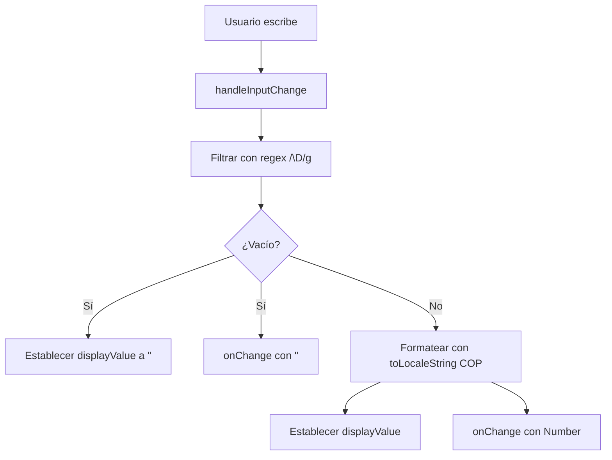

# Entrada de Moneda Formateada COP (CurrencyInput)

Componente atómico de formulario diseñado para proporcionar una máscara de entrada de moneda en pesos colombianos (`$ XX.XXX`) en tiempo real sobre el DOM, propagando el valor numérico entero limpio al estado padre y consumiendo variables HSL del sistema de diseño para marca blanca.

---

## 1. Propósito y Casos de Uso
* **Formateo en Vivo (COP):** Convierte números en texto formateado de moneda local sobre la marcha.
* **Retorno Limpio:** Informa el número entero limpio (`Number` o `""`) al manejador `onChange` del padre.
* **Casos de Uso:**
  * Inputs de precio en formularios de creación de productos.
  * Importe de pagos, abonos y propinas en el POS.
  * Presupuestos y transacciones financieras.

---

## 2. Especificación Visual y Estilos (Tailwind CSS HSL)
* **Tema Adaptable:** Utiliza variables de color CSS (`var(--color-text)`, `var(--color-border)`, `var(--color-surface)`) para integrarse al esquema global.
* **Teclado Optimizado:** Usa `inputMode="numeric"` para desplegar el teclado numérico de forma nativa en móviles.

---

## 3. Props y API del Componente
| Prop | Tipo | Default | Descripción |
|------|------|---------|-------------|
| `value` | `number \| string` | `""` | Valor numérico entero actual (sin formatear). |
| `onChange` | `function` | `() => {}` | Callback invocado ante cambios, devuelve el número limpio. |
| `placeholder` | `string` | `""` | Texto del marcador de posición. |
| `className` | `string` | `""` | Clases Tailwind personalizadas. |
| `disabled` | `boolean` | `false` | Deshabilita la interacción del input. |

---

## 4. Código React Fuente Completo (`CurrencyInput.jsx`)
```jsx
import React, { useState, useEffect } from 'react';

export default function CurrencyInput({ 
  value, 
  onChange, 
  placeholder = '', 
  className = '', 
  disabled = false 
}) {
  const [displayValue, setDisplayValue] = useState('');

  const formatCurrency = (val) => {
    if (val === null || val === undefined || val === '') return '';
    const num = String(val).replace(/\D/g, '');
    if (!num) return '';
    return '$ ' + Number(num).toLocaleString('es-CO', { maximumFractionDigits: 0 });
  };

  useEffect(() => {
    setDisplayValue(formatCurrency(value));
  }, [value]);

  const handleInputChange = (e) => {
    const rawVal = e.target.value;
    const numStr = rawVal.replace(/\D/g, '');
    const finalVal = numStr === '' ? '' : Number(numStr);
    
    setDisplayValue(formatCurrency(numStr));
    onChange(finalVal);
  };

  return (
    <input
      type="text"
      value={displayValue}
      onChange={handleInputChange}
      placeholder={placeholder}
      className={className}
      disabled={disabled}
      inputMode="numeric"
    />
  );
}
```

---

## 5. Lógica de Estado y Ciclo de Vida
1. **Sincronización:** Cuando la prop `value` cambia externamente, se recalcula y formatea visualmente en el estado local `displayValue`.
2. **Entrada Controlada:** En cada tipeo, la regex `/\D/g` filtra caracteres no numéricos, actualizando el valor crudo en el componente padre y el formateado localmente.

---

## 6. Flujo de Interacción


---

## 7. Origen
* **Extraído de:** `src/components/ui/CurrencyInput.jsx`
* **Fecha de extracción:** 2026-06-06
* **Versión:** 1.0 (Refactorizado con HSL variables).
