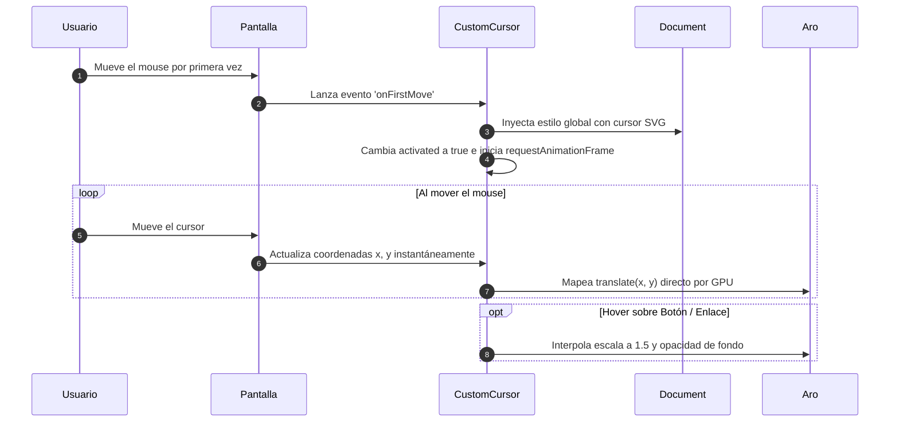

# CustomCursor

## 1. Propósito y Casos de Uso
El componente `CustomCursor` proporciona un cursor interactivo y personalizado premium para pantallas de escritorio, diseñado específicamente para mejorar la estética, la identidad de marca y la experiencia de usuario (UX) en paneles y dashboards.

### Casos de Uso:
*   Consolas de administración, dashboards de análisis y telemetría donde se busca una estética visual inmersiva.
*   Proyectos de marca blanca que requieran adaptar el cursor y los indicadores visuales al color corporativo de forma dinámica.
*   Experiencias web premium que utilicen hover interactivo y escalado para botones o tarjetas.

---

## 2. Especificación Visual y Estilos
*   **Dot (Puntero Central)**: Un círculo SVG de 8px de diámetro renderizado directamente por el motor del navegador (composición nativa a nivel del sistema operativo) para asegurar latencia cero y velocidad perfecta de seguimiento.
*   **Aro de Seguimiento (Halo)**: Un círculo de 40px de diámetro con borde suavizado (`border: 1.5px`) que envuelve el cursor. Utiliza aceleración por hardware (`will-change: transform`).
*   **Efecto Hover**: Cuando el cursor pasa sobre un elemento interactivo (botones, enlaces, selectores, inputs, etc.), el aro se expande en escala (`scale(1.5)`) mediante interpolación por software y adquiere un fondo semi-transparente en un periodo de transición sumamente fluido.
*   **Fondo & Colores**: Completamente personalizable mediante variables CSS o props directas de color, soportando de forma predeterminada el morado de marca del ecosistema PROTOTIPE.

---

## 3. Props y API del Componente
| Prop | Tipo | Default | Descripción |
| :--- | :--- | :--- | :--- |
| `color` | `String` | `'#8b5cf6'` | Color principal en formato Hex del dot central y del halo (aro). |
| `size` | `Number` | `40` | Diámetro en píxeles del aro de seguimiento. |
| `ringOpacityNormal` | `Number` | `0.6` | Opacidad normal del aro cuando está en estado de reposo (0.0 a 1.0). |

---

## 4. Código React Completo y 100% Funcional
```jsx
import React, { useRef, useEffect, useState } from 'react';

/**
 * CustomCursor - Cursor interactivo con punto SVG nativo a nivel de SO y aro de seguimiento GPU acelerado.
 * Actúa únicamente tras el primer movimiento de ratón físico para garantizar compatibilidad con laptops táctiles.
 */
export default function CustomCursor({
  color = '#8b5cf6',
  size = 40,
  ringOpacityNormal = 0.6
}) {
  const ringRef    = useRef(null);
  const mouse      = useRef({ x: -200, y: -200 });
  const scaleRef   = useRef(1);
  const rafRef     = useRef(null);
  const isHoverRef = useRef(false);
  const [activated, setActivated] = useState(false);

  // Escapar el hash (#) del color para inyectarlo en el Data URL del SVG
  const escapedColor = color.replace('#', '%23');
  const dotSvg = `<svg xmlns='http://www.w3.org/2000/svg' width='8' height='8' viewBox='0 0 8 8'><circle cx='4' cy='4' r='3.5' fill='${escapedColor}'/><circle cx='4' cy='4' r='3.5' fill='${escapedColor}' opacity='0.5' filter='blur(2px)'/></svg>`;
  const dotCursor = `url("data:image/svg+xml,${dotSvg}") 4 4, none`;

  useEffect(() => {
    let styleEl = null;
    let targetScale = 1.0;

    const onMove = (e) => {
      mouse.current.x = e.clientX;
      mouse.current.y = e.clientY;
      if (ringRef.current) {
        ringRef.current.style.transform =
          `translate(${e.clientX - size / 2}px, ${e.clientY - size / 2}px) scale(${scaleRef.current})`;
      }

      const el = e.target.closest('button,a,input,select,textarea,[role="button"],label,[tabindex]');
      const hover = !!el;
      if (hover !== isHoverRef.current) {
        isHoverRef.current = hover;
        targetScale = hover ? 1.5 : 1.0;
      }
    };

    const onFirstMove = () => {
      setActivated(true);

      // Inyectar estilo CSS global para ocultar el cursor del SO y renderizar el dot SVG
      styleEl = document.createElement('style');
      styleEl.id = 'ccursor-style';
      styleEl.textContent = `*,*::before,*::after{cursor:${dotCursor}!important}`;
      document.head.appendChild(styleEl);

      window.removeEventListener('mousemove', onFirstMove);
      window.addEventListener('mousemove', onMove, { passive: true });
      rafRef.current = requestAnimationFrame(tick);
    };

    const onDown = () => {
      if (ringRef.current) ringRef.current.style.opacity = (ringOpacityNormal * 0.6).toString();
    };
    const onUp = () => {
      if (ringRef.current) ringRef.current.style.opacity = ringOpacityNormal.toString();
    };

    const tick = () => {
      scaleRef.current += (targetScale - scaleRef.current) * 0.18;

      if (ringRef.current) {
        // Posicionamiento continuo con la escala interpolada
        ringRef.current.style.transform =
          `translate(${mouse.current.x - size / 2}px, ${mouse.current.y - size / 2}px) scale(${scaleRef.current})`;
        
        // Efecto hover sobre color y fondo
        ringRef.current.style.borderColor = isHoverRef.current ? color : `${color}99`;
        ringRef.current.style.backgroundColor = isHoverRef.current ? `${color}14` : 'transparent';
      }

      rafRef.current = requestAnimationFrame(tick);
    };

    window.addEventListener('mousemove', onFirstMove);
    window.addEventListener('mousedown', onDown);
    window.addEventListener('mouseup', onUp);

    return () => {
      window.removeEventListener('mousemove', onFirstMove);
      window.removeEventListener('mousemove', onMove);
      window.removeEventListener('mousedown', onDown);
      window.removeEventListener('mouseup', onUp);
      if (rafRef.current) cancelAnimationFrame(rafRef.current);
      document.getElementById('ccursor-style')?.remove();
    };
  }, [color, size, ringOpacityNormal, dotCursor]);

  if (!activated) return null;

  return (
    <div
      ref={ringRef}
      className="fixed top-0 left-0 z-[9999] pointer-events-none"
      style={{
        width: `${size}px`,
        height: `${size}px`,
        borderRadius: '50%',
        border: `1.5px solid ${color}99`,
        backgroundColor: 'transparent',
        willChange: 'transform',
        transformOrigin: 'center center',
      }}
    />
  );
}
```

---

## 5. Lógica de Estado y Ciclo de Vida
*   `activated` (`useState`): Controla si el cursor personalizado debe renderizarse en pantalla. Comienza en `false` para evitar mostrar un aro estático en la esquina `(0,0)` y se activa únicamente tras el primer evento físico de ratón (`mousemove`).
*   `scaleRef` (`useRef`): Mantiene la escala del aro para evitar disparar renders innecesarios. Se interpola con la escala destino en el bucle `rAF` (`tick`).
*   `rafRef` (`useRef`): Referencia del identificador de animación de cuadros para su des-suscripción segura al desmontar.
*   `isHoverRef` (`useRef`): Flag de estado binario para determinar si el puntero se encuentra sobre un elemento accionable.

---

## 6. Integración con Servicios Externos
*   El componente no requiere integraciones de base de datos directa.
*   Totalmente agnóstico, depende únicamente de las capacidades gráficas del navegador (CSS Transitions y SVG url data formats).

---

## 7. Flujo Operativo y Secuencia de Interacción


---

## 8. Ejemplo de Uso (Importación y Consumo)
```jsx
import React from 'react';
import CustomCursor from './components/ui/CustomCursor';

export default function App() {
  return (
    <div className="min-h-screen bg-slate-900 text-white md:cursor-none">
      {/* Opcional: ocultar cursor nativo con la clase md:cursor-none */}
      <CustomCursor color="#06b6d4" size={40} />
      
      <main className="p-8">
        <h1>Mi Aplicación Premium</h1>
        <button className="px-4 py-2 bg-cyan-600 rounded-lg">
          Acción Interactiva
        </button>
      </main>
    </div>
  );
}
```

---

## 9. Origen
*   **Extraído de**: [dev-dashboard — src/App.jsx](file:///d:/Aplicaciones/dev-dashboard/src/App.jsx)
*   **Fecha de extracción**: 2026-06-07
*   **Versión**: 1.0
