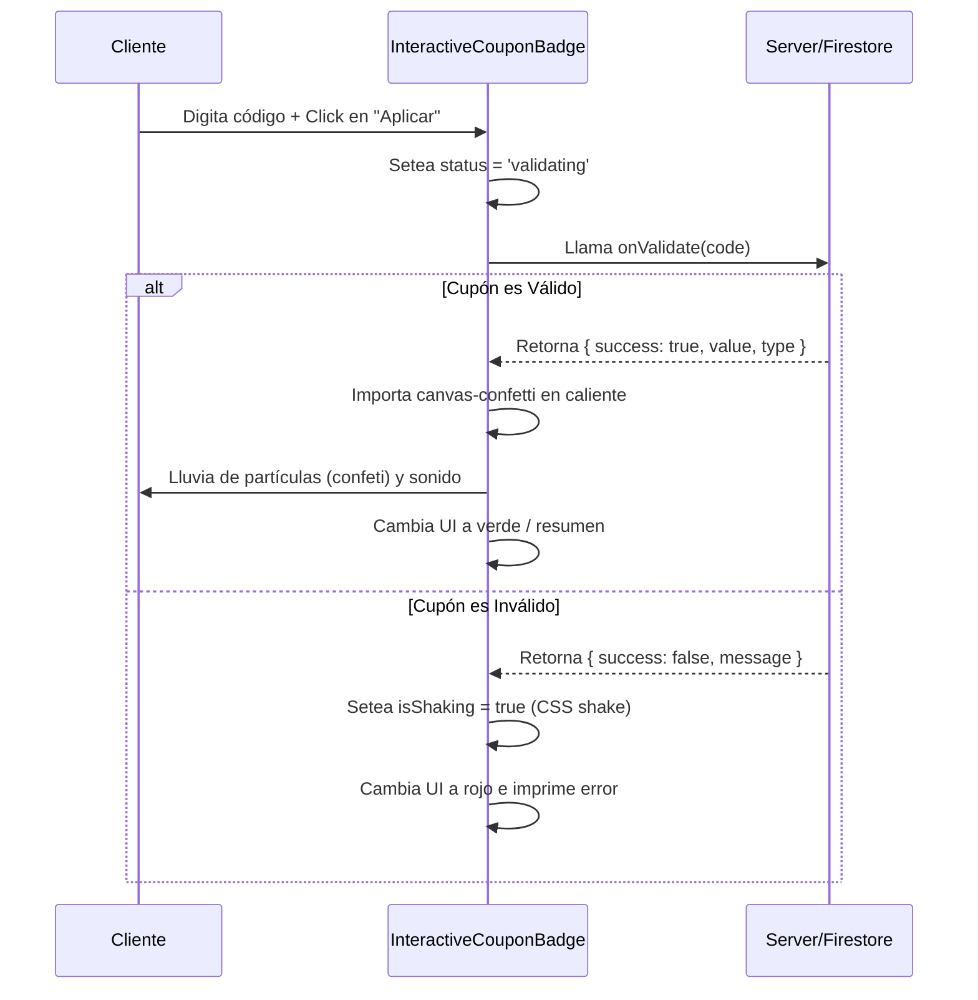

# InteractiveCouponBadge — Aplicador Animado de Cupones con Confeti

## 1. Propósito y Casos de Uso
El `InteractiveCouponBadge` es un campo de validación de cupones de descuento integrado en el proceso de checkout. Combina la validación lógica de Firestore con una recompensa visual (confeti digital) al validarse un descuento con éxito.

### Casos de Uso Principales:
* **Checkout de Clientes:** Aplicación de cupones promocionales (ej: Moni, Barbería Glamour) antes de completar la orden de compra.
* **Fidelización:** Animación de recompensa al canjear tarjetas de regalo o códigos de referidos.

---

## 2. Especificación Visual y Estilos
* **Input de Captura:** Entrada HSL redondeada (`rounded-2xl`) con borde discreto (`border-slate-800 focus-within:border-indigo-500/40`).
* **Botón de Acción:** Botón atómico (`px-4 bg-indigo-600 hover:bg-indigo-500 rounded-xl`).
* **Estados Visuales:**
  - **Éxito (Verde):** Al aplicarse, el borde se tiñe de esmeralda (`border-emerald-500/30 bg-emerald-500/5`), mostrando un check y disparando confeti.
  - **Fallo (Rojo):** Si es inválido, el input vibra y el borde se tiñe de rojo (`border-red-500/30 bg-red-500/5`).
* **Glow Efecto:** El banner de descuento activo brilla sutilmente en la parte inferior para recordar la deducción.

---

## 3. Código React Completo y 100% Funcional
Este componente implementa la importación dinámica (`dynamic import`) de la librería de confeti para no penalizar el tiempo de carga del bundle inicial de la pasarela.

```jsx
import React, { useState, useRef } from 'react';

/**
 * InteractiveCouponBadge Component
 * @param {function} onValidate - Callback asíncrono para verificar el cupón: `async (code) => { success: boolean, value: number, type: 'percent'|'fixed' }`
 * @param {function} onApply - Callback al aplicar el descuento con éxito.
 * @param {function} onRemove - Callback para descartar/eliminar el cupón activo.
 */
export default function InteractiveCouponBadge({
  onValidate,
  onApply,
  onRemove
}) {
  const [code, setCode] = useState('');
  const [status, setStatus] = useState('idle'); // 'idle' | 'validating' | 'success' | 'error'
  const [errorMessage, setErrorMessage] = useState('');
  const [appliedCoupon, setAppliedCoupon] = useState(null);
  const [isShaking, setIsShaking] = useState(false);
  const inputRef = useRef(null);

  // Lanzar animación de confeti dinámicamente
  const triggerConfetti = async () => {
    try {
      const module = await import('canvas-confetti');
      const confetti = module.default || module;
      confetti({
        particleCount: 80,
        spread: 60,
        origin: { y: 0.8 },
        colors: ['#6366f1', '#3b82f6', '#10b981', '#f59e0b'] // Colores HSL
      });
    } catch (e) {
      console.warn('Librería canvas-confetti no cargada:', e.message);
    }
  };

  const handleApply = async () => {
    const cleanCode = code.toUpperCase().trim();
    if (!cleanCode) return;

    setStatus('validating');
    setErrorMessage('');

    try {
      const result = await onValidate(cleanCode);
      if (result.success) {
        setStatus('success');
        setAppliedCoupon({ code: cleanCode, ...result });
        onApply(result);
        triggerConfetti();
      } else {
        triggerError(result.message || 'Cupón inválido o vencido');
      }
    } catch (err) {
      triggerError('Error al validar el cupón.');
    }
  };

  const triggerError = (msg) => {
    setStatus('error');
    setErrorMessage(msg);
    setIsShaking(true);
    setTimeout(() => setIsShaking(false), 500); // Duración de vibración CSS
  };

  const handleRemove = () => {
    setStatus('idle');
    setCode('');
    setAppliedCoupon(null);
    onRemove();
  };

  return (
    <div className="w-full space-y-2">
      {status === 'success' && appliedCoupon ? (
        // Estado: Cupón Aplicado Exitosamente
        <div className="flex items-center justify-between p-3.5 bg-emerald-500/10 border border-emerald-500/25 rounded-2xl animate-fade-in-up">
          <div className="flex items-center gap-2">
            <span className="text-base">🎟️</span>
            <div>
              <p className="text-xs font-black text-emerald-400">Cupón: {appliedCoupon.code}</p>
              <p className="text-[10px] text-slate-400">
                Descuento aplicado: {appliedCoupon.type === 'percent' ? `${appliedCoupon.value}%` : `$${appliedCoupon.value.toLocaleString('es-CO')}`}
              </p>
            </div>
          </div>
          <button
            onClick={handleRemove}
            className="px-2.5 py-1.5 bg-slate-900 border border-slate-800 text-[10px] font-bold text-red-400 rounded-xl hover:bg-slate-800 transition-all cursor-pointer"
          >
            Eliminar
          </button>
        </div>
      ) : (
        // Estado: Input para escribir cupón
        <div className="space-y-1.5">
          <div
            className={`flex items-center bg-slate-950 border rounded-2xl p-1.5 gap-2 transition-all ${
              status === 'error' ? 'border-red-500/50 ring-2 ring-red-500/10' :
              status === 'validating' ? 'border-indigo-500/30' :
              'border-slate-800 focus-within:border-indigo-500/50 focus-within:ring-2 focus-within:ring-indigo-500/10'
            } ${isShaking ? 'animate-shake' : ''}`}
          >
            <input
              ref={inputRef}
              type="text"
              value={code}
              onChange={(e) => setCode(e.target.value)}
              disabled={status === 'validating'}
              placeholder="Ingresa código de descuento"
              className="bg-transparent outline-none text-xs text-slate-100 placeholder-slate-600 flex-1 pl-3 uppercase"
              onKeyDown={(e) => { if (e.key === 'Enter') handleApply(); }}
            />
            <button
              onClick={handleApply}
              disabled={!code || status === 'validating'}
              className="px-4 py-2 bg-indigo-600 hover:bg-indigo-500 disabled:opacity-40 disabled:cursor-not-allowed text-white text-xs font-black rounded-xl cursor-pointer transition-all hover:scale-[1.02] shrink-0"
            >
              {status === 'validating' ? 'Aplicando...' : 'Aplicar'}
            </button>
          </div>
          {status === 'error' && (
            <p className="text-[10px] text-red-400 font-semibold pl-2">{errorMessage}</p>
          )}
        </div>
      )}
    </div>
  );
}
```

---

## 4. Lógica de Estado y Ciclo de Vida
1. **Importación Dinámica de Confeti:** En lugar de importar `canvas-confetti` estáticamente en la parte superior, lo cargamos en memoria asíncronamente con `await import('canvas-confetti')` únicamente cuando la respuesta de validación es exitosa.
2. **Animación Shake (Vibración):** El estado `isShaking` se vuelve `true` durante `500ms` al capturar un fallo. Esto activa una clase CSS en `index.css` de traslación oscilante horizontal que atrae visualmente el ojo del usuario al mensaje de error.

---

## 5. Secuencia de Validación

