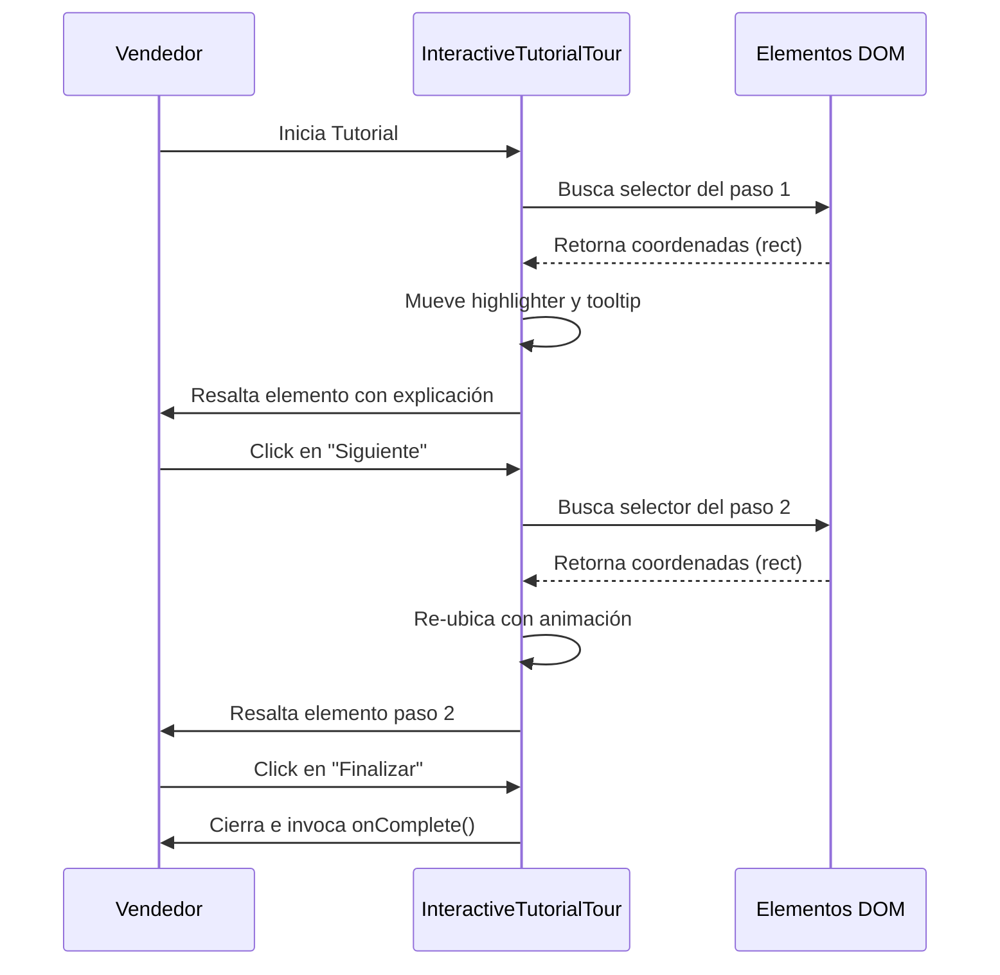

<!--
{
  "technicalName": "InteractiveTutorialTour",
  "targetPath": "src/components/ui/InteractiveTutorialTour.jsx",
  "dependencies": {
    "npm": {},
    "internal": []
  },
  "type": "component",
  "niches": []
}
-->

# InteractiveTutorialTour — Guía de Onboarding Paso a Paso

## 1. Propósito y Casos de Uso
El `InteractiveTutorialTour` es un componente de guiado interactivo que ayuda a los usuarios nuevos (por ejemplo, tenderos o administradores de comercios afiliados) a familiarizarse con las funciones críticas del sistema. Resalta elementos clave en la pantalla y proporciona explicaciones contextuales reduciendo la fricción inicial de configuración.

### Casos de Uso Principales:
* **Onboarding del Administrador:** Guiar en el proceso de registrar su primer producto y configurar su método de pago.
* **Presentación de Nuevas Features:** Resaltar una nueva funcionalidad (ej. facturación DIAN) que se ha integrado tras una actualización.
* **Onboarding de Clientes:** Mostrar el funcionamiento del POS al personal de caja en su primer día.

---

## 2. Especificación Visual y Estilos
* **Máscara de Enfoque (Highlighter Overlay):** Superposición oscura semi-transparente que cubre la pantalla excepto el elemento DOM enfocado (`bg-[var(--color-bg)]/60 transition-all duration-300`).
* **Caja de Explicación (Tooltip Card):** Tarjeta flotante con fondo sólido (`bg-[var(--color-surface)] border border-[var(--color-border)]`), sombra profunda, indicador de pasos numérico y botones de navegación ("Atrás", "Siguiente", "Finalizar").
* **Animaciones:** Transición fluida del recorte de foco y el tooltip al cambiar de paso operativo.

---

## 3. Código React Completo y 100% Funcional
Este componente utiliza la API `getBoundingClientRect()` del navegador para calcular la posición física del elemento enfocado y posicionar el tooltip de forma matemática, evitando dependencias externas.

```jsx
import React, { useState, useEffect, useRef } from 'react';
import ReactDOM from 'react-dom';

/**
 * InteractiveTutorialTour Component
 * @param {boolean} active - Inicia o detiene el tour.
 * @param {Array} steps - Lista de pasos: { selector: '.element-class', title: 'Título', content: 'Info' }
 * @param {function} onComplete - Callback al finalizar o saltar el tour.
 */
export default function InteractiveTutorialTour({
  active,
  steps = [],
  onComplete = () => {}
}) {
  const [currentStep, setCurrentStep] = useState(0);
  const [highlightStyle, setHighlightStyle] = useState(null);
  const [tooltipStyle, setTooltipStyle] = useState(null);
  const tooltipRef = useRef(null);

  useEffect(() => {
    if (!active || steps.length === 0) return;

    const updatePosition = () => {
      const step = steps[currentStep];
      const targetElement = document.querySelector(step.selector);

      if (targetElement) {
        // Asegurar que el elemento esté visible en el viewport
        targetElement.scrollIntoView({ block: 'center', behavior: 'smooth' });

        const rect = targetElement.getBoundingClientRect();
        const scrollX = window.scrollX;
        const scrollY = window.scrollY;

        // Estilo de la máscara de recorte (agregando un padding de 8px alrededor del elemento)
        const padding = 8;
        setHighlightStyle({
          left: `${rect.left + scrollX - padding}px`,
          top: `${rect.top + scrollY - padding}px`,
          width: `${rect.width + padding * 2}px`,
          height: `${rect.height + padding * 2}px`,
          borderRadius: '16px'
        });

        // Calcular la posición del Tooltip flotante (por debajo o encima del elemento)
        const tooltipHeight = tooltipRef.current ? tooltipRef.current.offsetHeight : 150;
        const spaceBelow = window.innerHeight - rect.bottom;
        const topPosition = spaceBelow > tooltipHeight + 20
          ? rect.bottom + scrollY + 12
          : rect.top + scrollY - tooltipHeight - 12;

        setTooltipStyle({
          left: `${Math.max(16, Math.min(window.innerWidth - 300, rect.left + scrollX))}px`,
          top: `${topPosition}px`,
          width: '280px'
        });
      } else {
        // Si no se encuentra el elemento, posicionar en el centro de la pantalla
        setHighlightStyle({ width: 0, height: 0, opacity: 0 });
        setTooltipStyle({
          left: '50%',
          top: '50%',
          transform: 'translate(-50%, -50%)',
          width: '280px',
          position: 'fixed'
        });
      }
    };

    // Dar un tiempo a que el scroll termine
    const timer = setTimeout(updatePosition, 300);
    window.addEventListener('resize', updatePosition);
    window.addEventListener('scroll', updatePosition);

    return () => {
      clearTimeout(timer);
      window.removeEventListener('resize', updatePosition);
      window.removeEventListener('scroll', updatePosition);
    };
  }, [active, currentStep, steps]);

  const handleNext = () => {
    if (currentStep < steps.length - 1) {
      setCurrentStep(prev => prev + 1);
    } else {
      onComplete();
    }
  };

  const handlePrev = () => {
    if (currentStep > 0) {
      setCurrentStep(prev => prev - 1);
    }
  };

  if (!active || steps.length === 0) return null;

  return ReactDOM.createPortal(
    <div className="fixed inset-0 z-[999999] pointer-events-none">
      {/* Máscara de sombreado (Overlay) simulada con 4 divs para permitir clics controlados */}
      {highlightStyle && (
        <div
          style={{
            position: 'absolute',
            boxShadow: '0 0 0 9999px rgba(2, 6, 23, 0.65)',
            transition: 'all 300ms cubic-bezier(0.16, 1, 0.3, 1)',
            pointerEvents: 'auto',
            ...highlightStyle
          }}
          className="border-2 border-indigo-500/40 ring-4 ring-indigo-500/10"
        />
      )}

      {/* Tooltip Explicativo Card */}
      <div
        ref={tooltipRef}
        style={{
          position: 'absolute',
          transition: 'all 300ms cubic-bezier(0.16, 1, 0.3, 1)',
          pointerEvents: 'auto',
          ...tooltipStyle
        }}
        className="bg-[var(--color-surface)] border border-[var(--color-border)] rounded-3xl p-5 shadow-2xl flex flex-col gap-4 text-slate-100 animate-fade-in"
      >
        <div className="flex justify-between items-start">
          <span className="text-[10px] font-black uppercase tracking-wider text-indigo-400">
            Paso {currentStep + 1} de {steps.length}
          </span>
          <button onClick={onComplete} className="text-slate-500 hover:text-slate-300 transition-colors cursor-pointer">
            <svg className="w-3.5 h-3.5" fill="none" stroke="currentColor" viewBox="0 0 24 24">
              <path strokeLinecap="round" strokeLinejoin="round" strokeWidth="2.5" d="M6 18L18 6M6 6l12 12" />
            </svg>
          </button>
        </div>

        <div>
          <h4 className="text-xs font-black text-slate-100">{steps[currentStep]?.title}</h4>
          <p className="text-[10px] text-slate-400 mt-1 leading-relaxed">{steps[currentStep]?.content}</p>
        </div>

        <div className="flex justify-between items-center gap-2 border-t border-[var(--color-border)]/80 pt-3">
          <button
            onClick={onComplete}
            className="text-[9px] font-black uppercase tracking-wider text-slate-500 hover:text-slate-400 cursor-pointer"
          >
            Saltar
          </button>
          <div className="flex gap-1.5">
            {currentStep > 0 && (
              <button
                onClick={handlePrev}
                className="px-2.5 py-1.5 bg-slate-800 border border-slate-700 text-[9px] font-black rounded-lg text-slate-300 hover:bg-slate-700 transition-all cursor-pointer"
              >
                Atrás
              </button>
            )}
            <button
              onClick={handleNext}
              className="px-3.5 py-1.5 bg-indigo-600 hover:bg-indigo-500 text-[9px] font-black rounded-lg text-white transition-all cursor-pointer"
            >
              {currentStep === steps.length - 1 ? 'Finalizar' : 'Siguiente'}
            </button>
          </div>
        </div>
      </div>
    </div>,
    document.body
  );
}
```

---

## 4. Lógica de Estado y Ciclo de Vida
1. **Recorte Físico (Box Shadow Trick):** En lugar de crear complejas geometrías SVG, el área de foco se resalta utilizando un truco de CSS: un div absoluto del tamaño del elemento con un `box-shadow: 0 0 0 9999px rgba(...)`. Esto crea un sombreado infinito en la pantalla simulando un overlay y permitiendo enfocar exactamente el elemento DOM.
2. **Scroll Automático (scrollIntoView):** Al cambiar de paso, el componente fuerza la vista al elemento destacado (`scrollIntoView`) para asegurar que no quede fuera del viewport móvil o de escritorio.
3. **Escuchadores de Layout:** Agrega event listeners de redimensionamiento (`resize`) y desplazamiento (`scroll`) para actualizar dinámicamente las coordenadas del highlighter si el usuario cambia el tamaño del navegador.

---

## 5. Diagrama de Secuencia

