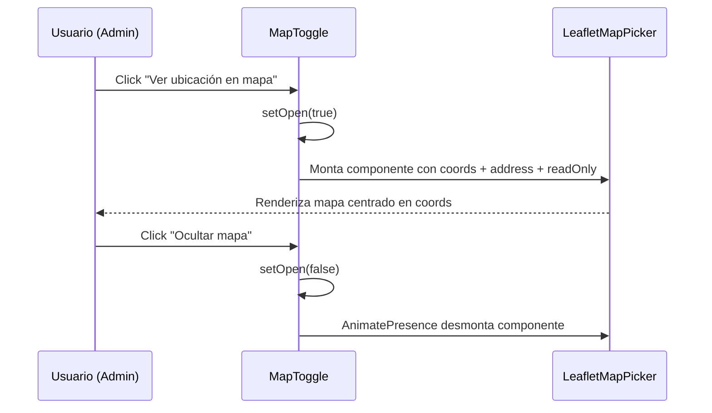

# MapToggle — Mapa Desplegable del Cliente

> **Origen:** Extraído de `src/pages/admin/AdminOrders.jsx` (líneas 25–58)
> **Categoría:** `Formularios_y_UI / Mapa_Desplegable`
> **Estado:** ✅ Estable — Producción

---

## 1. Propósito y Casos de Uso

Componente de UI mínimo y autocontenido que muestra u oculta un mapa interactivo de sólo lectura mediante un toggle animado. Encapsula el estado local `open` para no contaminar el store del padre.

**Cuándo usarlo:**
- En tarjetas de pedidos del panel admin para visualizar la ubicación de entrega del cliente.
- En paneles de detalle de clientes o reclamos donde se quiere mostrar la dirección geolocalizanda de forma no intrusiva.
- Siempre que se tenga un par `{ lat, lng }` almacenado en Firestore y se quiera presentarlo con un clic, sin ocupar espacio por defecto.

**Cuándo NO usarlo:**
- Si se necesita que el mapa permita seleccionar o mover el pin → usar `LeafletMapPicker` directamente en modo editable.
- Si el mapa debe estar siempre visible → renderizar `LeafletMapPicker` directo sin envolver en este toggle.

---

## 2. Especificación Visual y Estilos

| Elemento | Estilo aplicado |
|---|---|
| Botón trigger | `flex items-center gap-1.5 text-[11px] font-bold text-primary hover:underline transition-all` |
| Ícono de pin | SVG inline 13×13px, `stroke="currentColor"`, sin dependencia de lucide-react |
| Texto toggle | `"Ver ubicación en mapa"` / `"Ocultar mapa"` según estado |
| Contenedor animado | `motion.div` con `height: 0 → auto` + `opacity: 0 → 1`, clase `mt-2 overflow-hidden` |
| Envoltorio raíz | `<div className="mt-2">` — separación vertical del elemento anterior |

**Variables CSS dependientes:** `--color-primary` (heredado del tema global HSL).

---

## 3. Props y API

| Prop | Tipo | Requerido | Descripción |
|---|---|---|---|
| `coords` | `{ lat: number, lng: number }` | ✅ | Coordenadas geográficas a mostrar en el mapa. |
| `address` | `string` | ✅ | Dirección textual del cliente (se pasa a `LeafletMapPicker` como label). |

> **Nota de seguridad:** El componente no valida internamente si `coords.lat` existe. El padre debe condicionar su renderizado: `{order.cliente?.coords?.lat && <MapToggle ... />}`.

---

## 4. Código React Completo y 100% Funcional

```jsx
import { useState } from 'react'
import { motion, AnimatePresence } from 'framer-motion'
import LeafletMapPicker from '../../components/ui/LeafletMapPicker'

/**
 * MapToggle
 * Muestra u oculta un mapa de sólo lectura con animación de altura.
 *
 * @param {{ lat: number, lng: number }} coords  Coordenadas del cliente.
 * @param {string} address                       Dirección textual.
 */
function MapToggle({ coords, address }) {
  const [open, setOpen] = useState(false)

  return (
    <div className="mt-2">
      <button
        type="button"
        onClick={() => setOpen(v => !v)}
        className="flex items-center gap-1.5 text-[11px] font-bold text-primary hover:underline transition-all"
      >
        {/* Ícono de pin inline — sin lucide */}
        <svg
          viewBox="0 0 24 24"
          width="13"
          height="13"
          stroke="currentColor"
          fill="none"
          strokeWidth="2"
          strokeLinecap="round"
          strokeLinejoin="round"
        >
          <path d="M21 10c0 7-9 13-9 13s-9-6-9-13a9 9 0 0 1 18 0z"/>
          <circle cx="12" cy="10" r="3"/>
        </svg>
        {open ? 'Ocultar mapa' : 'Ver ubicación en mapa'}
      </button>

      <AnimatePresence>
        {open && (
          <motion.div
            initial={{ opacity: 0, height: 0 }}
            animate={{ opacity: 1, height: 'auto' }}
            exit={{ opacity: 0, height: 0 }}
            className="mt-2 overflow-hidden"
          >
            <LeafletMapPicker
              address={address}
              coords={coords}
              readOnly={true}
            />
          </motion.div>
        )}
      </AnimatePresence>
    </div>
  )
}

export default MapToggle
```

---

## 5. Lógica de Estado y Ciclo de Vida

| Estado | Tipo | Valor inicial | Descripción |
|---|---|---|---|
| `open` | `boolean` | `false` | Controla la visibilidad del mapa. |

- **No hay efectos secundarios (`useEffect`)** — el componente es puramente reactivo al click del botón.
- **Sin comunicación hacia arriba** — el toggle es completamente autocontenido; el padre no necesita saber si el mapa está abierto.
- **`AnimatePresence`** garantiza que el mapa se desmonta limpiamente de Leaflet al cerrar (evita memory leaks del mapa).

---

## 6. Integración con Servicios Externos

| Servicio | Rol | Nota |
|---|---|---|
| `LeafletMapPicker` | Renderizador del mapa | Componente interno documentado en `/Formularios_y_UI/Mapa_Interactivo/mapa_interactivo.md`. Opera en modo `readOnly={true}`: sin eventos de click ni drag. |
| Nominatim / OpenStreetMap | Proveedor de tiles | Encapsulado dentro de `LeafletMapPicker`. Sin API key requerida. |

---

## 7. Flujo Operativo y Secuencia de Interacción



---

## 8. Ejemplo de Uso

```jsx
// En AdminOrders.jsx — dentro del panel expandido de la tarjeta de pedido:
{order.cliente?.coords?.lat && (
  <MapToggle
    coords={order.cliente.coords}
    address={order.cliente.direccion}
  />
)}
```

```jsx
// En un panel de detalle de cliente / reclamo:
{claim.cliente?.geoLocation && (
  <MapToggle
    coords={claim.cliente.geoLocation}
    address={claim.cliente.direccionTexto || 'Sin dirección registrada'}
  />
)}
```

---

## 9. Origen

| Campo | Valor |
|---|---|
| **Archivo fuente** | `src/pages/admin/AdminOrders.jsx` |
| **Líneas originales** | 25–58 |
| **Fecha de extracción** | 2026-05-29 |
| **Extraído por** | Protocolo `@extraer-componente` — Antigravity AI |
| **Motivo de extracción** | Patrón reutilizable para visualización de ubicación en múltiples vistas admin (pedidos, reclamos, perfil de cliente). |
