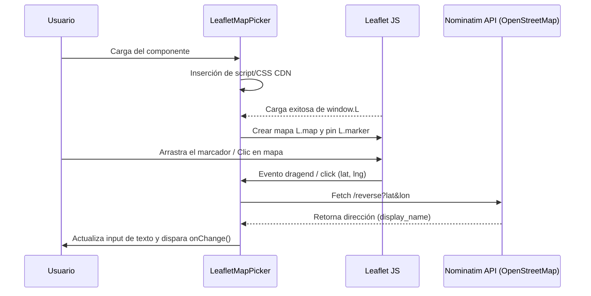

<!--
{
  "technicalName": "LeafletMapPicker",
  "targetPath": "src/components/ui/LeafletMapPicker.jsx",
  "dependencies": {
    "npm": {},
    "internal": []
  },
  "type": "component",
  "niches": [
    "contractors",
    "machinery_rental",
    "laundry",
    "grocery_food",
    "distribucion-horeca"
  ]
}
-->

# Mapa Interactivo (LeafletMapPicker)

## 1. Propósito y Casos de Uso
El componente `LeafletMapPicker` provee una interfaz gráfica interactiva para buscar, seleccionar y visualizar ubicaciones geográficas sobre un mapa basado en **Leaflet** y **OpenStreetMap** de forma 100% gratuita y libre de APIs de pago (como Google Maps).

### Casos de Uso:
1. **Administración de Puntos de Entrega (Admin):** Permite al administrador mover un marcador (pin) de forma interactiva en el mapa, o bien buscar mediante dirección escrita, obteniendo automáticamente las coordenadas y la dirección física estandarizada gracias a geocodificación inversa con Nominatim.
2. **Checkout del Cliente (Visualización):** Muestra al cliente la ubicación exacta de retiro en tienda con un pin fijo y centrado de forma ágil y de solo lectura.

---

## 2. Especificación Visual y Estilos
* **Contenedor del Mapa:** Estilizado mediante clases de Tailwind CSS para lograr bordes redondeados premium (`rounded-2xl`), contorno sutil (`border border-app` o `border-slate-200`), fondo neutro de carga (`bg-surface-2` o `bg-slate-100`) y sombra interior (`shadow-inner`).
* **Marcadores y Tiles:** Utiliza las capas estándar de OpenStreetMap y el set de marcadores oficiales de Leaflet distribuidos por CDN.
* **Buscador (Admin):** Incluye una barra de búsqueda alineada con la estética HSL del sistema (inputs con borde suave, botones con efecto elástico active y estado loading animado en spinner circular).

---

## 3. Props y API del Componente

| Prop | Tipo | Default | Descripción |
|------|------|---------|-------------|
| `address` | `string` | `""` | Dirección en texto asociada. Se muestra en el popup en modo solo lectura. |
| `coords` | `object` | `null` | Coordenadas iniciales con la estructura `{ lat: number, lng: number }`. |
| `onChange` | `function` | `null` | Callback que se dispara cuando la ubicación cambia (por búsqueda, arrastre o clic). Recibe `({ address, barrio, ciudad, coords })`. |
| `readOnly` | `boolean` | `false` | Si es `true`, deshabilita el buscador, el arrastre del pin y los clics de cambio, funcionando solo como visor. |
| `themeClasses` | `object` | `defaultTheme` | Objeto de clases Tailwind opcionales para personalizar los estilos de marca blanca. |

---

## 4. Código React Completo y 100% Funcional (Decoupled Theme Classes)

```jsx
import React, { useEffect, useRef, useState } from 'react'

const defaultTheme = {
  input: "w-full h-11 pl-4 pr-12 rounded-xl bg-surface border border-app text-xs text-app focus:outline-none focus:border-primary transition-colors",
  gpsBtn: "absolute right-2 top-1/2 -translate-y-1/2 w-8 h-8 rounded-lg bg-surface-2 hover:bg-surface-3 border border-app flex items-center justify-center text-xs font-bold transition-all active:scale-90",
  searchBtn: "h-11 px-4 bg-primary text-[var(--color-text)] rounded-xl text-xs font-bold transition-all active:scale-95 shadow-sm hover:opacity-90 disabled:opacity-50 cursor-pointer flex items-center justify-center gap-1.5 shrink-0",
  errorText: "text-[11px] font-bold text-red-500",
  mapContainer: "relative w-full h-64 rounded-2xl overflow-hidden border border-app bg-surface-2 shadow-inner z-10",
  loader: "absolute inset-0 flex items-center justify-center bg-surface-2/80 text-xs text-muted font-semibold",
  helperText: "text-[10px] text-muted leading-relaxed font-medium"
}

/**
 * LeafletMapPicker Component
 * Reusable interactive map using Leaflet and OpenStreetMap.
 * Handles dynamic library loading and geolocation features (Nominatim API).
 */
export default function LeafletMapPicker({
  address,
  coords,
  onChange,
  readOnly = false,
  themeClasses = {}
}) {
  const containerRef = useRef(null)
  const mapRef = useRef(null)
  const markerRef = useRef(null)
  const [leafletLoaded, setLeafletLoaded] = useState(false)
  const [searchQuery, setSearchQuery] = useState('')
  const [searching, setSearching] = useState(false)
  const [errorMessage, setErrorMessage] = useState('')

  const classes = { ...defaultTheme, ...themeClasses }

  // Default coordinate (Bogotá, Colombia)
  const defaultCoords = { lat: 4.624335, lng: -74.063644 }
  const activeCoords = coords && coords.lat && coords.lng ? coords : defaultCoords

  // Dynamically load Leaflet script & CSS from unpkg CDN
  useEffect(() => {
    if (window.L) {
      setLeafletLoaded(true)
      return
    }

    const link = document.createElement('link')
    link.rel = 'stylesheet'
    link.href = 'https://unpkg.com/leaflet@1.9.4/dist/leaflet.css'
    document.head.appendChild(link)

    const script = document.createElement('script')
    script.src = 'https://unpkg.com/leaflet@1.9.4/dist/leaflet.js'
    script.onload = () => setLeafletLoaded(true)
    document.body.appendChild(script)
  }, [])

  // Initialize Leaflet Map
  useEffect(() => {
    if (!leafletLoaded || !containerRef.current) return

    // Clean up existing map instance
    if (mapRef.current) {
      mapRef.current.remove()
      mapRef.current = null
    }

    const L = window.L

    // Fix default marker icons path in Leaflet loaded via CDN
    delete L.Icon.Default.prototype._getIconUrl
    L.Icon.Default.mergeOptions({
      iconRetinaUrl: 'https://unpkg.com/leaflet@1.9.4/dist/images/marker-icon-2x.png',
      iconUrl: 'https://unpkg.com/leaflet@1.9.4/dist/images/marker-icon.png',
      shadowUrl: 'https://unpkg.com/leaflet@1.9.4/dist/images/marker-shadow.png'
    })

    // Create Map
    const map = L.map(containerRef.current, {
      zoomControl: !readOnly,
      attributionControl: false
    }).setView([activeCoords.lat, activeCoords.lng], 15)
    mapRef.current = map

    // Load OpenStreetMap tiles
    L.tileLayer('https://{s}.tile.openstreetmap.org/{z}/{x}/{y}.png', {
      maxZoom: 19
    }).addTo(map)

    // Add Marker
    const marker = L.marker([activeCoords.lat, activeCoords.lng], {
      draggable: !readOnly
    }).addTo(map)
    markerRef.current = marker

    // Bind popup if readOnly
    if (readOnly && address) {
      marker.bindPopup(`<div style="font-size: 11px; font-weight: bold; color: var(--color-text-app, #1f2937);">${address}</div>`).openPopup()
    }

    // Leaflet Events (For Admin Picker Mode)
    if (!readOnly) {
      marker.on('dragend', () => {
        const position = marker.getLatLng()
        handleReverseGeocode(position.lat, position.lng)
      })

      map.on('click', (e) => {
        const { lat, lng } = e.latlng
        marker.setLatLng([lat, lng])
        handleReverseGeocode(lat, lng)
      })
    }

    return () => {
      if (mapRef.current) {
        mapRef.current.remove()
        mapRef.current = null
      }
    }
  }, [leafletLoaded, readOnly])

  // Update marker position when coords prop changes externally
  useEffect(() => {
    if (mapRef.current && markerRef.current && coords && coords.lat && coords.lng) {
      const { lat, lng } = coords
      markerRef.current.setLatLng([lat, lng])
      mapRef.current.setView([lat, lng], mapRef.current.getZoom())
    }
  }, [coords])

  // Reverse Geocoding: Coords -> Address details (Nominatim)
  const handleReverseGeocode = async (lat, lng) => {
    try {
      const response = await fetch(
        `https://nominatim.openstreetmap.org/reverse?format=json&lat=${lat}&lon=${lng}&zoom=18&addressdetails=1`,
        { headers: { 'Accept-Language': 'es' } }
      )
      if (!response.ok) throw new Error('Network error')
      const data = await response.json()
      const addr = data.address || {}
      
      let street = addr.road || addr.pedestrian || addr.path || addr.suburb || addr.neighbourhood || ''
      let num = addr.house_number || ''
      let shortAddress = street
      if (street && num) {
        shortAddress = `${street} # ${num}`
      } else if (!street) {
        shortAddress = addr.amenity || addr.shop || addr.building || data.display_name?.split(',')[0] || `${lat.toFixed(6)}, ${lng.toFixed(6)}`
      }

      const city = addr.city || addr.town || addr.village || addr.municipality || ''
      const neighborhood = addr.neighbourhood || addr.suburb || addr.quarter || ''

      if (onChange) {
        onChange({
          address: shortAddress,
          barrio: neighborhood,
          ciudad: city,
          coords: { lat, lng }
        })
      }
    } catch (err) {
      console.error('Error reverse geocoding:', err)
      if (onChange) {
        onChange({
          address: `${lat.toFixed(6)}, ${lng.toFixed(6)}`,
          barrio: '',
          ciudad: '',
          coords: { lat, lng }
        })
      }
    }
  }

  // Forward Geocoding: Search query -> Coords (Nominatim)
  const handleSearch = async (e) => {
    if (e) e.preventDefault()
    if (!searchQuery.trim()) return

    setSearching(true)
    setErrorMessage('')

    try {
      let results = []
      const response = await fetch(
        `https://nominatim.openstreetmap.org/search?format=json&q=${encodeURIComponent(searchQuery)}&limit=1&addressdetails=1`,
        { headers: { 'Accept-Language': 'es' } }
      )
      if (response.ok) {
        results = await response.json()
      }

      if ((!results || results.length === 0) && searchQuery.trim().includes(' ')) {
        const words = searchQuery.trim().split(/\s+/)
        for (let i = words.length - 1; i > 0; i--) {
          const fallbackQuery = words.slice(0, i).join(' ')
          try {
            const fbResponse = await fetch(
              `https://nominatim.openstreetmap.org/search?format=json&q=${encodeURIComponent(fallbackQuery)}&limit=1&addressdetails=1`,
              { headers: { 'Accept-Language': 'es' } }
            )
            if (fbResponse.ok) {
              const fbResults = await fbResponse.json()
              if (fbResults && fbResults.length > 0) {
                results = fbResults
                break
              }
            }
          } catch (fbErr) {
            console.error('Error in fallback geocoding:', fbErr)
          }
        }
      }

      if (results && results.length > 0) {
        const { lat, lon, address: addr } = results[0]
        const latitude = parseFloat(lat)
        const longitude = parseFloat(lon)

        if (markerRef.current && mapRef.current) {
          markerRef.current.setLatLng([latitude, longitude])
          mapRef.current.setView([latitude, longitude], 16)
        }

        let street = addr?.road || addr?.pedestrian || addr?.path || addr?.suburb || addr?.neighbourhood || ''
        let num = addr?.house_number || ''
        let shortAddress = street
        if (street && num) {
          shortAddress = `${street} # ${num}`
        } else if (!street) {
          shortAddress = addr?.amenity || addr?.shop || addr?.building || results[0].display_name?.split(',')[0] || `${latitude.toFixed(6)}, ${longitude.toFixed(6)}`
        }

        const city = addr?.city || addr?.town || addr?.village || addr?.municipality || ''
        const neighborhood = addr?.neighbourhood || addr?.suburb || addr?.quarter || ''

        if (onChange) {
          onChange({
            address: shortAddress,
            barrio: neighborhood,
            ciudad: city,
            coords: { lat: latitude, lng: longitude }
          })
        }
      } else {
        setErrorMessage('No se encontró la dirección. Intenta ser más específico.')
      }
    } catch (err) {
      console.error('Error geocoding:', err)
      setErrorMessage('Error al realizar la búsqueda. Revisa tu conexión.')
    } finally {
      setSearching(false)
    }
  }

  // Get current GPS location
  const handleGPSLocation = (e) => {
    e.preventDefault()
    if (!navigator.geolocation) {
      setErrorMessage('La geolocalización no es soportada por tu navegador.')
      return
    }

    navigator.geolocation.getCurrentPosition(
      (position) => {
        const { latitude, longitude } = position.coords
        if (markerRef.current && mapRef.current) {
          markerRef.current.setLatLng([latitude, longitude])
          mapRef.current.setView([latitude, longitude], 16)
        }
        handleReverseGeocode(latitude, longitude)
      },
      (error) => {
        console.error('GPS error:', error)
        setErrorMessage('No se pudo acceder a tu ubicación GPS. Asegúrate de dar los permisos.')
      }
    )
  }

  return (
    <div className="space-y-3.5">
      {!readOnly && (
        <div className="flex gap-2">
          <div className="relative flex-1">
            <input
              type="text"
              value={searchQuery}
              onChange={(e) => setSearchQuery(e.target.value)}
              onKeyDown={(e) => {
                if (e.key === 'Enter') {
                  e.preventDefault()
                  handleSearch()
                }
              }}
              placeholder="Buscar dirección (ej: Carrera 15 # 12-45)..."
              className={classes.input}
            />
            <button
              type="button"
              onClick={handleGPSLocation}
              className={classes.gpsBtn}
              title="Usar mi ubicación GPS"
            >
              📍
            </button>
          </div>
          <button
            type="button"
            onClick={handleSearch}
            disabled={searching}
            className={classes.searchBtn}
          >
            {searching ? (
              <span className="w-4 h-4 border-2 border-white/30 border-t-white rounded-full animate-spin" />
            ) : (
              'Buscar'
            )}
          </button>
        </div>
      )}

      {errorMessage && (
        <p className={classes.errorText}>{errorMessage}</p>
      )}

      {/* Map Container */}
      <div className={classes.mapContainer}>
        {!leafletLoaded && (
          <div className={classes.loader}>
            Cargando mapa interactivo...
          </div>
        )}
        <div ref={containerRef} className="w-full h-full" />
      </div>

      {!readOnly && (
        <p className={classes.helperText}>
          💡 Puedes buscar por dirección, usar el botón GPS o hacer clic/arrastrar el marcador sobre el mapa para autocompletar la dirección.
        </p>
      )}
    </div>
  )
}
```

---

## 5. Lógica de Estado y Ciclo de Vida
* **`leafletLoaded` (State):** Controla el estado de descarga de los recursos externos del CDN. Evita inicializar el mapa antes de que `window.L` esté presente.
* **`containerRef`, `mapRef`, `markerRef` (Refs):** Almacenan las referencias del DOM y los objetos nativos del ciclo de vida de Leaflet. Esto previene re-renders innecesarios e inconsistencias lógicas en React.
* **Efecto de Geocodificación Inversa:** Al arrastrar el pin (`dragend`) o hacer clic en el mapa (`click`), se extraen las coordenadas latitud/longitud y se dispara un fetch a Nominatim para actualizar el valor textual en tiempo real.

---

## 6. Integración con Servicios Externos
* **OpenStreetMap (OSM):** Proveedor de la cuadrícula de imágenes de mapas (Tiles) de dominio público.
* **Nominatim API (OSM):** API gratuita y pública utilizada para geocodificación hacia adelante (texto a coordenadas) y geocodificación inversa (coordenadas a texto).

---

## 7. Flujo Operativo y Secuencia de Interacción



---

## 8. Ejemplo de Uso (Importación y Consumo)

### Modo Selector de Dirección (Vendedor/Admin):
```javascript
import { useState } from 'react'
import LeafletMapPicker from './LeafletMapPicker'

function ConfigStorePickup() {
  const [address, setAddress] = useState('')
  const [coords, setCoords] = useState(null)

  return (
    <div>
      <p>Dirección seleccionada: {address}</p>
      <LeafletMapPicker
        address={address}
        coords={coords}
        onChange={({ address, barrio, ciudad, coords }) => {
          setAddress(address)
          setCoords(coords)
          console.log("Barrio:", barrio, "Ciudad:", ciudad)
        }}
      />
    </div>
  )
}
```

### Modo Solo Lectura (Cliente/Checkout):
```javascript
import LeafletMapPicker from './LeafletMapPicker'

function ShowStoreLocation({ storeAddress, storeCoords }) {
  return (
    <LeafletMapPicker
      address={storeAddress}
      coords={storeCoords}
      readOnly={true}
    />
  )
}
```

---

## 9. Origen
* **Extraído de:** [App Ventas — LeafletMapPicker.jsx](file:///d:/Aplicaciones/App%20Ventas/src/components/ui/LeafletMapPicker.jsx)
* **Versión:** 1.2 (Generic Decoupled Styles)
