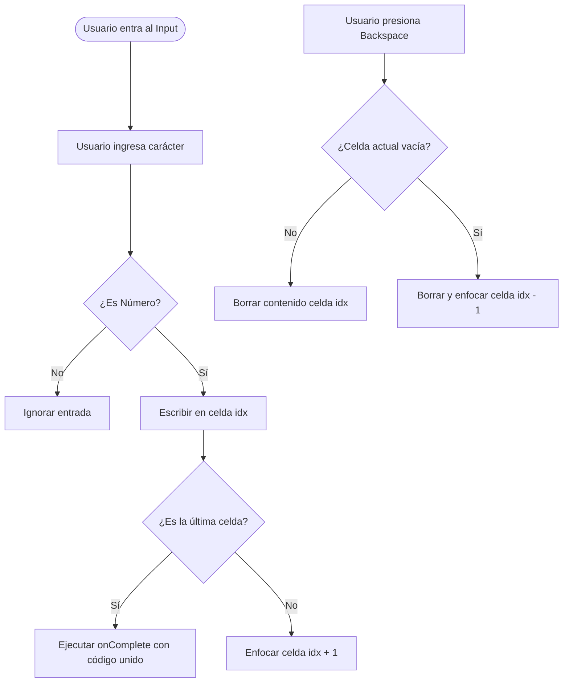

# OTPInputField — Entrada de Código de Verificación Celular

## 1. Propósito y Casos de Uso
El `OTPInputField` es un componente de formulario especializado para capturar contraseñas temporales de un solo uso (One-Time Password / PIN) enviadas por SMS, WhatsApp o correo electrónico. Su propósito es optimizar la fricción del usuario al ingresar credenciales numéricas eliminando la necesidad de escribir y presionar pestañas de forma manual.

### Casos de Uso Principales:
* **Autenticación sin Contraseña:** Validación de número de celular al loguearse en el portal de cliente.
* **Confirmación de Compras:** Validación de seguridad para retiros, abonos o compras a crédito.
* **Firmas de Documentos:** Firma de comprobantes de pago o de facturas comisionales del desarrollador.

---

## 2. Especificación Visual y Estilos
* **Inputs Individuales:** Cajas de entrada cuadradas independientes (`w-12 h-12` a `w-14 h-14` según el tamaño de la pantalla).
* **Estados Activos:** Borde brillante HSL de marca en foco (`focus:border-indigo-500 focus:ring-4 focus:ring-indigo-500/10`).
* **Estados Completos:** Indicador visual (color de fondo o borde sutil) cuando la celda tiene un dígito ingresado.
* **Navegación Fluida:** Transición de escala suave en foco para dar feedback táctil elástico al escribir.

---

## 3. Código React Completo y 100% Funcional
Este componente es autocontenido y maneja eventos de teclado complejos como saltar automáticamente hacia adelante, retroceder con el botón borrar (`Backspace`), y distribuir un PIN copiado completo desde el portapapeles.

```jsx
import React, { useRef, useState, useEffect } from 'react';

/**
 * OTPInputField Component
 * @param {number} length - Cantidad de celdas de entrada (ej: 4 o 6).
 * @param {function} onComplete - Callback que recibe el código completo cuando se llenan todos los campos.
 * @param {boolean} disabled - Estado deshabilitado del componente.
 */
export default function OTPInputField({
  length = 4,
  onComplete = () => {},
  disabled = false
}) {
  const [otp, setOtp] = useState(Array(length).fill(''));
  const inputsRef = useRef([]);

  // Inicializar referencias
  useEffect(() => {
    inputsRef.current = inputsRef.current.slice(0, length);
  }, [length]);

  // Manejar el cambio individual de cada celda
  const handleChange = (index, value) => {
    // Aceptar solo números
    const cleanValue = value.replace(/[^0-9]/g, '');
    if (!cleanValue) return;

    const newOtp = [...otp];
    // Tomar solo el último dígito ingresado
    newOtp[index] = cleanValue.substring(cleanValue.length - 1);
    setOtp(newOtp);

    // Disparar el callback de completado si es el último campo
    const combinedOtp = newOtp.join('');
    if (combinedOtp.length === length) {
      onComplete(combinedOtp);
    }

    // Saltar automáticamente al siguiente input si hay valor
    if (cleanValue && index < length - 1) {
      inputsRef.current[index + 1]?.focus();
    }
  };

  // Manejar acciones especiales del teclado
  const handleKeyDown = (index, e) => {
    if (e.key === 'Backspace') {
      const newOtp = [...otp];
      
      if (otp[index] === '') {
        // Si la celda actual ya está vacía, borrar la anterior y enfocarla
        if (index > 0) {
          newOtp[index - 1] = '';
          setOtp(newOtp);
          inputsRef.current[index - 1]?.focus();
        }
      } else {
        // Borrar el valor de la celda actual
        newOtp[index] = '';
        setOtp(newOtp);
      }
    }
  };

  // Manejar el evento de pegar contenido (paste) completo
  const handlePaste = (e) => {
    e.preventDefault();
    const pastedData = e.clipboardData.getData('text/plain').replace(/[^0-9]/g, '').substring(0, length);
    
    if (pastedData) {
      const newOtp = [...otp];
      for (let i = 0; i < length; i++) {
        newOtp[i] = pastedData[i] || '';
      }
      setOtp(newOtp);

      // Enfocar el último campo con datos o el primero vacío
      const focusIndex = Math.min(pastedData.length, length - 1);
      inputsRef.current[focusIndex]?.focus();

      if (pastedData.length === length) {
        onComplete(pastedData);
      }
    }
  };

  return (
    <div className="flex justify-center gap-3 w-full max-w-xs mx-auto">
      {Array.from({ length }).map((_, idx) => (
        <input
          key={idx}
          ref={(el) => (inputsRef.current[idx] = el)}
          type="text"
          inputMode="numeric"
          pattern="[0-9]*"
          maxLength={1}
          value={otp[idx]}
          disabled={disabled}
          onChange={(e) => handleChange(idx, e.target.value)}
          onKeyDown={(e) => handleKeyDown(idx, e)}
          onPaste={handlePaste}
          className={`w-12 h-12 sm:w-14 sm:h-14 text-center text-lg font-black bg-[var(--color-surface-2)] border rounded-2xl outline-none text-[var(--color-text)] transition-all select-all focus:scale-105 ${
            otp[idx] 
              ? 'border-indigo-500/60 ring-2 ring-indigo-500/10' 
              : 'border-[var(--color-border)]'
          } focus:border-indigo-500 focus:ring-4 focus:ring-indigo-500/15 disabled:opacity-40 disabled:cursor-not-allowed`}
        />
      ))}
    </div>
  );
}
```

---

## 4. Lógica de Estado y Ciclo de Vida
1. **Representación de Estado en Array:** El código OTP se maneja internamente como un array de strings de longitud igual a la prop `length` (por defecto 4). Esto facilita el borrado y rellenado controlado celda por celda.
2. **Ciclo de Enfoque Avanzado (Ref Array):** Se mantiene un `useRef` que apunta a un array de elementos inputs del DOM. Se usa para mover el foco dinámicamente (`.focus()`) hacia adelante al escribir o hacia atrás al borrar.
3. **Optimización de Copiado (Clipboard API):** Al capturar el evento `onPaste`, el componente extrae el texto plano, purga cualquier letra o carácter especial no numérico y distribuye ordenadamente los primeros números en los inputs.

---

## 5. Flujo Operativo y Secuencia de Interacción

