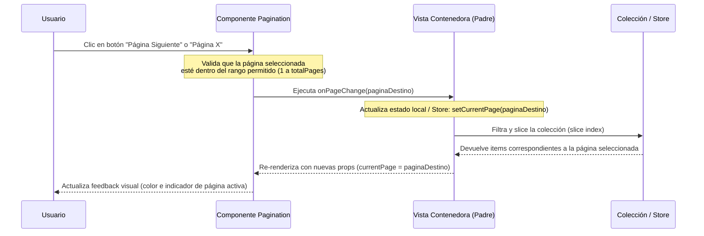

<!--
{
  "technicalName": "Pagination",
  "targetPath": "src/components/ui/Pagination.jsx",
  "dependencies": {
    "npm": {},
    "internal": []
  },
  "type": "component",
  "niches": []
}
-->

# Componente de Paginación Fluida (`Pagination.jsx`)

## 1. Propósito y Casos de Uso
El componente `Pagination` es un control de interfaz táctil y responsivo que gestiona la división de colecciones de datos extensas (como catálogos de productos, listas de pedidos, historiales de transacciones y reclamos de clientes) en bloques de visualización paginados. 
Calcula dinámicamente un rango de páginas visible alrededor del número de página seleccionado, insertando puntos suspensivos (`...`) en los extremos donde existan páginas ocultas mediante un algoritmo inteligente de vecindad (`siblingCount`).

> [!IMPORTANT]
> **Regla de Activación y Límite de Visualización:**
> El componente tiene configurado un límite máximo de visualización de **10 elementos por página** en los módulos que lo consumen. Para evitar ruido visual innecesario, el componente **se activa y aparece automáticamente sólo cuando el total de elementos de la colección supera este límite de 10 elementos** (es decir, cuando `totalPages > 1`). Si hay 10 o menos elementos, retorna `null` y se oculta de forma transparente.

## 2. Especificación Visual y Estilos (Tailwind CSS)
- **Contenedores y botones:** Maquetación responsiva con Flexbox. Los botones de página usan el fondo de superficie (`bg-surface`), texto por defecto de la aplicación (`text-app`), bordes redondeados unificados con el radio base corporativo (`borderRadius: 'var(--radius-base)'`), y bordes suaves de marca (`border-primary-soft` / `hover:border-primary`) con fondos reactivos (`hover:bg-surface-2`).
- **Página Seleccionada:** Resaltado de foco premium empleando colores del tema activo (`bg-primary`, `text-white`, `border-primary`) y una sombra de realce elástica (`shadow-md shadow-primary/20`).
- **Interactividad y Micro-animaciones:** Los botones numéricos usan micro-escalados interactivos al tacto (`whileTap={{ scale: 0.95 }}`) implementados con Framer Motion, y transiciones elásticas suavizadas en propiedades de color.
- **Iconografía Integrada:** Los controles de navegación (flechas de retroceso y avance) utilizan trazados SVG puros integrados con un grosor optimizado de trazo (`strokeWidth="2.5"`) para garantizar una perfecta visualización en pantallas móviles sin requerir dependencias externas de íconos.

## 3. Props y API del Componente
El componente es puramente stateless (sin estado de negocio interno) y se comunica en cascada ascendente mediante callbacks:

| Prop | Tipo | Default | Descripción |
| :--- | :--- | :--- | :--- |
| `currentPage` | `Number` | *Requerido* | Número de página seleccionado actualmente (basado en 1). |
| `totalPages` | `Number` | *Requerido* | Cantidad total de páginas disponibles basadas en la colección de origen. |
| `onPageChange` | `Function` | *Requerido* | Callback disparado cuando el usuario hace clic en un número de página o flecha. Recibe la página destino como parámetro `(page)`. |
| `siblingCount` | `Number` | `1` | Cantidad de páginas vecinas que se mostrarán visibles a la izquierda y derecha de la página seleccionada. |

## 4. Código React Completo y 100% Funcional
```jsx
import React from 'react'
import { motion } from 'framer-motion'

export default function Pagination({
  currentPage,
  totalPages,
  onPageChange,
  siblingCount = 1
}) {
  if (totalPages <= 1) return null

  // Rango de páginas a mostrar
  const range = (start, end) => {
    let length = end - start + 1
    return Array.from({ length }, (_, idx) => idx + start)
  }

  const fetchPageNumbers = () => {
    const totalNumbers = siblingCount * 2 + 5
    const totalBlocks = totalNumbers + 2

    if (totalPages > totalBlocks) {
      const startPage = Math.max(2, currentPage - siblingCount)
      const endPage = Math.min(totalPages - 1, currentPage + siblingCount)
      let pages = range(startPage, endPage)

      const hasLeftSpill = startPage > 2
      const hasRightSpill = totalPages - endPage > 1
      const spillOffset = totalNumbers - (pages.length + 1)

      switch (true) {
        // Caso 1: Spill a la derecha
        case !hasLeftSpill && hasRightSpill: {
          const extraPages = range(endPage + 1, endPage + spillOffset)
          pages = [...pages, ...extraPages]
          return [1, ...pages, '...', totalPages]
        }

        // Caso 2: Spill a la izquierda
        case hasLeftSpill && !hasRightSpill: {
          const extraPages = range(startPage - spillOffset, startPage - 1)
          pages = [...extraPages, ...pages]
          return [1, '...', ...pages, totalPages]
        }

        // Caso 3: Spill a ambos lados
        case hasLeftSpill && hasRightSpill:
        default: {
          return [1, '...', ...pages, '...', totalPages]
        }
      }
    }

    return range(1, totalPages)
  }

  const pageNumbers = fetchPageNumbers()

  return (
    <div className="flex items-center justify-center gap-1.5 mt-8 mb-4 select-none">
      {/* Botón Anterior */}
      <button
        onClick={() => currentPage > 1 && onPageChange(currentPage - 1)}
        disabled={currentPage === 1}
        className="w-10 h-10 rounded-xl flex items-center justify-center border border-primary-soft bg-surface text-app disabled:opacity-40 hover:bg-surface-2 transition-all active:scale-95 cursor-pointer disabled:cursor-not-allowed"
        style={{ borderRadius: 'var(--radius-base)' }}
        aria-label="Página anterior"
      >
        <svg className="w-5 h-5" fill="none" stroke="currentColor" viewBox="0 0 24 24" strokeWidth="2.5">
          <path strokeLinecap="round" strokeLinejoin="round" d="M15 19l-7-7 7-7" />
        </svg>
      </button>

      {/* Números de Página */}
      <div className="flex items-center gap-1">
        {pageNumbers.map((page, index) => {
          if (page === '...') {
            return (
              <span
                key={`ellipsis-${index}`}
                className="w-10 h-10 flex items-center justify-center text-muted font-bold"
              >
                &bull;&bull;&bull;
              </span>
            )
          }

          const isSelected = page === currentPage

          return (
            <motion.button
              key={`page-${page}`}
              whileTap={{ scale: 0.95 }}
              onClick={() => onPageChange(page)}
              className={`w-10 h-10 rounded-xl font-bold text-sm transition-all flex items-center justify-center border cursor-pointer ${
                isSelected
                  ? 'bg-primary text-[var(--color-text)] border-primary shadow-md shadow-primary/20'
                  : 'bg-surface text-app border-primary-soft hover:border-primary hover:bg-surface-2'
              }`}
              style={{ borderRadius: 'var(--radius-base)' }}
            >
              {page}
            </motion.button>
          )
        })}
      </div>

      {/* Botón Siguiente */}
      <button
        onClick={() => currentPage < totalPages && onPageChange(currentPage + 1)}
        disabled={currentPage === totalPages}
        className="w-10 h-10 rounded-xl flex items-center justify-center border border-primary-soft bg-surface text-app disabled:opacity-40 hover:bg-surface-2 transition-all active:scale-95 cursor-pointer disabled:cursor-not-allowed"
        style={{ borderRadius: 'var(--radius-base)' }}
        aria-label="Página siguiente"
      >
        <svg className="w-5 h-5" fill="none" stroke="currentColor" viewBox="0 0 24 24" strokeWidth="2.5">
          <path strokeLinecap="round" strokeLinejoin="round" d="M9 5l7 7-7 7" />
        </svg>
      </button>
    </div>
  )
}
```

## 5. Lógica de Estado y Ciclo de Vida
El componente es un **Control de Presentación Puro** (Stateless):
- No posee manejadores de ciclo de vida (`useEffect`) propios ni variables locales persistentes de estado React.
- El cálculo matemático de los puntos de interrupción (`fetchPageNumbers`) se ejecuta síncronamente durante el flujo de renderizado en base a las propiedades recibidas (`currentPage`, `totalPages`, `siblingCount`).
- Dispara callbacks hacia componentes contenedores (`onPageChange`), delegando la persistencia y control del estado de página a stores reactivos (ej. Zustand) o hooks locales del módulo padre.

## 6. Integración con Servicios Externos
Agnóstico de servicios externos:
- No requiere llamadas directas de red ni conexiones Firebase Firestore.
- Para integrarlo con consultas paginadas del servidor, el componente contenedor padre debe mapear el índice de página activa a desplazamientos de consulta (`startAfter` o saltos offset en Firestore/API).

## 7. Flujo Operativo y Secuencia de Interacción


## 8. Ejemplo de Uso (Importación y Consumo)
```jsx
import React, { useState, useMemo } from 'react'
import Pagination from '../../components/ui/Pagination'

export default function CatalogView() {
  const [currentPage, setCurrentPage] = useState(1)
  const items = [/* ... tus datos de origen ... */]
  const ITEMS_PER_PAGE = 10

  const totalPages = Math.ceil(items.length / ITEMS_PER_PAGE)
  const paginatedItems = useMemo(() => {
    return items.slice(
      (currentPage - 1) * ITEMS_PER_PAGE,
      currentPage * ITEMS_PER_PAGE
    )
  }, [items, currentPage])

  return (
    <div>
      <div className="list-container">
        {paginatedItems.map(item => (
          <div key={item.id}>{item.nombre}</div>
        ))}
      </div>

      <Pagination
        currentPage={currentPage}
        totalPages={totalPages}
        onPageChange={setCurrentPage}
        siblingCount={1}
      />
    </div>
  )
}
```

## 9. Origen
- **Extraído de:** [Pagination.jsx](file:///d:/Aplicaciones/App%20Ventas/src/components/ui/Pagination.jsx)
- **Fecha de extracción:** 2026-05-30
- **Versión:** 1.2 (Soporte HSL integrado y animaciones táctiles)
