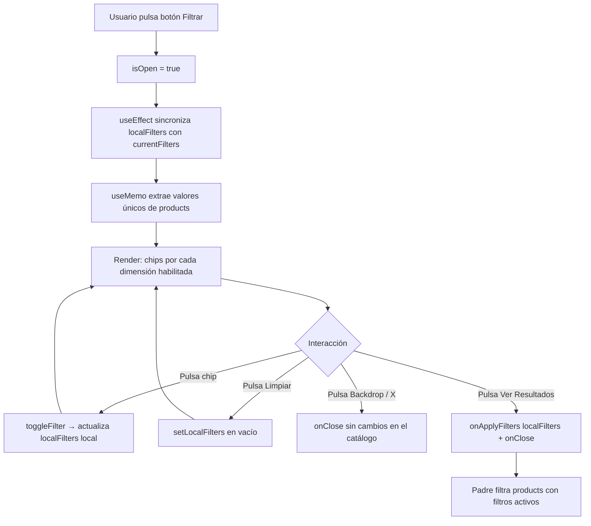

# Panel de Filtros de Catálogo (FilterPanel)

## 1. Propósito y Casos de Uso

Bottom sheet / drawer mobile-first que permite al usuario filtrar un listado de productos por múltiples dimensiones dinámicas (colores, tallas, atributos personalizados). Diseñado para catálogos de cualquier dominio:

- **E-commerce de ropa/calzado:** Filtrar por talla, color y material.
- **Catálogo de servicios:** Filtrar por categoría, precio y duración.
- **Directorio de proveedores:** Filtrar por región, tipo y certificación.
- **Marketplace:** Filtrar por condición, envío y valoración.

**Uso actual en App Ventas:** `src/components/client/catalog/ClientFilterModal.jsx`. Se abre desde la barra de búsqueda del catálogo del cliente al pulsar el ícono de filtros. Extrae dinámicamente los valores únicos de los productos recibidos.

---

## 2. Especificación Visual y Estilos

### Variables CSS Requeridas
```css
--bg-surface        /* Fondo del panel/drawer */
--bg-surface-2      /* Fondo secundario (header/footer del panel) */
--text-primary      /* Texto principal */
--text-muted        /* Texto secundario/mutado */
--color-primary     /* Color de acento (chips activos, botón aplicar) */
--border-app        /* Color del borde estándar */
--radius-base       /* Radio de borde base */
```

### Características Visuales
- **Mobile:** Drawer deslizante desde abajo (`translateY`), `border-radius` en esquinas superiores, ocupa máx. 85vh.
- **Desktop (≥640px):** Modal centrado con `max-w-md`, bordes redondeados completos.
- **Chips de filtro:** `border-2`, toggle activo/inactivo con fondo primario vs transparente.
- **Animación:** CSS puro — `@keyframes fp-slide-up` para entrada, sin dependencia de framer-motion.
- **Backdrop:** Overlay semitransparente con `backdrop-filter: blur(4px)`.

---

## 3. Props y API del Componente

| Prop | Tipo | Default | Descripción |
|------|------|---------|-------------|
| `isOpen` | `boolean` | `false` | Controla si el panel es visible. |
| `onClose` | `() => void` | **requerido** | Callback al cerrar el panel (botón X o backdrop). |
| `products` | `Array<Product>` | `[]` | Lista completa de productos para extraer valores únicos de filtro. |
| `onApplyFilters` | `(filters: object) => void` | **requerido** | Callback con el objeto de filtros activos al pulsar "Ver Resultados". |
| `currentFilters` | `object` | `{}` | Filtros actualmente activos (para sincronizar el estado local al abrir). |
| `config` | `FilterConfig` | Ver default | Configuración de dimensiones de filtro habilitadas. |

### Estructura de `config`
```js
{
  colors: true,                     // Mostrar sección de colores
  sizes: true,                      // Mostrar sección de tallas
  customAttributes: [               // Atributos personalizados (opcional)
    { id: 'material', name: 'Material' },
    { id: 'temporada', name: 'Temporada' }
  ]
}
```

### Estructura del objeto `filters` (retornado por `onApplyFilters`)
```js
{
  colors: ['Rojo', 'Azul'],           // Array de colores seleccionados
  sizes: ['M', 'L'],                  // Array de tallas seleccionadas
  material: ['Algodón'],              // Clave dinámica por customAttribute.id
}
```

### Estructura del objeto `Product` (mínima requerida)
```js
{
  variantes: [
    { color: string, talla: string, stock: number }
  ],
  atributos: {
    material: string,    // Coincide con customAttribute.id
  }
}
```

---

## 4. Código React Completo y 100% Funcional

```jsx
import { useState, useMemo, useEffect } from 'react'

// ─── Íconos SVG inline ───────────────────────────────────────────────────────
const IconX = () => (
  <svg width={18} height={18} viewBox="0 0 24 24" fill="none"
    stroke="currentColor" strokeWidth={2.5} strokeLinecap="round" strokeLinejoin="round">
    <line x1="18" y1="6" x2="6" y2="18" />
    <line x1="6" y1="6" x2="18" y2="18" />
  </svg>
)
const IconFilter = () => (
  <svg width={18} height={18} viewBox="0 0 24 24" fill="none"
    stroke="currentColor" strokeWidth={2} strokeLinecap="round" strokeLinejoin="round">
    <polygon points="22 3 2 3 10 12.46 10 19 14 21 14 12.46 22 3" />
  </svg>
)
const IconTrash = () => (
  <svg width={16} height={16} viewBox="0 0 24 24" fill="none"
    stroke="currentColor" strokeWidth={2} strokeLinecap="round" strokeLinejoin="round">
    <polyline points="3 6 5 6 21 6" />
    <path d="M19 6l-1 14a2 2 0 0 1-2 2H8a2 2 0 0 1-2-2L5 6" />
    <path d="M10 11v6M14 11v6" />
    <path d="M9 6V4a1 1 0 0 1 1-1h4a1 1 0 0 1 1 1v2" />
  </svg>
)

// ─── Configuración por defecto ────────────────────────────────────────────────
const DEFAULT_CONFIG = {
  colors: true,
  sizes: true,
  customAttributes: []
}

// ─── Estilos de animación ─────────────────────────────────────────────────────
const KEYFRAMES = `
  @keyframes fp-slide-up {
    from { transform: translateY(100%); opacity: 0; }
    to   { transform: translateY(0);    opacity: 1; }
  }
  @keyframes fp-fade-in {
    from { opacity: 0; }
    to   { opacity: 1; }
  }
`

// ─── Componente Principal ─────────────────────────────────────────────────────
export default function FilterPanel({
  isOpen,
  onClose,
  products = [],
  onApplyFilters,
  currentFilters = {},
  config = DEFAULT_CONFIG
}) {
  const [localFilters, setLocalFilters] = useState(currentFilters)

  // Sincroniza filtros locales cada vez que se abre el panel
  useEffect(() => {
    if (isOpen) setLocalFilters(currentFilters)
  }, [isOpen, currentFilters])

  // Extrae valores únicos de los productos
  const uniqueOptions = useMemo(() => {
    const colors = new Set()
    const sizes  = new Set()
    const dynamicAttrs = {}

    config.customAttributes?.forEach(attr => {
      dynamicAttrs[attr.id] = new Set()
    })

    products.forEach(p => {
      p.variantes?.forEach(v => {
        if (v.color) colors.add(v.color)
        if (v.talla) sizes.add(v.talla)
      })
      config.customAttributes?.forEach(attr => {
        const val = p.atributos?.[attr.id]
        if (val) dynamicAttrs[attr.id].add(val)
      })
    })

    const result = {
      colors: Array.from(colors).filter(Boolean).sort(),
      sizes:  Array.from(sizes).filter(Boolean).sort()
    }
    config.customAttributes?.forEach(attr => {
      result[attr.id] = Array.from(dynamicAttrs[attr.id]).filter(Boolean).sort()
    })
    return result
  }, [products, config.customAttributes])

  const toggleFilter = (category, value) => {
    setLocalFilters(prev => {
      const list = prev[category] || []
      return {
        ...prev,
        [category]: list.includes(value)
          ? list.filter(i => i !== value)
          : [...list, value]
      }
    })
  }

  const handleApply = () => {
    onApplyFilters(localFilters)
    onClose()
  }

  const handleClearAll = () => setLocalFilters({})

  const totalActive = Object.values(localFilters).flat().length
  const hasAnyOption = Object.values(uniqueOptions).some(arr => arr.length > 0)

  if (!isOpen) return null

  return (
    <>
      <style>{KEYFRAMES}</style>

      {/* Portal-like fixed overlay */}
      <div style={{
        position: 'fixed', inset: 0, zIndex: 60,
        display: 'flex', alignItems: 'flex-end',
        justifyContent: 'center',
      }}>
        {/* Backdrop */}
        <div
          onClick={onClose}
          style={{
            position: 'absolute', inset: 0,
            background: 'rgba(0,0,0,0.5)',
            backdropFilter: 'blur(4px)',
            animation: 'fp-fade-in 0.2s ease'
          }}
        />

        {/* Panel */}
        <div style={{
          position: 'relative', width: '100%', maxWidth: 448,
          background: 'var(--bg-surface)',
          borderRadius: '24px 24px 0 0',
          boxShadow: '0 -8px 40px rgba(0,0,0,.18)',
          display: 'flex', flexDirection: 'column',
          maxHeight: '85vh',
          animation: 'fp-slide-up 0.22s ease',
          border: '1px solid var(--border-app)'
        }}>
          {/* Header */}
          <div style={{
            display: 'flex', alignItems: 'center', justifyContent: 'space-between',
            padding: '20px 20px 16px',
            borderBottom: '1px solid var(--border-app)',
            background: 'var(--bg-surface-2)',
            borderRadius: '24px 24px 0 0'
          }}>
            <h2 style={{
              display: 'flex', alignItems: 'center', gap: 8,
              fontSize: 17, fontWeight: 700, color: 'var(--text-primary)', margin: 0
            }}>
              <span style={{ color: 'var(--color-primary)' }}><IconFilter /></span>
              Filtrar Búsqueda
            </h2>
            <button
              onClick={onClose}
              aria-label="Cerrar filtros"
              style={{
                width: 32, height: 32, borderRadius: '50%', border: 'none',
                background: 'var(--bg-surface)', color: 'var(--text-muted)',
                cursor: 'pointer', display: 'flex', alignItems: 'center', justifyContent: 'center',
                boxShadow: '0 1px 4px rgba(0,0,0,.08)'
              }}
            >
              <IconX />
            </button>
          </div>

          {/* Body */}
          <div style={{ flex: 1, overflowY: 'auto', padding: '20px', display: 'flex', flexDirection: 'column', gap: 24 }}>
            {!hasAnyOption ? (
              <div style={{ textAlign: 'center', padding: '40px 0', color: 'var(--text-muted)', fontSize: 14 }}>
                No hay filtros disponibles para los productos actuales.
              </div>
            ) : (
              <>
                {/* Atributos personalizados dinámicos */}
                {config.customAttributes?.map(attr => {
                  const options = uniqueOptions[attr.id] || []
                  if (options.length === 0) return null
                  return (
                    <FilterSection key={attr.id} title={attr.name}>
                      {options.map(opt => (
                        <FilterChip
                          key={opt}
                          label={opt}
                          active={localFilters[attr.id]?.includes(opt)}
                          onClick={() => toggleFilter(attr.id, opt)}
                        />
                      ))}
                    </FilterSection>
                  )
                })}

                {/* Colores */}
                {config.colors && uniqueOptions.colors.length > 0 && (
                  <FilterSection title="Color">
                    {uniqueOptions.colors.map(color => (
                      <FilterChip
                        key={color}
                        label={color}
                        active={localFilters.colors?.includes(color)}
                        onClick={() => toggleFilter('colors', color)}
                      />
                    ))}
                  </FilterSection>
                )}

                {/* Tallas */}
                {config.sizes && uniqueOptions.sizes.length > 0 && (
                  <FilterSection title="Talla">
                    {uniqueOptions.sizes.map(size => (
                      <FilterChip
                        key={size}
                        label={size}
                        active={localFilters.sizes?.includes(size)}
                        onClick={() => toggleFilter('sizes', size)}
                      />
                    ))}
                  </FilterSection>
                )}
              </>
            )}
          </div>

          {/* Footer */}
          <div style={{
            padding: '16px 20px',
            borderTop: '1px solid var(--border-app)',
            background: 'var(--bg-surface-2)',
            display: 'flex', gap: 12
          }}>
            <button
              onClick={handleClearAll}
              disabled={totalActive === 0}
              aria-label="Limpiar filtros"
              style={{
                flex: 1, height: 48, borderRadius: 12,
                background: 'var(--bg-surface)',
                border: '1px solid var(--border-app)',
                color: 'var(--text-primary)',
                display: 'flex', alignItems: 'center', justifyContent: 'center', gap: 6,
                fontWeight: 700, fontSize: 13, cursor: totalActive === 0 ? 'not-allowed' : 'pointer',
                opacity: totalActive === 0 ? 0.5 : 1, transition: 'all 0.15s'
              }}
            >
              <IconTrash /> Limpiar
            </button>
            <button
              onClick={handleApply}
              style={{
                flex: 2, height: 48, borderRadius: 12,
                background: 'var(--color-primary)', color: '#fff',
                border: 'none', fontWeight: 700, fontSize: 13, cursor: 'pointer',
                boxShadow: '0 4px 16px rgba(0,0,0,.15)', transition: 'opacity 0.15s'
              }}
              onMouseEnter={e => e.currentTarget.style.opacity = '0.9'}
              onMouseLeave={e => e.currentTarget.style.opacity = '1'}
            >
              {totalActive > 0 ? `Ver Resultados (${totalActive})` : 'Ver Resultados'}
            </button>
          </div>
        </div>
      </div>
    </>
  )
}

// ─── Subcomponentes atómicos ──────────────────────────────────────────────────
function FilterSection({ title, children }) {
  return (
    <div>
      <h3 style={{ fontSize: 13, fontWeight: 700, color: 'var(--text-primary)', marginBottom: 12 }}>
        {title}
      </h3>
      <div style={{ display: 'flex', flexWrap: 'wrap', gap: 8 }}>
        {children}
      </div>
    </div>
  )
}

function FilterChip({ label, active, onClick }) {
  return (
    <button
      onClick={onClick}
      style={{
        padding: '7px 16px',
        borderRadius: 'var(--radius-base, 10px)',
        border: `2px solid ${active ? 'var(--color-primary)' : 'var(--border-app)'}`,
        background: active ? 'var(--color-primary)' : 'var(--bg-surface)',
        color: active ? '#fff' : 'var(--text-primary)',
        fontWeight: 700, fontSize: 12, cursor: 'pointer',
        boxShadow: active ? '0 2px 8px rgba(0,0,0,.12)' : 'none',
        transition: 'all 0.15s ease'
      }}
    >
      {label}
    </button>
  )
}
```

---

## 5. Lógica de Estado y Ciclo de Vida

| Hook | Propósito |
|---|---|
| `useState(localFilters)` | Estado local de los filtros en edición dentro del panel. No se propaga hasta que el usuario pulsa "Ver Resultados". |
| `useEffect([isOpen, currentFilters])` | Sincroniza `localFilters` con los filtros activos cada vez que el panel se abre, evitando que el estado quede desincronizado entre aperturas. |
| `useMemo([products, config.customAttributes])` | Calcula una sola vez los valores únicos de filtro derivados de `products`. Recalcula solo si cambia la lista de productos o la configuración. |

**Patrón de diseño:** Estado optimista local — el usuario puede modificar los chips sin afectar el catálogo hasta confirmar con "Ver Resultados". Si cierra sin aplicar, los cambios se descartan.

---

## 6. Integración con Servicios Externos

Este componente **no tiene dependencias externas directas**. Opera 100% sobre los datos ya cargados en memoria (`products`). No llama a Firestore ni a ninguna API.

La configuración de qué dimensiones de filtro habilitar proviene de la prop `config`, que en App Ventas se inyecta desde `useAppConfigStore().catalogFilters`:

```js
// En el componente padre (App Ventas)
import useAppConfigStore from '../store/appConfigStore'

const { catalogFilters } = useAppConfigStore()
// catalogFilters = { colors: true, sizes: true, customAttributes: [...] }

<FilterPanel
  config={catalogFilters}
  products={allProducts}
  // ...
/>
```

En otro proyecto, `config` puede ser un objeto estático o provenir de cualquier fuente de configuración.

---

## 7. Flujo Operativo y Secuencia de Interacción



---

## 8. Ejemplo de Uso (Importación y Consumo)

### Uso básico (catálogo de ropa)
```jsx
import FilterPanel from './FilterPanel'
import { useState } from 'react'

function CatalogPage({ products }) {
  const [filterOpen, setFilterOpen]     = useState(false)
  const [activeFilters, setActiveFilters] = useState({})

  const filteredProducts = products.filter(p => {
    const { colors = [], sizes = [] } = activeFilters
    const matchColor = colors.length === 0 || p.variantes?.some(v => colors.includes(v.color))
    const matchSize  = sizes.length  === 0 || p.variantes?.some(v => sizes.includes(v.talla))
    return matchColor && matchSize
  })

  return (
    <>
      <button onClick={() => setFilterOpen(true)}>Filtrar</button>

      <FilterPanel
        isOpen={filterOpen}
        onClose={() => setFilterOpen(false)}
        products={products}
        currentFilters={activeFilters}
        onApplyFilters={setActiveFilters}
        config={{ colors: true, sizes: true, customAttributes: [] }}
      />

      {filteredProducts.map(p => <ProductCard key={p.id} product={p} />)}
    </>
  )
}
```

### Con atributos personalizados
```jsx
<FilterPanel
  isOpen={filterOpen}
  onClose={() => setFilterOpen(false)}
  products={products}
  currentFilters={activeFilters}
  onApplyFilters={setActiveFilters}
  config={{
    colors: false,
    sizes: false,
    customAttributes: [
      { id: 'material',  name: 'Material'  },
      { id: 'temporada', name: 'Temporada' }
    ]
  }}
/>
```

---

## 9. Origen
* **Extraído de:** App Ventas — `src/components/client/catalog/ClientFilterModal.jsx`
* **Fecha de extracción:** 2026-05-29
* **Versión:** 1.0
