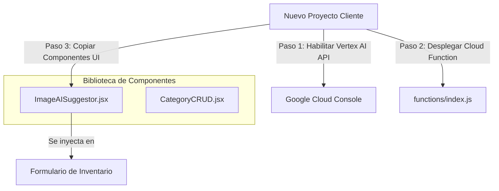

# Análisis de Viabilidad: Reutilización de Formulario de Inventario Asistido por IA (Gemini 1.5 Flash)

Este documento audita y presenta la propuesta técnica para portar y reutilizar el módulo de registro de inventario con análisis visual de Gemini 1.5 Flash y la gestión de categorías en cualquier nuevo cliente o aplicación del stack Ecosistema.

---

## 🔍 Diagnóstico Técnico de la Implementación Actual

### 1. Flujo Frontend (`ProductFormModal.jsx`)
* **Subida Reactiva:** Permite capturar imágenes (Galería o Cámara nativa móvil) y subirlas a Firebase Storage (`artifacts/temp_uploads/`) calculando el progreso con `uploadBytesResumable`.
* **Suscripción Reactiva (Sondeo):** Inmediatamente al iniciar la subida, se suscribe con `onSnapshot` a la colección temporal `/draft_products/{draftId}` en Firestore.
* **Auto-llenado:** Tan pronto como la Cloud Function escribe en Firestore el nombre y la descripción redactados por la IA, el hook de escucha actualiza el estado local de `formData`, autocompletando la interfaz mientras el usuario digita los demás datos.

### 2. Flujo Backend (Cloud Function: `processProductImage`)
* **Trigger de Storage:** Se dispara por evento `onObjectFinalized` de Storage de manera 100% desacoplada del frontend.
* **Procesamiento Vertex AI:** Descarga la imagen a memoria, la convierte a Base64 y realiza la llamada a Vertex AI utilizando la SDK oficial de Google Cloud con el modelo `gemini-1.5-flash-001`.
* **Respuesta Estructurada:** Utiliza `responseMimeType: "application/json"` para forzar a Gemini a responder en un formato JSON exacto sin texto adicional, evitando fallos de parseo.

---

## 🎨 Estética y Lógica de Llenado Manual (Fuera del Alcance de la IA)

Aunque la IA de Gemini 1.5 Flash es sumamente potente para redactar el nombre comercial y la descripción persuasiva analizando la imagen del producto, hay múltiples parámetros comerciales e inventarios internos que **necesariamente deben ser ingresados manualmente por el Administrador**.

A continuación se identifican estos campos junto con los estándares de estética y UI/UX implementados para garantizar un llenado manual óptimo:

| Categoría de Llenado | Parámetro Técnico | Por Qué no lo hace la IA | Estética e Interfaz de Llenado (UI/UX) |
| :--- | :--- | :--- | :--- |
| **Financiero / Precios** | Precio Detal y Precio Mayorista | Son decisiones comerciales estratégicas del negocio y márgenes de ganancia. | Campos de entrada numéricos destacados con fuentes en negrita (`font-bold`), validadores de formato de divisa local y restricciones contra valores negativos. |
| **Estructuración** | Categoría del Catálogo | Depende de la base de datos de categorías creada y estructurada por el vendedor. | Menú desplegable táctil interactivo (`CustomSelect`) con overlays elásticos y animaciones de Framer Motion. |
| **Control de Existencias** | Variantes (Tallas y Colores) | El stock real físico disponible en bodega solo lo conoce el administrador. | Cuadrícula dinâmica de variantes con selectores táctiles rápidos. Los colores muestran vistas previas circulares con su código hexadecimal HSL dinámico (`COLOR_MAP`) y badges responsivos. |
| **Seguridad de Stock** | Umbral de Alerta de Agotado | Es el límite de existencias mínimo personalizado para detonar notificaciones. | Campo numérico rápido con valores por defecto (`5`) y botones de incremento/decremento atómicos. |
| **Estrategia Comercial** | Oferta Directa (Descuentos) | Define si el producto entra en descuento de catálogo y qué porcentaje o monto fijo se resta. | Interruptor visual estilizado (`checkbox` premium) que revela de forma elástica (`animate-in slide-in-from-top-3`) los inputs de configuración de descuento. |
| **Atributos Ecosistema** | Filtros Personalizados (Material, etc.) | Varía según los atributos definidos administrativamente para el catálogo. | Renderizado dinámico de campos condicionales adaptándose si el atributo es selección (`select`) o texto libre. |

---

## 💡 Propuesta de Estandarización y Reutilización

La arquitectura implementada es **altamente portable y 100% viable para reutilizar**. Para generalizarla de cara a futuros proyectos, se propone el siguiente esquema de desacoplamiento:



### 1. Backend Portable (Cero Configuración en Código)
La Cloud Function en `functions/index.js` es genérica porque **autodetecta el ID del proyecto de Firebase en ejecución** mediante `process.env.GCLOUD_PROJECT`.
* **Acción de Portabilidad:** Para llevarla a un nuevo cliente, solo debes copiar la carpeta `functions` y ejecutar `firebase deploy --only functions`.
* **Requisito en la Nube:** Habilitar la API de Vertex AI en la consola de Google Cloud del nuevo proyecto de Firebase y activar el plan Blaze (requerido para ejecutar Cloud Functions v2).

### 2. Frontend Desacoplado: Creación de Componente `ImageAISuggestor`
Para evitar llevar el modal completo de inventario (que tiene campos de tallas y colores muy específicos de la tienda actual), extraemos el cargador con IA a un componente atómico reutilizable:

```javascript
// Propuesta de Componente Portable: ImageAISuggestor.jsx
export default function ImageAISuggestor({ onSuggestedData, onImageUploaded }) {
  // 1. Lógica interna de uploadBytesResumable
  // 2. onSnapshot a la colección draft_products
  // 3. Renderiza los botones de Cámara/Galería y el Shimmer Spinner de "IA Analizando..."
}
```

### 3. Módulo de Categorías Relacionado
Las categorías van de la mano con el producto. La app actual utiliza la colección `/categories` de Firestore y el hook `useCategories()`.
* **Estandarización:** Se puede empaquetar una sección visual reutilizable de creación rápida de categorías (`CategoryCRUD`) que contenga un simple formulario de entrada de texto (`nombre`, `descripcion`) y selector de icono, la cual se comunica con el hook de inventario.
