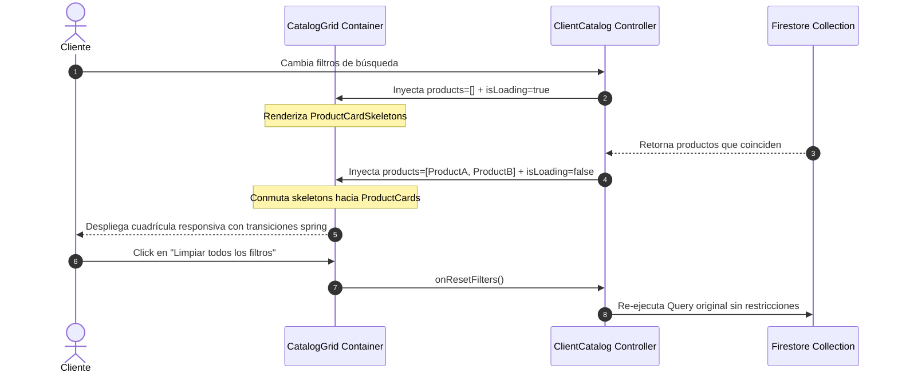

<!--
{
  "technicalName": "Rejilla_Catalogo",
  "targetPath": "src/components/ui/Rejilla_Catalogo.jsx",
  "dependencies": {
    "npm": {},
    "internal": []
  }
}
-->

# Rejilla de Catálogo Inteligente (`Rejilla_Catalogo`)

Este módulo proporciona una rejilla de maquetación de catálogo comercial responsiva y de alto rendimiento (`CatalogGrid`). Está programada de forma agnóstica para soportar conmutaciones en caliente entre múltiples variantes de distribución visual (`grid2`, `grid3`, `list`), sincronizar cargadores estructurales (*shimmer skeletons*) e integrar una interfaz comercial premium de no-resultados (*Empty State*).

---

## 1. Propósito y Casos de Uso

El componente soluciona el maquetado del catálogo del cliente de marca blanca de forma adaptativa móvil y escritorio, acelerando el pintado en pantalla y blindando la interfaz ante filtros vacíos.

### Casos de Uso:
* **Conmutación Dinámica de Cuadrícula:** Cambios en caliente en la densidad del catálogo (2 columnas para imágenes grandes en móviles, 3 columnas compactas, o lista horizontal descriptiva).
* **Cargas Asíncronas No Invasivas (Zero CLS):** Distribución simétrica de esqueletos de carga del mismo ratio de aspecto mientras los datos provienen de la suscripción a Firestore.
* **Recuperación Comercial de Búsqueda:** Cuando el cliente filtra y obtiene `0` resultados, el componente inyecta una guía interactiva que invita a resetear filtros con badges sugeridos en vez de una página rota o vacía.

---

## 2. Especificación Visual y Estilos

La rejilla aprovecha los layouts modernos de CSS Grid y Flexbox de Tailwind CSS bajo aceleración por hardware:
* **Layout `grid2` (Móvil prioritario):** 2 columnas en teléfonos, escalando progresivamente a 3, 4 y 5 columnas en monitores anchos.
* **Layout `grid3` (Compacto minorista):** 3 columnas en móviles (ideal para accesorios o calzado), escalando a 4, 5 y 6 columnas en pantallas de escritorio.
* **Layout `list` (Horizontal detallado):** Filas verticales completas de ancho completo con espaciados uniformes.
* **Aceleración por Hardware:** Uso preventivo de la clase CSS `will-change-transform` para que la conmutación de grids sea fluida a 60 FPS en celulares de gama media o baja.

### Variables CSS y Extensiones Tailwind Requeridas

> [!IMPORTANT]
> Usa `animate-spin-slow` que **no existe en Tailwind base**. Sin ella, el ícono de reset gira a velocidad normal (`animate-spin`), sin romper la funcionalidad.

**`tailwind.config.js`:**
```js
theme: {
  extend: {
    colors: {
      primary: ({ opacityValue }) =>
        opacityValue ? `hsl(var(--color-primary-hsl) / ${opacityValue})` : 'hsl(var(--color-primary-hsl))',
      'primary-hover': 'hsl(var(--color-primary-hsl) / 0.85)',
      neutral: { 850: '#1c1c1c' }
    },
    animation: {
      'spin-slow': 'spin 2s linear infinite', // Para el ícono del botón de reset
    }
  }
}
```

**Dependencias:** `npm install framer-motion`

---

## 3. Código React Completo y 100% Funcional

### Componente de Rejilla: `CatalogGrid.jsx`
Implementación portable, stateless y parametrizada.

```jsx
import React from 'react'
import { motion, AnimatePresence } from 'framer-motion'
import ProductCard, { ProductCardSkeleton } from '../Tarjeta_Producto/ProductCard' // Ruta relativa estándar de la biblioteca

// ─── Íconos SVG inline (fallbacks portables — no requieren lucide-react) ─────
const _IconPackageX = ({ size = 26 }) => (
  <svg width={size} height={size} viewBox="0 0 24 24" fill="none" stroke="currentColor" strokeWidth={2} strokeLinecap="round" strokeLinejoin="round">
    <path d="M21 16V8a2 2 0 00-1-1.73l-7-4a2 2 0 00-2 0l-7 4A2 2 0 003 8v8a2 2 0 001 1.73l7 4a2 2 0 002 0l7-4A2 2 0 0021 16z"/>
    <polyline points="3.27 6.96 12 12.01 20.73 6.96"/><line x1="12" y1="22.08" x2="12" y2="12"/>
    <line x1="9" y1="9" x2="15" y2="15"/><line x1="15" y1="9" x2="9" y2="15"/>
  </svg>
)
const _IconRefresh = ({ size = 14 }) => (
  <svg width={size} height={size} viewBox="0 0 24 24" fill="none" stroke="currentColor" strokeWidth={2} strokeLinecap="round" strokeLinejoin="round">
    <polyline points="23 4 23 10 17 10"/><polyline points="1 20 1 14 7 14"/>
    <path d="M3.51 9a9 9 0 0114.85-3.36L23 10M1 14l4.64 4.36A9 9 0 0020.49 15"/>
  </svg>
)

export default function CatalogGrid({
  products = [],
  favorites = [],
  layout = 'grid2', // 'grid2' | 'grid3' | 'list'
  isLoading = false,
  skeletonCount = 6,
  onOpenDetail,
  onToggleFavorite,
  onResetFilters,
  emptyTitle = "No encontramos productos",
  emptySubtitle = "Prueba ajustando tu búsqueda o eliminando los filtros activos para ver la colección completa.",
  formatCurrency,
  // ─── Íconos inyectables (opcional) ────────────────────────────────────────
  icons = {}
}) {
  const IPackageX = icons.empty   ?? <_IconPackageX size={26} />
  const IRefresh  = icons.refresh ?? <_IconRefresh size={14} />
  
  // ─── CARGADOR ESTRUCTURAL (SKELETONS) ───
  if (isLoading) {
    return (
      <div 
        className={`transition-all duration-300 ${
          layout === 'list'
            ? "flex flex-col gap-3 md:gap-4"
            : layout === 'grid3'
              ? "grid grid-cols-3 sm:grid-cols-4 lg:grid-cols-5 xl:grid-cols-6 gap-2 md:gap-4"
              : "grid grid-cols-2 sm:grid-cols-3 lg:grid-cols-4 xl:grid-cols-5 gap-4 md:gap-6"
        }`}
      >
        {Array.from({ length: skeletonCount }).map((_, idx) => (
          <ProductCardSkeleton key={`skeleton-${idx}`} layout={layout === 'list' ? 'list' : 'grid'} />
        ))}
      </div>
    );
  }

  // ─── ESTADO VACÍO PREMIUM (NO RESULTADOS) ───
  if (products.length === 0) {
    return (
      <motion.div 
        initial={{ opacity: 0, y: 15 }}
        animate={{ opacity: 1, y: 0 }}
        className="w-full py-12 px-6 bg-neutral-900 border border-neutral-850 rounded-[32px] text-center flex flex-col items-center justify-center select-none"
      >
        <div className="w-14 h-14 rounded-2xl bg-neutral-850 border border-neutral-800 flex items-center justify-center text-neutral-500 mb-4 animate-bounce">
          {IPackageX}
        </div>
        
        <h3 className="text-base font-bold text-white leading-none">
          {emptyTitle}
        </h3>
        
        <p className="text-xs text-neutral-400 mt-2 max-w-sm leading-relaxed">
          {emptySubtitle}
        </p>

        {onResetFilters && (
          <button
            onClick={onResetFilters}
            className="mt-6 h-10 px-5 bg-primary hover:bg-primary-hover active:scale-95 text-white font-bold text-xs rounded-xl flex items-center justify-center gap-1.5 transition-all shadow-lg shadow-primary/20"
          >
            <span className="animate-spin-slow">{IRefresh}</span>
            Limpiar todos los filtros
          </button>
        )}
      </motion.div>
    );
  }

  // ─── RENDEREADO DE REJILLA ACTIVA ───
  return (
    <div className="relative overflow-hidden w-full">
      <motion.div 
        layout
        className={`will-change-transform transition-all duration-300 ${
          layout === 'list'
            ? "flex flex-col gap-3 md:gap-4"
            : layout === 'grid3'
              ? "grid grid-cols-3 sm:grid-cols-4 lg:grid-cols-5 xl:grid-cols-6 gap-2 md:gap-4"
              : "grid grid-cols-2 sm:grid-cols-3 lg:grid-cols-4 xl:grid-cols-5 gap-4 md:gap-6"
        }`}
      >
        <AnimatePresence mode="popLayout">
          {products.map((product) => {
            const isFav = favorites.includes(product.id)
            
            return (
              <motion.div
                key={product.id}
                layout
                initial={{ opacity: 0, scale: 0.95 }}
                animate={{ opacity: 1, scale: 1 }}
                exit={{ opacity: 0, scale: 0.9 }}
                transition={{ type: 'spring', stiffness: 500, damping: 35 }}
              >
                <ProductCard 
                  product={product}
                  onOpenDetail={onOpenDetail}
                  isFavorite={isFav}
                  onToggleFavorite={onToggleFavorite}
                  layout={layout === 'list' ? 'list' : 'grid'}
                  formatCurrency={formatCurrency}
                />
              </motion.div>
            )
          })}
        </AnimatePresence>
      </motion.div>
    </div>
  );
}
```

---

## 4. Lógica de Estado y Ciclo de Vida

La rejilla opera como una capa de distribución 100% controlada (stateless):

1. **Interpolación de Estilos CSS:** Traduce de forma reactiva el string de la prop `layout` hacia los sets específicos de columnas de Tailwind CSS.
2. **Ciclo AnimatePresence:** La envoltura `AnimatePresence` con el modo `popLayout` asegura que cuando se filtre o busque un producto y este desaparezca del arreglo, los elementos hermanos contiguos se reacomoden visualmente con una transición suave acelerada en lugar de saltar bruscamente de posición.
3. **Reset de Estado Integrado:** El disparador `onResetFilters` actúa como callback drill-up hacia el controlador del catálogo principal de la PWA, permitiendo re-ejecutar las queries de Firebase y reiniciar el estado local del panel de filtros de forma transparente.

---

## 5. Flujo Operativo e Interacción

El siguiente diagrama detalla cómo se gestionan y distribuyen los eventos y transiciones al interior de la grilla:



---

## 6. Origen en la Aplicación

Los componentes de esta especificación se extrajeron y mejoraron a partir de los archivos de origen de la aplicación de producción:
* **Grid responsivo original:** [`ClientCatalog.jsx`](file:///d:/Aplicaciones/App%20Ventas/src/pages/client/ClientCatalog.jsx) (Líneas 389-395)
* **Loader y Skeleton original:** [`ClientCatalog.jsx`](file:///d:/Aplicaciones/App%20Ventas/src/pages/client/ClientCatalog.jsx) (Líneas 366-377)
* **Empty State de productos original:** [`ClientCatalog.jsx`](file:///d:/Aplicaciones/App%20Ventas/src/pages/client/ClientCatalog.jsx) (Líneas 378-388)
