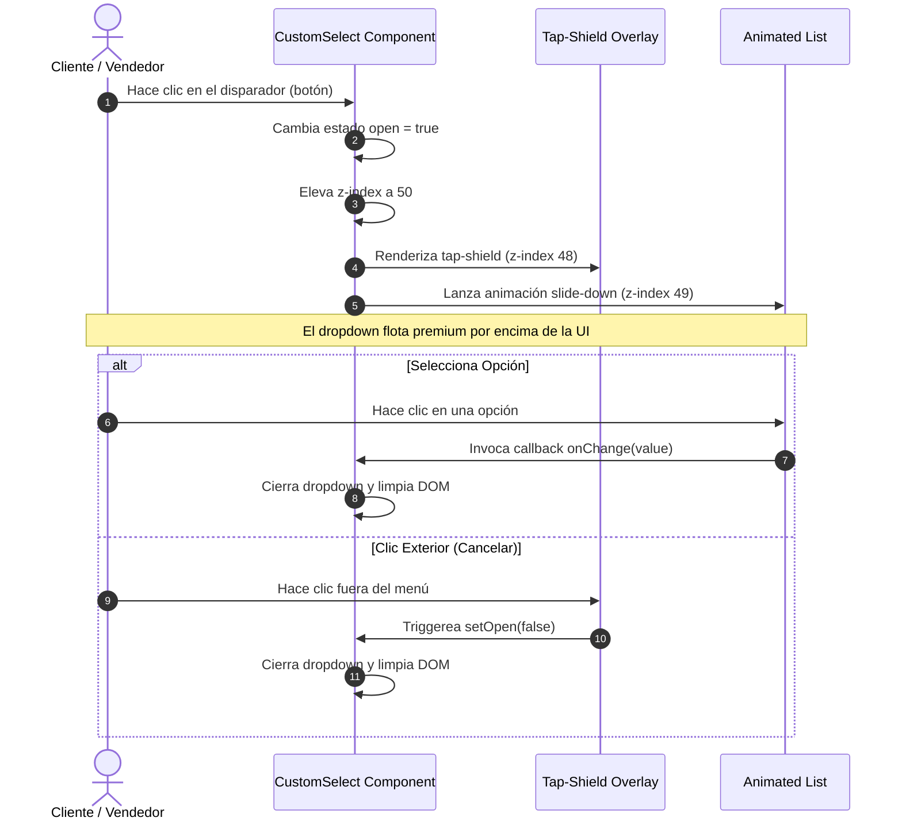

<!--
{
  "technicalName": "CustomSelect",
  "targetPath": "src/components/ui/CustomSelect.jsx",
  "dependencies": {
    "npm": {},
    "internal": []
  },
  "type": "component",
  "niches": []
}
-->

# Selector Desplegable Animado Premium (CustomSelect)
## Biblioteca de Componentes: Formularios y UI

Este componente atómico y stateless encapsula la funcionalidad y la estética premium de una lista desplegable (select) interactiva. Reemplaza por completo el control nativo del navegador utilizando animaciones fluidas aceleradas por hardware (Framer Motion) y un diseño de marca blanca basado en variables CSS / Tailwind, totalmente adaptativo para modo claro y oscuro.

---

## 💎 Propósito y Casos de Uso
El control desplegable nativo (`<select>`) del navegador rompe la consistencia visual y de experiencia en aplicaciones modernas (PWAs), especialmente en sistemas Ecosistema multitenant. `CustomSelect` unifica la interfaz permitiendo:
1. **Listas de Configuración Dinámica**: Selección de fuentes, tamaños de bordes y perfiles en paneles administrativos.
2. **Asignación de Personal / POS**: Selección interactiva de vendedores, cajeros o responsables de mesa en el punto de venta directo.
3. **Filtros Rápidos en Formularios**: Menús de selección atómica de categorías, estados de pedidos o divisas.

---

## 🎨 Especificación Visual y Estilos (Tailwind CSS)
El componente hereda la identidad visual dinámica del tema corporativo inyectado a través de variables CSS base (`var(--color-*)`) y clases HSL dinámicas:
* **Contenedor Principal (`relative`)**: Aísla el flujo del dropdown y monta un `z-index` controlado en fase activa.
* **Gatillo de Apertura (`button`)**: 
  * Altura fija `h-11`, bordes redondeados premium `rounded-xl` y fondo interactivo `bg-surface`.
  * Bordes dinámicos que se tiñen con el color de acción (`focus:border-primary`) ante el foco táctil.
  * Transición de rotación elástica (`duration-200`) sobre el ícono chevron al desplegarse.
* **Menú Desplegable (`motion.div`)**: 
  * Animación fluida de escala, opacidad y desplazamiento vertical elástico (`scale: 0.97` a `1`, `y: -6` a `0`).
  * Bordes limpios `border border-app` y sombra elástica `shadow-xl`.
* **Overlay Táctil Invisible**: Un tap-shield de pantalla completa (`fixed inset-0`) que intercepta clics exteriores para cerrar el dropdown con un comportamiento intuitivo.

---

## 3. Código React Completo

```jsx
import { useState } from 'react'
import { motion, AnimatePresence } from 'framer-motion'

/**
 * CustomSelect - Componente atómico y stateless para listas desplegables animadas premium.
 * 
 * @param {string|number} value - Valor seleccionado actualmente
 * @param {function} onChange - Callback invocado al seleccionar una opción: (val) => void
 * @param {Array<{value: any, label: string}>} options - Lista de opciones a desplegar
 * @param {string} placeholder - Texto a mostrar cuando no hay selección activa
 * @param {string} className - Clases de estilo Tailwind CSS adicionales para el botón disparador
 */
export default function CustomSelect({ 
  value, 
  onChange, 
  options = [], 
  placeholder = 'Selecciona una opción...',
  className = ''
}) {
  const [open, setOpen] = useState(false)
  const selected = options.find(o => o.value === value)

  return (
    <div className="relative w-full" style={{ zIndex: open ? 50 : 'auto' }}>
      {/* Botón Disparador */}
      <button
        type="button"
        onClick={() => setOpen(v => !v)}
        className={`w-full h-11 pl-4 pr-10 rounded-xl bg-surface border border-app text-sm text-app focus:outline-none focus:border-primary transition-colors appearance-none cursor-pointer flex items-center justify-between relative ${className}`}
        style={{ borderColor: open ? 'var(--color-primary)' : undefined }}
      >
        <span className={selected ? 'text-app font-medium' : 'text-muted'}>
          {selected ? selected.label : placeholder}
        </span>
        <span className={`absolute right-3 text-muted transition-transform duration-200 ${open ? 'rotate-180' : ''}`}>
          {/* Ícono Chevron Down SVG Nativo (Evita dependencias rígidas de iconos externos) */}
          <svg 
            xmlns="http://www.w3.org/2000/svg" 
            width="18" 
            height="18" 
            viewBox="0 0 24 24" 
            fill="none" 
            stroke="currentColor" 
            strokeWidth="2" 
            strokeLinecap="round" 
            strokeLinejoin="round"
          >
            <path d="m6 9 6 6 6-6"/>
          </svg>
        </span>
      </button>

      {/* Menú Animado Flotante */}
      <AnimatePresence>
        {open && (
          <>
            {/* Tap-shield para capturar clics exteriores y cerrar */}
            <div 
              className="fixed inset-0 bg-transparent cursor-default" 
              style={{ zIndex: 48 }} 
              onClick={() => setOpen(false)} 
            />
            
            {/* Lista Desplegable */}
            <motion.div
              initial={{ opacity: 0, y: -6, scale: 0.97 }}
              animate={{ opacity: 1, y: 0, scale: 1 }}
              exit={{ opacity: 0, y: -6, scale: 0.97 }}
              transition={{ duration: 0.12, ease: 'easeOut' }}
              className="absolute left-0 right-0 mt-1.5 rounded-xl border border-app overflow-hidden shadow-xl"
              style={{ zIndex: 49, background: 'var(--color-surface)' }}
            >
              {/* Opción vacía por defecto si se requiere deseleccionar */}
              {placeholder && (
                <button
                  type="button"
                  onClick={() => { onChange(''); setOpen(false) }}
                  className="w-full px-4 py-2.5 text-left text-sm text-muted hover:bg-surface-2 transition-colors border-b border-app/5"
                >
                  {placeholder}
                </button>
              )}
              
              {/* Opciones mapeadas */}
              {options.map((opt) => (
                <button
                  key={opt.value}
                  type="button"
                  onClick={() => { onChange(opt.value); setOpen(false) }}
                  className={`w-full px-4 py-2.5 text-left text-sm transition-colors flex items-center justify-between
                    ${opt.value === value
                      ? 'bg-primary text-white font-bold'
                      : 'text-app hover:bg-surface-2'
                    }
                  `}
                >
                  <span>{opt.label}</span>
                  {opt.value === value && (
                    /* Check SVG Nativo */
                    <svg 
                      xmlns="http://www.w3.org/2000/svg" 
                      width="16" 
                      height="16" 
                      viewBox="0 0 24 24" 
                      fill="none" 
                      stroke="currentColor" 
                      strokeWidth="2.5" 
                      strokeLinecap="round" 
                      strokeLinejoin="round"
                    >
                      <path d="M20 6 9 17l-5-5"/>
                    </svg>
                  )}
                </button>
              ))}
            </motion.div>
          </>
        )}
      </AnimatePresence>
    </div>
  )
}
```

---

## ⚡ Lógica de Estado y Ciclo de Vida
1. **Control de Fugas Táctiles**: El tap-shield `fixed inset-0` intercepta clics antes de que se propaguen y colisionen con botones inferiores de barra móvil.
2. **Control Síncrono de Z-Index**: Durante la fase activa `open === true`, el contenedor cambia su clase de `z-auto` a `z-50`, obligando al navegador a pintar la lista por encima de cualquier modal o barra lateral sin romper el layout estático de los formularios.
3. **Garbage Collection Automatizado**: La de-suscripción de `AnimatePresence` remueve físicamente el tap-shield y el menú del DOM al cerrarse, liberando la memoria activa.

---

## 🔄 Flujo Operativo y Secuencia de Interacción


