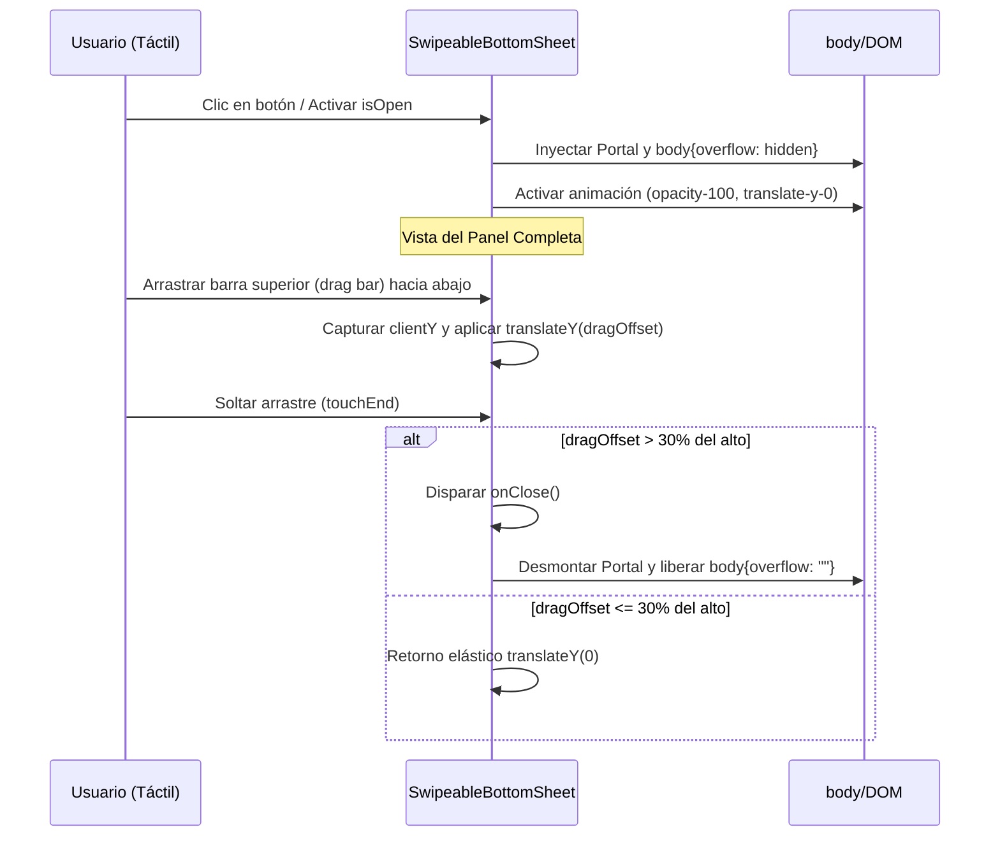

<!--
{
  "technicalName": "SwipeableBottomSheet",
  "targetPath": "src/components/ui/SwipeableBottomSheet.jsx",
  "dependencies": {
    "npm": {},
    "internal": []
  },
  "type": "component",
  "niches": []
}
-->

# SwipeableBottomSheet — Panel Deslizable Inferior Táctil

## 1. Propósito y Casos de Uso
El `SwipeableBottomSheet` es un componente de interfaz diseñado para dispositivos móviles que despliega un panel deslizante desde el borde inferior de la pantalla. Resuelve la mala ergonomía táctil de los modales centrados tradicionales, permitiendo al usuario interactuar cómodamente con el pulgar.

### Casos de Uso Principales:
* **Selección de Variantes:** Talla, color o atributos en el catálogo de productos (ej: tienda Moni).
* **Filtros Rápidos:** Sidebar de filtros de búsqueda colapsado en formato panel inferior.
* **Resumen de Pedido y Checkout:** Vista previa del carrito y confirmación antes de la compra.
* **Agendamiento:** Selección de hora y servicios en verticales como barberías o talleres.

---

## 2. Especificación Visual y Estilos
* **Fondo Overlay:** Cobertura de pantalla completa con color traslúcido y desenfoque (`bg-black/60 backdrop-blur-sm`).
* **Caja del Panel:** Bordes redondeados en la parte superior (`rounded-t-[2.5rem]`), fondo de color sólido de superficie (`bg-[var(--color-surface)]`) y bordes HSL discretos.
* **Control de Arrastre (Drag Bar):** Indicador visual superior para denotar que el panel se puede arrastrar (`w-12 h-1.5 bg-[var(--color-border)] rounded-full mx-auto mb-4`).
* **Efectos de Sombra:** Sombra profunda hacia arriba (`shadow-[0_-10px_25px_-5px_rgba(0,0,0,0.3)]`).

---

## 3. Código React Completo y 100% Funcional
Este componente utiliza **React Portals** para inyectarse en el nodo principal de la aplicación (`#root` o `body`), previniendo problemas de apilamiento `z-index`, e inyecta un scroll lock en el elemento `body` al estar abierto.

```jsx
import React, { useEffect, useRef, useState } from 'react';
import ReactDOM from 'react-dom';

/**
 * SwipeableBottomSheet Component
 * @param {boolean} isOpen - Controla la visibilidad del panel.
 * @param {function} onClose - Callback al cerrar el panel.
 * @param {string} title - Título del panel.
 * @param {React.ReactNode} children - Contenido del panel.
 * @param {string} maxWidth - Ancho máximo del contenedor en pantallas grandes.
 */
export default function SwipeableBottomSheet({
  isOpen,
  onClose,
  title = '',
  children,
  maxWidth = 'max-w-md'
}) {
  const [isAnimating, setIsAnimating] = useState(false);
  const [shouldRender, setShouldRender] = useState(false);
  const [dragOffset, setDragOffset] = useState(0);
  const touchStartY = useRef(0);
  const panelRef = useRef(null);

  // Sincronizar estados de apertura y cierre con animaciones
  useEffect(() => {
    if (isOpen) {
      setShouldRender(true);
      setIsAnimating(true);
      setDragOffset(0);
      document.body.style.overflow = 'hidden'; // Scroll lock
    } else {
      setIsAnimating(false);
      const timer = setTimeout(() => {
        setShouldRender(false);
        document.body.style.overflow = ''; // Release scroll lock
      }, 300); // Duración de la animación en ms
      return () => clearTimeout(timer);
    }
  }, [isOpen]);

  // Limpieza al desmontar
  useEffect(() => {
    return () => {
      document.body.style.overflow = '';
    };
  }, []);

  // Gestores de eventos táctiles nativos para arrastre
  const handleTouchStart = (e) => {
    touchStartY.current = e.touches[0].clientY;
  };

  const handleTouchMove = (e) => {
    const currentY = e.touches[0].clientY;
    const deltaY = currentY - touchStartY.current;
    
    // Solo permitir arrastrar hacia abajo (valores positivos)
    if (deltaY > 0) {
      setDragOffset(deltaY);
    }
  };

  const handleTouchEnd = () => {
    // Si se arrastró más del 30% del alto del panel, se cierra
    if (panelRef.current) {
      const panelHeight = panelRef.current.offsetHeight;
      if (dragOffset > panelHeight * 0.3) {
        onClose();
      } else {
        // Retornar elásticamente a su posición inicial
        setDragOffset(0);
      }
    }
  };

  if (!shouldRender) return null;

  const overlayOpacity = isAnimating ? 'opacity-100' : 'opacity-0';
  const panelTranslate = isAnimating 
    ? `translate-y-[${dragOffset}px]` 
    : 'translate-y-full';

  return ReactDOM.createPortal(
    <div className="fixed inset-0 z-[9999] flex items-end justify-center">
      {/* Fondo Negro Overlay */}
      <div
        className={`absolute inset-0 bg-black/60 backdrop-blur-sm transition-opacity duration-300 ${overlayOpacity}`}
        onClick={onClose}
      />

      {/* Caja del Bottom Sheet */}
      <div
        ref={panelRef}
        style={{
          transform: isAnimating ? `translateY(${dragOffset}px)` : 'translateY(100%)',
          transition: dragOffset === 0 ? 'transform 300ms cubic-bezier(0.16, 1, 0.3, 1)' : 'none'
        }}
        className={`relative w-full ${maxWidth} bg-[var(--color-surface)] border-t border-[var(--color-border)] rounded-t-[2rem] p-6 shadow-2xl flex flex-col max-h-[90vh] z-10`}
      >
        {/* Drag Handle Bar */}
        <div
          onTouchStart={handleTouchStart}
          onTouchMove={handleTouchMove}
          onTouchEnd={handleTouchEnd}
          className="w-full py-2 cursor-grab active:cursor-grabbing shrink-0"
        >
          <div className="w-12 h-1.5 bg-[var(--color-border)] rounded-full mx-auto hover:bg-[var(--color-text-muted)] transition-colors" />
        </div>

        {/* Header */}
        {title && (
          <div className="flex items-center justify-between pb-4 border-b border-[var(--color-border)] shrink-0">
            <h3 className="text-sm font-black tracking-wide text-[var(--color-text)]">{title}</h3>
            <button
              onClick={onClose}
              className="p-1 rounded-xl text-[var(--color-text-muted)] hover:bg-[var(--color-surface-2)] transition-all cursor-pointer"
            >
              <svg className="w-4 h-4" fill="none" stroke="currentColor" viewBox="0 0 24 24">
                <path strokeLinecap="round" strokeLinejoin="round" strokeWidth="2.5" d="M6 18L18 6M6 6l12 12" />
              </svg>
            </button>
          </div>
        )}

        {/* Content Area con scroll interno */}
        <div className="flex-1 overflow-y-auto mt-4 pr-1 scrollbar-thin">
          {children}
        </div>
      </div>
    </div>,
    document.body
  );
}
```

---

## 4. Lógica de Estado y Ciclo de Vida
1. **Montaje y Desmontaje Suave:** El componente usa un estado dual (`shouldRender` y `isAnimating`). Al abrirse, primero se renderiza y luego adquiere la opacidad/desplazamiento. Al cerrarse, se transiciona la animación hacia afuera y tras 300ms se desmonta físicamente del DOM.
2. **Scroll Lock:** Para evitar que el fondo de la página se desplace detrás del modal, se manipula `document.body.style.overflow = 'hidden'`. Al cerrarse o desmontarse (cleanup del hook), se libera de vuelta a su valor original.
3. **Física de Arrastre:** Guarda la posición táctil inicial (`touchStartY`). En el desplazamiento, si la coordenada de movimiento va hacia abajo, calcula la diferencia de píxeles (`dragOffset`) y los aplica en tiempo real vía `translateY` directamente sobre el estilo inline (previniendo lags visuales al omitir clases transitorias de Tailwind).

---

## 5. Flujo Operativo y Secuencia de Interacción

