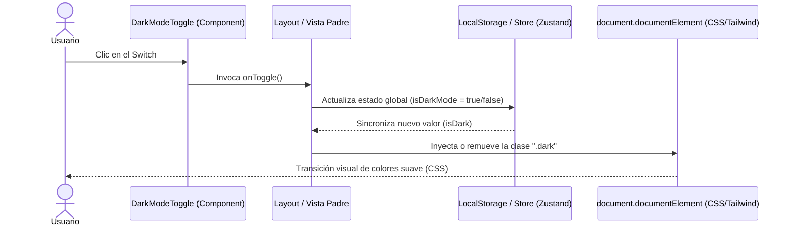

<!--
{
  "technicalName": "DarkModeToggle",
  "targetPath": "src/components/ui/DarkModeToggle.jsx",
  "dependencies": {
    "npm": {},
    "internal": []
  },
  "type": "component",
  "niches": []
}
-->

# Switch de Modo Oscuro Premium (DarkModeToggle)

## 1. Propósito y Casos de Uso
El componente `DarkModeToggle` provee un control visual premium e interactivo que permite cambiar entre los temas de modo claro y oscuro de la aplicación.
Está diseñado bajo una arquitectura **totalmente desacoplada (Marca Blanca)**. Para garantizar su portabilidad a cualquier proyecto React (incluso si no utiliza Tailwind CSS o Lucide Icons), se ha estructurado eliminando dependencias duras y permitiendo la inyección dinámica de estilos custom e íconos personalizados.

---

## 2. Especificación Visual y Estilos
* **Visual:** Estética premium, sin bordes toscos, con estados interactivos.
* **Fallback de Estilos:**
  * Si el proyecto usa Tailwind, se auto-aplica un diseño estilizado (hover, scale, colores HSL de contraste).
  * Si el proyecto no usa Tailwind, expone la propiedad `style` y variables CSS para inyectar estilos alternativos limpiamente sin romper el maquetado.

---

## 3. Props y API del Componente
| Prop | Tipo | Default | Descripción |
|------|------|---------|-------------|
| `isDark` | `boolean` | `false` | Indica si el modo oscuro está activo. |
| `onToggle` | `function` | `() => {}` | Callback invocado al hacer clic sobre el switch. |
| `showLabel` | `boolean` | `false` | Condiciona si se renderiza una etiqueta de texto descriptiva. |
| `size` | `number` | `20` | Tamaño del contenedor de los iconos en píxeles. |
| `className` | `string` | `""` | Clases de estilo CSS / Tailwind adicionales. |
| `style` | `object` | `{}` | Estilos inline custom para proyectos sin framework de CSS. |
| `lightIcon` | `ReactNode` | `null` | Ícono personalizado para representar el modo claro (sol). Si se omite, renderiza un Sol SVG básico embebido en código nativo. |
| `darkIcon` | `ReactNode` | `null` | Ícono personalizado para representar el modo oscuro (luna). Si se omite, renderiza una Luna SVG básica embebida en código nativo. |
| `animate` | `boolean` | `true` | Habilita las micro-animaciones y rotaciones del switch. |

---

## 4. Código React Completo y 100% Funcional
```jsx
import React from 'react';

/**
 * SVG Nativo de Sol (Evita dependencia obligatoria de Lucide/Heroicons)
 */
const DefaultSunIcon = ({ size }) => (
  <svg 
    xmlns="http://www.w3.org/2000/svg" 
    width={size} 
    height={size} 
    viewBox="0 0 24 24" 
    fill="none" 
    stroke="currentColor" 
    strokeWidth="2" 
    strokeLinecap="round" 
    strokeLinejoin="round"
  >
    <circle cx="12" cy="12" r="4"/>
    <path d="M12 2v2M12 20v2M4.93 4.93l1.41 1.41M17.66 17.66l1.41 1.41M2 12h2M20 12h2M6.34 17.66l-1.41 1.41M19.07 4.93l-1.41 1.41"/>
  </svg>
);

/**
 * SVG Nativo de Luna (Evita dependencia obligatoria de Lucide/Heroicons)
 */
const DefaultMoonIcon = ({ size }) => (
  <svg 
    xmlns="http://www.w3.org/2000/svg" 
    width={size} 
    height={size} 
    viewBox="0 0 24 24" 
    fill="none" 
    stroke="currentColor" 
    strokeWidth="2" 
    strokeLinecap="round" 
    strokeLinejoin="round"
  >
    <path d="M12 3a6 6 0 0 0 9 9 9 9 0 1 1-9-9Z"/>
  </svg>
);

/**
 * Componente DarkModeToggle - Switch modular marca blanca sin dependencias duras
 */
export default function DarkModeToggle({
  isDark = false,
  onToggle = () => {},
  showLabel = false,
  size = 20,
  className = "",
  style = {},
  lightIcon = null,
  darkIcon = null,
  animate = true
}) {
  
  // Renderizado dinámico de iconos (prop > svg embebido nativo)
  const renderedLightIcon = lightIcon || <DefaultSunIcon size={size} />;
  const renderedDarkIcon = darkIcon || <DefaultMoonIcon size={size} />;

  // Estilos de fallback inline si no se proveen clases
  const defaultStyles = {
    display: 'inline-flex',
    alignItems: 'center',
    justifyContent: 'center',
    cursor: 'pointer',
    padding: '10px',
    borderRadius: '12px',
    border: isDark ? '1px solid rgba(63, 63, 70, 0.4)' : '1px solid rgba(229, 229, 229, 1)',
    backgroundColor: isDark ? '#262626' : '#f5f5f5',
    color: isDark ? '#fbbf24' : '#7c3aed',
    transition: 'all 0.3s ease-in-out',
    ...style
  };

  return (
    <button
      onClick={onToggle}
      style={className ? style : defaultStyles}
      className={`
        focus:outline-none focus:ring-2 focus:ring-primary/20
        ${animate ? 'hover:scale-105 active:scale-95' : ''}
        ${className}
      `}
      title={isDark ? "Cambiar a Modo Claro" : "Cambiar a Modo Oscuro"}
      aria-label={isDark ? "Activar modo claro" : "Activar modo oscuro"}
    >
      <div 
        style={{
          transition: 'transform 0.5s ease-out',
          transform: animate ? (isDark ? 'rotate(360deg)' : 'rotate(0deg)') : 'none'
        }}
      >
        {isDark ? renderedDarkIcon : renderedLightIcon}
      </div>

      {showLabel && (
        <span 
          style={{
            marginLeft: '10px',
            fontSize: '14px',
            fontWeight: '600',
            userSelect: 'none',
            color: isDark ? '#e5e5e5' : '#404040'
          }}
        >
          {isDark ? 'Modo Oscuro' : 'Modo Claro'}
        </span>
      )}
    </button>
  );
}
```

---

## 5. Lógica de Estado y Ciclo de Vida
Este componente es **funcional puro y sin estado local (stateless)**, delegando todo el ciclo de vida a su contenedor padre (controlled component).
Cuando ocurre el click, ejecuta el callback `onToggle`.

---

## 6. Integración con Servicios Externos
Para usarlo en un entorno multitenant o Ecosistema, los flags de modo oscuro pueden guardarse localmente en la sesión (`localStorage`) o persistirse en la base de datos de configuración de usuario/tienda (ej. Firestore `/config/settings`).

---

## 7. Flujo Operativo y Secuencia de Interacción


---

## 8. Ejemplo de Uso (Importación y Consumo)
### Caso A: Consumo Básico en proyectos sin dependencias (Sin Tailwind / Sin Lucide)
```jsx
import React, { useState } from 'react';
import DarkModeToggle from './common/DarkModeToggle';

export function Header() {
  const [isDarkMode, setIsDarkMode] = useState(false);

  return (
    <header style={{ display: 'flex', justifyContent: 'space-between', padding: '16px' }}>
      <h1>Mi App Vanilla</h1>
      <DarkModeToggle 
        isDark={isDarkMode} 
        onToggle={() => setIsDarkMode(prev => !prev)} 
      />
    </header>
  );
}
```

### Caso B: Inyección de iconos alternativos (ej. Heroicons en lugar de SVG por defecto)
```jsx
import React from 'react';
import DarkModeToggle from '../components/common/DarkModeToggle';
import { SunIcon as HeroSun, MoonIcon as HeroMoon } from '@heroicons/react/24/solid';

export function NavigationBar({ theme, toggleTheme }) {
  return (
    <nav className="flex justify-between p-4 bg-surface">
      <DarkModeToggle 
        isDark={theme === 'dark'} 
        onToggle={toggleTheme}
        lightIcon={<HeroSun className="w-5 h-5 text-amber-500" />}
        darkIcon={<HeroMoon className="w-5 h-5 text-indigo-400" />}
      />
    </nav>
  );
}
```

---

## 9. Origen
* **Extraído de:** [AdminSettings.jsx](file:///D:/PROTOTIPE/App%20Ventas/src/pages/admin/AdminSettings.jsx#L2586-L2592) (Controlador global de visualización del tema)
* **Fecha de extracción:** 2026-05-29
* **Versión:** 2.0 (Actualizado para garantizar desacoplamiento total de librerías CSS/iconos).
