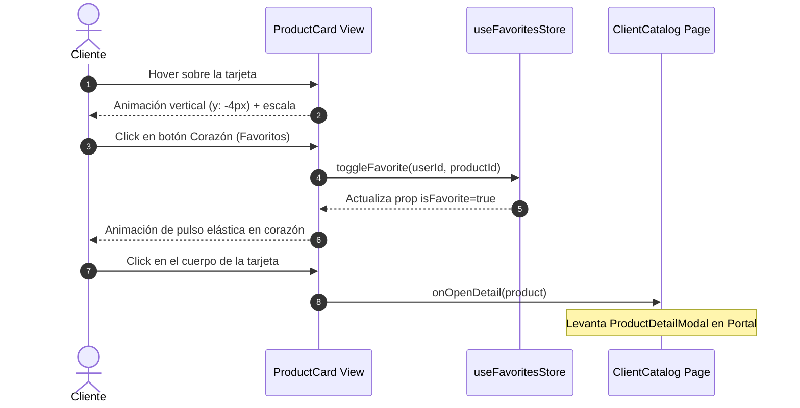

<!--
{
  "technicalName": "Tarjeta_Producto",
  "targetPath": "src/components/ui/Tarjeta_Producto.jsx",
  "dependencies": {
    "npm": {},
    "internal": []
  }
}
-->

# Tarjeta de Producto Adaptativa (`Tarjeta_Producto`)

Este módulo proporciona un componente premium e interactivo para renderizar productos en el catálogo comercial (`ProductCard`). Soporta de forma nativa layouts adaptativos dinámicos, gestión visual de stock agotado, micro-animaciones aceleradas por hardware, control de favoritos y efectos avanzados de atención visual ("Glow") para ofertas destacadas. Incluye su contraparte estructural (`ProductCardSkeleton`) para cargas fluidas.

---

## 1. Propósito y Casos de Uso

El componente actúa como el principal punto de visualización del catálogo comercial, optimizando la atracción visual del artículo y facilitando el drill-down interactivo.

### Casos de Uso:
* **Catálogos Flexibles (Grid / List):** Cambios en caliente del maquetado del catálogo sin alterar el marcado estructural del componente.
* **Productos Destacados / Promocionales:** Aplicación automática de bordes difuminados de color de marca (*neon glow box-shadow*) usando `color-mix` CSS nativo para llamar la atención del comprador.
* **Control Visual de Quiebres de Stock:** Grayscale automático del arte del producto y desactivación del botón táctil de compra al agotarse.
* **Skeleton Loading Shimmer:** Marcado visual idéntico con barrido de gradiente de brillo para transiciones de carga imperceptibles.

---

## 2. Especificación Visual y Estilos

El diseño gráfico es extremadamente premium, adaptándose dinámicamente mediante variables HSL:
* **Layout Grid (Cuadrícula):** Cuadro estilizado con ratio de imagen fijo, alineación vertical de textos y botón de acción atómico inferior derecho.
* **Layout List (Fila):** Cuadro apaisado con previsualización horizontal de imagen al lado izquierdo y descripción detallada en bloque derecho con límite de 2 líneas (`line-clamp-2`).
* **Glow Effect:** Sombra proyectada difusa de 15px con mezcla de color del 35% del tono primario hacia transparente. Requiere soporte de `color-mix()` (Chrome 111+, Firefox 113+, Safari 16.2+).
* **Favoritos Heart Button:** Corazón flotante con escala reactiva y transiciones de rebote elástico.

### Variables CSS y Extensiones Tailwind Requeridas

> [!IMPORTANT]
> `ProductCard` usa `color-mix()` con `var(--color-primary)` para el efecto glow. Sin esta variable el glow no se renderiza (no rompe el componente, solo pierde el efecto visual).

**Variables CSS (`:root`):**
```css
:root {
  --color-primary-hsl: 262 83% 58%;
  /* color-mix() requiere la variable en formato que acepte CSS: */
  --color-primary: hsl(var(--color-primary-hsl));
}
```

**`tailwind.config.js`:**
```js
theme: {
  extend: {
    colors: {
      primary: ({ opacityValue }) =>
        opacityValue ? `hsl(var(--color-primary-hsl) / ${opacityValue})` : 'hsl(var(--color-primary-hsl))',
      neutral: {
        850: '#1c1c1c',
      }
    }
  }
}
```

**Dependencia:** `npm install framer-motion`

---

## 3. Código React Completo y 100% Funcional

### Componente Visual Principal: `ProductCard.jsx`
Implementación 100% portable y parametrizada.

```jsx
import React from 'react'
import { motion } from 'framer-motion'

// ─── Íconos SVG inline (fallbacks portables — no requieren lucide-react) ─────
const _IconHeart = ({ size = 14, filled = false }) => (
  <svg width={size} height={size} viewBox="0 0 24 24" fill={filled ? 'currentColor' : 'none'}
    stroke="currentColor" strokeWidth={2} strokeLinecap="round" strokeLinejoin="round">
    <path d="M20.84 4.61a5.5 5.5 0 00-7.78 0L12 5.67l-1.06-1.06a5.5 5.5 0 00-7.78 7.78l1.06 1.06L12 21.23l7.78-7.78 1.06-1.06a5.5 5.5 0 000-7.78z"/>
  </svg>
)
const _IconPlus = ({ size = 14 }) => (
  <svg width={size} height={size} viewBox="0 0 24 24" fill="none" stroke="currentColor" strokeWidth={2.5} strokeLinecap="round">
    <line x1="12" y1="5" x2="12" y2="19"/><line x1="5" y1="12" x2="19" y2="12"/>
  </svg>
)
const _IconImage = ({ size = 28 }) => (
  <svg width={size} height={size} viewBox="0 0 24 24" fill="none" stroke="currentColor" strokeWidth={1.5} strokeLinecap="round" strokeLinejoin="round">
    <rect x="3" y="3" width="18" height="18" rx="2"/>
    <circle cx="8.5" cy="8.5" r="1.5"/>
    <polyline points="21 15 16 10 5 21"/>
  </svg>
)

export default function ProductCard({
  product,
  onOpenDetail,
  isFavorite = false,
  onToggleFavorite,
  layout = 'grid', // 'grid' | 'list'
  formatCurrency = (value) => `$${value.toLocaleString()}`,
  truncateText = (text, max = 40) => text.length > max ? `${text.substring(0, max)}...` : text,
  // ─── Íconos inyectables (opcional) ────────────────────────────────────────
  // Ejemplo: icons={{ heart: <HeartIcon size={14}/>, plus: <PlusIcon/>, image: <ImageIcon/> }}
  icons = {}
}) {
  const IHeart = (filled) => icons.heart ?? <_IconHeart size={14} filled={filled} />
  const IPlus  = icons.plus  ?? <_IconPlus size={14} />
  const IImage = (sz) => icons.image ?? <_IconImage size={sz} />
  // Comprobación de stock
  const isOutOfStock = product.variantes?.length > 0 && product.variantes.every(v => v.stock <= 0)

  // Efecto Glow dinámico premium usando color-mix HSL
  const glowStyle = product.tienePromocion && product.promocion?.glowEffect
    ? {
        boxShadow: '0 0 15px color-mix(in srgb, var(--color-primary) 35%, transparent)',
        borderColor: 'color-mix(in srgb, var(--color-primary) 50%, transparent)',
      }
    : {}

  // Estilos de hover Framer Motion acelerados
  const motionProps = {
    whileHover: isOutOfStock ? {} : { y: -4 },
    transition: { type: 'spring', stiffness: 400, damping: 30 }
  }

  // ─── VISTA LAYOUT LIST (FILA HORIZONTAL) ───
  if (layout === 'list') {
    return (
      <motion.div
        {...motionProps}
        onClick={() => onOpenDetail(product)}
        style={glowStyle}
        className={`w-full bg-neutral-900 border border-neutral-850 rounded-3xl p-3 flex gap-4 cursor-pointer relative transition-all duration-300 ${
          isOutOfStock ? 'opacity-70' : 'hover:border-neutral-800'
        }`}
      >
        {/* Imagen Izquierda */}
        <div className="w-24 h-24 sm:w-28 sm:h-28 rounded-2xl bg-neutral-850 overflow-hidden relative flex-shrink-0 border border-neutral-800/40">
          {product.imageUrl ? (
            
          ) : (
            <div className="w-full h-full flex items-center justify-center text-neutral-600">
              {IImage(28)}
            </div>
          )}

          {/* Badges de Promoción */}
          {product.tienePromocion && (
            <span className="absolute top-2 left-2 px-2 py-0.5 rounded-lg bg-primary text-[9px] font-black text-[var(--color-text)] uppercase tracking-wider">
              Oferta
            </span>
          )}
        </div>

        {/* Bloque Informativo Derecho */}
        <div className="flex-1 flex flex-col min-w-0 py-1">
          <div className="flex items-start justify-between gap-2">
            <h3 className="font-bold text-[var(--color-text)] text-sm sm:text-base leading-tight truncate pr-4">
              {product.nombre}
            </h3>
              <button
              onClick={(e) => {
                e.stopPropagation();
                onToggleFavorite(product.id);
              }}
              className={`p-1.5 rounded-xl bg-neutral-850 border border-neutral-800 transition-colors ${isFavorite ? 'text-red-500 animate-pulse' : 'text-neutral-400 hover:text-red-400'}`}
            >
              {IHeart(isFavorite)}
            </button>
          </div>
          
          <p className="text-[10px] text-neutral-400 mt-0.5">{product.categoria}</p>
          <p className="text-[10px] text-neutral-400 line-clamp-2 mt-2 leading-relaxed max-w-sm">
            {product.descripcion || 'Sin descripción detallada.'}
          </p>

          <div className="flex items-end justify-between mt-auto pt-2">
            <div>
              {product.tienePromocion && product.precioPromo < product.precioBase ? (
                <div className="flex items-center gap-2">
                  <span className="text-[10px] text-neutral-500 line-through font-semibold">
                    {formatCurrency(product.precioBase)}
                  </span>
                  <span className="font-black text-primary text-base">
                    {formatCurrency(product.precioPromo)}
                  </span>
                </div>
              ) : (
                <span className={`font-black text-base ${isOutOfStock ? 'text-neutral-500' : 'text-primary'}`}>
                  {formatCurrency(product.precioBase)}
                </span>
              )}
            </div>

            {isOutOfStock ? (
              <span className="text-[9px] font-black text-red-500 uppercase tracking-widest px-2 py-1 rounded bg-red-500/10">
                Agotado
              </span>
            ) : (
              <button
                className="w-8 h-8 rounded-xl bg-primary text-[var(--color-text)] flex items-center justify-center shadow-lg shadow-primary/20 hover:opacity-90 active:scale-90 transition-all border border-neutral-700/20"
                aria-label="Agregar al carrito"
              >
                {IPlus}
              </button>
            )}
          </div>
        </div>
      </motion.div>
    );
  }

  // ─── VISTA LAYOUT GRID (CUADRÍCULA VERTICAL STANDARD) ───
  return (
    <motion.div
      {...motionProps}
      onClick={() => onOpenDetail(product)}
      style={glowStyle}
      className={`bg-neutral-900 border border-neutral-850 rounded-[32px] p-3 flex flex-col h-full cursor-pointer relative group transition-all duration-300 ${
        isOutOfStock ? 'opacity-75' : 'hover:border-neutral-800'
      }`}
    >
      {/* Contenedor de Imagen */}
      <div className="w-full aspect-square rounded-[24px] bg-neutral-850 overflow-hidden relative border border-neutral-800/40">
        {product.imageUrl ? (
          
        ) : (
            <div className="w-full h-full flex items-center justify-center text-neutral-600">
              {IImage(32)}
            </div>
          )}

        {/* Corazón Absoluto Favorito */}
        <button
          onClick={(e) => {
            e.stopPropagation();
            onToggleFavorite(product.id);
          }}
          className={`absolute top-2.5 right-2.5 w-8 h-8 rounded-xl bg-black/40 backdrop-blur-md border border-neutral-800 flex items-center justify-center transition-colors ${isFavorite ? 'text-red-500' : 'text-neutral-300 hover:text-red-400'}`}
        >
          {IHeart(isFavorite)}
        </button>

        {/* Badge Flotante Promocional */}
        {product.tienePromocion && (
          <span className="absolute top-2.5 left-2.5 px-2 py-0.5 rounded-lg bg-primary text-[8px] font-black text-[var(--color-text)] uppercase tracking-wider">
            Oferta
          </span>
        )}
      </div>

      {/* Textos y Detalle */}
      <div className="flex-1 flex flex-col mt-3.5 px-1 min-h-0">
        <h3 className="font-bold text-[var(--color-text)] text-xs sm:text-sm leading-tight mb-0.5 truncate" title={product.nombre}>
          {truncateText(product.nombre, 35)}
        </h3>
        <p className="text-[9px] text-neutral-400">{product.categoria}</p>
        
        {/* Precios e Interacción */}
        <div className="flex items-end justify-between mt-auto pt-3 gap-2">
          <div>
            {product.tienePromocion && product.precioPromo < product.precioBase ? (
              <>
                <p className="text-[9px] text-neutral-500 line-through font-semibold leading-none mb-1">
                  {formatCurrency(product.precioBase)}
                </p>
                <p className="font-black text-primary text-sm sm:text-base leading-none">
                  {formatCurrency(product.precioPromo)}
                </p>
              </>
            ) : (
              <p className={`font-black text-sm sm:text-base leading-none ${isOutOfStock ? 'text-neutral-500' : 'text-primary'}`}>
                {formatCurrency(product.precioBase)}
              </p>
            )}
          </div>

          {isOutOfStock ? (
            <span className="text-[8px] font-black text-red-500 uppercase tracking-wider px-1.5 py-0.5 rounded bg-red-500/10 border border-red-500/10">
              Agotado
            </span>
          ) : (
            <button
              className="w-7 h-7 rounded-xl bg-primary text-[var(--color-text)] flex items-center justify-center shadow-md shadow-primary/10 hover:opacity-90 active:scale-90 transition-transform shrink-0 border border-neutral-700/10"
              aria-label="Agregar"
            >
              {IPlus}
            </button>
          )}
        </div>
      </div>
    </motion.div>
  );
}
```

### Componente Acompañante Shimmer: `ProductCardSkeleton.jsx`
Evita el salto de maquetación inyectando pulsos de brillo adaptativos.

```jsx
import React from 'react'

export function ProductCardSkeleton({ layout = 'grid' }) {
  if (layout === 'list') {
    return (
      <div className="w-full bg-neutral-900 border border-neutral-850 rounded-3xl p-3 flex gap-4 animate-pulse select-none">
        <div className="w-24 h-24 sm:w-28 sm:h-28 rounded-2xl bg-neutral-800 flex-shrink-0" />
        <div className="flex-1 flex flex-col py-1 space-y-2.5">
          <div className="h-4 bg-neutral-800 rounded-lg w-3/4" />
          <div className="h-3 bg-neutral-800 rounded-lg w-1/4" />
          <div className="h-8 bg-neutral-800 rounded-xl w-full mt-2" />
        </div>
      </div>
    );
  }

  return (
    <div className="bg-neutral-900 border border-neutral-850 rounded-[32px] p-3 flex flex-col h-full animate-pulse select-none">
      <div className="w-full aspect-square rounded-[24px] bg-neutral-800" />
      <div className="mt-3.5 px-1 space-y-2">
        <div className="h-3.5 bg-neutral-800 rounded-lg w-5/6" />
        <div className="h-2.5 bg-neutral-800 rounded-lg w-1/3" />
        <div className="flex items-center justify-between pt-3 mt-auto">
          <div className="h-5 bg-neutral-800 rounded-lg w-2/3" />
          <div className="w-7 h-7 rounded-xl bg-neutral-800" />
        </div>
      </div>
    </div>
  );
}
```

---

## 4. Lógica de Estado y Ciclo de Vida

El componente opera bajo un flujo stateless y puro guiado por propiedades reactivas:

1. **Evaluación de Stock Consolidada:** Suma dinámicamente la propiedad `stock` de todas las variantes disponibles en el objeto del producto físico. Si todas son `0`, conmuta automáticamente al render del estado de agotado en grayscale.
2. **Prop Drilling de Detalle:** El click en cualquier parte del cuerpo del contenedor (exceptuando los botones de Favoritos o Compra rápida) gatilla la llamada de `onOpenDetail(product)`, delegando de forma limpia la inyección de Portales al modal maestro del catálogo.
3. **Optimización Shimmer Loader:** `ProductCardSkeleton` copia exactamente las propiedades físicas de maquetado (`grid` o `list`), permitiendo alternar entre el cargador animado y la tarjeta real de forma suave.

---

## 5. Flujo Operativo e Interacción

El siguiente diagrama detalla la orquestación y eventos generados por interacciones del usuario sobre la tarjeta:



---

## 6. Origen en la Aplicación

Los componentes de esta especificación se extrajeron y mejoraron a partir de los archivos de origen de la aplicación de producción:
* **Tarjeta de Producto original:** [`ProductCard.jsx`](file:///d:/Aplicaciones/App%20Ventas/src/components/client/catalog/ProductCard.jsx) (Líneas 1-161)
* **Maquetado Skeleton original:** [`ClientCatalog.jsx`](file:///d:/Aplicaciones/App%20Ventas/src/pages/client/ClientCatalog.jsx) (Líneas 366-377)
