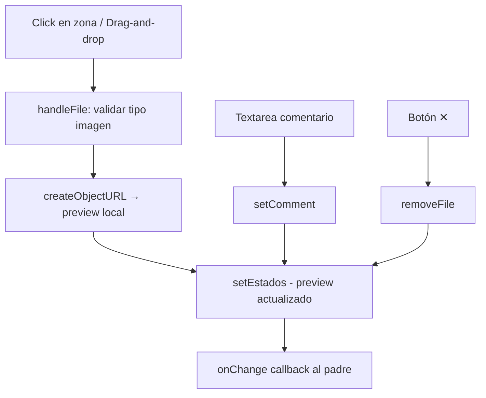

<!--
{
  "resource": "CargadorFotosRestauracion",
  "technicalName": "CargadorFotosRestauracion",
  "targetPath": "src/components/common/CargadorFotosRestauracion.jsx",
  "type": "component",
  "niches": ["furniture_repair"],
  "dependencies": {
    "npm": {},
    "internal": []
  }
}
-->

# CargadorFotosRestauracion

## 1. Propósito y Casos de Uso

Zona de carga de fotos del mueble a restaurar simulada (sin upload real), organizada en 4 ángulos predefinidos: Frontal, Lateral, Detalle del daño y Descripción adicional. Permite adjuntar comentarios de texto por zona para orientar al tapicero.

**Casos de uso:**
- Formulario de solicitud de cotización remota: el cliente adjunta fotos desde su celular.
- Ficha de recepción de mueble en taller.
- Documentación de estado previo al inicio de la restauración.

---

## 2. Especificación Visual

- Grid 2×2 de zonas de carga.
- Área de drop con ícono y texto, reemplazada por preview de imagen al cargar.
- Input de texto bajo cada preview para descripción específica.
- Botón de eliminar foto por zona.
- Variables CSS estándar.

---

## 3. Código React Completo

```jsx
import { useState, useRef } from 'react';

const ZONAS = [
  { id: 'frontal', label: 'Vista Frontal', icon: '🪑', hint: 'Foto del frente completo del mueble' },
  { id: 'lateral', label: 'Vista Lateral', icon: '↔️', hint: 'Foto del perfil izquierdo o derecho' },
  { id: 'dano', label: 'Detalle del Daño', icon: '🔍', hint: 'Acerca la cámara al área deteriorada' },
  { id: 'adicional', label: 'Descripción Adicional', icon: '📝', hint: 'Otra zona relevante o comentario visual' },
];

function ZonaCarga({ zona, estado, onFile, onComment, onRemove }) {
  const inputRef = useRef(null);
  const { preview, comentario } = estado;

  const handleFile = (file) => {
    if (!file || !file.type.startsWith('image/')) return;
    const url = URL.createObjectURL(file);
    onFile(zona.id, url);
  };

  const handleDrop = (e) => {
    e.preventDefault();
    const file = e.dataTransfer.files[0];
    handleFile(file);
  };

  return (
    <div className="flex flex-col gap-2">
      <p className="text-xs font-bold text-[var(--color-text)] flex items-center gap-1">
        <span>{zona.icon}</span> {zona.label}
      </p>

      {preview ? (
        <div className="relative rounded-xl overflow-hidden aspect-video bg-black border border-[var(--color-border)]">
          
          <button
            onClick={() => onRemove(zona.id)}
            className="absolute top-1.5 right-1.5 w-6 h-6 rounded-full bg-red-500 text-[var(--color-text)] flex items-center justify-center text-xs font-bold shadow hover:bg-red-600 transition-colors"
          >✕</button>
          <div className="absolute bottom-0 left-0 right-0 bg-gradient-to-t from-black/60 to-transparent px-2 py-1">
            <p className="text-[9px] text-[var(--color-text)]">✓ Foto cargada</p>
          </div>
        </div>
      ) : (
        <div
          onDrop={handleDrop}
          onDragOver={(e) => e.preventDefault()}
          onClick={() => inputRef.current?.click()}
          className="aspect-video rounded-xl border-2 border-dashed border-[var(--color-border)] bg-[var(--color-surface)] flex flex-col items-center justify-center gap-1.5 cursor-pointer hover:border-[var(--color-primary)] hover:bg-[var(--color-primary)] hover:bg-opacity-5 transition-all group"
        >
          <div className="w-8 h-8 rounded-full bg-[var(--color-border)] flex items-center justify-center group-hover:bg-[var(--color-primary)] group-hover:bg-opacity-20 transition-colors">
            <svg className="w-4 h-4 text-[var(--color-text-muted)] group-hover:text-[var(--color-primary)]" fill="none" viewBox="0 0 24 24" stroke="currentColor">
              <path strokeLinecap="round" strokeLinejoin="round" strokeWidth={2} d="M12 4v16m8-8H4" />
            </svg>
          </div>
          <p className="text-[10px] text-[var(--color-text-muted)] group-hover:text-[var(--color-primary)] font-medium text-center px-2">
            Subir foto · Arrastra o toca
          </p>
          <p className="text-[9px] text-[var(--color-text-muted)] text-center px-2 leading-tight">{zona.hint}</p>
        </div>
      )}

      <input
        ref={inputRef}
        type="file"
        accept="image/*"
        className="hidden"
        onChange={(e) => handleFile(e.target.files[0])}
      />

      <textarea
        placeholder="Descripción de esta zona..."
        value={comentario}
        onChange={(e) => onComment(zona.id, e.target.value)}
        rows={2}
        className="w-full text-xs px-2.5 py-2 rounded-lg border border-[var(--color-border)] bg-[var(--color-surface)] text-[var(--color-text)] placeholder:text-[var(--color-text-muted)] resize-none focus:outline-none focus:border-[var(--color-primary)] transition-colors"
      />
    </div>
  );
}

export default function CargadorFotosRestauracion({ onChange }) {
  const [estados, setEstados] = useState(
    Object.fromEntries(ZONAS.map(z => [z.id, { preview: null, comentario: '' }]))
  );

  const cargadas = Object.values(estados).filter(e => e.preview).length;

  const setFile = (id, url) => {
    setEstados(prev => {
      const next = { ...prev, [id]: { ...prev[id], preview: url } };
      onChange?.(next);
      return next;
    });
  };

  const setComment = (id, text) => {
    setEstados(prev => {
      const next = { ...prev, [id]: { ...prev[id], comentario: text } };
      onChange?.(next);
      return next;
    });
  };

  const removeFile = (id) => {
    setEstados(prev => {
      const next = { ...prev, [id]: { ...prev[id], preview: null } };
      onChange?.(next);
      return next;
    });
  };

  return (
    <div className="w-full space-y-4">
      {/* Header */}
      <div className="flex items-center justify-between">
        <div>
          <h3 className="text-sm font-bold text-[var(--color-text)]">📸 Fotos del mueble</h3>
          <p className="text-xs text-[var(--color-text-muted)]">Sube hasta 4 fotos desde diferentes ángulos</p>
        </div>
        <div className={`px-3 py-1 rounded-full text-xs font-bold border ${
          cargadas === 4 ? 'border-green-400 text-green-600 bg-green-50' :
          cargadas > 0 ? 'border-yellow-400 text-yellow-600 bg-yellow-50' :
          'border-[var(--color-border)] text-[var(--color-text-muted)]'
        }`}>
          {cargadas}/4 fotos
        </div>
      </div>

      {/* Grid 2x2 */}
      <div className="grid grid-cols-1 sm:grid-cols-2 gap-3">
        {ZONAS.map(zona => (
          <ZonaCarga
            key={zona.id}
            zona={zona}
            estado={estados[zona.id]}
            onFile={setFile}
            onComment={setComment}
            onRemove={removeFile}
          />
        ))}
      </div>

      {/* Nota legal */}
      <p className="text-[10px] text-[var(--color-text-muted)] text-center">
        🔒 Las fotos se usan únicamente para elaborar tu cotización y no se comparten con terceros.
      </p>
    </div>
  );
}
```

---

## 4. Lógica de Estado

| Estado | Tipo | Descripción |
|---|---|---|
| `estados` | `object` | Mapa `{[zonaId]: {preview, comentario}}` |

- `URL.createObjectURL(file)` genera URL local en memoria para preview sin upload real.
- `onRemove` no revoca la URL del objeto (vida corta en sandbox), en producción usar `URL.revokeObjectURL`.
- `onChange(estados)` notifica al padre con el estado completo.

---

## 5. Flujo Operativo


