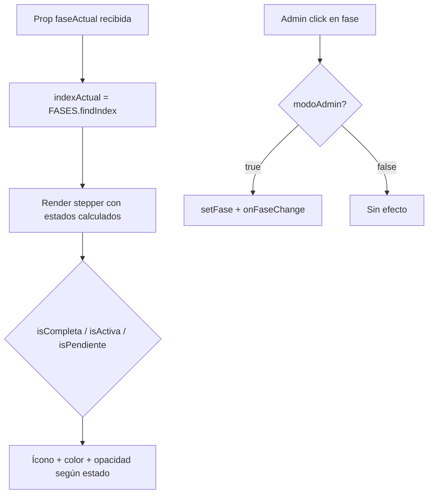

<!--
{
  "resource": "SeguimientoFasesRestauracion",
  "technicalName": "SeguimientoFasesRestauracion",
  "targetPath": "src/components/common/SeguimientoFasesRestauracion.jsx",
  "type": "component",
  "niches": ["furniture_repair"],
  "dependencies": {
    "npm": {},
    "internal": []
  }
}
-->

# SeguimientoFasesRestauracion

## 1. Propósito y Casos de Uso

Stepper visual de las etapas físicas del proceso de tapizado y restauración de muebles. Muestra 6 fases (Recepción → Desmontaje → Estructura → Tapizado → Acabados → Entrega) con fechas estimadas y animación pulse en la fase activa.

**Casos de uso:**
- Panel del cliente para seguimiento en tiempo real del estado de su mueble.
- Dashboard interno del taller para actualizar el progreso por orden.
- Integración con sistema de notificaciones WhatsApp por fase completada.

---

## 2. Especificación Visual

- Stepper vertical con línea conectora animada.
- Fase activa: color `--color-primary`, animación `pulse`.
- Fases completadas: ícono check verde.
- Fases pendientes: opacidad reducida.
- Fechas estimadas en texto muted.

---

## 3. Código React Completo

```jsx
import { useState } from 'react';

const FASES = [
  {
    id: 'recepcion',
    nombre: 'Recepción',
    descripcion: 'Mueble recibido en taller y evaluado',
    icono: '📦',
    diasDesde: 0,
  },
  {
    id: 'desmontaje',
    nombre: 'Desmontaje',
    descripcion: 'Retiro de tapizado antiguo y limpieza de estructura',
    icono: '🔧',
    diasDesde: 1,
  },
  {
    id: 'estructura',
    nombre: 'Estructura',
    descripcion: 'Reparación de madera, resortes y espuma',
    icono: '🪚',
    diasDesde: 2,
  },
  {
    id: 'tapizado',
    nombre: 'Tapizado',
    descripcion: 'Aplicación de tela y costura',
    icono: '🧵',
    diasDesde: 4,
  },
  {
    id: 'acabados',
    nombre: 'Acabados',
    descripcion: 'Tinte de patas, detalles finales e impermeabilización',
    icono: '✨',
    diasDesde: 6,
  },
  {
    id: 'entrega',
    nombre: 'Entrega',
    descripcion: 'Mueble listo para entrega o flete',
    icono: '🚚',
    diasDesde: 7,
  },
];

function getFechaEstimada(diasDesde, fechaInicio) {
  const d = new Date(fechaInicio);
  d.setDate(d.getDate() + diasDesde);
  return d.toLocaleDateString('es-CO', { weekday: 'short', day: 'numeric', month: 'short' });
}

export default function SeguimientoFasesRestauracion({
  faseActual = 'tapizado',
  fechaInicio,
  onFaseChange,
  modoAdmin = false,
}) {
  const [fase, setFase] = useState(faseActual);
  const inicio = fechaInicio ? new Date(fechaInicio) : new Date();

  const indexActual = FASES.findIndex(f => f.id === fase);

  const handleFase = (id) => {
    if (!modoAdmin) return;
    setFase(id);
    onFaseChange?.(id);
  };

  return (
    <div className="w-full space-y-2">
      {/* Encabezado */}
      <div className="flex items-center justify-between mb-3">
        <div>
          <h3 className="text-sm font-bold text-[var(--color-text)]">Estado de restauración</h3>
          <p className="text-xs text-[var(--color-text-muted)]">
            Iniciado: {inicio.toLocaleDateString('es-CO', { day: 'numeric', month: 'long', year: 'numeric' })}
          </p>
        </div>
        <div className="text-right">
          <p className="text-xs font-bold text-[var(--color-primary)]">
            Fase {indexActual + 1} / {FASES.length}
          </p>
          <div className="w-24 h-1.5 bg-[var(--color-border)] rounded-full mt-1 overflow-hidden">
            <div
              className="h-full bg-[var(--color-primary)] rounded-full transition-all duration-700"
              style={{ width: `${((indexActual + 1) / FASES.length) * 100}%` }}
            />
          </div>
        </div>
      </div>

      {/* Stepper */}
      <div className="relative">
        {FASES.map((f, i) => {
          const isCompleta = i < indexActual;
          const isActiva = i === indexActual;
          const isPendiente = i > indexActual;

          return (
            <div key={f.id} className="flex gap-3 relative">
              {/* Línea conectora */}
              {i < FASES.length - 1 && (
                <div className="absolute left-4 top-8 w-0.5 h-full -z-0" style={{ height: 'calc(100% - 8px)' }}>
                  <div className={`w-full h-full transition-colors duration-500 ${isCompleta ? 'bg-green-400' : 'bg-[var(--color-border)]'}`} />
                </div>
              )}

              {/* Ícono de fase */}
              <div className="relative z-10 shrink-0">
                <button
                  onClick={() => handleFase(f.id)}
                  disabled={!modoAdmin}
                  className={`w-8 h-8 rounded-full flex items-center justify-center text-sm border-2 transition-all duration-300 ${
                    isCompleta
                      ? 'bg-green-500 border-green-500 text-[var(--color-text)]'
                      : isActiva
                      ? 'bg-[var(--color-primary)] border-[var(--color-primary)] text-[var(--color-text)] shadow-lg'
                      : 'bg-[var(--color-surface)] border-[var(--color-border)] opacity-50'
                  } ${modoAdmin ? 'cursor-pointer hover:scale-110' : 'cursor-default'}`}
                  style={isActiva ? { animation: 'pulse 2s infinite' } : {}}
                >
                  {isCompleta ? (
                    <svg className="w-4 h-4" fill="none" viewBox="0 0 24 24" stroke="currentColor" strokeWidth={3}>
                      <path strokeLinecap="round" strokeLinejoin="round" d="M5 13l4 4L19 7" />
                    </svg>
                  ) : (
                    <span>{f.icono}</span>
                  )}
                </button>
                {/* Pulse ring para fase activa */}
                {isActiva && (
                  <div className="absolute inset-0 rounded-full border-2 border-[var(--color-primary)] opacity-50"
                    style={{ animation: 'ping 1.5s cubic-bezier(0, 0, 0.2, 1) infinite' }} />
                )}
              </div>

              {/* Contenido de la fase */}
              <div className={`pb-5 flex-1 min-w-0 transition-opacity duration-300 ${isPendiente ? 'opacity-40' : 'opacity-100'}`}>
                <div className="flex items-start justify-between gap-2">
                  <div>
                    <p className={`text-sm font-bold ${isActiva ? 'text-[var(--color-primary)]' : 'text-[var(--color-text)]'}`}>
                      {f.nombre}
                      {isActiva && (
                        <span className="ml-2 text-[9px] font-bold px-1.5 py-0.5 rounded-full bg-[var(--color-primary)] text-[var(--color-text)]">
                          EN CURSO
                        </span>
                      )}
                    </p>
                    <p className="text-xs text-[var(--color-text-muted)] leading-snug">{f.descripcion}</p>
                  </div>
                  <p className="text-[10px] text-[var(--color-text-muted)] shrink-0 text-right">
                    {getFechaEstimada(f.diasDesde, inicio)}
                  </p>
                </div>
              </div>
            </div>
          );
        })}
      </div>

      <style>{`
        @keyframes ping {
          75%, 100% { transform: scale(1.6); opacity: 0; }
        }
        @keyframes pulse {
          0%, 100% { box-shadow: 0 0 0 0 var(--color-primary); }
          50% { box-shadow: 0 0 0 6px transparent; }
        }
      `}</style>
    </div>
  );
}
```

---

## 4. Lógica de Estado

| Prop/Estado | Tipo | Descripción |
|---|---|---|
| `faseActual` | `string` | ID de la fase activa (prop controlada externamente) |
| `fechaInicio` | `Date\|string` | Fecha de inicio para calcular estimados por fase |
| `modoAdmin` | `boolean` | Habilita click en fases para actualizarlas desde el taller |
| `onFaseChange` | `function` | Callback cuando el admin cambia la fase |

- `getFechaEstimada` suma los días definidos en cada fase desde la fecha de inicio.
- Las animaciones `ping` y `pulse` son CSS keyframes embebidos para portabilidad.

---

## 5. Flujo Operativo


