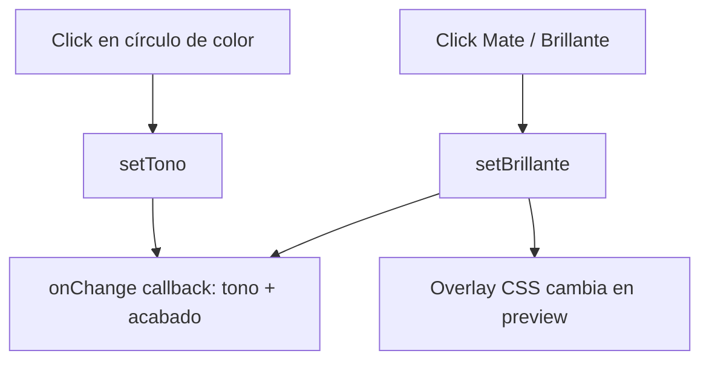

<!--
{
  "resource": "SelectorAcabadoPatas",
  "technicalName": "SelectorAcabadoPatas",
  "targetPath": "src/components/common/SelectorAcabadoPatas.jsx",
  "type": "component",
  "niches": ["furniture_repair"],
  "dependencies": {
    "npm": {},
    "internal": []
  }
}
-->

# SelectorAcabadoPatas

## 1. Propósito y Casos de Uso

Selector de tonos de tinte y barniz para patas de madera en restauración de muebles. Paleta de tonos madera con vista previa de color real, nombre del tono y toggle de acabado brillante/mate.

**Casos de uso:**
- Sección de "detalles de patas" en formulario de cotización de tapicería.
- Herramienta para que el cliente visualice el tono final antes de aprobar la orden.

---

## 2. Especificación Visual

- Paleta circular de colores en grid.
- Vista previa grande del color seleccionado con reflejo simulado para brillante.
- Toggle brillante/mate con cambio visual en la preview.
- Nombre del tono con badge del tipo de acabado.

---

## 3. Código React Completo

```jsx
import { useState } from 'react';

const TONOS = [
  { id: 'roble_natural', nombre: 'Roble Natural', hex: '#C8A97A', descripcion: 'Clásico y versátil, tono cálido' },
  { id: 'nogal_oscuro', nombre: 'Nogal Oscuro', hex: '#5C3D2E', descripcion: 'Elegante, estilo contemporáneo' },
  { id: 'wengue', nombre: 'Wengué', hex: '#3B2A24', descripcion: 'Muy oscuro, moderno y sofisticado' },
  { id: 'caoba', nombre: 'Caoba', hex: '#7B3F2A', descripcion: 'Cálido rojizo, estilo colonial' },
  { id: 'pino_claro', nombre: 'Pino Claro', hex: '#E8C99A', descripcion: 'Tono escandinavo, luminoso' },
  { id: 'cerezo', nombre: 'Cerezo', hex: '#9B4A3E', descripcion: 'Cálido y sofisticado' },
  { id: 'blanco_crema', nombre: 'Blanco Crema', hex: '#F5EFE0', descripcion: 'Estilo provenzal o shabby chic' },
  { id: 'negro_mate', nombre: 'Negro Mate', hex: '#1A1A1A', descripcion: 'Minimalista, industrial moderno' },
  { id: 'gris_piedra', nombre: 'Gris Piedra', hex: '#8A8A8A', descripcion: 'Neutro contemporáneo' },
];

export default function SelectorAcabadoPatas({ onChange }) {
  const [tono, setTono] = useState(TONOS[0]);
  const [brillante, setBrillante] = useState(false);

  const handleTono = (t) => {
    setTono(t);
    onChange?.({ tono: t, acabado: brillante ? 'brillante' : 'mate' });
  };

  const handleBrillante = (val) => {
    setBrillante(val);
    onChange?.({ tono, acabado: val ? 'brillante' : 'mate' });
  };

  return (
    <div className="w-full space-y-4">
      {/* Vista previa */}
      <div className="relative rounded-2xl overflow-hidden h-28 border border-[var(--color-border)]">
        <div
          className="absolute inset-0 transition-colors duration-500"
          style={{ backgroundColor: tono.hex }}
        />
        {/* Efecto brillante */}
        {brillante && (
          <div
            className="absolute inset-0"
            style={{
              background: 'linear-gradient(135deg, rgba(255,255,255,0.4) 0%, rgba(255,255,255,0) 50%, rgba(255,255,255,0.15) 100%)',
            }}
          />
        )}
        {/* Simulación veta de madera */}
        <div
          className="absolute inset-0 opacity-20"
          style={{
            backgroundImage: 'repeating-linear-gradient(90deg, rgba(0,0,0,0.08) 0px, transparent 2px, transparent 20px, rgba(0,0,0,0.05) 22px)',
          }}
        />
        {/* Labels sobre la preview */}
        <div className="absolute bottom-3 left-4 right-4 flex justify-between items-end">
          <div>
            <p className="text-sm font-bold drop-shadow-sm" style={{ color: tono.hex < '#888' ? '#fff' : '#222' }}>
              {tono.nombre}
            </p>
            <p className="text-[10px] opacity-80" style={{ color: tono.hex < '#888' ? '#eee' : '#555' }}>
              {tono.descripcion}
            </p>
          </div>
          <span
            className="text-[10px] font-bold px-2 py-0.5 rounded-full"
            style={{
              background: brillante ? 'rgba(255,255,255,0.9)' : 'rgba(0,0,0,0.6)',
              color: brillante ? '#333' : '#eee',
            }}
          >
            {brillante ? '✨ Brillante' : '🪨 Mate'}
          </span>
        </div>
      </div>

      {/* Paleta de colores */}
      <div>
        <p className="text-xs font-bold text-[var(--color-text-muted)] uppercase tracking-wider mb-2">Tono de madera</p>
        <div className="flex flex-wrap gap-2 py-1">
          {TONOS.map(t => (
            <button
              key={t.id}
              onClick={() => handleTono(t)}
              title={t.nombre}
              className={`w-9 h-9 rounded-full transition-all duration-200 border-2 ${
                tono.id === t.id
                  ? 'border-[var(--color-primary)] scale-110 shadow-lg'
                  : 'border-transparent hover:scale-105 hover:border-[var(--color-border)]'
              }`}
              style={{ backgroundColor: t.hex, boxShadow: tono.id === t.id ? `0 0 0 3px var(--color-surface), 0 0 0 5px ${t.hex}` : undefined }}
            />
          ))}
        </div>
        <p className="text-xs text-[var(--color-text-muted)] mt-1">
          Seleccionado: <strong className="text-[var(--color-text)]">{tono.nombre}</strong>
        </p>
      </div>

      {/* Toggle brillante/mate */}
      <div className="p-3 rounded-xl border border-[var(--color-border)] bg-[var(--color-surface)]">
        <p className="text-xs font-bold text-[var(--color-text)] mb-2">Tipo de acabado</p>
        <div className="flex gap-2">
          {[
            { val: false, label: '🪨 Mate', desc: 'Sin reflejo, natural' },
            { val: true, label: '✨ Brillante', desc: 'Laca con brillo' },
          ].map(opt => (
            <button
              key={String(opt.val)}
              onClick={() => handleBrillante(opt.val)}
              className={`flex-1 py-2 px-3 rounded-lg border-2 text-left transition-all ${
                brillante === opt.val
                  ? 'border-[var(--color-primary)] bg-[var(--color-primary)] bg-opacity-5'
                  : 'border-[var(--color-border)] hover:border-[var(--color-primary)] hover:border-opacity-50'
              }`}
            >
              <p className="text-xs font-bold text-[var(--color-text)]">{opt.label}</p>
              <p className="text-[9px] text-[var(--color-text-muted)]">{opt.desc}</p>
            </button>
          ))}
        </div>
      </div>
    </div>
  );
}
```

---

## 4. Lógica de Estado

| Estado | Tipo | Descripción |
|---|---|---|
| `tono` | `object` | Objeto de tono seleccionado con `hex`, `nombre`, `descripcion` |
| `brillante` | `boolean` | Tipo de acabado: `true`=brillante, `false`=mate |

- El efecto de brillo se implementa con un overlay `linear-gradient` de opacidad alta en la preview.
- La detección de color claro/oscuro para el texto usa comparación lexicográfica del hex (heurística simple).

---

## 5. Flujo Operativo


