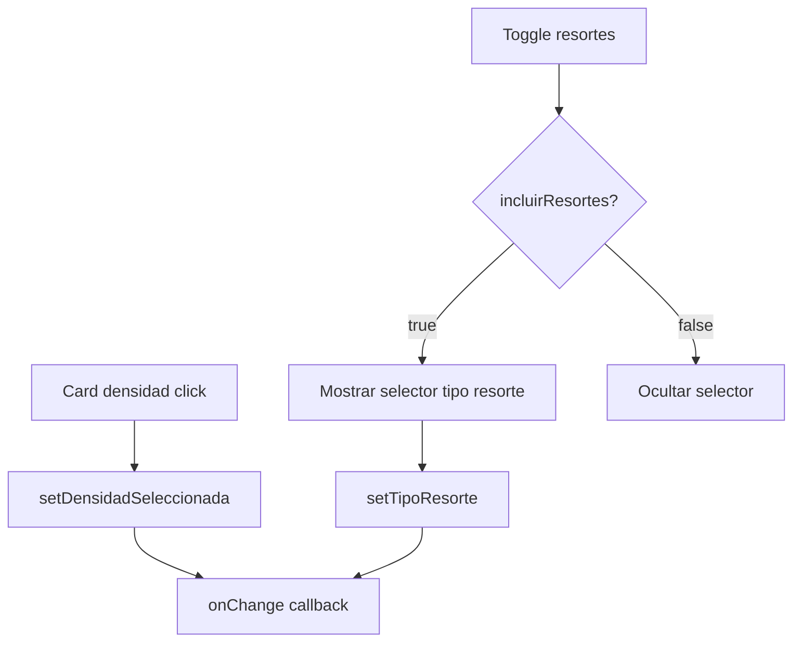

<!--
{
  "resource": "SelectorDensidadEspuma",
  "technicalName": "SelectorDensidadEspuma",
  "targetPath": "src/components/common/SelectorDensidadEspuma.jsx",
  "type": "component",
  "niches": ["furniture_repair"],
  "dependencies": {
    "npm": {},
    "internal": []
  }
}
-->

# SelectorDensidadEspuma

## 1. Propósito y Casos de Uso

Selector visual de densidad de espuma para restauración de muebles, con indicador de firmeza y toggle para incluir cambio de resortes. Permite configurar con precisión el nivel de confort deseado por el cliente.

**Casos de uso:**
- Formulario de cotización de tapicería: sección de interior/estructura.
- Herramienta de diagnóstico de mueble: evaluar qué tipo de reposición requiere.

---

## 2. Especificación Visual

- Cards de densidad con barra visual de firmeza proporcional.
- Toggle de resortes con subtipo seleccionable (elásticos, espiral, zigzag).
- Badge de precio adicional por densidad.
- Variables CSS estándar.

---

## 3. Código React Completo

```jsx
import { useState } from 'react';

const DENSIDADES = [
  {
    id: 'D18',
    label: 'D18 — Suave',
    descripcion: 'Ideal para respaldos decorativos. Máximo confort inmediato.',
    firmeza: 20,
    usos: 'Cojines decorativos, respaldos',
    precio: 0,
    color: '#A8D8EA',
  },
  {
    id: 'D23',
    label: 'D23 — Semi-suave',
    descripcion: 'Balance entre confort y soporte. Uso residencial estándar.',
    firmeza: 45,
    usos: 'Sofás residenciales, poltronas',
    precio: 15000,
    color: '#A8D8A8',
  },
  {
    id: 'D28',
    label: 'D28 — Firme',
    descripcion: 'Mayor durabilidad. Recomendado para uso frecuente.',
    firmeza: 70,
    usos: 'Sofás de alta rotación, oficinas',
    precio: 28000,
    color: '#FFD8A8',
  },
  {
    id: 'D33',
    label: 'D33 — Extra firme',
    descripcion: 'Soporte ortopédico. Máxima resistencia al aplastamiento.',
    firmeza: 95,
    usos: 'Uso comercial, hospitales, hoteles',
    precio: 45000,
    color: '#FFB8A8',
  },
];

const TIPOS_RESORTE = [
  { id: 'elasticos', label: 'Elásticos (zigzag plano)', descripcion: 'Económico, duración media' },
  { id: 'espiral', label: 'Espiral bicónico', descripcion: 'Confort superior, larga vida útil' },
  { id: 'zigzag', label: 'Zigzag sinuoso', descripcion: 'Soporte firme, sin ruidos' },
];

export default function SelectorDensidadEspuma({ onChange }) {
  const [densidadSeleccionada, setDensidadSeleccionada] = useState('D23');
  const [incluirResortes, setIncluirResortes] = useState(false);
  const [tipoResorte, setTipoResorte] = useState('espiral');

  const densidad = DENSIDADES.find(d => d.id === densidadSeleccionada);

  const handleChange = (d, r, tr) => {
    onChange?.({ densidad: d, incluirResortes: r, tipoResorte: tr });
  };

  const selectDensidad = (id) => {
    setDensidadSeleccionada(id);
    handleChange(id, incluirResortes, tipoResorte);
  };

  const toggleResortes = () => {
    const next = !incluirResortes;
    setIncluirResortes(next);
    handleChange(densidadSeleccionada, next, tipoResorte);
  };

  return (
    <div className="w-full space-y-4">
      {/* Selector densidades */}
      <div className="space-y-2">
        <p className="text-xs font-bold text-[var(--color-text-muted)] uppercase tracking-wider">Densidad de espuma</p>
        <div className="grid grid-cols-1 sm:grid-cols-2 gap-2">
          {DENSIDADES.map(d => (
            <button
              key={d.id}
              onClick={() => selectDensidad(d.id)}
              className={`text-left p-3 rounded-xl border-2 transition-all duration-200 ${
                densidadSeleccionada === d.id
                  ? 'border-[var(--color-primary)] shadow-md'
                  : 'border-[var(--color-border)] bg-[var(--color-surface)] hover:border-[var(--color-primary)] hover:border-opacity-50'
              }`}
            >
              <div className="flex items-center justify-between mb-2">
                <span className="text-xs font-bold text-[var(--color-text)]">{d.label}</span>
                {d.precio > 0 && (
                  <span className="text-[9px] font-bold text-[var(--color-primary)] bg-[var(--color-surface)] border border-[var(--color-primary)] rounded px-1">
                    +${d.precio.toLocaleString()}
                  </span>
                )}
              </div>
              {/* Barra firmeza */}
              <div className="w-full h-2 rounded-full bg-[var(--color-border)] overflow-hidden mb-1.5">
                <div
                  className="h-full rounded-full transition-all duration-500"
                  style={{ width: `${d.firmeza}%`, backgroundColor: d.color }}
                />
              </div>
              <p className="text-[9px] text-[var(--color-text-muted)] leading-tight">{d.descripcion}</p>
            </button>
          ))}
        </div>
      </div>

      {/* Info densidad seleccionada */}
      {densidad && (
        <div className="p-3 rounded-lg border border-[var(--color-border)] bg-[var(--color-surface)] flex gap-3 items-start">
          <div className="w-8 h-8 rounded-lg shrink-0 mt-0.5" style={{ backgroundColor: densidad.color }} />
          <div>
            <p className="text-xs font-bold text-[var(--color-text)]">{densidad.label}</p>
            <p className="text-[10px] text-[var(--color-text-muted)]">Usos recomendados: {densidad.usos}</p>
          </div>
        </div>
      )}

      {/* Toggle resortes */}
      <div className="p-3 rounded-xl border border-[var(--color-border)] bg-[var(--color-surface)] space-y-3">
        <div className="flex items-center justify-between">
          <div>
            <p className="text-sm font-semibold text-[var(--color-text)]">Cambio de resortes</p>
            <p className="text-xs text-[var(--color-text-muted)]">Reemplazar la estructura base de soporte</p>
          </div>
          <button
            onClick={toggleResortes}
            className={`relative w-12 h-6 rounded-full transition-colors duration-300 ${
              incluirResortes ? 'bg-[var(--color-primary)]' : 'bg-[var(--color-border)]'
            }`}
          >
            <div className={`absolute top-1 w-4 h-4 rounded-full bg-white shadow transition-transform duration-300 ${
              incluirResortes ? 'translate-x-7' : 'translate-x-1'
            }`} />
          </button>
        </div>

        {incluirResortes && (
          <div className="space-y-1.5 pt-2 border-t border-[var(--color-border)]">
            <p className="text-xs font-semibold text-[var(--color-text-muted)]">Tipo de resorte:</p>
            {TIPOS_RESORTE.map(r => (
              <button
                key={r.id}
                onClick={() => { setTipoResorte(r.id); handleChange(densidadSeleccionada, true, r.id); }}
                className={`w-full flex items-center gap-2 p-2 rounded-lg border text-left transition-all ${
                  tipoResorte === r.id
                    ? 'border-[var(--color-primary)] bg-[var(--color-primary)] bg-opacity-5'
                    : 'border-[var(--color-border)] hover:border-[var(--color-primary)] hover:border-opacity-50'
                }`}
              >
                <div className={`w-3.5 h-3.5 rounded-full border-2 shrink-0 ${tipoResorte === r.id ? 'border-[var(--color-primary)] bg-[var(--color-primary)]' : 'border-[var(--color-border)]'}`} />
                <div>
                  <p className="text-xs font-semibold text-[var(--color-text)]">{r.label}</p>
                  <p className="text-[9px] text-[var(--color-text-muted)]">{r.descripcion}</p>
                </div>
              </button>
            ))}
          </div>
        )}
      </div>
    </div>
  );
}
```

---

## 4. Lógica de Estado

| Estado | Tipo | Descripción |
|---|---|---|
| `densidadSeleccionada` | `string` | ID de densidad activa (`D18`, `D23`, etc.) |
| `incluirResortes` | `boolean` | Si se agrega cambio de resortes |
| `tipoResorte` | `string` | Tipo de resorte seleccionado |

- `handleChange` centraliza el callback hacia el padre con el estado completo actual.

---

## 5. Flujo Operativo


