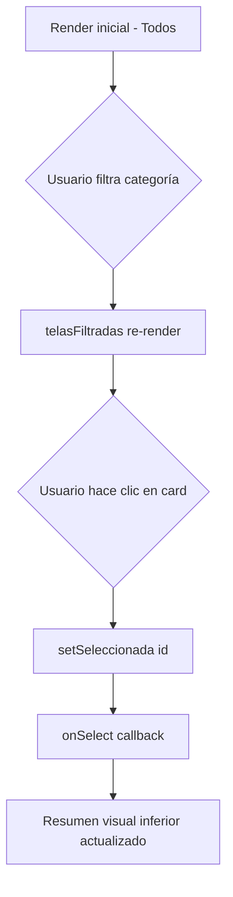

<!--
{
  "resource": "SelectorTelasTexturas",
  "technicalName": "SelectorTelasTexturas",
  "targetPath": "src/components/common/SelectorTelasTexturas.jsx",
  "type": "component",
  "niches": ["furniture_repair"],
  "dependencies": {
    "npm": {},
    "internal": []
  }
}
-->

# SelectorTelasTexturas

## 1. Propósito y Casos de Uso

Muestrario visual interactivo de telas para tapicería clasificadas por tipo, con especificaciones de resistencia, precio por metro y filtro por categoría. Permite al cliente final o al operario seleccionar el material adecuado para el proyecto de restauración.

**Casos de uso:**
- Cotizador de tapicería: selección de tela antes de calcular metraje.
- Panel de administración de materiales disponibles en taller.
- Catálogo digital para presentar opciones al cliente durante visita comercial.

---

## 2. Especificación Visual

- Grid de cards (2-3 columnas responsive).
- Cada card muestra: swatch de color, nombre de tela, badge de resistencia con color semántico (verde/amarillo/rojo), precio/metro.
- Filtros por categoría como chips horizontales con scroll.
- Card seleccionada con borde `--color-primary` y checkmark.
- Variables CSS: `--color-surface`, `--color-border`, `--color-text`, `--color-text-muted`, `--color-primary`.

---

## 3. Código React Completo

```jsx
import { useState } from 'react';

const TELAS = [
  { id: 1, nombre: 'Cuero sintético', categoria: 'Sintético', color: '#8B4513', resistencia: 'alta', precio: 45000, descripcion: 'Fácil limpieza, ideal para mascotas' },
  { id: 2, nombre: 'Cuero genuino', categoria: 'Natural', color: '#6B3A2A', resistencia: 'alta', precio: 120000, descripcion: 'Premium, mayor durabilidad' },
  { id: 3, nombre: 'Terciopelo', categoria: 'Tejido', color: '#4B0082', resistencia: 'media', precio: 38000, descripcion: 'Elegante, requiere cuidado especial' },
  { id: 4, nombre: 'Terciopelo verde', categoria: 'Tejido', color: '#2D6A4F', resistencia: 'media', precio: 38000, descripcion: 'Tendencia decorativa actual' },
  { id: 5, nombre: 'Lino natural', categoria: 'Natural', color: '#D4B896', resistencia: 'media', precio: 32000, descripcion: 'Transpirable, estilo nórdico' },
  { id: 6, nombre: 'Microfibra', categoria: 'Sintético', color: '#708090', resistencia: 'alta', precio: 28000, descripcion: 'Antialérgica, ultra suave' },
  { id: 7, nombre: 'Algodón canvas', categoria: 'Natural', color: '#F5F5DC', resistencia: 'baja', precio: 22000, descripcion: 'Económico, casual' },
  { id: 8, nombre: 'Chenille', categoria: 'Tejido', color: '#C0A080', resistencia: 'media', precio: 35000, descripcion: 'Textura suave, aspecto lujoso' },
  { id: 9, nombre: 'Antimanchas', categoria: 'Sintético', color: '#B0C4DE', resistencia: 'alta', precio: 52000, descripcion: 'Repelente a líquidos, ideal familias' },
];

const CATEGORIAS = ['Todos', 'Natural', 'Sintético', 'Tejido'];

const BADGE_COLORS = {
  alta: 'bg-green-100 text-green-700 border-green-300',
  media: 'bg-yellow-100 text-yellow-700 border-yellow-300',
  baja: 'bg-red-100 text-red-700 border-red-300',
};

export default function SelectorTelasTexturas({ onSelect, seleccionada: seleccionadaExternal }) {
  const [categoria, setCategoria] = useState('Todos');
  const [seleccionada, setSeleccionada] = useState(seleccionadaExternal ?? null);

  const telasFiltradas = TELAS.filter(t => categoria === 'Todos' || t.categoria === categoria);

  const handleSelect = (tela) => {
    setSeleccionada(tela.id);
    onSelect?.(tela);
  };

  return (
    <div className="w-full space-y-4">
      {/* Filtros */}
      <div className="flex gap-2 overflow-x-auto pb-1 px-1">
        {CATEGORIAS.map(cat => (
          <button
            key={cat}
            onClick={() => setCategoria(cat)}
            className={`shrink-0 px-4 py-1.5 rounded-full text-sm font-medium border transition-all ${
              categoria === cat
                ? 'bg-[var(--color-primary)] text-[var(--color-text)] border-[var(--color-primary)]'
                : 'bg-[var(--color-surface)] text-[var(--color-text-muted)] border-[var(--color-border)] hover:border-[var(--color-primary)]'
            }`}
          >
            {cat}
          </button>
        ))}
      </div>

      {/* Grid de telas */}
      <div className="grid grid-cols-1 sm:grid-cols-2 sm:grid-cols-3 gap-3">
        {telasFiltradas.map(tela => {
          const isSelected = seleccionada === tela.id;
          return (
            <button
              key={tela.id}
              onClick={() => handleSelect(tela)}
              className={`relative text-left rounded-xl border-2 overflow-hidden transition-all duration-200 hover:-translate-y-0.5 hover:shadow-lg ${
                isSelected
                  ? 'border-[var(--color-primary)] shadow-md'
                  : 'border-[var(--color-border)] bg-[var(--color-surface)]'
              }`}
            >
              {/* Swatch de color */}
              <div
                className="w-full h-16 relative"
                style={{ backgroundColor: tela.color }}
              >
                {isSelected && (
                  <div className="absolute top-2 right-2 w-6 h-6 bg-white rounded-full flex items-center justify-center shadow">
                    <svg className="w-4 h-4 text-green-600" fill="none" viewBox="0 0 24 24" stroke="currentColor" strokeWidth={3}>
                      <path strokeLinecap="round" strokeLinejoin="round" d="M5 13l4 4L19 7" />
                    </svg>
                  </div>
                )}
                {/* Textura simulada */}
                <div className="absolute inset-0 opacity-10" style={{
                  backgroundImage: 'repeating-linear-gradient(45deg, #fff 0, #fff 1px, transparent 0, transparent 50%)',
                  backgroundSize: '8px 8px'
                }} />
              </div>

              {/* Info */}
              <div className="p-2.5 bg-[var(--color-surface)]">
                <p className="text-xs font-semibold text-[var(--color-text)] leading-tight">{tela.nombre}</p>
                <p className="text-[10px] text-[var(--color-text-muted)] mt-0.5 leading-tight">{tela.descripcion}</p>
                <div className="flex items-center justify-between mt-2">
                  <span className={`text-[9px] font-bold px-1.5 py-0.5 rounded border ${BADGE_COLORS[tela.resistencia]}`}>
                    ↑ {tela.resistencia}
                  </span>
                  <span className="text-[10px] font-bold text-[var(--color-primary)]">
                    ${tela.precio.toLocaleString()}/m
                  </span>
                </div>
              </div>
            </button>
          );
        })}
      </div>

      {/* Resumen selección */}
      {seleccionada && (() => {
        const t = TELAS.find(x => x.id === seleccionada);
        return t ? (
          <div className="p-3 rounded-lg bg-[var(--color-surface-2,var(--color-surface))] border border-[var(--color-primary)] text-sm">
            <p className="font-semibold text-[var(--color-text)]">✓ Seleccionado: <span className="text-[var(--color-primary)]">{t.nombre}</span></p>
            <p className="text-[var(--color-text-muted)] text-xs mt-0.5">Categoría: {t.categoria} · Resistencia: {t.resistencia} · ${t.precio.toLocaleString()}/m</p>
          </div>
        ) : null;
      })()}
    </div>
  );
}
```

---

## 4. Lógica de Estado

| Estado | Tipo | Descripción |
|---|---|---|
| `categoria` | `string` | Filtro activo de categoría |
| `seleccionada` | `number \| null` | ID de tela seleccionada |

- `handleSelect`: actualiza estado local y llama `onSelect(tela)` prop callback.
- Filtrado derivado (`telasFiltradas`) con `.filter()` directo, sin `useMemo` por colección pequeña.

---

## 5. Flujo Operativo


