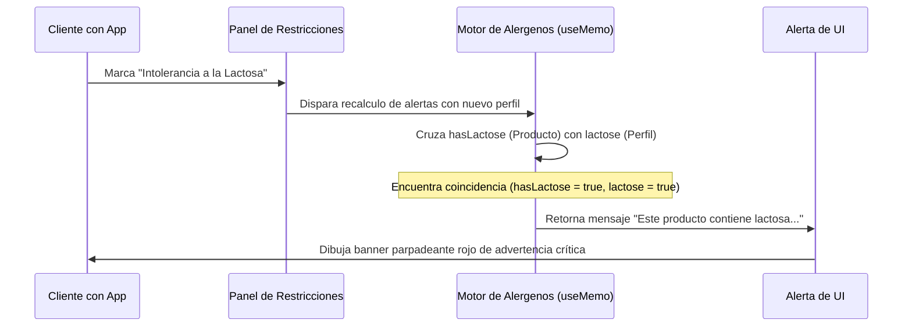

<!--
{
  "resource": "AdvertenciaNutricionalAlergenos",
  "technicalName": "AdvertenciaNutricionalAlergenos",
  "targetPath": "src/components/common/AdvertenciaNutricionalAlergenos.jsx",
  "type": "component",
  "niches": ["grocery_food"],
  "dependencies": {
    "npm": {
      "lucide-react": "^0.344.0"
    },
    "internal": []
  }
}
-->

# Advertencia Nutricional y Alérgenos (`AdvertenciaNutricionalAlergenos`)

Permite visualizar fichas técnicas nutricionales, desplegando sellos de advertencia alimentaria (sin azúcar, vegano, orgánico) y contrastándolos dinámicamente con el perfil de salud o alérgenos registrado por el cliente, disparando alertas preventivas si el artículo posee componentes de riesgo.

## 1. Propósito y Casos de Uso
* **Ficha de Producto de E-commerce:** Enriquecer los detalles del producto con información nutricional y dietética legal.
* **Seguridad Alimentaria del Cliente:** Advertir automáticamente al usuario antes de agregar un artículo que podría causarle reacciones alérgicas.
* **Filtros Personalizados:** Permitir a usuarios celíacos, veganos o intolerantes a la lactosa pre-configurar filtros globales en la app.

## 2. Especificación Visual y Estilos
* **Sellos Nutricionales:** Badges de forma octogonal o circular de color negro/gris oscuro emulando el etiquetado legal de salud (ej: Alto en Azúcares, Alto en Sodio).
* **Alertas Dinámicas de Alérgenos:** Banner de color rojo/carmesí con bordes y destello parpadeante ante incompatibilidades críticas.
* **Panel de Configuración Rápida:** Listado de checkboxes deslizables para alternar alérgenos del usuario en tiempo real en la propia ficha.

## 3. Código React Completo

```jsx
import React, { useState, useMemo } from 'react';
import { AlertCircle, ShieldCheck, Heart, User, Check, Settings, Info } from 'lucide-react';

const ALERGENS_REGISTRY = [
  { key: 'lactose', label: 'Intolerancia a la Lactosa' },
  { key: 'gluten', label: 'Celiaquía / Intolerancia al Gluten' },
  { key: 'peanuts', label: 'Alergia al Maní / Frutos Secos' },
  { key: 'sugar', label: 'Diabetes / Restricción de Azúcar' },
  { key: 'seafood', label: 'Alergia a Mariscos / Pescados' }
];

export default function AdvertenciaNutricionalAlergenos({
  productName = "Galletas de Avena con Maní y Miel",
  seals = ['Alto en Azúcares', 'Contiene Frutos Secos'],
  composition = {
    hasLactose: false,
    hasGluten: true,
    hasPeanuts: true,
    hasSugar: true,
    hasSeafood: false
  },
  onProfileUpdate = () => {}
}) {
  // Estado de alérgenos del perfil de usuario
  const [userProfile, setUserProfile] = useState({
    lactose: false,
    gluten: true, // Por defecto celíaco
    peanuts: false,
    sugar: false,
    seafood: false
  });

  const [isConfiguring, setIsConfiguring] = useState(false);

  // Alternar alérgeno en el perfil
  const handleToggleAlergen = (key) => {
    const updated = { ...userProfile, [key]: !userProfile[key] };
    setUserProfile(updated);
    onProfileUpdate(updated);
  };

  // Evaluar si existe incompatibilidad crítica
  const alertsDetected = useMemo(() => {
    const alerts = [];
    if (userProfile.lactose && composition.hasLactose) {
      alerts.push({ key: 'lactose', text: 'Este producto contiene lactosa, incompatible con tu perfil.' });
    }
    if (userProfile.gluten && composition.hasGluten) {
      alerts.push({ key: 'gluten', text: 'Contiene gluten. No apto para personas con celiaquía.' });
    }
    if (userProfile.peanuts && composition.hasPeanuts) {
      alerts.push({ key: 'peanuts', text: 'Peligro: Contiene maní o trazas de frutos secos.' });
    }
    if (userProfile.sugar && composition.hasSugar) {
      alerts.push({ key: 'sugar', text: 'Alto contenido de azúcar. No recomendado para dietas restringidas.' });
    }
    if (userProfile.seafood && composition.hasSeafood) {
      alerts.push({ key: 'seafood', text: 'Contiene trazas de mariscos/pescados.' });
    }
    return alerts;
  }, [userProfile, composition]);

  const hasCriticalConflict = alertsDetected.length > 0;

  return (
    <div className="bg-[var(--color-surface)] border border-[var(--color-border)] rounded-2xl shadow-xl w-full max-w-2xl mx-auto p-6 text-[var(--color-text)]">
      <div className="flex flex-col md:flex-row md:items-center justify-between gap-4 mb-5 border-b border-[var(--color-border)] pb-4">
        <div className="flex items-center gap-3">
          <div className="p-2 bg-[var(--color-primary)]/10 rounded-lg text-[var(--color-primary)]">
            <Heart className="w-6 h-6" />
          </div>
          <div>
            <h3 className="font-semibold text-lg">{productName}</h3>
            <p className="text-xs text-[var(--color-text-muted)]">Información Nutricional y Alertas de Salud</p>
          </div>
        </div>

        {/* Botón de Configurar Perfil */}
        <button
          onClick={() => setIsConfiguring(!isConfiguring)}
          className={`flex items-center gap-1.5 px-3 py-1.5 rounded-xl text-xs font-semibold border transition ${isConfiguring ? 'bg-[var(--color-primary)] text-[var(--color-text)] border-[var(--color-primary)]' : 'bg-[var(--color-surface-2)] border-[var(--color-border)] hover:bg-[var(--color-border)]/20'}`}
        >
          <Settings className="w-3.5 h-3.5" />
          Configurar Alérgenos
        </button>
      </div>

      <div className="grid grid-cols-1 md:grid-cols-12 gap-5">
        {/* Desglose Nutricional y Sellos */}
        <div className="md:col-span-7 flex flex-col gap-4">
          {/* Sellos de Advertencia Legal */}
          <div>
            <span className="block text-[10px] font-bold uppercase tracking-wider text-[var(--color-text-muted)] mb-2">
              Sellos Nutricionales
            </span>
            <div className="flex flex-wrap gap-2">
              {seals.length === 0 ? (
                <span className="text-xs text-[var(--color-text-muted)] flex items-center gap-1 bg-emerald-500/10 text-emerald-500 border border-emerald-500/20 px-3 py-1 rounded-xl">
                  <ShieldCheck className="w-3.5 h-3.5" />
                  Producto Libre de Sellos Críticos
                </span>
              ) : (
                seals.map(seal => (
                  <span
                    key={seal}
                    className="px-3 py-1 bg-black !text-[var(--color-text)] text-xs font-black tracking-tighter rounded-md uppercase border border-neutral-800 shadow"
                  >
                    {seal}
                  </span>
                ))
              )}
            </div>
          </div>

          {/* Composición en Ficha */}
          <div>
            <span className="block text-[10px] font-bold uppercase tracking-wider text-[var(--color-text-muted)] mb-2">
              Trazas e Ingredientes Declarados
            </span>
            <div className="grid grid-cols-1 sm:grid-cols-2 gap-2 text-xs">
              <div className={`p-2 rounded-lg border ${composition.hasGluten ? 'bg-amber-500/5 border-amber-500/25' : 'bg-[var(--color-surface-2)] border-[var(--color-border)]/50 opacity-60'}`}>
                Gluten: <span className="font-bold">{composition.hasGluten ? 'SÍ' : 'NO'}</span>
              </div>
              <div className={`p-2 rounded-lg border ${composition.hasLactose ? 'bg-amber-500/5 border-amber-500/25' : 'bg-[var(--color-surface-2)] border-[var(--color-border)]/50 opacity-60'}`}>
                Lactosa: <span className="font-bold">{composition.hasLactose ? 'SÍ' : 'NO'}</span>
              </div>
              <div className={`p-2 rounded-lg border ${composition.hasPeanuts ? 'bg-amber-500/5 border-amber-500/25' : 'bg-[var(--color-surface-2)] border-[var(--color-border)]/50 opacity-60'}`}>
                Frutos Secos: <span className="font-bold">{composition.hasPeanuts ? 'SÍ' : 'NO'}</span>
              </div>
              <div className={`p-2 rounded-lg border ${composition.hasSugar ? 'bg-amber-500/5 border-amber-500/25' : 'bg-[var(--color-surface-2)] border-[var(--color-border)]/50 opacity-60'}`}>
                Azúcar Añadida: <span className="font-bold">{composition.hasSugar ? 'SÍ' : 'NO'}</span>
              </div>
            </div>
          </div>
        </div>

        {/* Panel de Configuración Rápida / Alertas */}
        <div className="md:col-span-5 flex flex-col gap-4">
          {isConfiguring ? (
            <div className="p-4 bg-[var(--color-surface-2)] border border-[var(--color-border)]/55 rounded-xl">
              <span className="block text-[10px] font-bold uppercase tracking-wider text-[var(--color-text-muted)] mb-3 flex items-center gap-1">
                <User className="w-3.5 h-3.5" />
                Mis Restricciones
              </span>
              <div className="flex flex-col gap-2">
                {ALERGENS_REGISTRY.map(alergen => {
                  const isChecked = userProfile[alergen.key];
                  return (
                    <label
                      key={alergen.key}
                      className="flex items-center justify-between p-2 hover:bg-[var(--color-border)]/10 rounded-lg cursor-pointer transition text-xs"
                    >
                      <span>{alergen.label}</span>
                      <input 
                        type="checkbox"
                        checked={isChecked}
                        onChange={() => handleToggleAlergen(alergen.key)}
                        className="w-4 h-4 rounded border-[var(--color-border)] text-[var(--color-primary)] focus:ring-[var(--color-primary)]"
                      />
                    </label>
                  );
                })}
              </div>
            </div>
          ) : (
            <div className="flex-1 flex flex-col justify-between min-h-[150px]">
              {hasCriticalConflict ? (
                <div className="flex-1 flex flex-col gap-2">
                  <span className="block text-[10px] font-bold uppercase tracking-wider text-red-500">
                    Alerta de Compatibilidad
                  </span>
                  <div className="flex flex-col gap-2">
                    {alertsDetected.map((alert, idx) => (
                      <div
                        key={idx}
                        className="flex items-start gap-2 p-3 bg-red-500/10 border border-red-500/25 text-red-500 rounded-xl text-xs"
                      >
                        <AlertCircle className="w-4 h-4 shrink-0 mt-0.5" />
                        <span className="font-semibold">{alert.text}</span>
                      </div>
                    ))}
                  </div>
                </div>
              ) : (
                <div className="flex-1 flex flex-col items-center justify-center text-center p-6 bg-emerald-500/5 border border-emerald-500/20 text-emerald-500 rounded-xl">
                  <ShieldCheck className="w-8 h-8 mb-2" />
                  <p className="font-bold text-xs">Compatible con tu perfil</p>
                  <p className="text-[10px] text-emerald-600 mt-0.5">No se detectaron alérgenos cruzados con tus restricciones.</p>
                </div>
              )}
            </div>
          )}
        </div>
      </div>
    </div>
  );
}
```

## 4. Lógica de Estado y Ciclo de Vida
* Conserva el estado de restricciones dietéticas del usuario (`userProfile`) en el estado local, simulando la persistencia del perfil de salud del cliente en la aplicación móvil.
* Un hook `useMemo` recalcula automáticamente las incompatibilidades críticas alimentarias (`alertsDetected`) cada vez que el usuario modifica sus alérgenos o se renderiza un producto con composición química diferente.

## 5. Secuencia de Interacción

